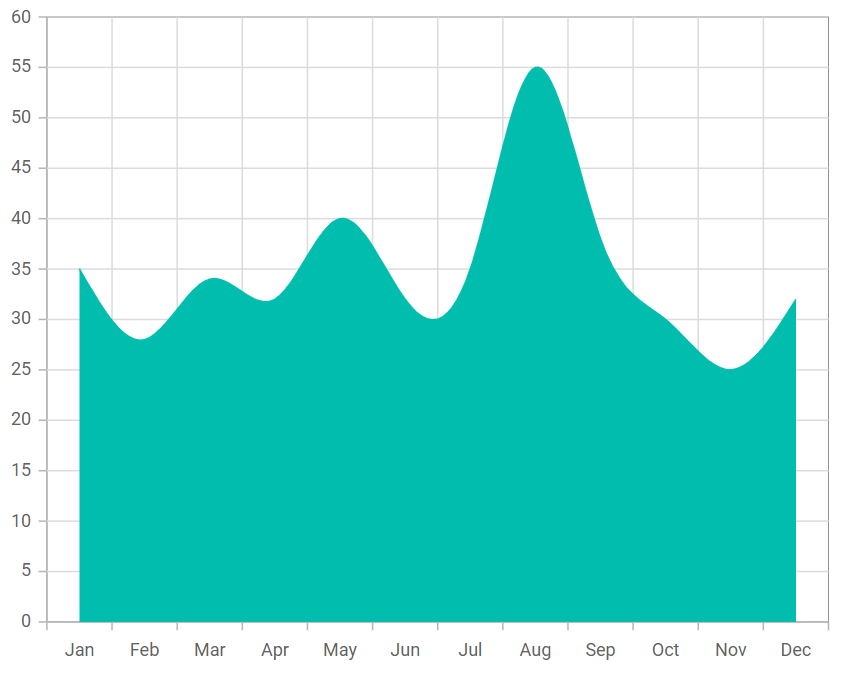

# Spline Area in Blazor Charts Component

## Spline area

[Spline Area Chart](https://www.syncfusion.com/blazor-components/blazor-charts/chart-types/spline-area-chart) visualizes time-dependent or ordered data using a smooth spline to connect points, with the area under the curve filled to emphasize magnitude. To render a spline area series, set the series [`Type`](https://help.syncfusion.com/cr/blazor/Syncfusion.Blazor.Charts.ChartSeries.html#Syncfusion_Blazor_Charts_ChartSeries_Type) to [`SplineArea`](https://help.syncfusion.com/cr/blazor/Syncfusion.Blazor.Charts.ChartSeriesType.html#Syncfusion_Blazor_Charts_ChartSeriesType_SplineArea). Category axes are commonly used for evenly spaced labels.

```cshtml

@using Syncfusion.Blazor.Charts

<SfChart>
    <ChartPrimaryXAxis ValueType="Syncfusion.Blazor.Charts.ValueType.Category" />
    <ChartSeriesCollection>
        <ChartSeries DataSource="@SalesDetails" XName="X" YName="Y" Type="ChartSeriesType.SplineArea">
        </ChartSeries>
    </ChartSeriesCollection>
</SfChart>

@code{
    public class ChartData
    {
        public string X { get; set;}
        public double Y {get; set;}
    }
	
    public List<ChartData> SalesDetails = new List<ChartData>
	{
        new ChartData { X= "Jan", Y= 35 },
        new ChartData { X= "Feb", Y= 28 },
        new ChartData { X= "Mar", Y= 34 },
        new ChartData { X= "Apr", Y= 32 },
        new ChartData { X= "May", Y= 40 },
        new ChartData { X= "Jun", Y= 32 },
        new ChartData { X= "Jul", Y= 35 },
        new ChartData { X= "Aug", Y= 55 },
        new ChartData { X= "Sep", Y= 38 },
        new ChartData { X= "Oct", Y= 30 },
        new ChartData { X= "Nov", Y= 25 },
        new ChartData { X= "Dec", Y= 32 }
    };
}

``` 




N> Refer to the [Blazor spline area chart](https://www.syncfusion.com/blazor-components/blazor-charts/chart-types/spline-area-chart) feature tour for additional capabilities. Explore the [spline area chart example](https://blazor.syncfusion.com/demos/chart/spline-area?theme=bootstrap5) to see how points are connected with smooth curves.

## Binding data with series

Bind data to the chart using the series [`DataSource`](https://help.syncfusion.com/cr/blazor/Syncfusion.Blazor.Charts.ChartSeries.html#Syncfusion_Blazor_Charts_ChartSeries_DataSource). It accepts an [`SfDataManager`](https://help.syncfusion.com/cr/blazor/Syncfusion.Blazor.Data.SfDataManager.html) or a list of business objects. Map fields using [`XName`](https://help.syncfusion.com/cr/blazor/Syncfusion.Blazor.Charts.ChartSeries.html#Syncfusion_Blazor_Charts_ChartSeries_XName) and [`YName`](https://help.syncfusion.com/cr/blazor/Syncfusion.Blazor.Charts.ChartSeries.html#Syncfusion_Blazor_Charts_ChartSeries_YName). For more options, see [Working with data](../working-with-data).

```cshtml

@using Syncfusion.Blazor.Charts

<SfChart>
    <ChartPrimaryXAxis ValueType="Syncfusion.Blazor.Charts.ValueType.Category" />
    <ChartSeriesCollection>
        <ChartSeries DataSource="@SalesDetails" XName="X" YName="Y" Type="ChartSeriesType.SplineArea">
        </ChartSeries>
    </ChartSeriesCollection>
</SfChart>

@code{
    public class ChartData
    {
        public string X { get; set;}
        public double Y {get; set;}
    }
	
    public List<ChartData> SalesDetails = new List<ChartData>
	{
        new ChartData { X= "Jan", Y= 35 },
        new ChartData { X= "Feb", Y= 28 },
        new ChartData { X= "Mar", Y= 34 },
        new ChartData { X= "Apr", Y= 32 },
        new ChartData { X= "May", Y= 40 },
        new ChartData { X= "Jun", Y= 32 },
        new ChartData { X= "Jul", Y= 35 },
        new ChartData { X= "Aug", Y= 55 },
        new ChartData { X= "Sep", Y= 38 },
        new ChartData { X= "Oct", Y= 30 },
        new ChartData { X= "Nov", Y= 25 },
        new ChartData { X= "Dec", Y= 32 }
    };
}

``` 


## Series customization

Use the following series-level properties to customize the appearance of a [Spline Area](https://help.syncfusion.com/cr/blazor/Syncfusion.Blazor.Charts.ChartSeriesType.html#Syncfusion_Blazor_Charts_ChartSeriesType_SplineArea) series.

**Fill**

The [Fill](https://help.syncfusion.com/cr/blazor/Syncfusion.Blazor.Charts.ChartSeries.html#Syncfusion_Blazor_Charts_ChartSeries_Fill) property controls the series fill color.

```cshtml

@using Syncfusion.Blazor.Charts

<SfChart>
    <ChartPrimaryXAxis ValueType="Syncfusion.Blazor.Charts.ValueType.Category" />
    <ChartSeriesCollection>
        <ChartSeries DataSource="@SalesDetails" Fill="blue" XName="X" YName="Y" Type="ChartSeriesType.SplineArea">
        </ChartSeries>
    </ChartSeriesCollection>
</SfChart>

@code{
    public class ChartData
    {
        public string X { get; set;}
        public double Y {get; set;}
    }
	
    public List<ChartData> SalesDetails = new List<ChartData>
	{
        new ChartData { X= "Jan", Y= 35 },
        new ChartData { X= "Feb", Y= 28 },
        new ChartData { X= "Mar", Y= 34 },
        new ChartData { X= "Apr", Y= 32 },
        new ChartData { X= "May", Y= 40 },
        new ChartData { X= "Jun", Y= 32 },
        new ChartData { X= "Jul", Y= 35 },
        new ChartData { X= "Aug", Y= 55 },
        new ChartData { X= "Sep", Y= 38 },
        new ChartData { X= "Oct", Y= 30 },
        new ChartData { X= "Nov", Y= 25 },
        new ChartData { X= "Dec", Y= 32 }
    };
}

```


The [Fill](https://help.syncfusion.com/cr/blazor/Syncfusion.Blazor.Charts.ChartSeries.html#Syncfusion_Blazor_Charts_ChartSeries_Fill) property also supports gradients via an SVG reference, such as `url(#grad1)`. This enables smooth color transitions within the filled area.

```cshtml

@using Syncfusion.Blazor.Charts

<SfChart>
    <ChartPrimaryXAxis ValueType="Syncfusion.Blazor.Charts.ValueType.Category" />
    <ChartSeriesCollection>
        <ChartSeries DataSource="@SalesDetails" Fill="url(#grad1)" XName="X" YName="Y" Type="ChartSeriesType.SplineArea">
        </ChartSeries>
    </ChartSeriesCollection>
</SfChart>

<svg style="height: 0">
   <defs>
       <linearGradient id="grad1" x1="0%" y1="0%" x2="0%" y2="100%">
           <stop offset="20%" style="stop-color:orange;stop-opacity:1" />
           <stop offset="100%" style="stop-color:black;stop-opacity:1" />
       </linearGradient>
   </defs>
</svg>

@code{
    public class ChartData
    {
        public string X { get; set;}
        public double Y {get; set;}
    }
	
    public List<ChartData> SalesDetails = new List<ChartData>
	{
        new ChartData { X= "Jan", Y= 35 },
        new ChartData { X= "Feb", Y= 28 },
        new ChartData { X= "Mar", Y= 34 },
        new ChartData { X= "Apr", Y= 32 },
        new ChartData { X= "May", Y= 40 },
        new ChartData { X= "Jun", Y= 32 },
        new ChartData { X= "Jul", Y= 35 },
        new ChartData { X= "Aug", Y= 55 },
        new ChartData { X= "Sep", Y= 38 },
        new ChartData { X= "Oct", Y= 30 },
        new ChartData { X= "Nov", Y= 25 },
        new ChartData { X= "Dec", Y= 32 }
    };
}

``` 



**Opacity**

The [Opacity](https://help.syncfusion.com/cr/blazor/Syncfusion.Blazor.Charts.ChartSeries.html#Syncfusion_Blazor_Charts_ChartSeries_Opacity) property sets the transparency of the series fill. Adjust to improve readability when multiple series overlap.

```cshtml

@using Syncfusion.Blazor.Charts

<SfChart>
    <ChartPrimaryXAxis ValueType="Syncfusion.Blazor.Charts.ValueType.Category" />
    <ChartSeriesCollection>
        <ChartSeries DataSource="@SalesDetails" Opacity="0.5" XName="X" YName="Y" Type="ChartSeriesType.SplineArea">
        </ChartSeries>
    </ChartSeriesCollection>
</SfChart>

@code{
    public class ChartData
    {
        public string X { get; set;}
        public double Y {get; set;}
    }
	
    public List<ChartData> SalesDetails = new List<ChartData>
	{
        new ChartData { X= "Jan", Y= 35 },
        new ChartData { X= "Feb", Y= 28 },
        new ChartData { X= "Mar", Y= 34 },
        new ChartData { X= "Apr", Y= 32 },
        new ChartData { X= "May", Y= 40 },
        new ChartData { X= "Jun", Y= 32 },
        new ChartData { X= "Jul", Y= 35 },
        new ChartData { X= "Aug", Y= 55 },
        new ChartData { X= "Sep", Y= 38 },
        new ChartData { X= "Oct", Y= 30 },
        new ChartData { X= "Nov", Y= 25 },
        new ChartData { X= "Dec", Y= 32 }
    };
}

```


**DashArray**

The [DashArray](https://help.syncfusion.com/cr/blazor/Syncfusion.Blazor.Charts.ChartSeries.html#Syncfusion_Blazor_Charts_ChartSeries_DashArray) property controls the dash pattern of the series border (outline). For area series, this affects the edge, not the filled interior.

```cshtml

@using Syncfusion.Blazor.Charts

<SfChart>
    <ChartPrimaryXAxis ValueType="Syncfusion.Blazor.Charts.ValueType.Category" />
    <ChartSeriesCollection>
        <ChartSeries DataSource="@SalesDetails" DashArray="5,5" XName="X" YName="Y" Type="Syncfusion.Blazor.Charts.ChartSeriesType.SplineArea">
            <ChartSeriesBorder Width="2" Color="red"></ChartSeriesBorder>
        </ChartSeries>
    </ChartSeriesCollection>
</SfChart>

@code {
    public class ChartData
    {
        public string X { get; set; }
        public double Y { get; set; }
    }

    public List<ChartData> SalesDetails = new List<ChartData>
    {
        new ChartData { X= "Jan", Y= 35 },
        new ChartData { X= "Feb", Y= 28 },
        new ChartData { X= "Mar", Y= 34 },
        new ChartData { X= "Apr", Y= 32 },
        new ChartData { X= "May", Y= 40 },
        new ChartData { X= "Jun", Y= 32 },
        new ChartData { X= "Jul", Y= 35 },
        new ChartData { X= "Aug", Y= 55 },
        new ChartData { X= "Sep", Y= 38 },
        new ChartData { X= "Oct", Y= 30 },
        new ChartData { X= "Nov", Y= 25 },
        new ChartData { X= "Dec", Y= 32 }
    };
}

``` 


**Series Border**

The [ChartSeriesBorder](https://help.syncfusion.com/cr/blazor/Syncfusion.Blazor.Charts.ChartSeriesBorder.html) property controls the border [Color](https://help.syncfusion.com/cr/blazor/Syncfusion.Blazor.Charts.ChartCommonBorder.html#Syncfusion_Blazor_Charts_ChartCommonBorder_Color) and [Width](https://help.syncfusion.com/cr/blazor/Syncfusion.Blazor.Charts.ChartCommonBorder.html#Syncfusion_Blazor_Charts_ChartCommonBorder_Width) of the series.

```cshtml

@using Syncfusion.Blazor.Charts

<SfChart>
    <ChartPrimaryXAxis ValueType="Syncfusion.Blazor.Charts.ValueType.Category" />
    <ChartSeriesCollection>
        <ChartSeries DataSource="@SalesDetails" XName="X" YName="Y" Type="ChartSeriesType.SplineArea">
            <ChartSeriesBorder Width="2" Color="black"></ChartSeriesBorder>
        </ChartSeries>
    </ChartSeriesCollection>
</SfChart>

@code{
    public class ChartData
    {
        public string X { get; set;}
        public double Y {get; set;}
    }
	
    public List<ChartData> SalesDetails = new List<ChartData>
	{
        new ChartData { X= "Jan", Y= 35 },
        new ChartData { X= "Feb", Y= 28 },
        new ChartData { X= "Mar", Y= 34 },
        new ChartData { X= "Apr", Y= 32 },
        new ChartData { X= "May", Y= 40 },
        new ChartData { X= "Jun", Y= 32 },
        new ChartData { X= "Jul", Y= 35 },
        new ChartData { X= "Aug", Y= 55 },
        new ChartData { X= "Sep", Y= 38 },
        new ChartData { X= "Oct", Y= 30 },
        new ChartData { X= "Nov", Y= 25 },
        new ChartData { X= "Dec", Y= 32 }
    };
}

``` 


## Empty points

Data points with `null`, `double.NaN` or `undefined` values are considered empty. Empty data points are ignored and not plotted on the chart.

**Mode**

Use the [`Mode`](https://help.syncfusion.com/cr/blazor/Syncfusion.Blazor.Charts.ChartEmptyPointSettings.html#Syncfusion_Blazor_Charts_ChartEmptyPointSettings_Mode) property to specify how empty points are handled. The default mode is [`Gap`](https://help.syncfusion.com/cr/blazor/Syncfusion.Blazor.Charts.EmptyPointMode.html#Syncfusion_Blazor_Charts_EmptyPointMode_Gap).

```cshtml

@using Syncfusion.Blazor.Charts

<SfChart>
    <ChartPrimaryXAxis ValueType="Syncfusion.Blazor.Charts.ValueType.Category" />
    <ChartSeriesCollection>
        <ChartSeries DataSource="@SalesDetails" XName="X" YName="Y" Type="ChartSeriesType.SplineArea">
            <ChartEmptyPointSettings Mode="EmptyPointMode.Zero"></ChartEmptyPointSettings>
        </ChartSeries>
    </ChartSeriesCollection>
</SfChart>

@code{
    public class ChartData
    {
        public string X { get; set;}
        public double Y {get; set;}
    }
	
    public List<ChartData> SalesDetails = new List<ChartData>
	{
        new ChartData { X= "Jan", Y= 35 },
        new ChartData { X= "Feb", Y= 28 },
        new ChartData { X= "Mar", Y= 34 },
        new ChartData { X= "Apr", Y= double.NaN },
        new ChartData { X= "May", Y= 40 },
        new ChartData { X= "Jun", Y= 32 },
        new ChartData { X= "Jul", Y= 35 },
        new ChartData { X= "Aug", Y= double.NaN },
        new ChartData { X= "Sep", Y= 38 },
        new ChartData { X= "Oct", Y= 30 },
        new ChartData { X= "Nov", Y= 25 },
        new ChartData { X= "Dec", Y= 32 }
    };
}

```


**Fill**

Use the [`Fill`](https://help.syncfusion.com/cr/blazor/Syncfusion.Blazor.Charts.ChartEmptyPointSettings.html#Syncfusion_Blazor_Charts_ChartEmptyPointSettings_Fill) property to set the fill color of empty points. Combine with markers to highlight them.

```cshtml

@using Syncfusion.Blazor.Charts

<SfChart>
    <ChartPrimaryXAxis ValueType="Syncfusion.Blazor.Charts.ValueType.Category" />
    <ChartSeriesCollection>
        <ChartSeries DataSource="@SalesDetails" XName="X" YName="Y" Type="Syncfusion.Blazor.Charts.ChartSeriesType.SplineArea">
            <ChartEmptyPointSettings Mode="EmptyPointMode.Zero" Fill="red"></ChartEmptyPointSettings>
            <ChartMarker Visible="true" Width="7" Height="7" />
        </ChartSeries>
    </ChartSeriesCollection>
</SfChart>

@code {
    public class ChartData
    {
        public string X { get; set; }
        public double Y { get; set; }
    }

    public List<ChartData> SalesDetails = new List<ChartData>
    {
        new ChartData { X= "Jan", Y= 35 },
        new ChartData { X= "Feb", Y= 28 },
        new ChartData { X= "Mar", Y= 34 },
        new ChartData { X= "Apr", Y= double.NaN },
        new ChartData { X= "May", Y= 40 },
        new ChartData { X= "Jun", Y= 32 },
        new ChartData { X= "Jul", Y= 35 },
        new ChartData { X= "Aug", Y= double.NaN },
        new ChartData { X= "Sep", Y= 38 },
        new ChartData { X= "Oct", Y= 30 },
        new ChartData { X= "Nov", Y= 25 },
        new ChartData { X= "Dec", Y= 32 }
    };
}

```


**Border**

Use the [`Border`](https://help.syncfusion.com/cr/blazor/Syncfusion.Blazor.Charts.ChartEmptyPointSettings.html#Syncfusion_Blazor_Charts_ChartEmptyPointSettings_Border) property to customize the border [Width](https://help.syncfusion.com/cr/blazor/Syncfusion.Blazor.Charts.ChartEmptyPointBorder.html#Syncfusion_Blazor_Charts_ChartEmptyPointBorder_Width) and [Color](https://help.syncfusion.com/cr/blazor/Syncfusion.Blazor.Charts.ChartEmptyPointBorder.html#Syncfusion_Blazor_Charts_ChartEmptyPointBorder_Color) for empty points.

```cshtml

@using Syncfusion.Blazor.Charts

<SfChart>
    <ChartPrimaryXAxis ValueType="Syncfusion.Blazor.Charts.ValueType.Category" />
    <ChartSeriesCollection>
        <ChartSeries DataSource="@SalesDetails" XName="X" YName="Y" Type="Syncfusion.Blazor.Charts.ChartSeriesType.SplineArea">
            <ChartEmptyPointSettings Fill="red" Mode="EmptyPointMode.Zero">
                <ChartEmptyPointBorder Color="green" Width="2"></ChartEmptyPointBorder>
            </ChartEmptyPointSettings>
            <ChartMarker Visible="true" Height="7" Width="7" />
        </ChartSeries>
    </ChartSeriesCollection>
</SfChart>

@code {
    public class ChartData
    {
        public string X { get; set; }
        public double Y { get; set; }
    }

    public List<ChartData> SalesDetails = new List<ChartData>
    {
        new ChartData { X= "Jan", Y= 35 },
        new ChartData { X= "Feb", Y= 28 },
        new ChartData { X= "Mar", Y= 34 },
        new ChartData { X= "Apr", Y= double.NaN },
        new ChartData { X= "May", Y= 40 },
        new ChartData { X= "Jun", Y= 32 },
        new ChartData { X= "Jul", Y= 35 },
        new ChartData { X= "Aug", Y= double.NaN },
        new ChartData { X= "Sep", Y= 38 },
        new ChartData { X= "Oct", Y= 30 },
        new ChartData { X= "Nov", Y= 25 },
        new ChartData { X= "Dec", Y= 32 }
    };
}

``` 


## Events

### Series render

The [`OnSeriesRender`](https://help.syncfusion.com/cr/blazor/Syncfusion.Blazor.Charts.ChartEvents.html#Syncfusion_Blazor_Charts_ChartEvents_OnSeriesRender) event can customize series properties such as [Data](https://help.syncfusion.com/cr/blazor/Syncfusion.Blazor.Charts.SeriesRenderEventArgs.html#Syncfusion_Blazor_Charts_SeriesRenderEventArgs_Data), [Fill](https://help.syncfusion.com/cr/blazor/Syncfusion.Blazor.Charts.SeriesRenderEventArgs.html#Syncfusion_Blazor_Charts_SeriesRenderEventArgs_Fill), and [Series](https://help.syncfusion.com/cr/blazor/Syncfusion.Blazor.Charts.SeriesRenderEventArgs.html#Syncfusion_Blazor_Charts_SeriesRenderEventArgs_Series) before rendering.

```cshtml

@using Syncfusion.Blazor.Charts

<SfChart>
    <ChartPrimaryXAxis ValueType="Syncfusion.Blazor.Charts.ValueType.Category" />
    <ChartEvents OnSeriesRender="SeriesRender"></ChartEvents>
    <ChartSeriesCollection>
        <ChartSeries DataSource="@SalesDetails" XName="X" YName="Y" Type="ChartSeriesType.SplineArea">
        </ChartSeries>
    </ChartSeriesCollection>
</SfChart>

@code{
    public class ChartData
    {
        public string X { get; set;}
        public double Y {get; set;}
    }

    public void SeriesRender(SeriesRenderEventArgs args)
    {
        args.Fill = "#FF4081";
    }
	
    public List<ChartData> SalesDetails = new List<ChartData>
	{
        new ChartData { X= "Jan", Y= 35 },
        new ChartData { X= "Feb", Y= 28 },
        new ChartData { X= "Mar", Y= 34 },
        new ChartData { X= "Apr", Y= 32 },
        new ChartData { X= "May", Y= 40 },
        new ChartData { X= "Jun", Y= 32 },
        new ChartData { X= "Jul", Y= 35 },
        new ChartData { X= "Aug", Y= 55 },
        new ChartData { X= "Sep", Y= 38 },
        new ChartData { X= "Oct", Y= 30 },
        new ChartData { X= "Nov", Y= 25 },
        new ChartData { X= "Dec", Y= 32 }
    };
}

```


### Point render

The [`OnPointRender`](https://help.syncfusion.com/cr/blazor/Syncfusion.Blazor.Charts.ChartEvents.html#Syncfusion_Blazor_Charts_ChartEvents_OnPointRender) event customizes each data point before it is drawn on the chart.

```cshtml

@using Syncfusion.Blazor.Charts

<SfChart>
    <ChartPrimaryXAxis ValueType="Syncfusion.Blazor.Charts.ValueType.Category" />
    <ChartEvents OnPointRender="PointRender"></ChartEvents>
        <ChartSeriesCollection>
            <ChartSeries DataSource="@SalesDetails" XName="X" YName="Y" Type="ChartSeriesType.SplineArea">
                <ChartMarker Visible="true" Height="7" Width="7" />
            </ChartSeries>
        </ChartSeriesCollection>
</SfChart>

@code{
    public class ChartData
    {
        public string X { get; set;}
        public double Y {get; set;}
    }

    public void PointRender(PointRenderEventArgs args)
    {
        args.Fill = (args.Point.Index % 2 != 0) ? "#ff6347" : "#009cb8";
    }
	
    public List<ChartData> SalesDetails = new List<ChartData>
	{
        new ChartData { X= "Jan", Y= 35 },
        new ChartData { X= "Feb", Y= 28 },
        new ChartData { X= "Mar", Y= 34 },
        new ChartData { X= "Apr", Y= 32 },
        new ChartData { X= "May", Y= 40 },
        new ChartData { X= "Jun", Y= 32 },
        new ChartData { X= "Jul", Y= 35 },
        new ChartData { X= "Aug", Y= 55 },
        new ChartData { X= "Sep", Y= 38 },
        new ChartData { X= "Oct", Y= 30 },
        new ChartData { X= "Nov", Y= 25 },
        new ChartData { X= "Dec", Y= 32 }
    };
}

```
 

N> Refer to our [Blazor Charts](https://www.syncfusion.com/blazor-components/blazor-charts) feature tour page for its groundbreaking feature representations and also explore our [Blazor Chart Example](https://blazor.syncfusion.com/demos/chart/line?theme=bootstrap5) to know various chart types and how to represent time-dependent data, showing trends at equal intervals.

## See also

* [Data label](../data-labels)
* [Tooltip](../tool-tip)
