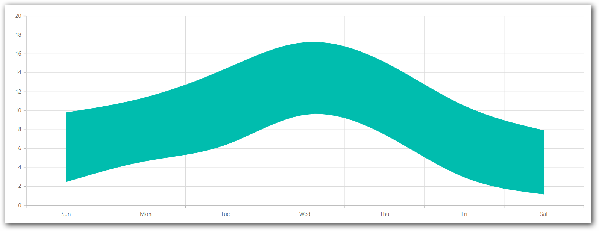

# Spline Range Area in Blazor Charts Component

## Spline Range Area

[Spline Range Area Chart](https://www.syncfusion.com/blazor-components/blazor-charts/chart-types/range-area-chart) visualizes a continuous band between low and high y-values across categories or time, using a smoothed (spline) curve. Configure the series as follows:
 
1. **Set the series type**: Assign the series [`Type`](https://help.syncfusion.com/cr/blazor/Syncfusion.Blazor.Charts.ChartSeries.html#Syncfusion_Blazor_Charts_ChartSeries_Type) to [`SplineRangeArea`](https://help.syncfusion.com/cr/blazor/Syncfusion.Blazor.Charts.ChartSeriesType.html#Syncfusion_Blazor_Charts_ChartSeriesType_SplineRangeArea) to render a spline range area band.

2. **Provide high and low values**: Each point must define both [`High`](https://help.syncfusion.com/cr/blazor/Syncfusion.Blazor.Charts.ChartSeries.html#Syncfusion_Blazor_Charts_ChartSeries_High) and [`Low`](https://help.syncfusion.com/cr/blazor/Syncfusion.Blazor.Charts.ChartSeries.html#Syncfusion_Blazor_Charts_ChartSeries_Low) values. These determine the upper and lower boundaries of the filled band for that x-value.

```cshtml

@using Syncfusion.Blazor.Charts

<SfChart>
    <ChartPrimaryXAxis ValueType="Syncfusion.Blazor.Charts.ValueType.Category" />
    <ChartSeriesCollection>
        <ChartSeries DataSource="@WeatherReports" XName="X" High="High" Low="Low" Type="ChartSeriesType.SplineRangeArea">
        </ChartSeries>
    </ChartSeriesCollection>
</SfChart>

@code{
    public class ChartData
    {
        public string X { get; set; }
        public double Low { get; set; }
        public double High { get; set; }
    }

    public List<ChartData> WeatherReports = new List<ChartData>
    {
         new ChartData { X= "Sun", Low= 2.5, High= 9.8 },
         new ChartData { X= "Mon", Low= 4.7, High= 11.4 },
         new ChartData { X= "Tue", Low= 6.4, High= 14.4 },
         new ChartData { X= "Wed", Low= 9.6, High= 17.2 },
         new ChartData { X= "Thu", Low= 7.5, High= 15.1 },
         new ChartData { X= "Fri", Low= 3.0, High= 10.5 },
         new ChartData { X= "Sat", Low= 1.2, High= 7.9 }
    };
}

```




> Refer to the [Blazor Spline Range Area Chart](https://www.syncfusion.com/blazor-components/blazor-charts/chart-types/range-area-chart) feature tour for additional capabilities. Explore our [Blazor Spline Range Area Chart Example](https://blazor.syncfusion.com/demos/chart/range-area?theme=bootstrap5) to know how to show variations in the data values for a given time.

## Binding data with series

Bind data to the series using the [`DataSource`](https://help.syncfusion.com/cr/blazor/Syncfusion.Blazor.Charts.ChartSeries.html#Syncfusion_Blazor_Charts_ChartSeries_DataSource) property. It accepts [`SfDataManager`](https://help.syncfusion.com/cr/blazor/Syncfusion.Blazor.Data.SfDataManager.html) or a collection of model objects. Map the data fields to [`XName`](https://help.syncfusion.com/cr/blazor/Syncfusion.Blazor.Charts.ChartSeries.html#Syncfusion_Blazor_Charts_ChartSeries_XName), [`High`](https://help.syncfusion.com/cr/blazor/Syncfusion.Blazor.Charts.ChartSeries.html#Syncfusion_Blazor_Charts_ChartSeries_High), and [`Low`](https://help.syncfusion.com/cr/blazor/Syncfusion.Blazor.Charts.ChartSeries.html#Syncfusion_Blazor_Charts_ChartSeries_Low). For more details, see [Working with data](../working-with-data).

```cshtml

@using Syncfusion.Blazor.Charts

<SfChart>
    <ChartPrimaryXAxis ValueType="Syncfusion.Blazor.Charts.ValueType.Category" />
    <ChartSeriesCollection>
        <ChartSeries DataSource="@WeatherReports" XName="X" High="High" Low="Low" Type="ChartSeriesType.SplineRangeArea">
        </ChartSeries>
    </ChartSeriesCollection>
</SfChart>

@code{
    public class ChartData
    {
        public string X { get; set; }
        public double Low { get; set; }
        public double High { get; set; }
    }

    public List<ChartData> WeatherReports = new List<ChartData>
    {
         new ChartData { X= "Sun", Low= 2.5, High= 9.8 },
         new ChartData { X= "Mon", Low= 4.7, High= 11.4 },
         new ChartData { X= "Tue", Low= 6.4, High= 14.4 },
         new ChartData { X= "Wed", Low= 9.6, High= 17.2 },
         new ChartData { X= "Thu", Low= 7.5, High= 15.1 },
         new ChartData { X= "Fri", Low= 3.0, High= 10.5 },
         new ChartData { X= "Sat", Low= 1.2, High= 7.9 }
    };
}

```


## Series customization

Use the following properties to customize the [Spline Range Area](https://help.syncfusion.com/cr/blazor/Syncfusion.Blazor.Charts.ChartSeriesType.html#Syncfusion_Blazor_Charts_ChartSeriesType_SplineRangeArea) series.

**Fill**

The [Fill](https://help.syncfusion.com/cr/blazor/Syncfusion.Blazor.Charts.ChartSeries.html#Syncfusion_Blazor_Charts_ChartSeries_Fill) property sets the color of the band.

```cshtml

@using Syncfusion.Blazor.Charts

<SfChart>
    <ChartPrimaryXAxis ValueType="Syncfusion.Blazor.Charts.ValueType.Category" />
    <ChartSeriesCollection>
        <ChartSeries DataSource="@WeatherReports" XName="X" High="High" Low="Low" Fill="blue" Type="ChartSeriesType.SplineRangeArea">
        </ChartSeries>
    </ChartSeriesCollection>
</SfChart>

@code {
    public class ChartData
    {
        public string X { get; set; }
        public double Low { get; set; }
        public double High { get; set; }
    }

    public List<ChartData> WeatherReports = new List<ChartData>
    {
         new ChartData { X= "Sun", Low= 2.5, High= 9.8 },
         new ChartData { X= "Mon", Low= 4.7, High= 11.4 },
         new ChartData { X= "Tue", Low= 6.4, High= 14.4 },
         new ChartData { X= "Wed", Low= 9.6, High= 17.2 },
         new ChartData { X= "Thu", Low= 7.5, High= 15.1 },
         new ChartData { X= "Fri", Low= 3.0, High= 10.5 },
         new ChartData { X= "Sat", Low= 1.2, High= 7.9 }
    };
}

```


The [Fill](https://help.syncfusion.com/cr/blazor/Syncfusion.Blazor.Charts.ChartSeries.html#Syncfusion_Blazor_Charts_ChartSeries_Fill) property also accepts a gradient via `Fill="url(#gradientId)"`. Ensure the matching `<defs>` with the referenced gradient is present in the page DOM.

```cshtml

@using Syncfusion.Blazor.Charts

<SfChart>
    <ChartPrimaryXAxis ValueType="Syncfusion.Blazor.Charts.ValueType.Category" />
    <ChartSeriesCollection>
        <ChartSeries DataSource="@WeatherReports" XName="X" High="High" Low="Low" Fill="url(#grad1)" Type="ChartSeriesType.SplineRangeArea">
        </ChartSeries>
    </ChartSeriesCollection>
</SfChart>

<svg style="height: 0">
    <defs>
        <linearGradient id="grad1" x1="0%" y1="0%" x2="0%" y2="100%">
            <stop offset="20%" style="stop-color:orange;stop-opacity:1" />
            <stop offset="100%" style="stop-color:black;stop-opacity:1" />
        </linearGradient>
    </defs>
</svg>

@code {
    public class ChartData
    {
        public string X { get; set; }
        public double Low { get; set; }
        public double High { get; set; }
    }

    public List<ChartData> WeatherReports = new List<ChartData>
    {
         new ChartData { X= "Sun", Low= 2.5, High= 9.8 },
         new ChartData { X= "Mon", Low= 4.7, High= 11.4 },
         new ChartData { X= "Tue", Low= 6.4, High= 14.4 },
         new ChartData { X= "Wed", Low= 9.6, High= 17.2 },
         new ChartData { X= "Thu", Low= 7.5, High= 15.1 },
         new ChartData { X= "Fri", Low= 3.0, High= 10.5 },
         new ChartData { X= "Sat", Low= 1.2, High= 7.9 }
    };
}

```


**Opacity**

The [Opacity](https://help.syncfusion.com/cr/blazor/Syncfusion.Blazor.Charts.ChartSeries.html#Syncfusion_Blazor_Charts_ChartSeries_Opacity) property controls the transparency of the band fill.

```cshtml

@using Syncfusion.Blazor.Charts

<SfChart>
    <ChartPrimaryXAxis ValueType="Syncfusion.Blazor.Charts.ValueType.Category" />
    <ChartSeriesCollection>
        <ChartSeries DataSource="@WeatherReports" XName="X" High="High" Low="Low" Fill="blue" Opacity="0.5" Type="ChartSeriesType.SplineRangeArea">
        </ChartSeries>
    </ChartSeriesCollection>
</SfChart>

@code {
    public class ChartData
    {
        public string X { get; set; }
        public double Low { get; set; }
        public double High { get; set; }
    }

    public List<ChartData> WeatherReports = new List<ChartData>
    {
         new ChartData { X= "Sun", Low= 2.5, High= 9.8 },
         new ChartData { X= "Mon", Low= 4.7, High= 11.4 },
         new ChartData { X= "Tue", Low= 6.4, High= 14.4 },
         new ChartData { X= "Wed", Low= 9.6, High= 17.2 },
         new ChartData { X= "Thu", Low= 7.5, High= 15.1 },
         new ChartData { X= "Fri", Low= 3.0, High= 10.5 },
         new ChartData { X= "Sat", Low= 1.2, High= 7.9 }
    };
}

```


**DashArray**

The [DashArray](https://help.syncfusion.com/cr/blazor/Syncfusion.Blazor.Charts.ChartSeries.html#Syncfusion_Blazor_Charts_ChartSeries_DashArray) property controls the dash pattern of the series border.

```cshtml

@using Syncfusion.Blazor.Charts

<SfChart>
    <ChartPrimaryXAxis ValueType="Syncfusion.Blazor.Charts.ValueType.Category" />
	
    <ChartSeriesCollection>
        <ChartSeries DataSource="@WeatherReports" XName="X" High="High" Low="Low" Opacity="0.5"
                     DashArray="5,5" Fill="blue" Type="ChartSeriesType.SplineRangeArea">
            <ChartSeriesBorder Width="2" Color="red"></ChartSeriesBorder>
        </ChartSeries>
    </ChartSeriesCollection>
</SfChart>

@code{
    public class ChartData
    {
        public string X { get; set; }
        public double Low { get; set; }
        public double High { get; set; }
    }

    public List<ChartData> WeatherReports = new List<ChartData>
	{
        new  ChartData { X=  "Sun", Low=  2.5, High=  9.8 },
        new  ChartData { X=  "Mon", Low=  4.7, High=  11.4 },
        new  ChartData { X=  "Tue", Low=  6.4, High=  14.4 },
        new  ChartData { X=  "Wed", Low=  9.6, High=  17.2 },
        new  ChartData { X=  "Thu", Low=  7.5, High=  15.1 },
        new  ChartData { X=  "Fri", Low=  3.0, High=  10.5 },
        new  ChartData { X=  "Sat", Low=  1.2, High=  7.9 }
    };
}

```


**Border**

[ChartSeriesBorder](https://help.syncfusion.com/cr/blazor/Syncfusion.Blazor.Charts.ChartSeriesBorder.html) sets the [Color](https://help.syncfusion.com/cr/blazor/Syncfusion.Blazor.Charts.ChartCommonBorder.html#Syncfusion_Blazor_Charts_ChartCommonBorder_Color) and [Width](https://help.syncfusion.com/cr/blazor/Syncfusion.Blazor.Charts.ChartCommonBorder.html#Syncfusion_Blazor_Charts_ChartCommonBorder_Width) of the series border.

```cshtml

@using Syncfusion.Blazor.Charts

<SfChart>
    <ChartPrimaryXAxis ValueType="Syncfusion.Blazor.Charts.ValueType.Category" />
	
    <ChartSeriesCollection>
        <ChartSeries DataSource="@WeatherReports" XName="X" High="High" Low="Low" Fill="blue" Type="ChartSeriesType.SplineRangeArea">
            <ChartSeriesBorder Width="2" Color="red"></ChartSeriesBorder>
        </ChartSeries>
    </ChartSeriesCollection>
</SfChart>

@code{
    public class ChartData
    {
        public string X { get; set; }
        public double Low { get; set; }
        public double High { get; set; }
    }

    public List<ChartData> WeatherReports = new List<ChartData>
	{
        new  ChartData { X=  "Sun", Low=  2.5, High=  9.8 },
        new  ChartData { X=  "Mon", Low=  4.7, High=  11.4 },
        new  ChartData { X=  "Tue", Low=  6.4, High=  14.4 },
        new  ChartData { X=  "Wed", Low=  9.6, High=  17.2 },
        new  ChartData { X=  "Thu", Low=  7.5, High=  15.1 },
        new  ChartData { X=  "Fri", Low=  3.0, High=  10.5 },
        new  ChartData { X=  "Sat", Low=  1.2, High=  7.9 }
    };
}

```


## Empty points

Data points with `null` or `double.NaN` values are treated as empty and are not plotted.

**Mode**

Use the [`Mode`](https://help.syncfusion.com/cr/blazor/Syncfusion.Blazor.Charts.ChartEmptyPointSettings.html#Syncfusion_Blazor_Charts_ChartEmptyPointSettings_Mode) property to control how missing data is displayed. The default is [`Gap`](https://help.syncfusion.com/cr/blazor/Syncfusion.Blazor.Charts.EmptyPointMode.html#Syncfusion_Blazor_Charts_EmptyPointMode_Gap).

```cshtml

@using Syncfusion.Blazor.Charts

<SfChart>
    <ChartPrimaryXAxis ValueType="Syncfusion.Blazor.Charts.ValueType.Category" />
    <ChartSeriesCollection>
        <ChartSeries DataSource="@WeatherReports" XName="X" High="High" Low="Low" Type="Syncfusion.Blazor.Charts.ChartSeriesType.SplineRangeArea">
            <ChartEmptyPointSettings Mode="EmptyPointMode.Zero"></ChartEmptyPointSettings>
        </ChartSeries>
    </ChartSeriesCollection>
</SfChart>

@code {
    public class ChartData
    {
        public string X { get; set; }
        public double Low { get; set; }
        public double High { get; set; }
    }

    public List<ChartData> WeatherReports = new List<ChartData>
    {
        new  ChartData { X=  "Sun", Low=  2.5, High=  9.8 },
        new  ChartData { X=  "Mon", Low=  4.7, High=  11.4 },
        new  ChartData { X=  "Tue", Low=  6.4, High=  14.4 },
        new  ChartData { X=  "Wed", Low=  double.NaN, High=  double.NaN },
        new  ChartData { X=  "Thu", Low=  7.5, High=  15.1 },
        new  ChartData { X=  "Fri", Low=  3.0, High=  10.5 },
        new  ChartData { X=  "Sat", Low=  1.2, High=  7.9 }
    };
}

```


**Fill**

Use the [`Fill`](https://help.syncfusion.com/cr/blazor/Syncfusion.Blazor.Charts.ChartEmptyPointSettings.html#Syncfusion_Blazor_Charts_ChartEmptyPointSettings_Fill) property to color empty points.

```cshtml

@using Syncfusion.Blazor.Charts

<SfChart>
    <ChartPrimaryXAxis ValueType="Syncfusion.Blazor.Charts.ValueType.Category" />
    <ChartSeriesCollection>
        <ChartSeries DataSource="@WeatherReports" XName="X" High="High" Low="Low" Type="Syncfusion.Blazor.Charts.ChartSeriesType.SplineRangeArea">
            <ChartEmptyPointSettings Mode="EmptyPointMode.Zero" Fill="red"></ChartEmptyPointSettings>
            <ChartMarker Visible="true" Height="10" Width="10"></ChartMarker>
        </ChartSeries>
    </ChartSeriesCollection>
</SfChart>

@code {
    public class ChartData
    {
        public string X { get; set; }
        public double Low { get; set; }
        public double High { get; set; }
    }

    public List<ChartData> WeatherReports = new List<ChartData>
    {
        new  ChartData { X=  "Sun", Low=  2.5, High=  9.8 },
        new  ChartData { X=  "Mon", Low=  4.7, High=  11.4 },
        new  ChartData { X=  "Tue", Low=  6.4, High=  14.4 },
        new  ChartData { X=  "Wed", Low=  double.NaN, High=  double.NaN },
        new  ChartData { X=  "Thu", Low=  7.5, High=  15.1 },
        new  ChartData { X=  "Fri", Low=  3.0, High=  10.5 },
        new  ChartData { X=  "Sat", Low=  1.2, High=  7.9 }
    };
}

```


**Border**

Use the [`Border`](https://help.syncfusion.com/cr/blazor/Syncfusion.Blazor.Charts.ChartEmptyPointSettings.html#Syncfusion_Blazor_Charts_ChartEmptyPointSettings_Border) property to style empty point borders, including [Width](https://help.syncfusion.com/cr/blazor/Syncfusion.Blazor.Charts.ChartEmptyPointBorder.html#Syncfusion_Blazor_Charts_ChartEmptyPointBorder_Width) and [Color](https://help.syncfusion.com/cr/blazor/Syncfusion.Blazor.Charts.ChartEmptyPointBorder.html#Syncfusion_Blazor_Charts_ChartEmptyPointBorder_Color).

```cshtml

@using Syncfusion.Blazor.Charts

<SfChart>
    <ChartPrimaryXAxis ValueType="Syncfusion.Blazor.Charts.ValueType.Category" />
    <ChartSeriesCollection>
        <ChartSeries DataSource="@WeatherReports" XName="X" High="High" Low="Low" Type="Syncfusion.Blazor.Charts.ChartSeriesType.SplineRangeArea">
            <ChartEmptyPointSettings Mode="EmptyPointMode.Zero" Fill="red">
                <ChartEmptyPointBorder Color="green" Width="2"></ChartEmptyPointBorder>
            </ChartEmptyPointSettings>
            <ChartMarker Visible="true" Height="10" Width="10"></ChartMarker>
        </ChartSeries>
    </ChartSeriesCollection>
</SfChart>

@code {
    public class ChartData
    {
        public string X { get; set; }
        public double Low { get; set; }
        public double High { get; set; }
    }

    public List<ChartData> WeatherReports = new List<ChartData>
    {
        new  ChartData { X=  "Sun", Low=  2.5, High=  9.8 },
        new  ChartData { X=  "Mon", Low=  4.7, High=  11.4 },
        new  ChartData { X=  "Tue", Low=  6.4, High=  14.4 },
        new  ChartData { X=  "Wed", Low=  double.NaN, High=  double.NaN },
        new  ChartData { X=  "Thu", Low=  7.5, High=  15.1 },
        new  ChartData { X=  "Fri", Low=  3.0, High=  10.5 },
        new  ChartData { X=  "Sat", Low=  1.2, High=  7.9 }
    };
}

```


## Events

### Series render

The [`OnSeriesRender`](https://help.syncfusion.com/cr/blazor/Syncfusion.Blazor.Charts.ChartEvents.html#Syncfusion_Blazor_Charts_ChartEvents_OnSeriesRender) event can modify series-level settings (for example, [Data](https://help.syncfusion.com/cr/blazor/Syncfusion.Blazor.Charts.SeriesRenderEventArgs.html#Syncfusion_Blazor_Charts_SeriesRenderEventArgs_Data), [Fill](https://help.syncfusion.com/cr/blazor/Syncfusion.Blazor.Charts.SeriesRenderEventArgs.html#Syncfusion_Blazor_Charts_SeriesRenderEventArgs_Fill), and [Series](https://help.syncfusion.com/cr/blazor/Syncfusion.Blazor.Charts.SeriesRenderEventArgs.html#Syncfusion_Blazor_Charts_SeriesRenderEventArgs_Series)) before rendering.

```cshtml

@using Syncfusion.Blazor.Charts

<SfChart>
    <ChartEvents OnSeriesRender="SeriesRender"></ChartEvents>
    <ChartPrimaryXAxis ValueType="Syncfusion.Blazor.Charts.ValueType.Category" />
    <ChartSeriesCollection>
        <ChartSeries DataSource="@WeatherReports" XName="X" High="High" Low="Low" Fill="blue" Opacity="0.5" Type="Syncfusion.Blazor.Charts.ChartSeriesType.SplineRangeArea">
        </ChartSeries>
    </ChartSeriesCollection>
</SfChart>

@code {
    public class ChartData
    {
        public string X { get; set; }
        public double Low { get; set; }
        public double High { get; set; }
    }

    public void SeriesRender(SeriesRenderEventArgs args)
    {
        args.Fill = "#FF4081";
    }

    public List<ChartData> WeatherReports = new List<ChartData>
    {
         new ChartData { X= "Sun", Low= 2.5, High= 9.8 },
         new ChartData { X= "Mon", Low= 4.7, High= 11.4 },
         new ChartData { X= "Tue", Low= 6.4, High= 14.4 },
         new ChartData { X=  "Wed", Low=  9.6, High=  17.2 },
         new ChartData { X= "Thu", Low= 7.5, High= 15.1 },
         new ChartData { X= "Fri", Low= 3.0, High= 10.5 },
         new ChartData { X= "Sat", Low= 1.2, High= 7.9 }
    };
}

```


### Point render

The [`OnPointRender`](https://help.syncfusion.com/cr/blazor/Syncfusion.Blazor.Charts.ChartEvents.html#Syncfusion_Blazor_Charts_ChartEvents_OnPointRender) event customizes individual points before they are rendered (for example, conditional coloring).

```cshtml

@using Syncfusion.Blazor.Charts

<SfChart>
    <ChartEvents OnPointRender="PointRender"></ChartEvents>
    <ChartPrimaryXAxis ValueType="Syncfusion.Blazor.Charts.ValueType.Category" />
    <ChartSeriesCollection>
        <ChartSeries DataSource="@WeatherReports" XName="X" High="High" Low="Low" Type="Syncfusion.Blazor.Charts.ChartSeriesType.SplineRangeArea">
            <ChartMarker Visible="true" Height="10" Width="10"></ChartMarker>
        </ChartSeries>
    </ChartSeriesCollection>
</SfChart>

@code {
    public class ChartData
    {
        public string X { get; set; }
        public double Low { get; set; }
        public double High { get; set; }
    }

    public void PointRender(PointRenderEventArgs args)
    {
        args.Fill = (args.Point.Index % 2 != 0) ? "#ff6347" : "#009cb8";
    }

    public List<ChartData> WeatherReports = new List<ChartData>
    {
         new ChartData { X= "Sun", Low= 2.5, High= 9.8 },
         new ChartData { X= "Mon", Low= 4.7, High= 11.4 },
         new ChartData { X= "Tue", Low= 6.4, High= 14.4 },
         new ChartData { X= "Wed", Low=  9.6, High=  17.2 },
         new ChartData { X= "Thu", Low= 7.5, High= 15.1 },
         new ChartData { X= "Fri", Low= 3.0, High= 10.5 },
         new ChartData { X= "Sat", Low= 1.2, High= 7.9 }
    };
}

```


> Refer to the [Blazor Charts](https://www.syncfusion.com/blazor-components/blazor-charts) feature tour for an overview of chart types and capabilities. Explore the [Charts demo](https://blazor.syncfusion.com/demos/chart/line?theme=bootstrap5) for additional examples.

## See also

* [Data label](../data-labels)
* [Tooltip](../tool-tip)
