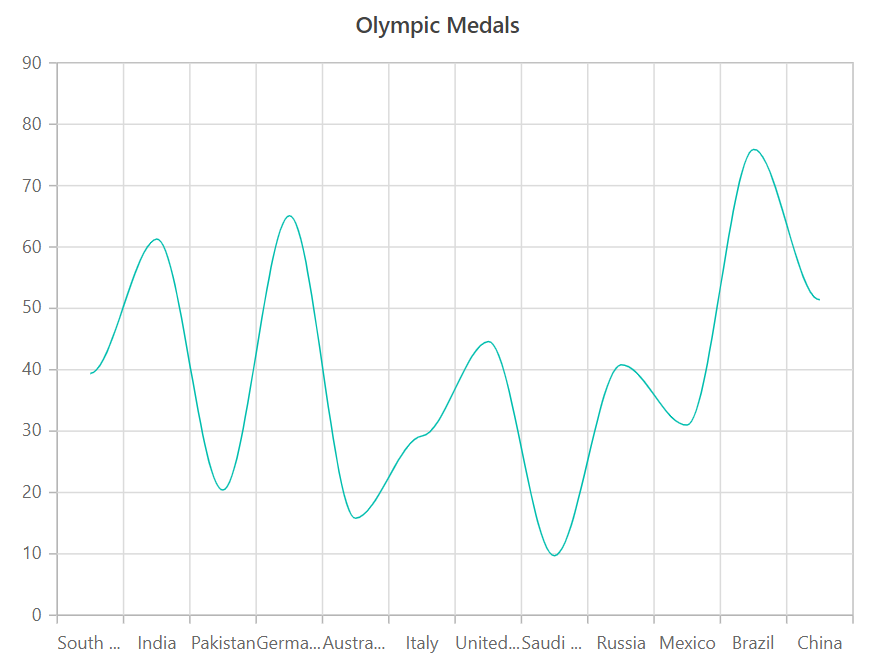

# Spline in Blazor Charts Component

## Spline

[Spline Chart](https://www.syncfusion.com/blazor-components/blazor-charts/chart-types/spline-chart) connects the data points with smooth curves. To render a [Spline Chart](https://www.syncfusion.com/blazor-components/blazor-charts/chart-types/spline-chart), set the series [Type](https://help.syncfusion.com/cr/blazor/Syncfusion.Blazor.Charts.ChartSeries.html#Syncfusion_Blazor_Charts_ChartSeries_Type) as [Spline](https://help.syncfusion.com/cr/blazor/Syncfusion.Blazor.Charts.ChartSeriesType.html#Syncfusion_Blazor_Charts_ChartSeriesType_Spline).

```cshtml

@using Syncfusion.Blazor.Charts

<SfChart Title="Olympic Medals">
    <ChartPrimaryXAxis ValueType="Syncfusion.Blazor.Charts.ValueType.Category"></ChartPrimaryXAxis>
	
    <ChartSeriesCollection>
        <ChartSeries DataSource="@MedalDetails" XName="X" YName="Y" Type="ChartSeriesType.Spline">
        </ChartSeries>
    </ChartSeriesCollection>
</SfChart>

@code{
    public class ChartData
    {
        public string X { get; set; }
        public double Y { get; set; }
    }
	
    public List<ChartData> MedalDetails = new List<ChartData>
	{
        new ChartData { X= "South Korea", Y= 39.4 },
        new ChartData { X= "India", Y= 61.3 },
        new ChartData { X= "Pakistan", Y= 20.4 },
        new ChartData { X= "Germany", Y= 65.1 },
        new ChartData { X= "Australia", Y= 15.8 },
        new ChartData { X= "Italy", Y= 29.2 },
        new ChartData { X= "United Kingdom", Y= 44.6 },
        new ChartData { X= "Saudi Arabia", Y= 9.7 },
        new ChartData { X= "Russia", Y= 40.8 },
        new ChartData { X= "Mexico", Y= 31 },
        new ChartData { X= "Brazil", Y= 75.9 },
        new ChartData { X= "China", Y= 51.4 }
    };
}

``` 



N> Refer to our [Blazor Spline Chart](https://www.syncfusion.com/blazor-components/blazor-charts/chart-types/spline-chart) feature tour page to know about its other groundbreaking feature representations. Explore our [Blazor Spline Chart Example](https://blazor.syncfusion.com/demos/chart/spline?theme=bootstrap4) to know how to connect the data points with smooth curves.

## Type of spline

To specify the type of [Spline Chart](https://help.syncfusion.com/cr/blazor/Syncfusion.Blazor.Charts.ChartSeriesType.html#Syncfusion_Blazor_Charts_ChartSeriesType_Spline), use [SplineType](https://help.syncfusion.com/cr/blazor/Syncfusion.Blazor.Charts.ChartSeries.html#Syncfusion_Blazor_Charts_ChartSeries_SplineType) property. The spline types are **Clamped**, **Cardinal**, **Monotonic** and **Natural**.

```cshtml

@using Syncfusion.Blazor.Charts

<SfChart Title="Olympic Medals" Width="60%">
    <ChartPrimaryXAxis ValueType="Syncfusion.Blazor.Charts.ValueType.Category"></ChartPrimaryXAxis>
	
    <ChartSeriesCollection>
        <ChartSeries DataSource="@MedalDetails" XName="X" YName="Y" Type="ChartSeriesType.Spline" SplineType="SplineType.Cardinal">
        </ChartSeries>
    </ChartSeriesCollection>
</SfChart>

@code{
    public class ChartData
    {
        public string X { get; set; }
        public double Y { get; set; }
    }
	
    public List<ChartData> MedalDetails = new List<ChartData>
	{
        new ChartData { X= "South Korea", Y= 39.4 },
        new ChartData { X= "India", Y= 61.3 },
        new ChartData { X= "Pakistan", Y= 20.4 },
        new ChartData { X= "Germany", Y= 65.1 },
        new ChartData { X= "Australia", Y= 15.8 },
        new ChartData { X= "Italy", Y= 29.2 },
        new ChartData { X= "United Kingdom", Y= 44.6 },
        new ChartData { X= "Saudi Arabia", Y= 9.7 },
        new ChartData { X= "Russia", Y= 40.8 },
        new ChartData { X= "Mexico", Y= 31 },
        new ChartData { X= "Brazil", Y= 75.9 },
        new ChartData { X= "China", Y= 51.4 }
    };
}

``` 




## Series customization

The following properties can be used to customize the [Spline](https://help.syncfusion.com/cr/blazor/Syncfusion.Blazor.Charts.ChartSeriesType.html#Syncfusion_Blazor_Charts_ChartSeriesType_Spline) series.

* [Fill](https://help.syncfusion.com/cr/blazor/Syncfusion.Blazor.Charts.ChartSeries.html#Syncfusion_Blazor_Charts_ChartSeries_Fill) – Specifies the color of the series.
* [Opacity](https://help.syncfusion.com/cr/blazor/Syncfusion.Blazor.Charts.ChartSeries.html#Syncfusion_Blazor_Charts_ChartSeries_Opacity) – Specifies the opacity of [Fill](https://help.syncfusion.com/cr/blazor/Syncfusion.Blazor.Charts.ChartSeries.html#Syncfusion_Blazor_Charts_ChartSeries_Fill).
* [Width](https://help.syncfusion.com/cr/blazor/Syncfusion.Blazor.Charts.ChartSeries.html#Syncfusion_Blazor_Charts_ChartSeries_Width) – Specifies the width of the line stroke.
* [DashArray](https://help.syncfusion.com/cr/blazor/Syncfusion.Blazor.Charts.ChartSeries.html#Syncfusion_Blazor_Charts_ChartSeries_DashArray) – Specifies the dashes of line stroke.

```cshtml

@using Syncfusion.Blazor.Charts

<SfChart Title="Olympic Medals" Width="60%">
    <ChartPrimaryXAxis ValueType="Syncfusion.Blazor.Charts.ValueType.Category"></ChartPrimaryXAxis>
	
    <ChartSeriesCollection>
        <ChartSeries DataSource="@MedalDetails" XName="X" YName="Y" Width="3" Opacity="0.5"
                     DashArray="5,5" Fill="blue" Type="ChartSeriesType.Spline">
        </ChartSeries>
    </ChartSeriesCollection>
</SfChart>

@code{
    public class ChartData
    {
       public string X { get; set; }
       public double Y { get; set; }
    }
	
    public List<ChartData> MedalDetails = new List<ChartData>
	{
        new ChartData { X= "South Korea", Y= 39.4 },
        new ChartData { X= "India", Y= 61.3 },
        new ChartData { X= "Pakistan", Y= 20.4 },
        new ChartData { X= "Germany", Y= 65.1 },
        new ChartData { X= "Australia", Y= 15.8 },
        new ChartData { X= "Italy", Y= 29.2 },
        new ChartData { X= "United Kingdom", Y= 44.6 },
        new ChartData { X= "Saudi Arabia", Y= 9.7 },
        new ChartData { X= "Russia", Y= 40.8 },
        new ChartData { X= "Mexico", Y= 31 },
        new ChartData { X= "Brazil", Y= 75.9 },
        new ChartData { X= "China", Y= 51.4 }
    };
}

``` 



N> Refer to our [Blazor Charts](https://www.syncfusion.com/blazor-components/blazor-charts) feature tour page for its groundbreaking feature representations and also explore our [Blazor Chart Example](https://blazor.syncfusion.com/demos/chart/line?theme=bootstrap4) to know various chart types and how to represent time-dependent data, showing trends at equal intervals.

## See also

* [Data Label](../data-labels)
* [Tooltip](../tool-tip)