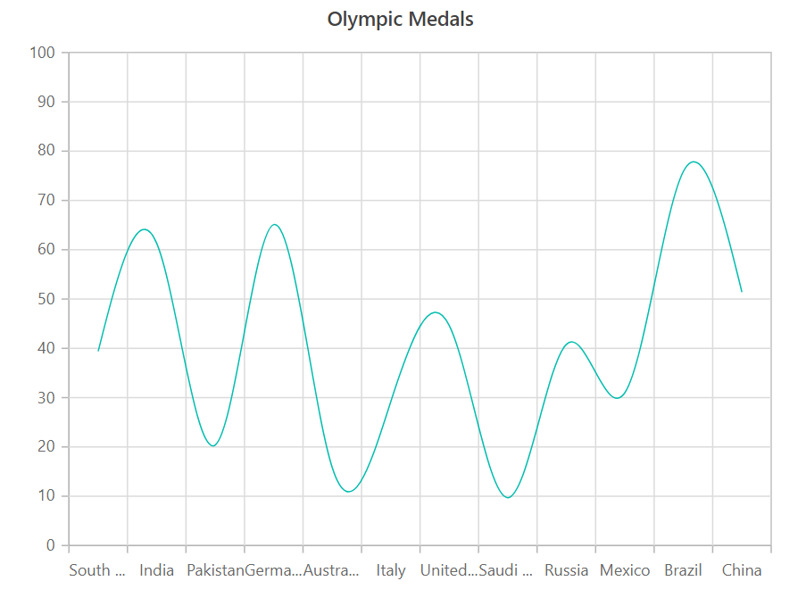
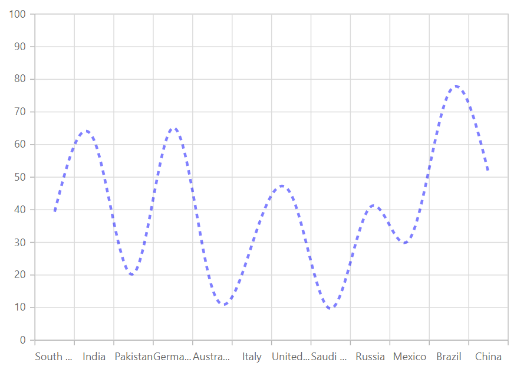

---
title: "Spline Chart in Blazor Charts component | Syncfusion"

component: "Charts"

description: "Learn here all about Spline Chart of Syncfusion Charts (SfCharts) component and more."
---
# Spline Chart in Blazor Charts (SfCharts)

## Spline

[`Spline Chart`](https://www.syncfusion.com/blazor-components/blazor-charts/chart-types/spline-chart) connects the data points with smooth curves. To render a [`Spline Chart`](https://www.syncfusion.com/blazor-components/blazor-charts/chart-types/spline-chart), use series [`Type`](https://help.syncfusion.com/cr/blazor/Syncfusion.Blazor~Syncfusion.Blazor.Charts.ChartSeries~Type.html) as [`Spline`](https://help.syncfusion.com/cr/blazor/Syncfusion.Blazor.Charts.ChartSeriesType.html#Syncfusion_Blazor_Charts_ChartSeriesType_Spline).





> Refer to our [`Blazor Spline Chart`](https://www.syncfusion.com/blazor-components/blazor-charts/chart-types/spline-chart) feature tour page to know about its other groundbreaking feature representations. Explore our [`Blazor Spline Chart Example`](https://blazor.syncfusion.com/demos/chart/spline?theme=bootstrap4) to know how to connects the data points with smooth curves.

## Type of Spline

To specify the type of [`Spline Chart`](https://help.syncfusion.com/cr/blazor/Syncfusion.Blazor.Charts.ChartSeriesType.html#Syncfusion_Blazor_Charts_ChartSeriesType_Spline) use [`SplineType`](https://help.syncfusion.com/cr/blazor/Syncfusion.Blazor.Charts.ChartSeries.html#Syncfusion_Blazor_Charts_ChartSeries_SplineType) property. The spline [`types`](https://help.syncfusion.com/cr/blazor/Syncfusion.Blazor.Charts.ChartSeriesType.html) are **Clamped**, **Cardinal**, **Monotonic** and **Natural**.





## Series Customization

The following properties can be used to customize the [`Spline`](https://help.syncfusion.com/cr/blazor/Syncfusion.Blazor.Charts.ChartSeriesType.html#Syncfusion_Blazor_Charts_ChartSeriesType_Spline) series.

* [`Fill`](https://help.syncfusion.com/cr/blazor/Syncfusion.Blazor.Charts.ChartSeries.html#Syncfusion_Blazor_Charts_ChartSeries_Fill) – Specifies the color of the series.
* [`Opacity`](https://help.syncfusion.com/cr/blazor/Syncfusion.Blazor.Charts.ChartSeries.html#Syncfusion_Blazor_Charts_ChartSeries_Opacity) – Specifies the opacity of [`Fill`](https://help.syncfusion.com/cr/blazor/Syncfusion.Blazor.Charts.ChartSeries.html#Syncfusion_Blazor_Charts_ChartSeries_Fill).
* [`Width`](https://help.syncfusion.com/cr/blazor/Syncfusion.Blazor~Syncfusion.Blazor.Charts.ChartSeries~Width.html) – Specifies the width of the line stroke.
* [`DashArray`](https://help.syncfusion.com/cr/blazor/Syncfusion.Blazor.Charts.ChartSeries.html#Syncfusion_Blazor_Charts_ChartSeries_DashArray) – Specifies the dashes of line stroke.





> Refer to our [`Blazor Charts`](https://www.syncfusion.com/blazor-components/blazor-charts) feature tour page for its groundbreaking feature representations and also explore our [`Blazor Chart example`](https://blazor.syncfusion.com/demos/chart/line?theme=bootstrap4) to know various chart types and how to represent time-dependent data, showing trends at equal intervals.

## See Also

* [Data Label](../data-labels)
* [Tooltip](../tool-tip)