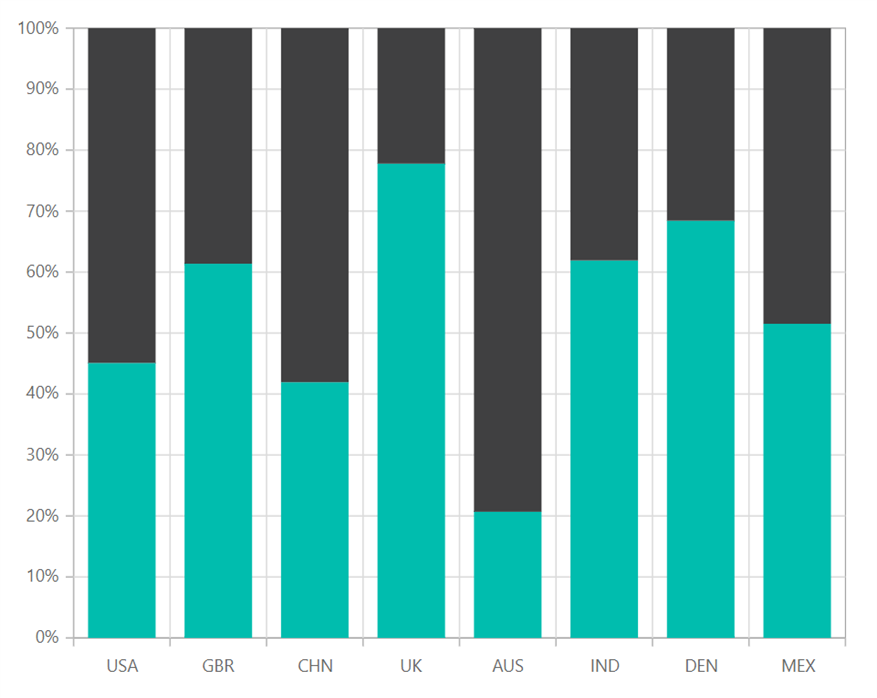
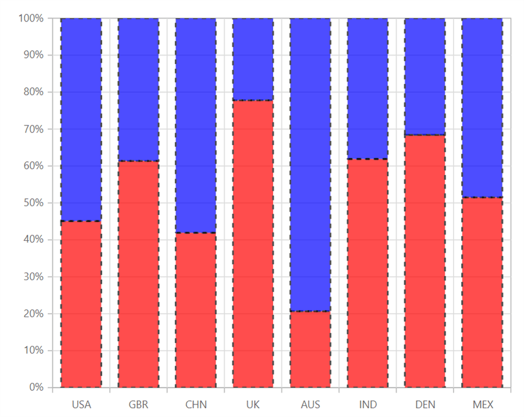

# 100% Stacked Column Chart in Blazor Charts (SfCharts)

## 100% Stacked Column

[`100% Stacked Column Chart`](https://www.syncfusion.com/blazor-components/blazor-charts/chart-types/100-stacked-column-chart) displays multiple series of data as stacked areas, ensuring that the cumulative proportion of each stacked element always totals 100%. The y-axis will hence always be rendered with the range 0–100%. To render a [`100% Stacked Column`](https://www.syncfusion.com/blazor-components/blazor-charts/chart-types/100-stacked-column-chart) series, use series [`Type`](https://help.syncfusion.com/cr/blazor/Syncfusion.Blazor~Syncfusion.Blazor.Charts.ChartSeries~Type.html) as [`StackingColumn100`](https://help.syncfusion.com/cr/blazor/Syncfusion.Blazor.Charts.ChartSeriesType.html#Syncfusion_Blazor_Charts_ChartSeriesType_StackingColumn100).

{% aspTab template="chart/series/column-charts/100%stackedcolumn", sourceFiles="stackedcolumn100.razor" %}



> Refer to our [`Blazor 100% Stacked Column Chart`](https://www.syncfusion.com/blazor-components/blazor-charts/chart-types/100-stacked-column-chart) feature tour page to know about its other groundbreaking feature representations. Explore our [`Blazor 100% Stacked Column Chart Example`](https://blazor.syncfusion.com/demos/chart/percent-stacked-column?theme=bootstrap4)  to know how to render and configure the 100% Stacked Column type chart.

## Series Customization

The following properties can be used to customize the [`100% Stacked Column`](https://help.syncfusion.com/cr/blazor/Syncfusion.Blazor.Charts.ChartSeriesType.html#Syncfusion_Blazor_Charts_ChartSeriesType_StackingColumn100) series.

* [`Fill`](https://help.syncfusion.com/cr/blazor/Syncfusion.Blazor.Charts.ChartSeries.html#Syncfusion_Blazor_Charts_ChartSeries_Fill) – Specifies the color of the series.
* [`Opacity`](https://help.syncfusion.com/cr/blazor/Syncfusion.Blazor.Charts.ChartSeries.html#Syncfusion_Blazor_Charts_ChartSeries_Opacity) – Specifies the opacity of [`Fill`](https://help.syncfusion.com/cr/blazor/Syncfusion.Blazor.Charts.ChartSeries.html#Syncfusion_Blazor_Charts_ChartSeries_Fill).
* [`DashArray`](https://help.syncfusion.com/cr/blazor/Syncfusion.Blazor.Charts.ChartSeries.html#Syncfusion_Blazor_Charts_ChartSeries_DashArray) – Specifies the dashes of series border.
* [`ChartSeriesBorder`](https://help.syncfusion.com/cr/blazor/Syncfusion.Blazor.Charts.ChartSeriesBorder.html) – Specifies the [`Color`](https://help.syncfusion.com/cr/blazor/Syncfusion.Blazor.Charts.ChartCommonBorder.html#Syncfusion_Blazor_Charts_ChartCommonBorder_Color) and [`Width`](https://help.syncfusion.com/cr/blazor/Syncfusion.Blazor.Charts.ChartCommonBorder.html#Syncfusion_Blazor_Charts_ChartCommonBorder_Width) of series border.

{% aspTab template="chart/series/column-charts/100%stackedcolumn", sourceFiles="custom-stackedcolumn100.razor" %}



> Refer to our [`Blazor Charts`](https://www.syncfusion.com/blazor-components/blazor-charts) feature tour page for its groundbreaking feature representations and also explore our [`Blazor Chart example`](https://blazor.syncfusion.com/demos/chart/line?theme=bootstrap4) to know various chart types and how to represent time-dependent data, showing trends at equal intervals.

## See Also

* [Data Label](../data-labels)
* [Tooltip](../tool-tip)