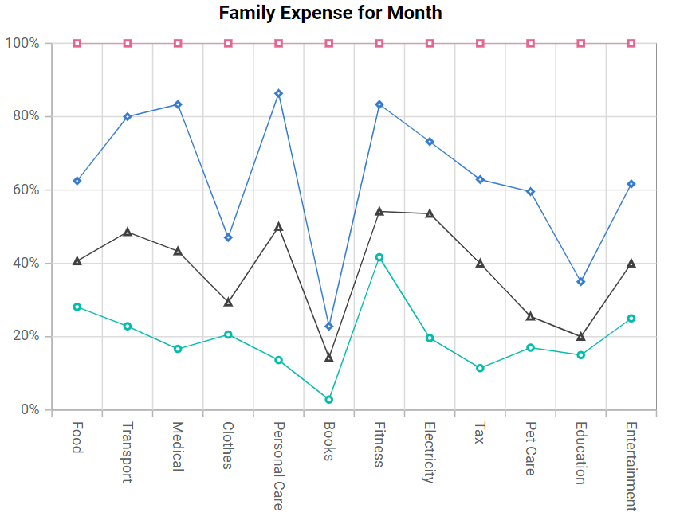

# 100% Stacked Line in Blazor Charts Component

## 100% Stacked Line

[100% Stacked Line Chart](https://www.syncfusion.com/blazor-components/blazor-charts/chart-types/100-stacked-line-chart) displays multiple series as stacked lines where the cumulative proportion at each category totals 100%. The y-axis range is normalized to 0–100% to compare proportional relationships rather than absolute values. To render a 100% stacked line series, set the series [`Type`](https://help.syncfusion.com/cr/blazor/Syncfusion.Blazor.Charts.ChartSeries.html#Syncfusion_Blazor_Charts_ChartSeries_Type) to [`StackingLine100`](https://help.syncfusion.com/cr/blazor/Syncfusion.Blazor.Charts.ChartSeriesType.html#Syncfusion_Blazor_Charts_ChartSeriesType_StackingLine100).

```cshtml

@using Syncfusion.Blazor.Charts

<SfChart Title="Family Expense for Month">
    <ChartPrimaryXAxis LabelRotation="90" ValueType="Syncfusion.Blazor.Charts.ValueType.Category">
    </ChartPrimaryXAxis>
	
    <ChartSeriesCollection>
        <ChartSeries XName="X" DataSource="@ExpenseReports"
                     YName="Y" Type="Syncfusion.Blazor.Charts.ChartSeriesType.StackingLine100">
            <ChartMarker Visible="true">
            </ChartMarker>
        </ChartSeries>
        <ChartSeries XName="X" DataSource="@ExpenseReports"
                     YName="Y1" Type="Syncfusion.Blazor.Charts.ChartSeriesType.StackingLine100">
            <ChartMarker Visible="true">
            </ChartMarker>
        </ChartSeries>
        <ChartSeries XName="X" DataSource="@ExpenseReports"
                     YName="Y2" Type="Syncfusion.Blazor.Charts.ChartSeriesType.StackingLine100">
            <ChartMarker Visible="true">
            </ChartMarker>
        </ChartSeries>
        <ChartSeries XName="X" DataSource="@ExpenseReports"
                     YName="Y3" Type="Syncfusion.Blazor.Charts.ChartSeriesType.StackingLine100">
            <ChartMarker Visible="true">
            </ChartMarker>
        </ChartSeries>
    </ChartSeriesCollection>
</SfChart>

@code{
    public class ChartData
    {
        public string X { get; set; }
        public double Y { get; set; }
        public double Y1 { get; set; }
        public double Y2 { get; set; }
        public double Y3 { get; set; }
    }
	
    public List<ChartData> ExpenseReports = new List<ChartData>
	{
        new ChartData { X = "Food" , Y = 90, Y1 = 40 , Y2 = 70, Y3 = 120 },
        new ChartData { X = "Transport", Y = 80, Y1 = 90, Y2 = 110, Y3 = 70 },
        new ChartData { X = "Medical",Y = 50, Y1 = 80, Y2 = 120, Y3 = 50 },
        new ChartData { X = "Clothes",Y = 70, Y1 = 30, Y2 = 60, Y3 = 180 },
        new ChartData { X = "Personal Care", Y = 30, Y1 = 80, Y2 = 80, Y3 = 30 },
        new ChartData { X = "Books", Y = 10, Y1 = 40, Y2 = 30, Y3 = 270},
        new ChartData { X = "Fitness",Y = 100, Y1 = 30, Y2 = 70, Y3 = 40 },
        new ChartData { X = "Electricity", Y = 55, Y1 = 95, Y2 = 55, Y3 = 75},
        new ChartData { X = "Tax", Y = 20, Y1 = 50, Y2 = 40, Y3 = 65 },
        new ChartData { X = "Pet Care", Y = 40, Y1 = 20, Y2 = 80, Y3 = 95 },
        new ChartData { X = "Education", Y = 45, Y1 = 15, Y2 = 45, Y3 = 195 },
        new ChartData { X = "Entertainment", Y = 75, Y1 = 45, Y2 = 65, Y3 = 115 }
    };
}

``` 




N> Refer to the [Blazor 100% Stacked Line Chart](https://www.syncfusion.com/blazor-components/blazor-charts/chart-types/100-stacked-line-chart) feature tour to learn about additional capabilities. Explore the [Blazor 100% Stacked Line Chart example](https://blazor.syncfusion.com/demos/chart/percent-stacked-line?theme=bootstrap5) to see how to render and configure this chart type.

## Binding data with series

Bind data to the chart using the series [`DataSource`](https://help.syncfusion.com/cr/blazor/Syncfusion.Blazor.Charts.ChartSeries.html#Syncfusion_Blazor_Charts_ChartSeries_DataSource) property. The data source can be an [`SfDataManager`](https://help.syncfusion.com/cr/blazor/Syncfusion.Blazor.Data.SfDataManager.html) or a list of business objects. For details, see [Working with data](../working-with-data). Map the data fields to [`XName`](https://help.syncfusion.com/cr/blazor/Syncfusion.Blazor.Charts.ChartSeries.html#Syncfusion_Blazor_Charts_ChartSeries_XName) and [`YName`](https://help.syncfusion.com/cr/blazor/Syncfusion.Blazor.Charts.ChartSeries.html#Syncfusion_Blazor_Charts_ChartSeries_YName) in the series.

```cshtml

@using Syncfusion.Blazor.Charts

<SfChart Title="Family Expense for Month">
    <ChartPrimaryXAxis LabelRotation="90" ValueType="Syncfusion.Blazor.Charts.ValueType.Category">
    </ChartPrimaryXAxis>
	
    <ChartSeriesCollection>
        <ChartSeries XName="X" DataSource="@ExpenseReports"
                     YName="Y" Type="Syncfusion.Blazor.Charts.ChartSeriesType.StackingLine100">
            <ChartMarker Visible="true">
            </ChartMarker>
        </ChartSeries>
        <ChartSeries XName="X" DataSource="@ExpenseReports"
                     YName="Y1" Type="Syncfusion.Blazor.Charts.ChartSeriesType.StackingLine100">
            <ChartMarker Visible="true">
            </ChartMarker>
        </ChartSeries>
        <ChartSeries XName="X" DataSource="@ExpenseReports"
                     YName="Y2" Type="Syncfusion.Blazor.Charts.ChartSeriesType.StackingLine100">
            <ChartMarker Visible="true">
            </ChartMarker>
        </ChartSeries>
        <ChartSeries XName="X" DataSource="@ExpenseReports"
                     YName="Y3" Type="Syncfusion.Blazor.Charts.ChartSeriesType.StackingLine100">
            <ChartMarker Visible="true">
            </ChartMarker>
        </ChartSeries>
    </ChartSeriesCollection>
</SfChart>

@code{
    public class ChartData
    {
        public string X { get; set; }
        public double Y { get; set; }
        public double Y1 { get; set; }
        public double Y2 { get; set; }
        public double Y3 { get; set; }
    }
	
    public List<ChartData> ExpenseReports = new List<ChartData>
	{
        new ChartData { X = "Food" , Y = 90, Y1 = 40 , Y2 = 70, Y3 = 120 },
        new ChartData { X = "Transport", Y = 80, Y1 = 90, Y2 = 110, Y3 = 70 },
        new ChartData { X = "Medical",Y = 50, Y1 = 80, Y2 = 120, Y3 = 50 },
        new ChartData { X = "Clothes",Y = 70, Y1 = 30, Y2 = 60, Y3 = 180 },
        new ChartData { X = "Personal Care", Y = 30, Y1 = 80, Y2 = 80, Y3 = 30 },
        new ChartData { X = "Books", Y = 10, Y1 = 40, Y2 = 30, Y3 = 270},
        new ChartData { X = "Fitness",Y = 100, Y1 = 30, Y2 = 70, Y3 = 40 },
        new ChartData { X = "Electricity", Y = 55, Y1 = 95, Y2 = 55, Y3 = 75},
        new ChartData { X = "Tax", Y = 20, Y1 = 50, Y2 = 40, Y3 = 65 },
        new ChartData { X = "Pet Care", Y = 40, Y1 = 20, Y2 = 80, Y3 = 95 },
        new ChartData { X = "Education", Y = 45, Y1 = 15, Y2 = 45, Y3 = 195 },
        new ChartData { X = "Entertainment", Y = 75, Y1 = 45, Y2 = 65, Y3 = 115 }
    };
}

``` 


## Series customization

The following properties customize the [100% Stacked Line](https://help.syncfusion.com/cr/blazor/Syncfusion.Blazor.Charts.ChartSeriesType.html#Syncfusion_Blazor_Charts_ChartSeriesType_StackingLine100) series.

**Fill**

The [Fill](https://help.syncfusion.com/cr/blazor/Syncfusion.Blazor.Charts.ChartSeries.html#Syncfusion_Blazor_Charts_ChartSeries_Fill) property sets the stroke color of the line series.

```cshtml

@using Syncfusion.Blazor.Charts

<SfChart Title="Family Expense for Month">
    <ChartPrimaryXAxis ValueType="Syncfusion.Blazor.Charts.ValueType.Category">
    </ChartPrimaryXAxis>

    <ChartSeriesCollection>
        <ChartSeries XName="X" DataSource="@ExpenseReports"
                     YName="Y" Fill="blue" Type="ChartSeriesType.StackingLine100">
            <ChartMarker Visible="true">
            </ChartMarker>
        </ChartSeries>
        <ChartSeries XName="X" DataSource="@ExpenseReports"
                     YName="Y1" Fill="green" Type="ChartSeriesType.StackingLine100">
            <ChartMarker Visible="true">
            </ChartMarker>
        </ChartSeries>
        <ChartSeries XName="X" DataSource="@ExpenseReports"
                     YName="Y2" Fill="red" Type="ChartSeriesType.StackingLine100">
            <ChartMarker Visible="true">
            </ChartMarker>
        </ChartSeries>
        <ChartSeries XName="X" DataSource="@ExpenseReports"
                     YName="Y3" Fill="black" Type="ChartSeriesType.StackingLine100">
            <ChartMarker Visible="true">
            </ChartMarker>
        </ChartSeries>
    </ChartSeriesCollection>
</SfChart>

@code {
    public class ChartData
    {
        public string X { get; set; }
        public double Y { get; set; }
        public double Y1 { get; set; }
        public double Y2 { get; set; }
        public double Y3 { get; set; }
    }

    public List<ChartData> ExpenseReports = new List<ChartData>
    {
         new ChartData { X = "Food" , Y = 90, Y1 = 40 , Y2 = 70, Y3 = 120 },
         new ChartData { X = "Transport", Y = 80, Y1 = 90, Y2 = 110, Y3 = 70 },
         new ChartData { X = "Medical",Y = 50, Y1 = 80, Y2 = 120, Y3 = 50 },
         new ChartData { X = "Clothes",Y = 70, Y1 = 30, Y2 = 60, Y3 = 180 },
         new ChartData { X = "Personal Care", Y = 30, Y1 = 80, Y2 = 80, Y3 = 30 },
         new ChartData { X = "Books", Y = 10, Y1 = 40, Y2 = 30, Y3 = 270},
         new ChartData { X = "Fitness",Y = 100, Y1 = 30, Y2 = 70, Y3 = 40 },
         new ChartData { X = "Electricity", Y = 55, Y1 = 95, Y2 = 55, Y3 = 75},
         new ChartData { X = "Tax", Y = 20, Y1 = 50, Y2 = 40, Y3 = 65 },
         new ChartData { X = "Pet Care", Y = 40, Y1 = 20, Y2 = 80, Y3 = 95 },
         new ChartData { X = "Education", Y = 45, Y1 = 15, Y2 = 45, Y3 = 195 },
         new ChartData { X = "Entertainment", Y = 75, Y1 = 45, Y2 = 65, Y3 = 115 }
    };
}

```


The [Fill](https://help.syncfusion.com/cr/blazor/Syncfusion.Blazor.Charts.ChartSeries.html#Syncfusion_Blazor_Charts_ChartSeries_Fill) property can reference an SVG gradient (for example, `url(#id)`) to apply a gradient stroke to the line series.

```cshtml

@using Syncfusion.Blazor.Charts

<SfChart Title="Family Expense for Month">
    <ChartPrimaryXAxis ValueType="Syncfusion.Blazor.Charts.ValueType.Category">
    </ChartPrimaryXAxis>

    <ChartSeriesCollection>
        <ChartSeries XName="X" DataSource="@ExpenseReports"
                     YName="Y" Fill="url(#grad1)" Type="ChartSeriesType.StackingLine100">
            <ChartMarker Visible="true"></ChartMarker>
        </ChartSeries>
        <ChartSeries XName="X" DataSource="@ExpenseReports"
                     YName="Y1" Fill="url(#grad2)" Type="ChartSeriesType.StackingLine100">
            <ChartMarker Visible="true"></ChartMarker>
        </ChartSeries>
        <ChartSeries XName="X" DataSource="@ExpenseReports"
                     YName="Y2" Fill="url(#grad3)" Type="ChartSeriesType.StackingLine100">
            <ChartMarker Visible="true"></ChartMarker>
        </ChartSeries>
        <ChartSeries XName="X" DataSource="@ExpenseReports"
                     YName="Y3" Fill="url(#grad4)" Type="ChartSeriesType.StackingLine100">
            <ChartMarker Visible="true"></ChartMarker>
        </ChartSeries>
    </ChartSeriesCollection>
</SfChart>

<svg style="height: 0">
    <defs>
        <linearGradient id="grad1" x1="0%" y1="0%" x2="0%" y2="100%">
            <stop offset="20%" style="stop-color:orange;stop-opacity:1" />
            <stop offset="100%" style="stop-color:black;stop-opacity:1" />
        </linearGradient>

        <linearGradient id="grad2" x1="0%" y1="0%" x2="0%" y2="100%">
            <stop offset="20%" style="stop-color:lightgreen;stop-opacity:1" />
            <stop offset="100%" style="stop-color:green;stop-opacity:1" />
        </linearGradient>

        <linearGradient id="grad3" x1="0%" y1="0%" x2="0%" y2="100%">
            <stop offset="20%" style="stop-color:pink;stop-opacity:1" />
            <stop offset="100%" style="stop-color:red;stop-opacity:1" />
        </linearGradient>

        <linearGradient id="grad4" x1="0%" y1="0%" x2="0%" y2="100%">
            <stop offset="20%" style="stop-color:gray;stop-opacity:1" />
            <stop offset="100%" style="stop-color:black;stop-opacity:1" />
        </linearGradient>
    </defs>
</svg>

@code {
    public class ChartData
    {
        public string X { get; set; }
        public double Y { get; set; }
        public double Y1 { get; set; }
        public double Y2 { get; set; }
        public double Y3 { get; set; }
    }

    public List<ChartData> ExpenseReports = new List<ChartData>
    {
         new ChartData { X = "Food" , Y = 90, Y1 = 40 , Y2 = 70, Y3 = 120 },
         new ChartData { X = "Transport", Y = 80, Y1 = 90, Y2 = 110, Y3 = 70 },
         new ChartData { X = "Medical",Y = 50, Y1 = 80, Y2 = 120, Y3 = 50 },
         new ChartData { X = "Clothes",Y = 70, Y1 = 30, Y2 = 60, Y3 = 180 },
         new ChartData { X = "Personal Care", Y = 30, Y1 = 80, Y2 = 80, Y3 = 30 },
         new ChartData { X = "Books", Y = 10, Y1 = 40, Y2 = 30, Y3 = 270},
         new ChartData { X = "Fitness",Y = 100, Y1 = 30, Y2 = 70, Y3 = 40 },
         new ChartData { X = "Electricity", Y = 55, Y1 = 95, Y2 = 55, Y3 = 75},
         new ChartData { X = "Tax", Y = 20, Y1 = 50, Y2 = 40, Y3 = 65 },
         new ChartData { X = "Pet Care", Y = 40, Y1 = 20, Y2 = 80, Y3 = 95 },
         new ChartData { X = "Education", Y = 45, Y1 = 15, Y2 = 45, Y3 = 195 },
         new ChartData { X = "Entertainment", Y = 75, Y1 = 45, Y2 = 65, Y3 = 115 }
    };
}

```


**Opacity**

The [Opacity](https://help.syncfusion.com/cr/blazor/Syncfusion.Blazor.Charts.ChartSeries.html#Syncfusion_Blazor_Charts_ChartSeries_Opacity) property specifies the transparency of the series stroke color.

```cshtml

@using Syncfusion.Blazor.Charts

<SfChart Title="Family Expense for Month">
    <ChartPrimaryXAxis ValueType="Syncfusion.Blazor.Charts.ValueType.Category">
    </ChartPrimaryXAxis>

    <ChartSeriesCollection>
        <ChartSeries XName="X" DataSource="@ExpenseReports"
                     YName="Y" Fill="blue" Opacity="0.7" Type="ChartSeriesType.StackingLine100">
            <ChartMarker Visible="true">
            </ChartMarker>
        </ChartSeries>
        <ChartSeries XName="X" DataSource="@ExpenseReports"
                     YName="Y1" Fill="green" Opacity="0.7" Type="ChartSeriesType.StackingLine100">
            <ChartMarker Visible="true">
            </ChartMarker>
        </ChartSeries>
        <ChartSeries XName="X" DataSource="@ExpenseReports"
                     YName="Y2" Fill="red" Opacity="0.7" Type="ChartSeriesType.StackingLine100">
            <ChartMarker Visible="true">
            </ChartMarker>
        </ChartSeries>
        <ChartSeries XName="X" DataSource="@ExpenseReports"
                     YName="Y3" Fill="black" Opacity="0.7" Type="ChartSeriesType.StackingLine100">
            <ChartMarker Visible="true">
            </ChartMarker>
        </ChartSeries>
    </ChartSeriesCollection>
</SfChart>

@code {
    public class ChartData
    {
        public string X { get; set; }
        public double Y { get; set; }
        public double Y1 { get; set; }
        public double Y2 { get; set; }
        public double Y3 { get; set; }
    }

    public List<ChartData> ExpenseReports = new List<ChartData>
    {
         new ChartData { X = "Food" , Y = 90, Y1 = 40 , Y2 = 70, Y3 = 120 },
         new ChartData { X = "Transport", Y = 80, Y1 = 90, Y2 = 110, Y3 = 70 },
         new ChartData { X = "Medical",Y = 50, Y1 = 80, Y2 = 120, Y3 = 50 },
         new ChartData { X = "Clothes",Y = 70, Y1 = 30, Y2 = 60, Y3 = 180 },
         new ChartData { X = "Personal Care", Y = 30, Y1 = 80, Y2 = 80, Y3 = 30 },
         new ChartData { X = "Books", Y = 10, Y1 = 40, Y2 = 30, Y3 = 270},
         new ChartData { X = "Fitness",Y = 100, Y1 = 30, Y2 = 70, Y3 = 40 },
         new ChartData { X = "Electricity", Y = 55, Y1 = 95, Y2 = 55, Y3 = 75},
         new ChartData { X = "Tax", Y = 20, Y1 = 50, Y2 = 40, Y3 = 65 },
         new ChartData { X = "Pet Care", Y = 40, Y1 = 20, Y2 = 80, Y3 = 95 },
         new ChartData { X = "Education", Y = 45, Y1 = 15, Y2 = 45, Y3 = 195 },
         new ChartData { X = "Entertainment", Y = 75, Y1 = 45, Y2 = 65, Y3 = 115 }
    };
}

```


**Width**

The [Width](https://help.syncfusion.com/cr/blazor/Syncfusion.Blazor.Charts.ChartSeries.html#Syncfusion_Blazor_Charts_ChartSeries_Width) property sets the stroke width of the line series.

```cshtml

@using Syncfusion.Blazor.Charts

<SfChart Title="Family Expense for Month">
    <ChartPrimaryXAxis ValueType="Syncfusion.Blazor.Charts.ValueType.Category">
    </ChartPrimaryXAxis>

    <ChartSeriesCollection>
        <ChartSeries XName="X" DataSource="@ExpenseReports"
                     YName="Y" Fill="blue" Opacity="0.7" Width="2" Type="ChartSeriesType.StackingLine100">
            <ChartMarker Visible="true">
            </ChartMarker>
        </ChartSeries>
        <ChartSeries XName="X" DataSource="@ExpenseReports"
                     YName="Y1" Fill="green" Opacity="0.7" Width="2" Type="ChartSeriesType.StackingLine100">
            <ChartMarker Visible="true">
            </ChartMarker>
        </ChartSeries>
        <ChartSeries XName="X" DataSource="@ExpenseReports"
                     YName="Y2" Fill="red" Opacity="0.7" Width="2" Type="ChartSeriesType.StackingLine100">
            <ChartMarker Visible="true">
            </ChartMarker>
        </ChartSeries>
        <ChartSeries XName="X" DataSource="@ExpenseReports"
                     YName="Y3" Fill="black" Opacity="0.7" Width="2" Type="ChartSeriesType.StackingLine100">
            <ChartMarker Visible="true">
            </ChartMarker>
        </ChartSeries>
    </ChartSeriesCollection>
</SfChart>

@code {
    public class ChartData
    {
        public string X { get; set; }
        public double Y { get; set; }
        public double Y1 { get; set; }
        public double Y2 { get; set; }
        public double Y3 { get; set; }
    }

    public List<ChartData> ExpenseReports = new List<ChartData>
    {
         new ChartData { X = "Food" , Y = 90, Y1 = 40 , Y2 = 70, Y3 = 120 },
         new ChartData { X = "Transport", Y = 80, Y1 = 90, Y2 = 110, Y3 = 70 },
         new ChartData { X = "Medical",Y = 50, Y1 = 80, Y2 = 120, Y3 = 50 },
         new ChartData { X = "Clothes",Y = 70, Y1 = 30, Y2 = 60, Y3 = 180 },
         new ChartData { X = "Personal Care", Y = 30, Y1 = 80, Y2= 80, Y3= 30 },
         new ChartData { X = "Books", Y = 10, Y1 = 40, Y2 = 30, Y3 = 270},
         new ChartData { X = "Fitness",Y = 100, Y1 = 30, Y2 = 70, Y3 = 40 },
         new ChartData { X = "Electricity", Y = 55, Y1 = 95, Y2 = 55, Y3 = 75},
         new ChartData { X = "Tax", Y = 20, Y1 = 50, Y2 = 40, Y3 = 65 },
         new ChartData { X = "Pet Care", Y = 40, Y1 = 20, Y2 = 80, Y3 = 95 },
         new ChartData { X = "Education", Y = 45, Y1 = 15, Y2 = 45, Y3 = 195 },
         new ChartData { X = "Entertainment", Y = 75, Y1 = 45, Y2 = 65, Y3 = 115 }
    };
}

```


**DashArray**

The [DashArray](https://help.syncfusion.com/cr/blazor/Syncfusion.Blazor.Charts.ChartSeries.html#Syncfusion_Blazor_Charts_ChartSeries_DashArray) property defines the dash and gap pattern for the series stroke.

```cshtml

@using Syncfusion.Blazor.Charts

<SfChart Title="Family Expense for Month">
    <ChartPrimaryXAxis ValueType="Syncfusion.Blazor.Charts.ValueType.Category">
    </ChartPrimaryXAxis>
	
    <ChartSeriesCollection>
        <ChartSeries XName="X" Width="2" DashArray="5,1" DataSource="@ExpenseReports"
                     YName="Y" Fill="blue" Opacity="0.7" Type="ChartSeriesType.StackingLine100">
            <ChartMarker Visible="true">
            </ChartMarker>
        </ChartSeries>
        <ChartSeries XName="X" Width="2" DashArray="5,1" DataSource="@ExpenseReports"
                     YName="Y1" Fill="green" Opacity="0.7" Type="ChartSeriesType.StackingLine100">
            <ChartMarker Visible="true">
            </ChartMarker>
        </ChartSeries>
        <ChartSeries XName="X" Width="2" DashArray="5,1" DataSource="@ExpenseReports"
                     YName="Y2" Fill="red" Opacity="0.7" Type="ChartSeriesType.StackingLine100">
            <ChartMarker Visible="true">
            </ChartMarker>
        </ChartSeries>
        <ChartSeries XName="X" Width="2" DashArray="5,1" DataSource="@ExpenseReports"
                     YName="Y3" Fill="black" Opacity="0.7" Type="ChartSeriesType.StackingLine100">
            <ChartMarker Visible="true">
            </ChartMarker>
        </ChartSeries>
    </ChartSeriesCollection>
</SfChart>

@code{
    public class ChartData
    {
        public string X { get; set; }
        public double Y { get; set; }
        public double Y1 { get; set; }
        public double Y2 { get; set; }
        public double Y3 { get; set; }
    }
	
    public List<ChartData> ExpenseReports = new List<ChartData>
	{
         new ChartData { X = "Food" , Y = 90, Y1 = 40 , Y2 = 70, Y3 = 120 },
         new ChartData { X = "Transport", Y = 80, Y1 = 90, Y2 = 110, Y3 = 70 },
         new ChartData { X = "Medical",Y = 50, Y1 = 80, Y2 = 120, Y3 = 50 },
         new ChartData { X = "Clothes",Y = 70, Y1 = 30, Y2 = 60, Y3 = 180 },
         new ChartData { X = "Personal Care", Y = 30, Y1 = 80, Y2= 80, Y3 = 30 },
         new ChartData { X = "Books", Y = 10, Y1 = 40, Y2 = 30, Y3 = 270},
         new ChartData { X = "Fitness",Y = 100, Y1 = 30, Y2 = 70, Y3 = 40 },
         new ChartData { X = "Electricity", Y = 55, Y1 = 95, Y2 = 55, Y3 = 75},
         new ChartData { X = "Tax", Y = 20, Y1 = 50, Y2 = 40, Y3 = 65 },
         new ChartData { X = "Pet Care", Y = 40, Y1 = 20, Y2 = 80, Y3 = 95 },
         new ChartData { X = "Education", Y = 45, Y1 = 15, Y2 = 45, Y3 = 195 },
         new ChartData { X = "Entertainment", Y = 75, Y1 = 45, Y2 = 65, Y3 = 115 }
    };
}

``` 


## Empty points

Data points with `null` or `double.NaN` values are considered empty. Empty data points are ignored and not plotted.

**Mode**

Use the [`Mode`](https://help.syncfusion.com/cr/blazor/Syncfusion.Blazor.Charts.ChartEmptyPointSettings.html#Syncfusion_Blazor_Charts_ChartEmptyPointSettings_Mode) property to define how empty or missing data points are handled. The default mode is [`Gap`](https://help.syncfusion.com/cr/blazor/Syncfusion.Blazor.Charts.EmptyPointMode.html#Syncfusion_Blazor_Charts_EmptyPointMode_Gap).

```cshtml

@using Syncfusion.Blazor.Charts

<SfChart Title="Family Expense for Month">
    <ChartPrimaryXAxis LabelRotation="90" ValueType="Syncfusion.Blazor.Charts.ValueType.Category">
    </ChartPrimaryXAxis>

    <ChartSeriesCollection>
        <ChartSeries XName="X" DataSource="@ExpenseReports" YName="Y" Type="Syncfusion.Blazor.Charts.ChartSeriesType.StackingLine100">
            <ChartEmptyPointSettings Mode="EmptyPointMode.Average"></ChartEmptyPointSettings>
            <ChartMarker Visible="true"></ChartMarker>
        </ChartSeries>
        <ChartSeries XName="X" DataSource="@ExpenseReports" YName="Y1" Type="Syncfusion.Blazor.Charts.ChartSeriesType.StackingLine100">
            <ChartMarker Visible="true"></ChartMarker>
        </ChartSeries>
        <ChartSeries XName="X" DataSource="@ExpenseReports" YName="Y2" Type="Syncfusion.Blazor.Charts.ChartSeriesType.StackingLine100">
            <ChartEmptyPointSettings Mode="EmptyPointMode.Gap"></ChartEmptyPointSettings>
            <ChartMarker Visible="true"></ChartMarker>
        </ChartSeries>
        <ChartSeries XName="X" DataSource="@ExpenseReports" YName="Y3" Type="Syncfusion.Blazor.Charts.ChartSeriesType.StackingLine100">
            <ChartMarker Visible="true"></ChartMarker>
        </ChartSeries>
    </ChartSeriesCollection>
</SfChart>

@code {
    public class ChartData
    {
        public string X { get; set; }
        public double Y { get; set; }
        public double Y1 { get; set; }
        public double Y2 { get; set; }
        public double Y3 { get; set; }
    }

    public List<ChartData> ExpenseReports = new List<ChartData>
    {
         new ChartData { X = "Food" , Y = 90, Y1 = 40 , Y2 = 70, Y3 = 120 },
         new ChartData { X = "Transport", Y = 80, Y1 = 90, Y2 = 110, Y3 = 70 },
         new ChartData { X = "Medical",Y = 50, Y1 = 80, Y2 = 120, Y3 = 50 },
         new ChartData { X = "Clothes",Y = 70, Y1 = 30, Y2 = 60, Y3 = 180 },
         new ChartData { X = "Personal Care", Y = 30, Y1 = 80, Y2 = 80, Y3 = 30 },
         new ChartData { X = "Books", Y = double.NaN, Y1 = 40, Y2 = double.NaN, Y3 = 270},
         new ChartData { X = "Fitness",Y = 100, Y1 = 30, Y2 = 70, Y3 = 40 },
         new ChartData { X = "Electricity", Y = 55, Y1 = 95, Y2 = 55, Y3 = 75},
         new ChartData { X = "Tax", Y = 20, Y1 = 50, Y2 = 40, Y3 = 65 },
         new ChartData { X = "Pet Care", Y = 40, Y1 = 20, Y2 = 80, Y3 = 95 },
         new ChartData { X = "Education", Y = 45, Y1 = 15, Y2 = 45, Y3 = 195 },
         new ChartData { X = "Entertainment", Y = 75, Y1 = 45, Y2 = 65, Y3 = 115 }
    };
}

```


**Fill**

Use the [`Fill`](https://help.syncfusion.com/cr/blazor/Syncfusion.Blazor.Charts.ChartEmptyPointSettings.html#Syncfusion_Blazor_Charts_ChartEmptyPointSettings_Fill) property to customize the color of empty points.

```cshtml

@using Syncfusion.Blazor.Charts

<SfChart Title="Family Expense for Month">
    <ChartPrimaryXAxis LabelRotation="90" ValueType="Syncfusion.Blazor.Charts.ValueType.Category">
    </ChartPrimaryXAxis>

    <ChartSeriesCollection>
        <ChartSeries XName="X" DataSource="@ExpenseReports" YName="Y" Type="Syncfusion.Blazor.Charts.ChartSeriesType.StackingLine100">
            <ChartEmptyPointSettings Mode="EmptyPointMode.Average" Fill="red"></ChartEmptyPointSettings>
            <ChartMarker Visible="true"></ChartMarker>
        </ChartSeries>
        <ChartSeries XName="X" DataSource="@ExpenseReports" YName="Y1" Type="Syncfusion.Blazor.Charts.ChartSeriesType.StackingLine100">
            <ChartMarker Visible="true"></ChartMarker>
        </ChartSeries>
        <ChartSeries XName="X" DataSource="@ExpenseReports" YName="Y2" Type="Syncfusion.Blazor.Charts.ChartSeriesType.StackingLine100">
            <ChartEmptyPointSettings Mode="EmptyPointMode.Gap"></ChartEmptyPointSettings>
            <ChartMarker Visible="true"></ChartMarker>
        </ChartSeries>
        <ChartSeries XName="X" DataSource="@ExpenseReports" YName="Y3" Type="Syncfusion.Blazor.Charts.ChartSeriesType.StackingLine100">
            <ChartMarker Visible="true"></ChartMarker>
        </ChartSeries>
    </ChartSeriesCollection>
</SfChart>

@code {
    public class ChartData
    {
        public string X { get; set; }
        public double Y { get; set; }
        public double Y1 { get; set; }
        public double Y2 { get; set; }
        public double Y3 { get; set; }
    }

    public List<ChartData> ExpenseReports = new List<ChartData>
    {
         new ChartData { X = "Food" , Y = 90, Y1 = 40 , Y2 = 70, Y3 = 120 },
         new ChartData { X = "Transport", Y = 80, Y1 = 90, Y2 = 110, Y3 = 70 },
         new ChartData { X = "Medical",Y = 50, Y1 = 80, Y2 = 120, Y3 = 50 },
         new ChartData { X = "Clothes",Y = 70, Y1 = 30, Y2 = 60, Y3 = 180 },
         new ChartData { X = "Personal Care", Y = 30, Y1 = 80, Y2 = 80, Y3 = 30 },
         new ChartData { X = "Books", Y = double.NaN, Y1 = 40, Y2 = double.NaN, Y3 = 270},
         new ChartData { X = "Fitness",Y = 100, Y1 = 30, Y2 = 70, Y3 = 40 },
         new ChartData { X = "Electricity", Y = 55, Y1 = 95, Y2 = 55, Y3 = 75},
         new ChartData { X = "Tax", Y = 20, Y1 = 50, Y2 = 40, Y3 = 65 },
         new ChartData { X = "Pet Care", Y = 40, Y1 = 20, Y2 = 80, Y3 = 95 },
         new ChartData { X = "Education", Y = 45, Y1 = 15, Y2 = 45, Y3 = 195 },
         new ChartData { X = "Entertainment", Y = 75, Y1 = 45, Y2 = 65, Y3 = 115 }
    };
}

``` 


**Border**

Use the [`Border`](https://help.syncfusion.com/cr/blazor/Syncfusion.Blazor.Charts.ChartEmptyPointSettings.html#Syncfusion_Blazor_Charts_ChartEmptyPointSettings_Border) property to customize the [Width](https://help.syncfusion.com/cr/blazor/Syncfusion.Blazor.Charts.ChartEmptyPointBorder.html#Syncfusion_Blazor_Charts_ChartEmptyPointBorder_Width) and [Color](https://help.syncfusion.com/cr/blazor/Syncfusion.Blazor.Charts.ChartEmptyPointBorder.html#Syncfusion_Blazor_Charts_ChartEmptyPointBorder_Color) of empty point borders.

```cshtml

@using Syncfusion.Blazor.Charts

<SfChart Title="Family Expense for Month">
    <ChartPrimaryXAxis LabelRotation="90" ValueType="Syncfusion.Blazor.Charts.ValueType.Category">
    </ChartPrimaryXAxis>

    <ChartSeriesCollection>
        <ChartSeries XName="X" DataSource="@ExpenseReports" YName="Y" Type="Syncfusion.Blazor.Charts.ChartSeriesType.StackingLine100">
            <ChartEmptyPointSettings Mode="EmptyPointMode.Average" Fill="red">
                <ChartEmptyPointBorder Color="green" Width="2"></ChartEmptyPointBorder>
            </ChartEmptyPointSettings>
            <ChartMarker Visible="true"></ChartMarker>
        </ChartSeries>
        <ChartSeries XName="X" DataSource="@ExpenseReports" YName="Y1" Type="Syncfusion.Blazor.Charts.ChartSeriesType.StackingLine100">
            <ChartMarker Visible="true"></ChartMarker>
        </ChartSeries>
        <ChartSeries XName="X" DataSource="@ExpenseReports" YName="Y2" Type="Syncfusion.Blazor.Charts.ChartSeriesType.StackingLine100">
            <ChartEmptyPointSettings Mode="EmptyPointMode.Gap"></ChartEmptyPointSettings>
            <ChartMarker Visible="true"></ChartMarker>
        </ChartSeries>
        <ChartSeries XName="X" DataSource="@ExpenseReports" YName="Y3" Type="Syncfusion.Blazor.Charts.ChartSeriesType.StackingLine100">
            <ChartMarker Visible="true"></ChartMarker>
        </ChartSeries>
    </ChartSeriesCollection>
</SfChart>

@code {
    public class ChartData
    {
        public string X { get; set; }
        public double Y { get; set; }
        public double Y1 { get; set; }
        public double Y2 { get; set; }
        public double Y3 { get; set; }
    }

    public List<ChartData> ExpenseReports = new List<ChartData>
    {
         new ChartData { X = "Food" , Y = 90, Y1 = 40 , Y2 = 70, Y3 = 120 },
         new ChartData { X = "Transport", Y = 80, Y1 = 90, Y2 = 110, Y3 = 70 },
         new ChartData { X = "Medical",Y = 50, Y1 = 80, Y2 = 120, Y3 = 50 },
         new ChartData { X = "Clothes",Y = 70, Y1 = 30, Y2 = 60, Y3 = 180 },
         new ChartData { X = "Personal Care", Y = 30, Y1 = 80, Y2 = 80, Y3 = 30 },
         new ChartData { X = "Books", Y = double.NaN, Y1 = 40, Y2 = double.NaN, Y3 = 270},
         new ChartData { X = "Fitness",Y = 100, Y1 = 30, Y2 = 70, Y3 = 40 },
         new ChartData { X = "Electricity", Y = 55, Y1 = 95, Y2 = 55, Y3 = 75},
         new ChartData { X = "Tax", Y = 20, Y1 = 50, Y2 = 40, Y3 = 65 },
         new ChartData { X = "Pet Care", Y = 40, Y1 = 20, Y2 = 80, Y3 = 95 },
         new ChartData { X = "Education", Y = 45, Y1 = 15, Y2 = 45, Y3 = 195 },
         new ChartData { X = "Entertainment", Y = 75, Y1 = 45, Y2 = 65, Y3 = 115 }
    };
}

``` 


## Stack labels

Stack labels display cumulative totals for stack segments using data labels. If all values in a stack segment are negative, the stack label appears below the point.

The [Visible](https://help.syncfusion.com/cr/blazor/Syncfusion.Blazor.Charts.ChartStackLabelSettings.html#Syncfusion_Blazor_Charts_ChartStackLabelSettings_Visible) property of [ChartStackLabelSettings](https://help.syncfusion.com/cr/blazor/Syncfusion.Blazor.Charts.ChartStackLabelSettings.html) enables stack labels when set to **true**.

```cshtml
@using Syncfusion.Blazor.Charts

<SfChart Title="Family Expense for Month">
    <ChartPrimaryXAxis LabelRotation="90" ValueType="Syncfusion.Blazor.Charts.ValueType.Category" Interval="1">
    </ChartPrimaryXAxis>

    <ChartPrimaryYAxis Title="Expense" Interval="100" LabelFormat="${value}">
    </ChartPrimaryYAxis>

    <ChartArea>
        <ChartAreaBorder Width="0"></ChartAreaBorder>
    </ChartArea>

    <ChartSeriesCollection>
        <ChartSeries XName="X" DataSource="@ExpenseReports"
                     YName="Y" Type="Syncfusion.Blazor.Charts.ChartSeriesType.StackingLine100">
            <ChartSeriesAnimation Enable="false" />
            <ChartMarker Visible="true">
                <ChartDataLabel Visible="true"/>
            </ChartMarker>
        </ChartSeries>
        <ChartSeries XName="X" DataSource="@ExpenseReports"
                     YName="Y2" Type="Syncfusion.Blazor.Charts.ChartSeriesType.StackingLine100">
            <ChartSeriesAnimation Enable="false" />
            <ChartMarker Visible="true">
                <ChartDataLabel Visible="true"/>
            </ChartMarker>
        </ChartSeries>
        <ChartSeries XName="X" DataSource="@ExpenseReports"
                     YName="Y3" Type="Syncfusion.Blazor.Charts.ChartSeriesType.StackingLine100">
            <ChartSeriesAnimation Enable="false" />
            <ChartMarker Visible="true">
                <ChartDataLabel Visible="true"/>
            </ChartMarker>
        </ChartSeries>
    </ChartSeriesCollection>

    <ChartStackLabelSettings  Visible="true">
    </ChartStackLabelSettings>
</SfChart>

@code {
    public class ChartData
    {
        public string X { get; set; }
        public double Y { get; set; }
        public double Y2 { get; set; }
        public double Y3 { get; set; }
    }

    public List<ChartData> ExpenseReports = new List<ChartData>
    {
        new ChartData { X = "Food" , Y = 90, Y2 = 70, Y3 = 120 },
        new ChartData { X = "Transport", Y = 80, Y2 = 110, Y3 = 70 },
        new ChartData { X = "Medical",Y = 50, Y2 = 120, Y3 = 50 },
        new ChartData { X = "Clothes",Y = 70, Y2 = 60, Y3 = 180 },
        new ChartData { X = "Personal Care", Y = 30, Y2 = 80, Y3 = 30 },
        new ChartData { X = "Books", Y = 10, Y2 = 30, Y3 = 270},
        new ChartData { X = "Fitness",Y = 100, Y2 = 70, Y3 = 40 },
        new ChartData { X = "Electricity", Y = 55, Y2 = 55, Y3 = 75}
    };
}
```


### Customization

Customize stack labels using `ChartStackLabelSettings` properties:

* [Fill](https://help.syncfusion.com/cr/blazor/Syncfusion.Blazor.Charts.ChartStackLabelSettings.html#Syncfusion_Blazor_Charts_ChartStackLabelSettings_Fill) - Specifies the background color of the stack labels when border is set. The default value is **transparent**.
* [Format](https://help.syncfusion.com/cr/blazor/Syncfusion.Blazor.Charts.ChartStackLabelSettings.html#Syncfusion_Blazor_Charts_ChartStackLabelSettings_Format) - Specifies the format of the stack labels. It supports a placeholder `{value}` which will be replaced by the stack label value.
* [Rx](https://help.syncfusion.com/cr/blazor/Syncfusion.Blazor.Charts.ChartStackLabelSettings.html#Syncfusion_Blazor_Charts_ChartStackLabelSettings_Rx) - Specifies the rounded corner radius along the X-axis (horizontal direction) for the stack label background. The default value is **5**.
* [Ry](https://help.syncfusion.com/cr/blazor/Syncfusion.Blazor.Charts.ChartStackLabelSettings.html#Syncfusion_Blazor_Charts_ChartStackLabelSettings_Ry) - Specifies the rounded corner radius along the Y-axis (vertical direction) for the stack label background. The default value is **5**.
* [Angle](https://help.syncfusion.com/cr/blazor/Syncfusion.Blazor.Charts.ChartStackLabelSettings.html#Syncfusion_Blazor_Charts_ChartStackLabelSettings_Angle) - Specifies the rotation angle for stack labels in degrees. The default value is **0**.

Customize the font using [ChartStackLabelFont](https://help.syncfusion.com/cr/blazor/Syncfusion.Blazor.Charts.ChartStackLabelFont.html):

* [TextAlignment](https://help.syncfusion.com/cr/blazor/Syncfusion.Blazor.Charts.ChartStackLabelFont.html#Syncfusion_Blazor_Charts_ChartStackLabelFont_TextAlignment) - Specifies the alignment of the text within the stack label.
* [FontFamily](https://help.syncfusion.com/cr/blazor/Syncfusion.Blazor.Charts.ChartStackLabelFont.html#Syncfusion_Blazor_Charts_ChartStackLabelFont_FontFamily) - Specifies the font family for the stack label text.
* [Size](https://help.syncfusion.com/cr/blazor/Syncfusion.Blazor.Charts.ChartStackLabelFont.html#Syncfusion_Blazor_Charts_ChartStackLabelFont_Size) - Specifies the font size of the stack label text.
* [FontStyle](https://help.syncfusion.com/cr/blazor/Syncfusion.Blazor.Charts.ChartDefaultFont.html#Syncfusion_Blazor_Charts_ChartDefaultFont_FontStyle) - Specifies the font style of the stack label text.
* [FontWeight](https://help.syncfusion.com/cr/blazor/Syncfusion.Blazor.Charts.ChartStackLabelFont.html#Syncfusion_Blazor_Charts_ChartStackLabelFont_FontWeight) - Specifies the font weight of the stack label text.
* [Color](https://help.syncfusion.com/cr/blazor/Syncfusion.Blazor.Charts.ChartStackLabelFont.html#Syncfusion_Blazor_Charts_ChartStackLabelFont_Color) - Specifies the color of the stack label text.

Customize the border using [ChartStackLabelBorder](https://help.syncfusion.com/cr/blazor/Syncfusion.Blazor.Charts.ChartStackLabelBorder.html):

* [Width](https://help.syncfusion.com/cr/blazor/Syncfusion.Blazor.Charts.ChartStackLabelBorder.html#Syncfusion_Blazor_Charts_ChartStackLabelBorder_Width) - Specifies the width of the border around the stack label.
* [Color](https://help.syncfusion.com/cr/blazor/Syncfusion.Blazor.Charts.ChartDefaultBorder.html#Syncfusion_Blazor_Charts_ChartDefaultBorder_Color) - Specifies the color of the border around the stack label.

Customize the margin using [ChartStackLabelMargin](https://help.syncfusion.com/cr/blazor/Syncfusion.Blazor.Charts.ChartStackLabelMargin.html):

* [Bottom](https://help.syncfusion.com/cr/blazor/Syncfusion.Blazor.Charts.ChartStackLabelMargin.html#Syncfusion_Blazor_Charts_ChartStackLabelMargin_Bottom) - Specifies the bottom margin of the stack label.
* [Top](https://help.syncfusion.com/cr/blazor/Syncfusion.Blazor.Charts.ChartStackLabelMargin.html#Syncfusion_Blazor_Charts_ChartStackLabelMargin_Top) - Specifies the top margin of the stack label.
* [Right](https://help.syncfusion.com/cr/blazor/Syncfusion.Blazor.Charts.ChartStackLabelMargin.html#Syncfusion_Blazor_Charts_ChartStackLabelMargin_Right) - Specifies the right margin of the stack label.
* [Left](https://help.syncfusion.com/cr/blazor/Syncfusion.Blazor.Charts.ChartStackLabelMargin.html#Syncfusion_Blazor_Charts_ChartStackLabelMargin_Left) - Specifies the left margin of the stack label.

```cshtml
@using Syncfusion.Blazor.Charts

<SfChart Title="Family Expense for Month">
    <ChartPrimaryXAxis LabelRotation="90" ValueType="Syncfusion.Blazor.Charts.ValueType.Category" Interval="1">
    </ChartPrimaryXAxis>

    <ChartPrimaryYAxis Title="Expense" Interval="100" LabelFormat="${value}">
    </ChartPrimaryYAxis>

    <ChartArea>
        <ChartAreaBorder Width="0"></ChartAreaBorder>
    </ChartArea>

    <ChartSeriesCollection>
        <ChartSeries XName="X" DataSource="@ExpenseReports"
                     YName="Y" Type="Syncfusion.Blazor.Charts.ChartSeriesType.StackingLine100">
            <ChartSeriesAnimation Enable="false" />
            <ChartMarker Visible="true">
                <ChartDataLabel Visible="true" />
            </ChartMarker>
        </ChartSeries>
        <ChartSeries XName="X" DataSource="@ExpenseReports"
                     YName="Y2" Type="Syncfusion.Blazor.Charts.ChartSeriesType.StackingLine100">
            <ChartSeriesAnimation Enable="false" />
            <ChartMarker Visible="true">
                <ChartDataLabel Visible="true" />
            </ChartMarker>
        </ChartSeries>
        <ChartSeries XName="X" DataSource="@ExpenseReports"
                     YName="Y3" Type="Syncfusion.Blazor.Charts.ChartSeriesType.StackingLine100">
            <ChartSeriesAnimation Enable="false" />
            <ChartMarker Visible="true">
                <ChartDataLabel Visible="true" />
            </ChartMarker>
        </ChartSeries>
    </ChartSeriesCollection>

    <ChartStackLabelSettings Visible="true" Format="{value}" Fill="#ADD8E6" Rx="10" Ry="10" Angle="35">
        <ChartStackLabelFont TextAlignment="Alignment.Center" FontFamily="Roboto" Size="12px" FontStyle="bold" FontWeight="600" Color="blue" />
        <ChartStackLabelBorder Width="2" Color="#000000" />
        <ChartStackLabelMargin Bottom="8" Top="8" Right="8" Left="8" />
    </ChartStackLabelSettings>
</SfChart>

@code {
    public class ChartData
    {
        public string X { get; set; }
        public double Y { get; set; }
        public double Y2 { get; set; }
        public double Y3 { get; set; }
    }

    public List<ChartData> ExpenseReports = new List<ChartData>
    {
        new ChartData { X = "Food" , Y = 90, Y2 = 70, Y3 = 120 },
        new ChartData { X = "Transport", Y = 80, Y2 = 110, Y3 = 70 },
        new ChartData { X = "Medical",Y = 50, Y2 = 120, Y3 = 50 },
        new ChartData { X = "Clothes",Y = 70, Y2 = 60, Y3 = 180 },
        new ChartData { X = "Personal Care", Y = 30, Y2 = 80, Y3 = 30 },
        new ChartData { X = "Books", Y = 10, Y2 = 30, Y3 = 270},
        new ChartData { X = "Fitness",Y = 100, Y2 = 70, Y3 = 40 },
        new ChartData { X = "Electricity", Y = 55, Y2 = 55, Y3 = 75}
    };
}
```



## Events

### Series render

The [`OnSeriesRender`](https://help.syncfusion.com/cr/blazor/Syncfusion.Blazor.Charts.ChartEvents.html#Syncfusion_Blazor_Charts_ChartEvents_OnSeriesRender) event customizes series properties such as [Data](https://help.syncfusion.com/cr/blazor/Syncfusion.Blazor.Charts.SeriesRenderEventArgs.html#Syncfusion_Blazor_Charts_SeriesRenderEventArgs_Data), [Fill](https://help.syncfusion.com/cr/blazor/Syncfusion.Blazor.Charts.SeriesRenderEventArgs.html#Syncfusion_Blazor_Charts_SeriesRenderEventArgs_Fill), and [Series](https://help.syncfusion.com/cr/blazor/Syncfusion.Blazor.Charts.SeriesRenderEventArgs.html#Syncfusion_Blazor_Charts_SeriesRenderEventArgs_Series) before rendering.

```cshtml

@using Syncfusion.Blazor.Charts

<SfChart Title="Family Expense for Month">
    <ChartEvents OnSeriesRender="SeriesRender"></ChartEvents>
    <ChartPrimaryXAxis ValueType="Syncfusion.Blazor.Charts.ValueType.Category"></ChartPrimaryXAxis>
     <ChartSeriesCollection>
        <ChartSeries XName="X" Width="2" DashArray="5,1" DataSource="@ExpenseReports"
                     YName="Y" Type="Syncfusion.Blazor.Charts.ChartSeriesType.StackingLine100">
            <ChartMarker Visible="true">
            </ChartMarker>
        </ChartSeries>
        <ChartSeries XName="X" Width="2" DashArray="5,1" DataSource="@ExpenseReports"
                     YName="Y1" Type="Syncfusion.Blazor.Charts.ChartSeriesType.StackingLine100">
            <ChartMarker Visible="true">
            </ChartMarker>
        </ChartSeries>
        <ChartSeries XName="X" Width="2" DashArray="5,1" DataSource="@ExpenseReports"
                     YName="Y2" Type="Syncfusion.Blazor.Charts.ChartSeriesType.StackingLine100">
            <ChartMarker Visible="true">
            </ChartMarker>
        </ChartSeries>
        <ChartSeries XName="X" Width="2" DashArray="5,1" DataSource="@ExpenseReports"
                     YName="Y3" Type="Syncfusion.Blazor.Charts.ChartSeriesType.StackingLine100">
            <ChartMarker Visible="true">
            </ChartMarker>
        </ChartSeries>
    </ChartSeriesCollection>
</SfChart>

@code {
    public class ChartData
    {
        public string X { get; set; }
        public double Y { get; set; }
        public double Y1 { get; set; }
        public double Y2 { get; set; }
        public double Y3 { get; set; }
    }

    public List<ChartData> ExpenseReports = new List<ChartData>
	{
        new ChartData { X = "Food" , Y = 90, Y1 = 40 , Y2 = 70, Y3 = 120 },
        new ChartData { X = "Transport", Y = 80, Y1 = 90, Y2 = 110, Y3 = 70 },
        new ChartData { X = "Medical",Y = 50, Y1 = 80, Y2 = 120, Y3 = 50 },
        new ChartData { X = "Clothes",Y = 70, Y1 = 30, Y2 = 60, Y3 = 180 },
        new ChartData { X = "Personal Care", Y = 30, Y1 = 80, Y2 = 80, Y3 = 30 },
        new ChartData { X = "Books", Y = 10, Y1 = 40, Y2 = 30, Y3 = 270},
        new ChartData { X = "Fitness",Y = 100, Y1 = 30, Y2 = 70, Y3 = 40 },
        new ChartData { X = "Electricity", Y = 55, Y1 = 95, Y2 = 55, Y3 = 75},
        new ChartData { X = "Tax", Y = 20, Y1 = 50, Y2 = 40, Y3 = 65 },
        new ChartData { X = "Pet Care", Y = 40, Y1 = 20, Y2 = 80, Y3 = 95 },
        new ChartData { X = "Education", Y = 45, Y1 = 15, Y2 = 45, Y3 = 195 },
        new ChartData { X = "Entertainment", Y = 75, Y1 = 45, Y2 = 65, Y3 = 115 }
    };

    public void SeriesRender(SeriesRenderEventArgs args)
    {
        args.Fill = "#FF4081";
    }
}

```


### Point render

The [`OnPointRender`](https://help.syncfusion.com/cr/blazor/Syncfusion.Blazor.Charts.ChartEvents.html#Syncfusion_Blazor_Charts_ChartEvents_OnPointRender) event customizes individual data points before rendering.

```cshtml

@using Syncfusion.Blazor.Charts

<SfChart Title="Family Expense for Month">
    <ChartEvents OnPointRender="PointRender"></ChartEvents>
    <ChartPrimaryXAxis ValueType="Syncfusion.Blazor.Charts.ValueType.Category"></ChartPrimaryXAxis>
     <ChartSeriesCollection>
        <ChartSeries XName="X" Width="2" DashArray="5,1" DataSource="@ExpenseReports"
                     YName="Y" Type="Syncfusion.Blazor.Charts.ChartSeriesType.StackingLine100">
            <ChartMarker Visible="true" Height="10" Width ="10">
            </ChartMarker>
        </ChartSeries>
        <ChartSeries XName="X" Width="2" DashArray="5,1" DataSource="@ExpenseReports"
                     YName="Y1" Type="Syncfusion.Blazor.Charts.ChartSeriesType.StackingLine100">
            <ChartMarker Visible="true" Height="10" Width ="10">
            </ChartMarker>
        </ChartSeries>
        <ChartSeries XName="X" Width="2" DashArray="5,1" DataSource="@ExpenseReports"
                     YName="Y2" Type="Syncfusion.Blazor.Charts.ChartSeriesType.StackingLine100">
            <ChartMarker Visible="true" Height="10" Width ="10">
            </ChartMarker>
        </ChartSeries>
        <ChartSeries XName="X" Width="2" DashArray="5,1" DataSource="@ExpenseReports"
                     YName="Y3" Type="Syncfusion.Blazor.Charts.ChartSeriesType.StackingLine100">
            <ChartMarker Visible="true" Height="10" Width ="10">
            </ChartMarker>
        </ChartSeries>
    </ChartSeriesCollection>

</SfChart>

@code {
    public class ChartData
    {
        public string X { get; set; }
        public double Y { get; set; }
        public double Y1 { get; set; }
        public double Y2 { get; set; }
        public double Y3 { get; set; }
    }

    public List<ChartData> ExpenseReports = new List<ChartData>
	{
        new ChartData { X = "Food" , Y = 90, Y1 = 40 , Y2 = 70, Y3 = 120 },
        new ChartData { X = "Transport", Y = 80, Y1 = 90, Y2 = 110, Y3 = 70 },
        new ChartData { X = "Medical",Y = 50, Y1 = 80, Y2 = 120, Y3 = 50 },
        new ChartData { X = "Clothes",Y = 70, Y1 = 30, Y2 = 60, Y3 = 180 },
        new ChartData { X = "Personal Care", Y = 30, Y1 = 80, Y2 = 80, Y3 = 30 },
        new ChartData { X = "Books", Y = 10, Y1 = 40, Y2 = 30, Y3 = 270},
        new ChartData { X = "Fitness",Y = 100, Y1 = 30, Y2 = 70, Y3 = 40 },
        new ChartData { X = "Electricity", Y = 55, Y1 = 95, Y2 = 55, Y3 = 75},
        new ChartData { X = "Tax", Y = 20, Y1 = 50, Y2 = 40, Y3 = 65 },
        new ChartData { X = "Pet Care", Y = 40, Y1 = 20, Y2 = 80, Y3 = 95 },
        new ChartData { X = "Education", Y = 45, Y1 = 15, Y2 = 45, Y3 = 195 },
        new ChartData { X = "Entertainment", Y = 75, Y1 = 45, Y2 = 65, Y3 = 115 }
    };

    public void PointRender(PointRenderEventArgs args)
    {
        args.Fill = args.Point.X.ToString() == "Clothes" ? "#E91E63" : "#3F51B5";
    }
}

```


N> Refer to the [Blazor Charts](https://www.syncfusion.com/blazor-components/blazor-charts) feature tour for an overview of chart types and capabilities, and explore the [Blazor Chart example](https://blazor.syncfusion.com/demos/chart/line?theme=bootstrap5) to learn how to represent time-dependent data.

## See also

* [Data label](../data-labels)
* [Tooltip](../tool-tip)
