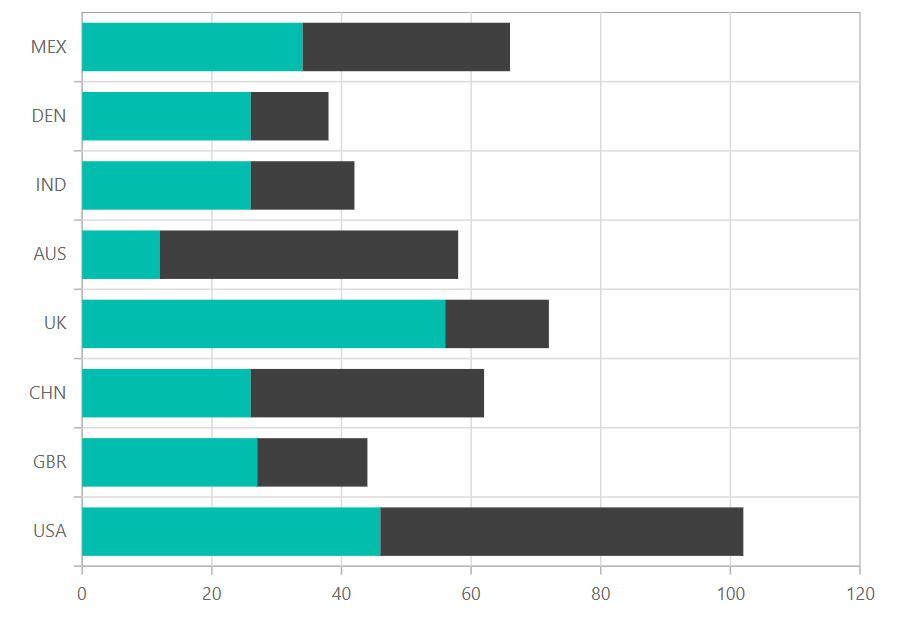

# Stacked Bar in Blazor Charts Component

## Stacked Bar

[Stacked Bar Chart](https://www.syncfusion.com/blazor-components/blazor-charts/chart-types/stacked-bar-chart) is a chart with Y values stacked over one another in the series order. It shows the relation between individual values to the total sum of the points. To render a [stacked bar](https://www.syncfusion.com/blazor-components/blazor-charts/chart-types/stacked-bar-chart) series in your chart, define the series [`Type`](https://help.syncfusion.com/cr/blazor/Syncfusion.Blazor.Charts.ChartSeries.html#Syncfusion_Blazor_Charts_ChartSeries_Type) as [`StackingBar`](https://help.syncfusion.com/cr/blazor/Syncfusion.Blazor.Charts.ChartSeriesType.html#Syncfusion_Blazor_Charts_ChartSeriesType_StackingBar) in your chart configuration. This indicates that the data should be represented as a stacked bar chart, where each bar consists of multiple segments stacked horizontally on top of each other.

```cshtml

@using Syncfusion.Blazor.Charts

<SfChart>
    <ChartPrimaryXAxis ValueType="Syncfusion.Blazor.Charts.ValueType.Category"></ChartPrimaryXAxis>

    <ChartSeriesCollection>
        <ChartSeries DataSource="@StackedDataList" XName="X" YName="Y" Type="Syncfusion.Blazor.Charts.ChartSeriesType.StackingBar">
        </ChartSeries>
        <ChartSeries DataSource="@StackedDataList" XName="X" YName="Y1" Type="Syncfusion.Blazor.Charts.ChartSeriesType.StackingBar">
        </ChartSeries>
        <ChartSeries DataSource="@StackedDataList" XName="X" YName="Y2" Type="Syncfusion.Blazor.Charts.ChartSeriesType.StackingBar">
        </ChartSeries>
        <ChartSeries DataSource="@StackedDataList" XName="X" YName="Y3" Type="Syncfusion.Blazor.Charts.ChartSeriesType.StackingBar">
        </ChartSeries>
    </ChartSeriesCollection>
</SfChart>

@code {
    public class StackedData
    {
        public string X { get; set; }
        public double Y { get; set; }
        public double Y1 { get; set; }
        public double Y2 { get; set; }
        public double Y3 { get; set; }
    }


    public List<StackedData> StackedDataList = new List<StackedData>
    {
        new StackedData { X = "2014", Y = 111.1, Y1 = 76.9, Y2 = 66.1, Y3 = 34.1 },
        new StackedData { X = "2015", Y = 127.3, Y1 = 99.5, Y2 = 79.3, Y3 = 38.2 },
        new StackedData { X = "2016", Y = 143.4, Y1 = 121.7, Y2 = 91.3, Y3 = 44.0 },
        new StackedData { X = "2017", Y = 159.9, Y1 = 142.5, Y2 = 102.4, Y3 = 51.6 },
        new StackedData { X = "2018", Y = 175.4, Y1 = 166.7, Y2 = 112.9, Y3 = 61.9 },
        new StackedData { X = "2019", Y = 189.0, Y1 = 182.9, Y2 = 122.4, Y3 = 71.5 },
        new StackedData { X = "2020", Y = 202.7, Y1 = 197.3, Y2 = 120.9, Y3 = 82.0 }
    };
}

``` 




N> Refer to our [Blazor Stacked Bar Chart](https://www.syncfusion.com/blazor-components/blazor-charts/chart-types/stacked-bar-chart) feature tour page to know about its other groundbreaking feature representations. Explore our [Blazor Stacked Bar Chart Example](https://blazor.syncfusion.com/demos/chart/stacked-bar?theme=bootstrap5) to know how to to render and configure the Stacked Bar type chart.

## Binding data with series

You can bind data to the chart using the [`DataSource`](https://help.syncfusion.com/cr/blazor/Syncfusion.Blazor.Charts.ChartSeries.html#Syncfusion_Blazor_Charts_ChartSeries_DataSource) property within the series configuration. The [`DataSource`](https://help.syncfusion.com/cr/blazor/Syncfusion.Blazor.Charts.ChartSeries.html#Syncfusion_Blazor_Charts_ChartSeries_DataSource) value can be set using either [`SfDataManager`](https://help.syncfusion.com/cr/blazor/Syncfusion.Blazor.Data.SfDataManager.html) property values or a list of business objects. More information on data binding can be found [here](../working-with-data). To display the data correctly, map the fields from the data to the chart series' [`XName`](https://help.syncfusion.com/cr/blazor/Syncfusion.Blazor.Charts.ChartSeries.html#Syncfusion_Blazor_Charts_ChartSeries_XName) and [`YName`](https://help.syncfusion.com/cr/blazor/Syncfusion.Blazor.Charts.ChartSeries.html#Syncfusion_Blazor_Charts_ChartSeries_YName) properties.

```cshtml

@using Syncfusion.Blazor.Charts

<SfChart>
    <ChartPrimaryXAxis ValueType="Syncfusion.Blazor.Charts.ValueType.Category"></ChartPrimaryXAxis>

    <ChartSeriesCollection>
        <ChartSeries DataSource="@StackedDataList" XName="X" YName="Y" Type="Syncfusion.Blazor.Charts.ChartSeriesType.StackingBar">
        </ChartSeries>
        <ChartSeries DataSource="@StackedDataList" XName="X" YName="Y1" Type="Syncfusion.Blazor.Charts.ChartSeriesType.StackingBar">
        </ChartSeries>
        <ChartSeries DataSource="@StackedDataList" XName="X" YName="Y2" Type="Syncfusion.Blazor.Charts.ChartSeriesType.StackingBar">
        </ChartSeries>
        <ChartSeries DataSource="@StackedDataList" XName="X" YName="Y3" Type="Syncfusion.Blazor.Charts.ChartSeriesType.StackingBar">
        </ChartSeries>
    </ChartSeriesCollection>
</SfChart>

@code {
    public class StackedData
    {
        public string X { get; set; }
        public double Y { get; set; }
        public double Y1 { get; set; }
        public double Y2 { get; set; }
        public double Y3 { get; set; }
    }


    public List<StackedData> StackedDataList = new List<StackedData>
    {
        new StackedData { X = "2014", Y = 111.1, Y1 = 76.9, Y2 = 66.1, Y3 = 34.1 },
        new StackedData { X = "2015", Y = 127.3, Y1 = 99.5, Y2 = 79.3, Y3 = 38.2 },
        new StackedData { X = "2016", Y = 143.4, Y1 = 121.7, Y2 = 91.3, Y3 = 44.0 },
        new StackedData { X = "2017", Y = 159.9, Y1 = 142.5, Y2 = 102.4, Y3 = 51.6 },
        new StackedData { X = "2018", Y = 175.4, Y1 = 166.7, Y2 = 112.9, Y3 = 61.9 },
        new StackedData { X = "2019", Y = 189.0, Y1 = 182.9, Y2 = 122.4, Y3 = 71.5 },
        new StackedData { X = "2020", Y = 202.7, Y1 = 197.3, Y2 = 120.9, Y3 = 82.0 }
    };
}

``` 


## Series customization

The following properties can be used to customize the [Stacked Bar](https://help.syncfusion.com/cr/blazor/Syncfusion.Blazor.Charts.ChartSeriesType.html#Syncfusion_Blazor_Charts_ChartSeriesType_StackingBar) series.

**Fill**

The [Fill](https://help.syncfusion.com/cr/blazor/Syncfusion.Blazor.Charts.ChartSeries.html#Syncfusion_Blazor_Charts_ChartSeries_Fill) property determines the color applied to the series.

```cshtml

@using Syncfusion.Blazor.Charts

<SfChart>
    <ChartPrimaryXAxis ValueType="Syncfusion.Blazor.Charts.ValueType.Category"></ChartPrimaryXAxis>

    <ChartSeriesCollection>
        <ChartSeries DataSource="@StackedDataList" Fill="green" XName="X" YName="Y" Type="Syncfusion.Blazor.Charts.ChartSeriesType.StackingBar">
        </ChartSeries>
        <ChartSeries DataSource="@StackedDataList" Fill="blue" XName="X" YName="Y1" Type="Syncfusion.Blazor.Charts.ChartSeriesType.StackingBar">
        </ChartSeries>
        <ChartSeries DataSource="@StackedDataList" Fill="yellow" XName="X" YName="Y2" Type="Syncfusion.Blazor.Charts.ChartSeriesType.StackingBar">
        </ChartSeries>
        <ChartSeries DataSource="@StackedDataList" Fill="orange" XName="X" YName="Y3" Type="Syncfusion.Blazor.Charts.ChartSeriesType.StackingBar">
        </ChartSeries>
    </ChartSeriesCollection>
</SfChart>

@code {
    public class StackedData
    {
        public string X { get; set; }
        public double Y { get; set; }
        public double Y1 { get; set; }
        public double Y2 { get; set; }
        public double Y3 { get; set; }
    }


    public List<StackedData> StackedDataList = new List<StackedData>
    {
        new StackedData { X = "2014", Y = 111.1, Y1 = 76.9, Y2 = 66.1, Y3 = 34.1 },
        new StackedData { X = "2015", Y = 127.3, Y1 = 99.5, Y2 = 79.3, Y3 = 38.2 },
        new StackedData { X = "2016", Y = 143.4, Y1 = 121.7, Y2 = 91.3, Y3 = 44.0 },
        new StackedData { X = "2017", Y = 159.9, Y1 = 142.5, Y2 = 102.4, Y3 = 51.6 },
        new StackedData { X = "2018", Y = 175.4, Y1 = 166.7, Y2 = 112.9, Y3 = 61.9 },
        new StackedData { X = "2019", Y = 189.0, Y1 = 182.9, Y2 = 122.4, Y3 = 71.5 },
        new StackedData { X = "2020", Y = 202.7, Y1 = 197.3, Y2 = 120.9, Y3 = 82.0 }
    };
}

```


The [Fill](https://help.syncfusion.com/cr/blazor/Syncfusion.Blazor.Charts.ChartSeries.html#Syncfusion_Blazor_Charts_ChartSeries_Fill) property can be used to apply a gradient color to the stacked bar series. By configuring this property with gradient values, you can create a visually appealing effect in which the color transitions smoothly from one shade to another.

```cshtml

@using Syncfusion.Blazor.Charts

<SfChart>
    <ChartPrimaryXAxis ValueType="Syncfusion.Blazor.Charts.ValueType.Category"></ChartPrimaryXAxis>

    <ChartSeriesCollection>
        <ChartSeries DataSource="@StackedDataList" Fill="url(#grad1)" XName="X" YName="Y" Type="Syncfusion.Blazor.Charts.ChartSeriesType.StackingBar">
        </ChartSeries>
        <ChartSeries DataSource="@StackedDataList" Fill="url(#grad2)" XName="X" YName="Y1" Type="Syncfusion.Blazor.Charts.ChartSeriesType.StackingBar">
        </ChartSeries>
        <ChartSeries DataSource="@StackedDataList" Fill="url(#grad3)" XName="X" YName="Y2" Type="Syncfusion.Blazor.Charts.ChartSeriesType.StackingBar">
        </ChartSeries>
        <ChartSeries DataSource="@StackedDataList" Fill="url(#grad4)" XName="X" YName="Y3" Type="Syncfusion.Blazor.Charts.ChartSeriesType.StackingBar">
        </ChartSeries>
    </ChartSeriesCollection>
</SfChart>

<svg style="height: 0">
    <defs>
        <linearGradient id="grad1" x1="0%" y1="0%" x2="0%" y2="100%">
            <stop offset="20%" style="stop-color:orange;stop-opacity:1" />
            <stop offset="100%" style="stop-color:black;stop-opacity:1" />
        </linearGradient>
    </defs>
</svg>

<svg style="height: 0">
    <defs>
        <linearGradient id="grad2" x1="0%" y1="0%" x2="0%" y2="100%">
            <stop offset="20%" style="stop-color:blue;stop-opacity:1" />
            <stop offset="100%" style="stop-color:black;stop-opacity:1" />
        </linearGradient>
    </defs>
</svg>

<svg style="height: 0">
    <defs>
        <linearGradient id="grad3" x1="0%" y1="0%" x2="0%" y2="100%">
            <stop offset="20%" style="stop-color:green;stop-opacity:1" />
            <stop offset="100%" style="stop-color:black;stop-opacity:1" />
        </linearGradient>
    </defs>
</svg>

<svg style="height: 0">
    <defs>
        <linearGradient id="grad4" x1="0%" y1="0%" x2="0%" y2="100%">
            <stop offset="20%" style="stop-color:red;stop-opacity:1" />
            <stop offset="100%" style="stop-color:black;stop-opacity:1" />
        </linearGradient>
    </defs>
</svg>


@code {
    public class StackedData
    {
        public string X { get; set; }
        public double Y { get; set; }
        public double Y1 { get; set; }
        public double Y2 { get; set; }
        public double Y3 { get; set; }
    }


    public List<StackedData> StackedDataList = new List<StackedData>
    {
        new StackedData { X = "2014", Y = 111.1, Y1 = 76.9, Y2 = 66.1, Y3 = 34.1 },
        new StackedData { X = "2015", Y = 127.3, Y1 = 99.5, Y2 = 79.3, Y3 = 38.2 },
        new StackedData { X = "2016", Y = 143.4, Y1 = 121.7, Y2 = 91.3, Y3 = 44.0 },
        new StackedData { X = "2017", Y = 159.9, Y1 = 142.5, Y2 = 102.4, Y3 = 51.6 },
        new StackedData { X = "2018", Y = 175.4, Y1 = 166.7, Y2 = 112.9, Y3 = 61.9 },
        new StackedData { X = "2019", Y = 189.0, Y1 = 182.9, Y2 = 122.4, Y3 = 71.5 },
        new StackedData { X = "2020", Y = 202.7, Y1 = 197.3, Y2 = 120.9, Y3 = 82.0 }
    };
}

```


**Opacity**

The [Opacity](https://help.syncfusion.com/cr/blazor/Syncfusion.Blazor.Charts.ChartSeries.html#Syncfusion_Blazor_Charts_ChartSeries_Opacity) property specifies the transparency level of the [Fill](https://help.syncfusion.com/cr/blazor/Syncfusion.Blazor.Charts.ChartSeries.html#Syncfusion_Blazor_Charts_ChartSeries_Fill). Adjusting this property allows you to control how opaque or transparent the fill color of the series appears.

```cshtml

@using Syncfusion.Blazor.Charts

<SfChart>
    <ChartPrimaryXAxis ValueType="Syncfusion.Blazor.Charts.ValueType.Category"></ChartPrimaryXAxis>

    <ChartSeriesCollection>
        <ChartSeries DataSource="@StackedDataList" Opacity="0.5" XName="X" YName="Y" Type="Syncfusion.Blazor.Charts.ChartSeriesType.StackingBar">
        </ChartSeries>
        <ChartSeries DataSource="@StackedDataList" Opacity="0.5" XName="X" YName="Y1" Type="Syncfusion.Blazor.Charts.ChartSeriesType.StackingBar">
        </ChartSeries>
        <ChartSeries DataSource="@StackedDataList" Opacity="0.5" XName="X" YName="Y2" Type="Syncfusion.Blazor.Charts.ChartSeriesType.StackingBar">
        </ChartSeries>
        <ChartSeries DataSource="@StackedDataList" Opacity="0.5" XName="X" YName="Y3" Type="Syncfusion.Blazor.Charts.ChartSeriesType.StackingBar">
        </ChartSeries>
    </ChartSeriesCollection>
</SfChart>

@code {
    public class StackedData
    {
        public string X { get; set; }
        public double Y { get; set; }
        public double Y1 { get; set; }
        public double Y2 { get; set; }
        public double Y3 { get; set; }
    }


    public List<StackedData> StackedDataList = new List<StackedData>
    {
        new StackedData { X = "2014", Y = 111.1, Y1 = 76.9, Y2 = 66.1, Y3 = 34.1 },
        new StackedData { X = "2015", Y = 127.3, Y1 = 99.5, Y2 = 79.3, Y3 = 38.2 },
        new StackedData { X = "2016", Y = 143.4, Y1 = 121.7, Y2 = 91.3, Y3 = 44.0 },
        new StackedData { X = "2017", Y = 159.9, Y1 = 142.5, Y2 = 102.4, Y3 = 51.6 },
        new StackedData { X = "2018", Y = 175.4, Y1 = 166.7, Y2 = 112.9, Y3 = 61.9 },
        new StackedData { X = "2019", Y = 189.0, Y1 = 182.9, Y2 = 122.4, Y3 = 71.5 },
        new StackedData { X = "2020", Y = 202.7, Y1 = 197.3, Y2 = 120.9, Y3 = 82.0 }
    };
}

```


**DashArray**

The [DashArray](https://help.syncfusion.com/cr/blazor/Syncfusion.Blazor.Charts.ChartSeries.html#Syncfusion_Blazor_Charts_ChartSeries_DashArray) property determines the dashes of series border.

```cshtml

@using Syncfusion.Blazor.Charts

<SfChart>
    <ChartPrimaryXAxis ValueType="Syncfusion.Blazor.Charts.ValueType.Category"></ChartPrimaryXAxis>

    <ChartSeriesCollection>
        <ChartSeries DataSource="@StackedDataList" DashArray="5,5" XName="X" YName="Y" Type="Syncfusion.Blazor.Charts.ChartSeriesType.StackingBar">
            <ChartSeriesBorder Width="2" Color="black"></ChartSeriesBorder>
        </ChartSeries>
        <ChartSeries DataSource="@StackedDataList" DashArray="5,5" XName="X" YName="Y1" Type="Syncfusion.Blazor.Charts.ChartSeriesType.StackingBar">
            <ChartSeriesBorder Width="2" Color="black"></ChartSeriesBorder>
        </ChartSeries>
        <ChartSeries DataSource="@StackedDataList" DashArray="5,5" XName="X" YName="Y2" Type="Syncfusion.Blazor.Charts.ChartSeriesType.StackingBar">
            <ChartSeriesBorder Width="2" Color="black"></ChartSeriesBorder>
        </ChartSeries>
        <ChartSeries DataSource="@StackedDataList" DashArray="5,5" XName="X" YName="Y3" Type="Syncfusion.Blazor.Charts.ChartSeriesType.StackingBar">
            <ChartSeriesBorder Width="2" Color="black"></ChartSeriesBorder>
        </ChartSeries>
    </ChartSeriesCollection>
</SfChart>

@code {
    public class StackedData
    {
        public string X { get; set; }
        public double Y { get; set; }
        public double Y1 { get; set; }
        public double Y2 { get; set; }
        public double Y3 { get; set; }
    }


    public List<StackedData> StackedDataList = new List<StackedData>
    {
        new StackedData { X = "2014", Y = 111.1, Y1 = 76.9, Y2 = 66.1, Y3 = 34.1 },
        new StackedData { X = "2015", Y = 127.3, Y1 = 99.5, Y2 = 79.3, Y3 = 38.2 },
        new StackedData { X = "2016", Y = 143.4, Y1 = 121.7, Y2 = 91.3, Y3 = 44.0 },
        new StackedData { X = "2017", Y = 159.9, Y1 = 142.5, Y2 = 102.4, Y3 = 51.6 },
        new StackedData { X = "2018", Y = 175.4, Y1 = 166.7, Y2 = 112.9, Y3 = 61.9 },
        new StackedData { X = "2019", Y = 189.0, Y1 = 182.9, Y2 = 122.4, Y3 = 71.5 },
        new StackedData { X = "2020", Y = 202.7, Y1 = 197.3, Y2 = 120.9, Y3 = 82.0 }
    };
}

``` 


**Series Border**

The [ChartSeriesBorder](https://help.syncfusion.com/cr/blazor/Syncfusion.Blazor.Charts.ChartSeriesBorder.html) property determines the [Color](https://help.syncfusion.com/cr/blazor/Syncfusion.Blazor.Charts.ChartCommonBorder.html#Syncfusion_Blazor_Charts_ChartCommonBorder_Color) and [Width](https://help.syncfusion.com/cr/blazor/Syncfusion.Blazor.Charts.ChartCommonBorder.html#Syncfusion_Blazor_Charts_ChartCommonBorder_Width) of series border.

```cshtml

@using Syncfusion.Blazor.Charts

<SfChart>
    <ChartPrimaryXAxis ValueType="Syncfusion.Blazor.Charts.ValueType.Category"></ChartPrimaryXAxis>

    <ChartSeriesCollection>
        <ChartSeries DataSource="@StackedDataList" DashArray="5,5" XName="X" YName="Y" Type="Syncfusion.Blazor.Charts.ChartSeriesType.StackingBar">
            <ChartSeriesBorder Width="2" Color="black"></ChartSeriesBorder>
        </ChartSeries>
        <ChartSeries DataSource="@StackedDataList" DashArray="5,5" XName="X" YName="Y1" Type="Syncfusion.Blazor.Charts.ChartSeriesType.StackingBar">
            <ChartSeriesBorder Width="2" Color="black"></ChartSeriesBorder>
        </ChartSeries>
        <ChartSeries DataSource="@StackedDataList" DashArray="5,5" XName="X" YName="Y2" Type="Syncfusion.Blazor.Charts.ChartSeriesType.StackingBar">
            <ChartSeriesBorder Width="2" Color="black"></ChartSeriesBorder>
        </ChartSeries>
        <ChartSeries DataSource="@StackedDataList" DashArray="5,5" XName="X" YName="Y3" Type="Syncfusion.Blazor.Charts.ChartSeriesType.StackingBar">
            <ChartSeriesBorder Width="2" Color="black"></ChartSeriesBorder>
        </ChartSeries>
    </ChartSeriesCollection>
</SfChart>

@code {
    public class StackedData
    {
        public string X { get; set; }
        public double Y { get; set; }
        public double Y1 { get; set; }
        public double Y2 { get; set; }
        public double Y3 { get; set; }
    }


    public List<StackedData> StackedDataList = new List<StackedData>
    {
        new StackedData { X = "2014", Y = 111.1, Y1 = 76.9, Y2 = 66.1, Y3 = 34.1 },
        new StackedData { X = "2015", Y = 127.3, Y1 = 99.5, Y2 = 79.3, Y3 = 38.2 },
        new StackedData { X = "2016", Y = 143.4, Y1 = 121.7, Y2 = 91.3, Y3 = 44.0 },
        new StackedData { X = "2017", Y = 159.9, Y1 = 142.5, Y2 = 102.4, Y3 = 51.6 },
        new StackedData { X = "2018", Y = 175.4, Y1 = 166.7, Y2 = 112.9, Y3 = 61.9 },
        new StackedData { X = "2019", Y = 189.0, Y1 = 182.9, Y2 = 122.4, Y3 = 71.5 },
        new StackedData { X = "2020", Y = 202.7, Y1 = 197.3, Y2 = 120.9, Y3 = 82.0 }
    };
}

``` 


## Stacking group

The [StackingGroup](https://help.syncfusion.com/cr/blazor/Syncfusion.Blazor.Charts.ChartSeries.html#Syncfusion_Blazor_Charts_ChartSeries_StackingGroup) property is used to group stacked bar and 100% stacked bar. Bars with same group name are stacked on top of each other.

```cshtml

@using Syncfusion.Blazor.Charts

<SfChart>
    <ChartPrimaryXAxis ValueType="Syncfusion.Blazor.Charts.ValueType.Category"></ChartPrimaryXAxis>

    <ChartSeriesCollection>
        <ChartSeries DataSource="@DataSource" StackingGroup="Group1" XName="X" YName="YValue" Type="ChartSeriesType.StackingBar">
        </ChartSeries>
        <ChartSeries DataSource="@DataSource" StackingGroup="Group1" XName="X" YName="YValue1" Type="ChartSeriesType.StackingBar">
        </ChartSeries>
        <ChartSeries DataSource="@DataSource" StackingGroup="Group2" XName="X" YName="YValue2" Type="ChartSeriesType.StackingBar">
        </ChartSeries>
    </ChartSeriesCollection>
</SfChart>

@code{
    public class ChartData
    {
        public string X { get; set; }
        public double YValue { get; set; }
        public double YValue1 { get; set; }
        public double YValue2 { get; set; }
    }

    public List<ChartData> DataSource = new List<ChartData>
	{
        new ChartData { X= "USA", YValue= 46, YValue1=56, YValue2=26},
        new ChartData { X= "GBR", YValue= 27, YValue1=17, YValue2=37},
        new ChartData { X= "CHN", YValue= 26, YValue1=36, YValue2=56},
        new ChartData { X= "UK", YValue= 56,  YValue1=16, YValue2=36},
        new ChartData { X= "AUS", YValue= 12, YValue1=46, YValue2=26},
        new ChartData { X= "IND", YValue= 26, YValue1=16, YValue2=76},
        new ChartData { X= "DEN", YValue= 26, YValue1=12, YValue2=42},
        new ChartData { X= "MEX", YValue= 34, YValue1=32, YValue2=82 },
    };
}

``` 


## Empty points

Data points with `null`, `double.NaN` or `undefined` values are considered empty. Empty data points are ignored and not plotted on the chart.

**Mode**

Use the [`Mode`](https://help.syncfusion.com/cr/blazor/Syncfusion.Blazor.Charts.ChartEmptyPointSettings.html#Syncfusion_Blazor_Charts_ChartEmptyPointSettings_Mode) property to define how empty or missing data points are handled in the series. The default mode for empty points is [`Gap`](https://help.syncfusion.com/cr/blazor/Syncfusion.Blazor.Charts.EmptyPointMode.html#Syncfusion_Blazor_Charts_EmptyPointMode_Gap).

```cshtml

@using Syncfusion.Blazor.Charts

<SfChart>
    <ChartPrimaryXAxis ValueType="Syncfusion.Blazor.Charts.ValueType.Category"></ChartPrimaryXAxis>

    <ChartSeriesCollection>
        <ChartSeries DataSource="@StackedDataList" XName="X" YName="Y" Type="Syncfusion.Blazor.Charts.ChartSeriesType.StackingBar">
            <ChartEmptyPointSettings Mode="EmptyPointMode.Zero"></ChartEmptyPointSettings>
        </ChartSeries>
        <ChartSeries DataSource="@StackedDataList" XName="X" YName="Y1" Type="Syncfusion.Blazor.Charts.ChartSeriesType.StackingBar">
        </ChartSeries>
        <ChartSeries DataSource="@StackedDataList" XName="X" YName="Y2" Type="Syncfusion.Blazor.Charts.ChartSeriesType.StackingBar">
            <ChartEmptyPointSettings Mode="EmptyPointMode.Average"></ChartEmptyPointSettings>
        </ChartSeries>
        <ChartSeries DataSource="@StackedDataList" XName="X" YName="Y3" Type="Syncfusion.Blazor.Charts.ChartSeriesType.StackingBar">
        </ChartSeries>
    </ChartSeriesCollection>
</SfChart>

@code {
    public class StackedData
    {
        public string X { get; set; }
        public double Y { get; set; }
        public double Y1 { get; set; }
        public double Y2 { get; set; }
        public double Y3 { get; set; }
    }


    public List<StackedData> StackedDataList = new List<StackedData>
    {
        new StackedData { X = "2014", Y = 111.1, Y1 = 76.9, Y2 = 66.1, Y3 = 34.1 },
        new StackedData { X = "2015", Y = 127.3, Y1 = 99.5, Y2 = 79.3, Y3 = 38.2 },
        new StackedData { X = "2016", Y = double.NaN, Y1 = 121.7, Y2 = 91.3, Y3 = 44.0 },
        new StackedData { X = "2017", Y = 159.9, Y1 = 142.5, Y2 = 102.4, Y3 = 51.6 },
        new StackedData { X = "2018", Y = 175.4, Y1 = 166.7, Y2 = 112.9, Y3 = 61.9 },
        new StackedData { X = "2019", Y = 189.0, Y1 = 182.9, Y2 = double.NaN, Y3 = 71.5 },
        new StackedData { X = "2020", Y = 202.7, Y1 = 197.3, Y2 = 120.9, Y3 = 82.0 }
    };
}

```


**Fill**

Use the [`Fill`](https://help.syncfusion.com/cr/blazor/Syncfusion.Blazor.Charts.ChartEmptyPointSettings.html#Syncfusion_Blazor_Charts_ChartEmptyPointSettings_Fill) property to customize the fill color of empty points in the series.

```cshtml

@using Syncfusion.Blazor.Charts

<SfChart>
    <ChartPrimaryXAxis ValueType="Syncfusion.Blazor.Charts.ValueType.Category"></ChartPrimaryXAxis>

    <ChartSeriesCollection>
        <ChartSeries DataSource="@StackedDataList" XName="X" YName="Y" Type="Syncfusion.Blazor.Charts.ChartSeriesType.StackingBar">
            <ChartEmptyPointSettings Mode="EmptyPointMode.Zero"></ChartEmptyPointSettings>
        </ChartSeries>
        <ChartSeries DataSource="@StackedDataList" XName="X" YName="Y1" Type="Syncfusion.Blazor.Charts.ChartSeriesType.StackingBar">
        </ChartSeries>
        <ChartSeries DataSource="@StackedDataList" XName="X" YName="Y2" Type="Syncfusion.Blazor.Charts.ChartSeriesType.StackingBar">
            <ChartEmptyPointSettings Mode="EmptyPointMode.Average" Fill="red"></ChartEmptyPointSettings>
        </ChartSeries>
        <ChartSeries DataSource="@StackedDataList" XName="X" YName="Y3" Type="Syncfusion.Blazor.Charts.ChartSeriesType.StackingBar">
        </ChartSeries>
    </ChartSeriesCollection>
</SfChart>

@code {
    public class StackedData
    {
        public string X { get; set; }
        public double Y { get; set; }
        public double Y1 { get; set; }
        public double Y2 { get; set; }
        public double Y3 { get; set; }
    }


    public List<StackedData> StackedDataList = new List<StackedData>
    {
        new StackedData { X = "2014", Y = 111.1, Y1 = 76.9, Y2 = 66.1, Y3 = 34.1 },
        new StackedData { X = "2015", Y = 127.3, Y1 = 99.5, Y2 = 79.3, Y3 = 38.2 },
        new StackedData { X = "2016", Y = double.NaN, Y1 = 121.7, Y2 = 91.3, Y3 = 44.0 },
        new StackedData { X = "2017", Y = 159.9, Y1 = 142.5, Y2 = 102.4, Y3 = 51.6 },
        new StackedData { X = "2018", Y = 175.4, Y1 = 166.7, Y2 = 112.9, Y3 = 61.9 },
        new StackedData { X = "2019", Y = 189.0, Y1 = 182.9, Y2 = double.NaN, Y3 = 71.5 },
        new StackedData { X = "2020", Y = 202.7, Y1 = 197.3, Y2 = 120.9, Y3 = 82.0 }
    };
}

```


**Border**

Use the [`Border`](https://help.syncfusion.com/cr/blazor/Syncfusion.Blazor.Charts.ChartEmptyPointSettings.html#Syncfusion_Blazor_Charts_ChartEmptyPointSettings_Border) property to customize the [Width](https://help.syncfusion.com/cr/blazor/Syncfusion.Blazor.Charts.ChartEmptyPointBorder.html#Syncfusion_Blazor_Charts_ChartEmptyPointBorder_Width) and [Color](https://help.syncfusion.com/cr/blazor/Syncfusion.Blazor.Charts.ChartEmptyPointBorder.html#Syncfusion_Blazor_Charts_ChartEmptyPointBorder_Color) of the border for empty points.

```cshtml

@using Syncfusion.Blazor.Charts

<SfChart>
    <ChartPrimaryXAxis ValueType="Syncfusion.Blazor.Charts.ValueType.Category"></ChartPrimaryXAxis>

    <ChartSeriesCollection>
        <ChartSeries DataSource="@StackedDataList" XName="X" YName="Y" Type="Syncfusion.Blazor.Charts.ChartSeriesType.StackingBar">
            <ChartEmptyPointSettings Mode="EmptyPointMode.Zero"></ChartEmptyPointSettings>
        </ChartSeries>
        <ChartSeries DataSource="@StackedDataList" XName="X" YName="Y1" Type="Syncfusion.Blazor.Charts.ChartSeriesType.StackingBar">
        </ChartSeries>
        <ChartSeries DataSource="@StackedDataList" XName="X" YName="Y2" Type="Syncfusion.Blazor.Charts.ChartSeriesType.StackingBar">
            <ChartEmptyPointSettings Mode="EmptyPointMode.Average" Fill="red">
                <ChartEmptyPointBorder Width="2" Color="green"></ChartEmptyPointBorder>
            </ChartEmptyPointSettings>
        </ChartSeries>
        <ChartSeries DataSource="@StackedDataList" XName="X" YName="Y3" Type="Syncfusion.Blazor.Charts.ChartSeriesType.StackingBar">
        </ChartSeries>
    </ChartSeriesCollection>
</SfChart>

@code {
    public class StackedData
    {
        public string X { get; set; }
        public double Y { get; set; }
        public double Y1 { get; set; }
        public double Y2 { get; set; }
        public double Y3 { get; set; }
    }


    public List<StackedData> StackedDataList = new List<StackedData>
    {
        new StackedData { X = "2014", Y = 111.1, Y1 = 76.9, Y2 = 66.1, Y3 = 34.1 },
        new StackedData { X = "2015", Y = 127.3, Y1 = 99.5, Y2 = 79.3, Y3 = 38.2 },
        new StackedData { X = "2016", Y = double.NaN, Y1 = 121.7, Y2 = 91.3, Y3 = 44.0 },
        new StackedData { X = "2017", Y = 159.9, Y1 = 142.5, Y2 = 102.4, Y3 = 51.6 },
        new StackedData { X = "2018", Y = 175.4, Y1 = 166.7, Y2 = 112.9, Y3 = 61.9 },
        new StackedData { X = "2019", Y = 189.0, Y1 = 182.9, Y2 = double.NaN, Y3 = 71.5 },
        new StackedData { X = "2020", Y = 202.7, Y1 = 197.3, Y2 = 120.9, Y3 = 82.0 }
    };
}

```


## Events

### Series render

The [`OnSeriesRender`](https://help.syncfusion.com/cr/blazor/Syncfusion.Blazor.Charts.ChartEvents.html#Syncfusion_Blazor_Charts_ChartEvents_OnSeriesRender) event allows you to customize series properties, such as [Data](https://help.syncfusion.com/cr/blazor/Syncfusion.Blazor.Charts.SeriesRenderEventArgs.html#Syncfusion_Blazor_Charts_SeriesRenderEventArgs_Data), [Fill](https://help.syncfusion.com/cr/blazor/Syncfusion.Blazor.Charts.SeriesRenderEventArgs.html#Syncfusion_Blazor_Charts_SeriesRenderEventArgs_Fill), and [Series](https://help.syncfusion.com/cr/blazor/Syncfusion.Blazor.Charts.SeriesRenderEventArgs.html#Syncfusion_Blazor_Charts_SeriesRenderEventArgs_Series), before they are rendered on the chart.

```cshtml

@using Syncfusion.Blazor.Charts

<SfChart>
    <ChartPrimaryXAxis ValueType="Syncfusion.Blazor.Charts.ValueType.Category"></ChartPrimaryXAxis>
    <ChartEvents OnSeriesRender="SeriesRender"></ChartEvents>
    <ChartSeriesCollection>
        <ChartSeries DataSource="@StackedDataList" Name="Series1" XName="X" YName="Y" Type="Syncfusion.Blazor.Charts.ChartSeriesType.StackingBar">
        </ChartSeries>
        <ChartSeries DataSource="@StackedDataList" Name="Series2" XName="X" YName="Y1" Type="Syncfusion.Blazor.Charts.ChartSeriesType.StackingBar">
        </ChartSeries>
        <ChartSeries DataSource="@StackedDataList" Name="Series3" XName="X" YName="Y2" Type="Syncfusion.Blazor.Charts.ChartSeriesType.StackingBar">
        </ChartSeries>
        <ChartSeries DataSource="@StackedDataList" Name="Series4" XName="X" YName="Y3" Type="Syncfusion.Blazor.Charts.ChartSeriesType.StackingBar">
        </ChartSeries>
    </ChartSeriesCollection>
    <ChartLegendSettings Visible="false"></ChartLegendSettings>
</SfChart>

@code {
    public class StackedData
    {
        public string X { get; set; }
        public double Y { get; set; }
        public double Y1 { get; set; }
        public double Y2 { get; set; }
        public double Y3 { get; set; }
    }

    public void SeriesRender(SeriesRenderEventArgs args)
    {
        if (args.Series.Name == "Series1")
        {
            args.Fill = "red";
        }
        else if (args.Series.Name == "Series2")
        {
            args.Fill = "green";
        }
        else if (args.Series.Name == "Series3")
        {
            args.Fill = "blue";
        }
        else if (args.Series.Name == "Series4")
        {
            args.Fill = "yellow";
        }
    }

    public List<StackedData> StackedDataList = new List<StackedData>
    {
        new StackedData { X = "2014", Y = 111.1, Y1 = 76.9, Y2 = 66.1, Y3 = 34.1 },
        new StackedData { X = "2015", Y = 127.3, Y1 = 99.5, Y2 = 79.3, Y3 = 38.2 },
        new StackedData { X = "2016", Y = 143.4, Y1 = 121.7, Y2 = 91.3, Y3 = 44.0 },
        new StackedData { X = "2017", Y = 159.9, Y1 = 142.5, Y2 = 102.4, Y3 = 51.6 },
        new StackedData { X = "2018", Y = 175.4, Y1 = 166.7, Y2 = 112.9, Y3 = 61.9 },
        new StackedData { X = "2019", Y = 189.0, Y1 = 182.9, Y2 = 122.4, Y3 = 71.5 },
        new StackedData { X = "2020", Y = 202.7, Y1 = 197.3, Y2 = 120.9, Y3 = 82.0 }
    };
}

```


### Point render

The [`OnPointRender`](https://help.syncfusion.com/cr/blazor/Syncfusion.Blazor.Charts.ChartEvents.html#Syncfusion_Blazor_Charts_ChartEvents_OnPointRender) event allows you to customize each data point before it is rendered on the chart.

```cshtml

@using Syncfusion.Blazor.Charts

<SfChart>
    <ChartPrimaryXAxis ValueType="Syncfusion.Blazor.Charts.ValueType.Category"></ChartPrimaryXAxis>
    <ChartEvents OnPointRender="PointRender"></ChartEvents>
    <ChartSeriesCollection>
        <ChartSeries DataSource="@StackedDataList" Name="Series1" XName="X" YName="YValue" Type="Syncfusion.Blazor.Charts.ChartSeriesType.StackingBar" />
        <ChartSeries DataSource="@StackedDataList" Name="Series2" XName="X" YName="YValue1" Type="Syncfusion.Blazor.Charts.ChartSeriesType.StackingBar" />
    </ChartSeriesCollection>
    <ChartLegendSettings Visible="false"></ChartLegendSettings>
</SfChart>

@code {
    public class ChartData
    {
        public string X { get; set; }
        public double YValue { get; set; }
        public double YValue1 { get; set; }
    }

    public void PointRender(PointRenderEventArgs args)
    {
        args.Fill = args.Point.X.ToString() == "2017" ? args.Series.YName == "YValue" ? "#E91E63" : "#FFC107" : args.Fill;
    }

    public List<ChartData> StackedDataList = new List<ChartData>
    {
        new ChartData { X= "2014", YValue= 46, YValue1=56 },
        new ChartData { X= "2015", YValue= 27, YValue1=17 },
        new ChartData { X= "2016", YValue= 26, YValue1=36 },
        new ChartData { X= "2017", YValue= 56, YValue1=16 },
        new ChartData { X= "2018", YValue= 12, YValue1=46 },
        new ChartData { X= "2019", YValue= 26, YValue1=16 },
        new ChartData { X= "2020", YValue= 26, YValue1=12 },
        new ChartData { X= "2021", YValue= 34, YValue1=32},
    };
}

```


N> Refer to our [Blazor Charts](https://www.syncfusion.com/blazor-components/blazor-charts) feature tour page for its groundbreaking feature representations and also explore our [Blazor Chart Example](https://blazor.syncfusion.com/demos/chart/line?theme=bootstrap5) to know various chart types and how to represent time-dependent data, showing trends at equal intervals.

## See also

* [Data Label](../data-labels)
* [Tooltip](../tool-tip)