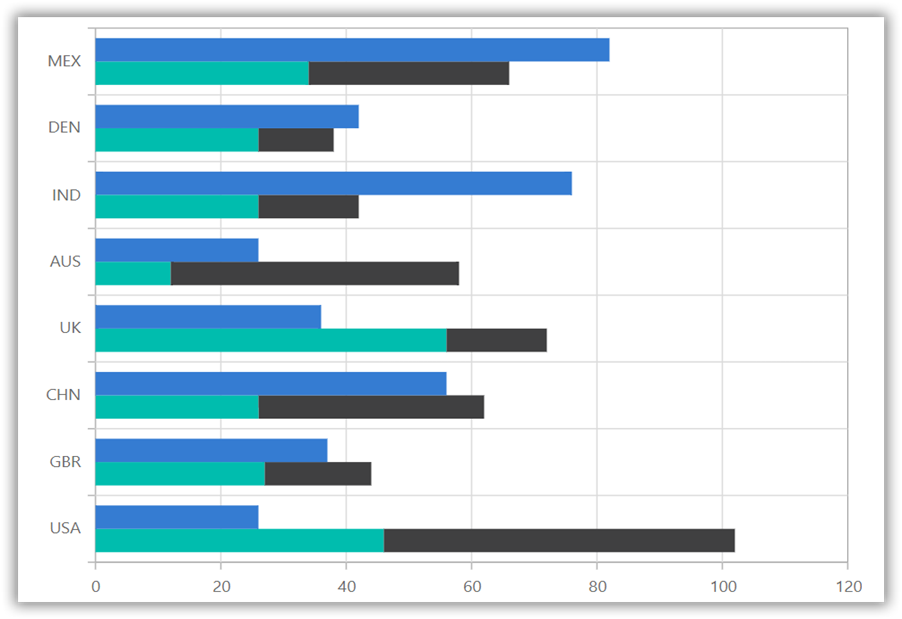
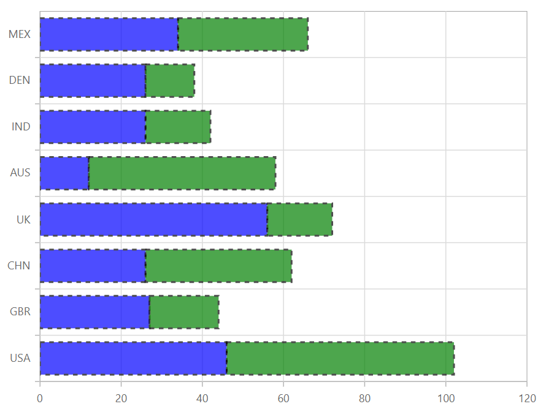

# Stacked Bar in Blazor Charts Component

## Stacked Bar

[`Stacked Bar Chart`](https://www.syncfusion.com/blazor-components/blazor-charts/chart-types/stacked-bar-chart) is a chart with Y values stacked over one another in the series order. It shows the relation between individual values to the total sum of the points. To render a [`Stacked Bar`](https://www.syncfusion.com/blazor-components/blazor-charts/chart-types/stacked-bar-chart) series, set the series [`Type`](https://help.syncfusion.com/cr/blazor/Syncfusion.Blazor.Charts.ChartSeries.html#Syncfusion_Blazor_Charts_ChartSeries_Type) as [`StackingBar`](https://help.syncfusion.com/cr/blazor/Syncfusion.Blazor.Charts.ChartSeriesType.html#Syncfusion_Blazor_Charts_ChartSeriesType_StackingBar).

```cshtml

@using Syncfusion.Blazor.Charts

<SfChart>
    <ChartPrimaryXAxis ValueType="Syncfusion.Blazor.Charts.ValueType.Category"></ChartPrimaryXAxis>

    <ChartSeriesCollection>
        <ChartSeries DataSource="@MedalDetails" XName="X" YName="YValue" Type="ChartSeriesType.StackingBar">
        </ChartSeries>
        <ChartSeries DataSource="@MedalDetails" XName="X" YName="YValue1" Type="ChartSeriesType.StackingBar">
        </ChartSeries>
    </ChartSeriesCollection>
</SfChart>

@code{
    public class ChartData
    {
        public string X { get; set; }
        public double YValue { get; set; }
        public double YValue1 { get; set; }
    }
	
    public List<ChartData> MedalDetails = new List<ChartData>
    {
        new ChartData { X= "USA", YValue= 46, YValue1=56 },
        new ChartData { X= "GBR", YValue= 27, YValue1=17 },
        new ChartData { X= "CHN", YValue= 26, YValue1=36 },
        new ChartData { X= "UK", YValue= 56,  YValue1=16 },
        new ChartData { X= "AUS", YValue= 12, YValue1=46 },
        new ChartData { X= "IND", YValue= 26, YValue1=16 },
        new ChartData { X= "DEN", YValue= 26, YValue1=12 },
        new ChartData { X= "MEX", YValue= 34, YValue1=32},
    };
}

``` 


> Refer to our [`Blazor Stacked Bar Chart`](https://www.syncfusion.com/blazor-components/blazor-charts/chart-types/stacked-bar-chart) feature tour page to know about its other groundbreaking feature representations. Explore our [`Blazor Stacked Bar Chart Example`](https://blazor.syncfusion.com/demos/chart/stacked-bar?theme=bootstrap4) to know how to to render and configure the Stacked Bar type chart.

## Stacking Group

The [`StackingGroup`](https://help.syncfusion.com/cr/blazor/Syncfusion.Blazor.Charts.ChartSeries.html#Syncfusion_Blazor_Charts_ChartSeries_StackingGroup) property is used to group stacked bar and 100% stacked bar. Bars with same group name are stacked on top of each other.



```cshtml

@using Syncfusion.Blazor.Charts

<SfChart>
    <ChartPrimaryXAxis ValueType="Syncfusion.Blazor.Charts.ValueType.Category"></ChartPrimaryXAxis>

    <ChartSeriesCollection>
        <ChartSeries DataSource="@DataSource" StackingGroup="Group1" XName="X" YName="YValue" Type="ChartSeriesType.StackingBar">
        </ChartSeries>
        <ChartSeries DataSource="@DataSource" StackingGroup="Group1" XName="X" YName="YValue1" Type="ChartSeriesType.StackingBar">
        </ChartSeries>
        <ChartSeries DataSource="@DataSource" StackingGroup="Group2" XName="X" YName="YValue2" Type="ChartSeriesType.StackingBar">
        </ChartSeries>
    </ChartSeriesCollection>
</SfChart>

@code{
    public class ChartData
    {
        public string X { get; set; }
        public double YValue { get; set; }
        public double YValue1 { get; set; }
        public double YValue2 { get; set; }
    }

    public List<ChartData> DataSource = new List<ChartData>
	{
        new ChartData { X= "USA", YValue= 46, YValue1=56, YValue2=26},
        new ChartData { X= "GBR", YValue= 27, YValue1=17, YValue2=37},
        new ChartData { X= "CHN", YValue= 26, YValue1=36, YValue2=56},
        new ChartData { X= "UK", YValue= 56,  YValue1=16, YValue2=36},
        new ChartData { X= "AUS", YValue= 12, YValue1=46, YValue2=26},
        new ChartData { X= "IND", YValue= 26, YValue1=16, YValue2=76},
        new ChartData { X= "DEN", YValue= 26, YValue1=12, YValue2=42},
        new ChartData { X= "MEX", YValue= 34, YValue1=32, YValue2=82 },
    };
}

``` 



## Series Customization

The following properties can be used to customize the [`Stacked Bar`](https://help.syncfusion.com/cr/blazor/Syncfusion.Blazor.Charts.ChartSeriesType.html#Syncfusion_Blazor_Charts_ChartSeriesType_StackingBar) series.

* [`Fill`](https://help.syncfusion.com/cr/blazor/Syncfusion.Blazor.Charts.ChartSeries.html#Syncfusion_Blazor_Charts_ChartSeries_Fill) – Specifies the color of the series.
* [`Opacity`](https://help.syncfusion.com/cr/blazor/Syncfusion.Blazor.Charts.ChartSeries.html#Syncfusion_Blazor_Charts_ChartSeries_Opacity) – Specifies the opacity of [`Fill`](https://help.syncfusion.com/cr/blazor/Syncfusion.Blazor.Charts.ChartSeries.html#Syncfusion_Blazor_Charts_ChartSeries_Fill).
* [`DashArray`](https://help.syncfusion.com/cr/blazor/Syncfusion.Blazor.Charts.ChartSeries.html#Syncfusion_Blazor_Charts_ChartSeries_DashArray) – Specifies the dashes of series border.
* [`ChartSeriesBorder`](https://help.syncfusion.com/cr/blazor/Syncfusion.Blazor.Charts.ChartSeriesBorder.html) – Specifies the [`Color`](https://help.syncfusion.com/cr/blazor/Syncfusion.Blazor.Charts.ChartCommonBorder.html#Syncfusion_Blazor_Charts_ChartCommonBorder_Color) and [`Width`](https://help.syncfusion.com/cr/blazor/Syncfusion.Blazor.Charts.ChartCommonBorder.html#Syncfusion_Blazor_Charts_ChartCommonBorder_Width) of series border.

```cshtml

@using Syncfusion.Blazor.Charts

<SfChart>
    <ChartPrimaryXAxis ValueType="Syncfusion.Blazor.Charts.ValueType.Category"></ChartPrimaryXAxis>

    <ChartSeriesCollection>
        <ChartSeries DataSource="@MedalDetails" XName="X" YName="YValue" DashArray="5,5" Fill="blue" Opacity="0.7" Type="ChartSeriesType.StackingBar">
            <ChartSeriesBorder Width="2" Color="black"></ChartSeriesBorder>
        </ChartSeries>
        <ChartSeries DataSource="@MedalDetails" XName="X" YName="YValue1" DashArray="5,5" Fill="green" Opacity="0.7" Type="ChartSeriesType.StackingBar">
            <ChartSeriesBorder Width="2" Color="black"></ChartSeriesBorder>
        </ChartSeries>
    </ChartSeriesCollection>
</SfChart>

@code{
    public class ChartData
    {
        public string X { get; set; }
        public double YValue { get; set; }
        public double YValue1 { get; set; }
    }
	
    public List<ChartData> MedalDetails = new List<ChartData>
    {
        new ChartData { X= "USA", YValue= 46, YValue1=56 },
        new ChartData { X= "GBR", YValue= 27, YValue1=17 },
        new ChartData { X= "CHN", YValue= 26, YValue1=36 },
        new ChartData { X= "UK", YValue= 56,  YValue1=16 },
        new ChartData { X= "AUS", YValue= 12, YValue1=46 },
        new ChartData { X= "IND", YValue= 26, YValue1=16 },
        new ChartData { X= "DEN", YValue= 26, YValue1=12 },
        new ChartData { X= "MEX", YValue= 34, YValue1=32},
    };
}

``` 



> Refer to our [`Blazor Charts`](https://www.syncfusion.com/blazor-components/blazor-charts) feature tour page for its groundbreaking feature representations and also explore our [`Blazor Chart Example`](https://blazor.syncfusion.com/demos/chart/line?theme=bootstrap4) to know various chart types and how to represent time-dependent data, showing trends at equal intervals.

## See Also

* [Data Label](../data-labels)
* [Tooltip](../tool-tip)