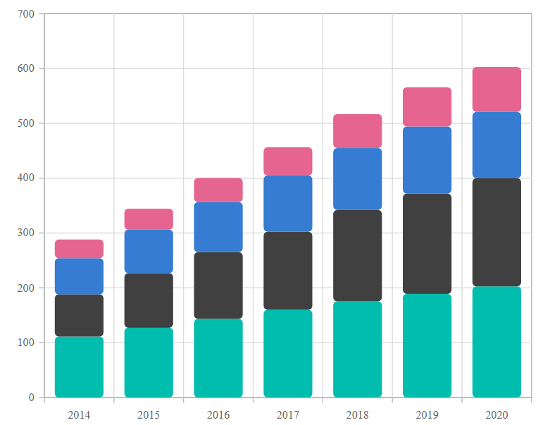

# Stacked Column in Blazor Charts Component

## Stacked Column

[Stacked Column Charts](https://www.syncfusion.com/blazor-components/blazor-charts/chart-types/stacked-column-chart) display multiple series stacked within each category to show individual contributions to a total.

You can learn how to create and customize the stacked column chart using Blazor Charts by watching the video below.



To render a [stacked column](https://www.syncfusion.com/blazor-components/blazor-charts/chart-types/stacked-column-chart) series, set the series [`Type`](https://help.syncfusion.com/cr/blazor/Syncfusion.Blazor.Charts.ChartSeries.html#Syncfusion_Blazor_Charts_ChartSeries_Type) to [`StackingColumn`](https://help.syncfusion.com/cr/blazor/Syncfusion.Blazor.Charts.ChartSeriesType.html#Syncfusion_Blazor_Charts_ChartSeriesType_StackingColumn). Each column is composed of multiple stacked segments representing different series.

```cshtml

@using Syncfusion.Blazor.Charts

<SfChart>
    <ChartPrimaryXAxis ValueType="Syncfusion.Blazor.Charts.ValueType.Category" />

    <ChartSeriesCollection>
        <ChartSeries DataSource="@StackedDataList" XName="X" YName="Y" Type="Syncfusion.Blazor.Charts.ChartSeriesType.StackingColumn">
        </ChartSeries>
        <ChartSeries DataSource="@StackedDataList" XName="X" YName="Y1" Type="Syncfusion.Blazor.Charts.ChartSeriesType.StackingColumn">
        </ChartSeries>
        <ChartSeries DataSource="@StackedDataList" XName="X" YName="Y2" Type="Syncfusion.Blazor.Charts.ChartSeriesType.StackingColumn">
        </ChartSeries>
        <ChartSeries DataSource="@StackedDataList" XName="X" YName="Y3" Type="Syncfusion.Blazor.Charts.ChartSeriesType.StackingColumn">
        </ChartSeries>
    </ChartSeriesCollection>
</SfChart>

@code {
    public class StackedData
    {
        public string X { get; set; }
        public double Y { get; set; }
        public double Y1 { get; set; }
        public double Y2 { get; set; }
        public double Y3 { get; set; }
    }

    public List<StackedData> StackedDataList = new List<StackedData>
    {
        new StackedData { X = "2014", Y = 111.1, Y1 = 76.9, Y2 = 66.1, Y3 = 34.1 },
        new StackedData { X = "2015", Y = 127.3, Y1 = 99.5, Y2 = 79.3, Y3 = 38.2 },
        new StackedData { X = "2016", Y = 143.4, Y1 = 121.7, Y2 = 91.3, Y3 = 44.0 },
        new StackedData { X = "2017", Y = 159.9, Y1 = 142.5, Y2 = 102.4, Y3 = 51.6 },
        new StackedData { X = "2018", Y = 175.4, Y1 = 166.7, Y2 = 112.9, Y3 = 61.9 },
        new StackedData { X = "2019", Y = 189.0, Y1 = 182.9, Y2 = 122.4, Y3 = 71.5 },
        new StackedData { X = "2020", Y = 202.7, Y1 = 197.3, Y2 = 120.9, Y3 = 82.0 }
    };
}

``` 



N> Refer to the [Blazor Stacked Column Chart](https://www.syncfusion.com/blazor-components/blazor-charts/chart-types/stacked-column-chart) feature tour for an overview of capabilities. Explore the [Stacked Column demo](https://blazor.syncfusion.com/demos/chart/stacked-column?theme=bootstrap5) for interactive examples.

## Binding data with series

Bind data to a series using the [`DataSource`](https://help.syncfusion.com/cr/blazor/Syncfusion.Blazor.Charts.ChartSeries.html#Syncfusion_Blazor_Charts_ChartSeries_DataSource) property. Provide a list of business objects or use [`SfDataManager`](https://help.syncfusion.com/cr/blazor/Syncfusion.Blazor.Data.SfDataManager.html). Map fields to [`XName`](https://help.syncfusion.com/cr/blazor/Syncfusion.Blazor.Charts.ChartSeries.html#Syncfusion_Blazor_Charts_ChartSeries_XName) and [`YName`](https://help.syncfusion.com/cr/blazor/Syncfusion.Blazor.Charts.ChartSeries.html#Syncfusion_Blazor_Charts_ChartSeries_YName). For additional options, see [Working with data](../working-with-data).

```cshtml

@using Syncfusion.Blazor.Charts

<SfChart>
    <ChartPrimaryXAxis ValueType="Syncfusion.Blazor.Charts.ValueType.Category" />

    <ChartSeriesCollection>
        <ChartSeries DataSource="@StackedDataList" XName="X" YName="Y" Type="Syncfusion.Blazor.Charts.ChartSeriesType.StackingColumn">
        </ChartSeries>
        <ChartSeries DataSource="@StackedDataList" XName="X" YName="Y1" Type="Syncfusion.Blazor.Charts.ChartSeriesType.StackingColumn">
        </ChartSeries>
        <ChartSeries DataSource="@StackedDataList" XName="X" YName="Y2" Type="Syncfusion.Blazor.Charts.ChartSeriesType.StackingColumn">
        </ChartSeries>
        <ChartSeries DataSource="@StackedDataList" XName="X" YName="Y3" Type="Syncfusion.Blazor.Charts.ChartSeriesType.StackingColumn">
        </ChartSeries>
    </ChartSeriesCollection>
</SfChart>

@code {
    public class StackedData
    {
        public string X { get; set; }
        public double Y { get; set; }
        public double Y1 { get; set; }
        public double Y2 { get; set; }
        public double Y3 { get; set; }
    }

    public List<StackedData> StackedDataList = new List<StackedData>
    {
        new StackedData { X = "2014", Y = 111.1, Y1 = 76.9, Y2 = 66.1, Y3 = 34.1 },
        new StackedData { X = "2015", Y = 127.3, Y1 = 99.5, Y2 = 79.3, Y3 = 38.2 },
        new StackedData { X = "2016", Y = 143.4, Y1 = 121.7, Y2 = 91.3, Y3 = 44.0 },
        new StackedData { X = "2017", Y = 159.9, Y1 = 142.5, Y2 = 102.4, Y3 = 51.6 },
        new StackedData { X = "2018", Y = 175.4, Y1 = 166.7, Y2 = 112.9, Y3 = 61.9 },
        new StackedData { X = "2019", Y = 189.0, Y1 = 182.9, Y2 = 122.4, Y3 = 71.5 },
        new StackedData { X = "2020", Y = 202.7, Y1 = 197.3, Y2 = 120.9, Y3 = 82.0 }
    };
}

``` 


## Series customization

Use the following properties to customize the [Stacked Column](https://help.syncfusion.com/cr/blazor/Syncfusion.Blazor.Charts.ChartSeriesType.html#Syncfusion_Blazor_Charts_ChartSeriesType_StackingColumn) series.

**Fill**

The [Fill](https://help.syncfusion.com/cr/blazor/Syncfusion.Blazor.Charts.ChartSeries.html#Syncfusion_Blazor_Charts_ChartSeries_Fill) property sets the bar fill color.

```cshtml

@using Syncfusion.Blazor.Charts

<SfChart>
    <ChartPrimaryXAxis ValueType="Syncfusion.Blazor.Charts.ValueType.Category" />

    <ChartSeriesCollection>
        <ChartSeries DataSource="@StackedDataList" Fill="green" XName="X" YName="Y" Type="Syncfusion.Blazor.Charts.ChartSeriesType.StackingColumn">
        </ChartSeries>
        <ChartSeries DataSource="@StackedDataList" Fill="blue" XName="X" YName="Y1" Type="Syncfusion.Blazor.Charts.ChartSeriesType.StackingColumn">
        </ChartSeries>
        <ChartSeries DataSource="@StackedDataList" Fill="yellow" XName="X" YName="Y2" Type="Syncfusion.Blazor.Charts.ChartSeriesType.StackingColumn">
        </ChartSeries>
        <ChartSeries DataSource="@StackedDataList" Fill="orange" XName="X" YName="Y3" Type="Syncfusion.Blazor.Charts.ChartSeriesType.StackingColumn">
        </ChartSeries>
    </ChartSeriesCollection>
</SfChart>

@code {
    public class StackedData
    {
        public string X { get; set; }
        public double Y { get; set; }
        public double Y1 { get; set; }
        public double Y2 { get; set; }
        public double Y3 { get; set; }
    }

    public List<StackedData> StackedDataList = new List<StackedData>
    {
        new StackedData { X = "2014", Y = 111.1, Y1 = 76.9, Y2 = 66.1, Y3 = 34.1 },
        new StackedData { X = "2015", Y = 127.3, Y1 = 99.5, Y2 = 79.3, Y3 = 38.2 },
        new StackedData { X = "2016", Y = 143.4, Y1 = 121.7, Y2 = 91.3, Y3 = 44.0 },
        new StackedData { X = "2017", Y = 159.9, Y1 = 142.5, Y2 = 102.4, Y3 = 51.6 },
        new StackedData { X = "2018", Y = 175.4, Y1 = 166.7, Y2 = 112.9, Y3 = 61.9 },
        new StackedData { X = "2019", Y = 189.0, Y1 = 182.9, Y2 = 122.4, Y3 = 71.5 },
        new StackedData { X = "2020", Y = 202.7, Y1 = 197.3, Y2 = 120.9, Y3 = 82.0 }
    };
}

```


The [Fill](https://help.syncfusion.com/cr/blazor/Syncfusion.Blazor.Charts.ChartSeries.html#Syncfusion_Blazor_Charts_ChartSeries_Fill) property can reference a gradient defined in SVG to create smooth color transitions across segments.

```cshtml

@using Syncfusion.Blazor.Charts

<SfChart>
    <ChartPrimaryXAxis ValueType="Syncfusion.Blazor.Charts.ValueType.Category" />

    <ChartSeriesCollection>
        <ChartSeries DataSource="@StackedDataList" Fill="url(#grad1)" XName="X" YName="Y" Type="Syncfusion.Blazor.Charts.ChartSeriesType.StackingColumn">
        </ChartSeries>
        <ChartSeries DataSource="@StackedDataList" Fill="url(#grad2)" XName="X" YName="Y1" Type="Syncfusion.Blazor.Charts.ChartSeriesType.StackingColumn">
        </ChartSeries>
        <ChartSeries DataSource="@StackedDataList" Fill="url(#grad3)" XName="X" YName="Y2" Type="Syncfusion.Blazor.Charts.ChartSeriesType.StackingColumn">
        </ChartSeries>
        <ChartSeries DataSource="@StackedDataList" Fill="url(#grad4)" XName="X" YName="Y3" Type="Syncfusion.Blazor.Charts.ChartSeriesType.StackingColumn">
        </ChartSeries>
    </ChartSeriesCollection>
</SfChart>

<svg style="height: 0">
    <defs>
        <linearGradient id="grad1" x1="0%" y1="0%" x2="0%" y2="100%">
            <stop offset="20%" style="stop-color:orange;stop-opacity:1" />
            <stop offset="100%" style="stop-color:black;stop-opacity:1" />
        </linearGradient>
    </defs>
</svg>

<svg style="height: 0">
    <defs>
        <linearGradient id="grad2" x1="0%" y1="0%" x2="0%" y2="100%">
            <stop offset="20%" style="stop-color:blue;stop-opacity:1" />
            <stop offset="100%" style="stop-color:black;stop-opacity:1" />
        </linearGradient>
    </defs>
</svg>

<svg style="height: 0">
    <defs>
        <linearGradient id="grad3" x1="0%" y1="0%" x2="0%" y2="100%">
            <stop offset="20%" style="stop-color:green;stop-opacity:1" />
            <stop offset="100%" style="stop-color:black;stop-opacity:1" />
        </linearGradient>
    </defs>
</svg>

<svg style="height: 0">
    <defs>
        <linearGradient id="grad4" x1="0%" y1="0%" x2="0%" y2="100%">
            <stop offset="20%" style="stop-color:red;stop-opacity:1" />
            <stop offset="100%" style="stop-color:black;stop-opacity:1" />
        </linearGradient>
    </defs>
</svg>


@code {
    public class StackedData
    {
        public string X { get; set; }
        public double Y { get; set; }
        public double Y1 { get; set; }
        public double Y2 { get; set; }
        public double Y3 { get; set; }
    }

    public List<StackedData> StackedDataList = new List<StackedData>
    {
        new StackedData { X = "2014", Y = 111.1, Y1 = 76.9, Y2 = 66.1, Y3 = 34.1 },
        new StackedData { X = "2015", Y = 127.3, Y1 = 99.5, Y2 = 79.3, Y3 = 38.2 },
        new StackedData { X = "2016", Y = 143.4, Y1 = 121.7, Y2 = 91.3, Y3 = 44.0 },
        new StackedData { X = "2017", Y = 159.9, Y1 = 142.5, Y2 = 102.4, Y3 = 51.6 },
        new StackedData { X = "2018", Y = 175.4, Y1 = 166.7, Y2 = 112.9, Y3 = 61.9 },
        new StackedData { X = "2019", Y = 189.0, Y1 = 182.9, Y2 = 122.4, Y3 = 71.5 },
        new StackedData { X = "2020", Y = 202.7, Y1 = 197.3, Y2 = 120.9, Y3 = 82.0 }
    };
}

```


**Opacity**

The [Opacity](https://help.syncfusion.com/cr/blazor/Syncfusion.Blazor.Charts.ChartSeries.html#Syncfusion_Blazor_Charts_ChartSeries_Opacity) property controls the transparency of the series fill.

```cshtml

@using Syncfusion.Blazor.Charts

<SfChart>
    <ChartPrimaryXAxis ValueType="Syncfusion.Blazor.Charts.ValueType.Category" />

    <ChartSeriesCollection>
        <ChartSeries DataSource="@StackedDataList" Opacity="0.5" XName="X" YName="Y" Type="Syncfusion.Blazor.Charts.ChartSeriesType.StackingColumn">
        </ChartSeries>
        <ChartSeries DataSource="@StackedDataList" Opacity="0.5" XName="X" YName="Y1" Type="Syncfusion.Blazor.Charts.ChartSeriesType.StackingColumn">
        </ChartSeries>
        <ChartSeries DataSource="@StackedDataList" Opacity="0.5" XName="X" YName="Y2" Type="Syncfusion.Blazor.Charts.ChartSeriesType.StackingColumn">
        </ChartSeries>
        <ChartSeries DataSource="@StackedDataList" Opacity="0.5" XName="X" YName="Y3" Type="Syncfusion.Blazor.Charts.ChartSeriesType.StackingColumn">
        </ChartSeries>
    </ChartSeriesCollection>
</SfChart>

@code {
    public class StackedData
    {
        public string X { get; set; }
        public double Y { get; set; }
        public double Y1 { get; set; }
        public double Y2 { get; set; }
        public double Y3 { get; set; }
    }

    public List<StackedData> StackedDataList = new List<StackedData>
    {
        new StackedData { X = "2014", Y = 111.1, Y1 = 76.9, Y2 = 66.1, Y3 = 34.1 },
        new StackedData { X = "2015", Y = 127.3, Y1 = 99.5, Y2 = 79.3, Y3 = 38.2 },
        new StackedData { X = "2016", Y = 143.4, Y1 = 121.7, Y2 = 91.3, Y3 = 44.0 },
        new StackedData { X = "2017", Y = 159.9, Y1 = 142.5, Y2 = 102.4, Y3 = 51.6 },
        new StackedData { X = "2018", Y = 175.4, Y1 = 166.7, Y2 = 112.9, Y3 = 61.9 },
        new StackedData { X = "2019", Y = 189.0, Y1 = 182.9, Y2 = 122.4, Y3 = 71.5 },
        new StackedData { X = "2020", Y = 202.7, Y1 = 197.3, Y2 = 120.9, Y3 = 82.0 }
    };
}

```


**DashArray**

The [DashArray](https://help.syncfusion.com/cr/blazor/Syncfusion.Blazor.Charts.ChartSeries.html#Syncfusion_Blazor_Charts_ChartSeries_DashArray) property configures the stroke dash pattern for the series border.

```cshtml

@using Syncfusion.Blazor.Charts

<SfChart>
    <ChartPrimaryXAxis ValueType="Syncfusion.Blazor.Charts.ValueType.Category" />

    <ChartSeriesCollection>
        <ChartSeries DataSource="@StackedDataList" DashArray="5,5" XName="X" YName="Y" Type="Syncfusion.Blazor.Charts.ChartSeriesType.StackingColumn">
            <ChartSeriesBorder Width="2" Color="black"></ChartSeriesBorder>
        </ChartSeries>
        <ChartSeries DataSource="@StackedDataList" DashArray="5,5" XName="X" YName="Y1" Type="Syncfusion.Blazor.Charts.ChartSeriesType.StackingColumn">
            <ChartSeriesBorder Width="2" Color="black"></ChartSeriesBorder>
        </ChartSeries>
        <ChartSeries DataSource="@StackedDataList" DashArray="5,5" XName="X" YName="Y2" Type="Syncfusion.Blazor.Charts.ChartSeriesType.StackingColumn">
            <ChartSeriesBorder Width="2" Color="black"></ChartSeriesBorder>
        </ChartSeries>
        <ChartSeries DataSource="@StackedDataList" DashArray="5,5" XName="X" YName="Y3" Type="Syncfusion.Blazor.Charts.ChartSeriesType.StackingColumn">
            <ChartSeriesBorder Width="2" Color="black"></ChartSeriesBorder>
        </ChartSeries>
    </ChartSeriesCollection>
</SfChart>

@code {
    public class StackedData
    {
        public string X { get; set; }
        public double Y { get; set; }
        public double Y1 { get; set; }
        public double Y2 { get; set; }
        public double Y3 { get; set; }
    }

    public List<StackedData> StackedDataList = new List<StackedData>
    {
        new StackedData { X = "2014", Y = 111.1, Y1 = 76.9, Y2 = 66.1, Y3 = 34.1 },
        new StackedData { X = "2015", Y = 127.3, Y1 = 99.5, Y2 = 79.3, Y3 = 38.2 },
        new StackedData { X = "2016", Y = 143.4, Y1 = 121.7, Y2 = 91.3, Y3 = 44.0 },
        new StackedData { X = "2017", Y = 159.9, Y1 = 142.5, Y2 = 102.4, Y3 = 51.6 },
        new StackedData { X = "2018", Y = 175.4, Y1 = 166.7, Y2 = 112.9, Y3 = 61.9 },
        new StackedData { X = "2019", Y = 189.0, Y1 = 182.9, Y2 = 122.4, Y3 = 71.5 },
        new StackedData { X = "2020", Y = 202.7, Y1 = 197.3, Y2 = 120.9, Y3 = 82.0 }
    };
}

``` 


**Series Border**

Use [ChartSeriesBorder](https://help.syncfusion.com/cr/blazor/Syncfusion.Blazor.Charts.ChartSeriesBorder.html) to configure the border [Color](https://help.syncfusion.com/cr/blazor/Syncfusion.Blazor.Charts.ChartCommonBorder.html#Syncfusion_Blazor_Charts_ChartCommonBorder_Color) and [Width](https://help.syncfusion.com/cr/blazor/Syncfusion.Blazor.Charts.ChartCommonBorder.html#Syncfusion_Blazor_Charts_ChartCommonBorder_Width).

```cshtml

@using Syncfusion.Blazor.Charts

<SfChart>
    <ChartPrimaryXAxis ValueType="Syncfusion.Blazor.Charts.ValueType.Category" />

    <ChartSeriesCollection>
        <ChartSeries DataSource="@StackedDataList" XName="X" YName="Y" Type="Syncfusion.Blazor.Charts.ChartSeriesType.StackingColumn">
            <ChartSeriesBorder Width="2" Color="black"></ChartSeriesBorder>
        </ChartSeries>
        <ChartSeries DataSource="@StackedDataList" XName="X" YName="Y1" Type="Syncfusion.Blazor.Charts.ChartSeriesType.StackingColumn">
            <ChartSeriesBorder Width="2" Color="black"></ChartSeriesBorder>
        </ChartSeries>
        <ChartSeries DataSource="@StackedDataList" XName="X" YName="Y2" Type="Syncfusion.Blazor.Charts.ChartSeriesType.StackingColumn">
            <ChartSeriesBorder Width="2" Color="black"></ChartSeriesBorder>
        </ChartSeries>
        <ChartSeries DataSource="@StackedDataList" XName="X" YName="Y3" Type="Syncfusion.Blazor.Charts.ChartSeriesType.StackingColumn">
            <ChartSeriesBorder Width="2" Color="black"></ChartSeriesBorder>
        </ChartSeries>
    </ChartSeriesCollection>
</SfChart>

@code {
    public class StackedData
    {
        public string X { get; set; }
        public double Y { get; set; }
        public double Y1 { get; set; }
        public double Y2 { get; set; }
        public double Y3 { get; set; }
    }

    public List<StackedData> StackedDataList = new List<StackedData>
    {
        new StackedData { X = "2014", Y = 111.1, Y1 = 76.9, Y2 = 66.1, Y3 = 34.1 },
        new StackedData { X = "2015", Y = 127.3, Y1 = 99.5, Y2 = 79.3, Y3 = 38.2 },
        new StackedData { X = "2016", Y = 143.4, Y1 = 121.7, Y2 = 91.3, Y3 = 44.0 },
        new StackedData { X = "2017", Y = 159.9, Y1 = 142.5, Y2 = 102.4, Y3 = 51.6 },
        new StackedData { X = "2018", Y = 175.4, Y1 = 166.7, Y2 = 112.9, Y3 = 61.9 },
        new StackedData { X = "2019", Y = 189.0, Y1 = 182.9, Y2 = 122.4, Y3 = 71.5 },
        new StackedData { X = "2020", Y = 202.7, Y1 = 197.3, Y2 = 120.9, Y3 = 82.0 }
    };
}

``` 


### Corner radius

The [ChartCornerRadius](https://help.syncfusion.com/cr/blazor/Syncfusion.Blazor.Charts.ChartCornerRadius.html) property customizes the corner radius for stacked column segments. Customize each corner with [BottomLeft](https://help.syncfusion.com/cr/blazor/Syncfusion.Blazor.Charts.ChartCornerRadius.html#Syncfusion_Blazor_Charts_ChartCornerRadius_BottomLeft), [BottomRight](https://help.syncfusion.com/cr/blazor/Syncfusion.Blazor.Charts.ChartCornerRadius.html#Syncfusion_Blazor_Charts_ChartCornerRadius_BottomRight), [TopLeft](https://help.syncfusion.com/cr/blazor/Syncfusion.Blazor.Charts.ChartCornerRadius.html#Syncfusion_Blazor_Charts_ChartCornerRadius_TopLeft), and [TopRight](https://help.syncfusion.com/cr/blazor/Syncfusion.Blazor.Charts.ChartCornerRadius.html#Syncfusion_Blazor_Charts_ChartCornerRadius_TopRight).

```cshtml

@using Syncfusion.Blazor.Charts

<SfChart>
    <ChartPrimaryXAxis ValueType="Syncfusion.Blazor.Charts.ValueType.Category" />

    <ChartSeriesCollection>
        <ChartSeries DataSource="@StackedDataList" XName="X" YName="Y" Type="Syncfusion.Blazor.Charts.ChartSeriesType.StackingColumn">
            <ChartCornerRadius BottomRight="5" TopRight="5" BottomLeft="5" TopLeft="5"></ChartCornerRadius>
        </ChartSeries>
        <ChartSeries DataSource="@StackedDataList" XName="X" YName="Y1" Type="Syncfusion.Blazor.Charts.ChartSeriesType.StackingColumn">
            <ChartCornerRadius BottomRight="5" TopRight="5" BottomLeft="5" TopLeft="5"></ChartCornerRadius>
        </ChartSeries>
        <ChartSeries DataSource="@StackedDataList" XName="X" YName="Y2" Type="Syncfusion.Blazor.Charts.ChartSeriesType.StackingColumn">
            <ChartCornerRadius BottomRight="5" TopRight="5" BottomLeft="5" TopLeft="5"></ChartCornerRadius>
        </ChartSeries>
        <ChartSeries DataSource="@StackedDataList" XName="X" YName="Y3" Type="Syncfusion.Blazor.Charts.ChartSeriesType.StackingColumn">
            <ChartCornerRadius BottomRight="5" TopRight="5" BottomLeft="5" TopLeft="5"></ChartCornerRadius>
        </ChartSeries>
    </ChartSeriesCollection>
</SfChart>

@code {
    public class StackedData
    {
        public string X { get; set; }
        public double Y { get; set; }
        public double Y1 { get; set; }
        public double Y2 { get; set; }
        public double Y3 { get; set; }
    }

    public List<StackedData> StackedDataList = new List<StackedData>
    {
        new StackedData { X = "2014", Y = 111.1, Y1 = 76.9, Y2 = 66.1, Y3 = 34.1 },
        new StackedData { X = "2015", Y = 127.3, Y1 = 99.5, Y2 = 79.3, Y3 = 38.2 },
        new StackedData { X = "2016", Y = 143.4, Y1 = 121.7, Y2 = 91.3, Y3 = 44.0 },
        new StackedData { X = "2017", Y = 159.9, Y1 = 142.5, Y2 = 102.4, Y3 = 51.6 },
        new StackedData { X = "2018", Y = 175.4, Y1 = 166.7, Y2 = 112.9, Y3 = 61.9 },
        new StackedData { X = "2019", Y = 189.0, Y1 = 182.9, Y2 = 122.4, Y3 = 71.5 },
        new StackedData { X = "2020", Y = 202.7, Y1 = 197.3, Y2 = 120.9, Y3 = 82.0 }
    };
}

```




Customize the corner radius for individual points using the [OnPointRender](https://blazor.syncfusion.com/documentation/chart/events#onpointrender) event with the [CornerRadius](https://help.syncfusion.com/cr/blazor/Syncfusion.Blazor.Charts.PointRenderEventArgs.html#Syncfusion_Blazor_Charts_PointRenderEventArgs_CornerRadius) property in the event arguments.

```cshtml

@using Syncfusion.Blazor.Charts

<SfChart>
    <ChartEvents OnPointRender="PointRenderEvent" />
    <ChartPrimaryXAxis ValueType="Syncfusion.Blazor.Charts.ValueType.Category" />

    <ChartSeriesCollection>
        <ChartSeries DataSource="@StackedDataList" XName="X" YName="Y" Type="Syncfusion.Blazor.Charts.ChartSeriesType.StackingColumn">
        </ChartSeries>
        <ChartSeries DataSource="@StackedDataList" XName="X" YName="Y1" Type="Syncfusion.Blazor.Charts.ChartSeriesType.StackingColumn">
        </ChartSeries>
        <ChartSeries DataSource="@StackedDataList" XName="X" YName="Y2" Type="Syncfusion.Blazor.Charts.ChartSeriesType.StackingColumn">
        </ChartSeries>
        <ChartSeries DataSource="@StackedDataList" XName="X" YName="Y3" Type="Syncfusion.Blazor.Charts.ChartSeriesType.StackingColumn">
        </ChartSeries>
    </ChartSeriesCollection>
</SfChart>

@code {
    public class StackedData
    {
        public string X { get; set; }
        public double Y { get; set; }
        public double Y1 { get; set; }
        public double Y2 { get; set; }
        public double Y3 { get; set; }
    }

    public List<StackedData> StackedDataList = new List<StackedData>
    {
        new StackedData { X = "2014", Y = 111.1, Y1 = 76.9, Y2 = 66.1, Y3 = 34.1 },
        new StackedData { X = "2015", Y = 127.3, Y1 = 99.5, Y2 = 79.3, Y3 = 38.2 },
        new StackedData { X = "2016", Y = 143.4, Y1 = 121.7, Y2 = 91.3, Y3 = 44.0 },
        new StackedData { X = "2017", Y = 159.9, Y1 = 142.5, Y2 = 102.4, Y3 = 51.6 },
        new StackedData { X = "2018", Y = 175.4, Y1 = 166.7, Y2 = 112.9, Y3 = 61.9 },
        new StackedData { X = "2019", Y = 189.0, Y1 = 182.9, Y2 = 122.4, Y3 = 71.5 },
        new StackedData { X = "2020", Y = 202.7, Y1 = 197.3, Y2 = 120.9, Y3 = 82.0 }
    };

    public void PointRenderEvent(PointRenderEventArgs args)
    {
        if ((args.Point.X as string) == "2015" || (args.Point.X as string) == "2017" || (args.Point.X as string) == "2019")
        {
            args.CornerRadius.BottomRight = 10;
            args.CornerRadius.BottomLeft = 10;
            args.CornerRadius.TopRight = 10;
            args.CornerRadius.TopLeft = 10;
        }
    }
}

```



## Stacking group

The [StackingGroup](https://help.syncfusion.com/cr/blazor/Syncfusion.Blazor.Charts.ChartSeries.html#Syncfusion_Blazor_Charts_ChartSeries_StackingGroup) property groups stacked columns and 100% stacked columns. Columns with the same group name are stacked on top of each other.

```cshtml

@using Syncfusion.Blazor.Charts

<SfChart>
    <ChartPrimaryXAxis ValueType="Syncfusion.Blazor.Charts.ValueType.Category" />

    <ChartSeriesCollection>
        <ChartSeries DataSource="@DataSource" StackingGroup="Group1" XName="X" YName="YValue" Type="ChartSeriesType.StackingColumn">
        </ChartSeries>
        <ChartSeries DataSource="@DataSource" StackingGroup="Group1" XName="X" YName="YValue1" Type="ChartSeriesType.StackingColumn">
        </ChartSeries>
        <ChartSeries DataSource="@DataSource" StackingGroup="Group2" XName="X" YName="YValue2" Type="ChartSeriesType.StackingColumn">
        </ChartSeries>
    </ChartSeriesCollection>
</SfChart>

@code{
    public class ChartData
    {
        public string X { get; set; }
        public double YValue { get; set; }
        public double YValue1 { get; set; }
        public double YValue2 { get; set; }
    }

    public List<ChartData> DataSource = new List<ChartData>
	{
        new ChartData { X= "USA", YValue= 46, YValue1= 56, YValue2= 26},
        new ChartData { X= "GBR", YValue= 27, YValue1= 17, YValue2= 37},
        new ChartData { X= "CHN", YValue= 26, YValue1= 36, YValue2= 56},
        new ChartData { X= "UK", YValue= 56,  YValue1= 16, YValue2= 36},
        new ChartData { X= "AUS", YValue= 12, YValue1= 46, YValue2= 26},
        new ChartData { X= "IND", YValue= 26, YValue1= 16, YValue2= 76},
        new ChartData { X= "DEN", YValue= 26, YValue1= 12, YValue2= 42},
        new ChartData { X= "MEX", YValue= 34, YValue1= 32, YValue2= 82 }
    };
}

``` 


## Empty points

Data points with `null`, `double.NaN` or `undefined` values are considered empty. Empty data points are ignored and not plotted on the chart.

**Mode**

Use the [`Mode`](https://help.syncfusion.com/cr/blazor/Syncfusion.Blazor.Charts.ChartEmptyPointSettings.html#Syncfusion_Blazor_Charts_ChartEmptyPointSettings_Mode) property to define how empty or missing data points are handled. The default is [`Gap`](https://help.syncfusion.com/cr/blazor/Syncfusion.Blazor.Charts.EmptyPointMode.html#Syncfusion_Blazor_Charts_EmptyPointMode_Gap).

```cshtml

@using Syncfusion.Blazor.Charts

<SfChart>
    <ChartPrimaryXAxis ValueType="Syncfusion.Blazor.Charts.ValueType.Category" />

    <ChartSeriesCollection>
        <ChartSeries DataSource="@StackedDataList" XName="X" YName="Y" Type="Syncfusion.Blazor.Charts.ChartSeriesType.StackingColumn">
            <ChartEmptyPointSettings Mode="EmptyPointMode.Zero"></ChartEmptyPointSettings>
        </ChartSeries>
        <ChartSeries DataSource="@StackedDataList" XName="X" YName="Y1" Type="Syncfusion.Blazor.Charts.ChartSeriesType.StackingColumn">
        </ChartSeries>
        <ChartSeries DataSource="@StackedDataList" XName="X" YName="Y2" Type="Syncfusion.Blazor.Charts.ChartSeriesType.StackingColumn">
            <ChartEmptyPointSettings Mode="EmptyPointMode.Average"></ChartEmptyPointSettings>
        </ChartSeries>
        <ChartSeries DataSource="@StackedDataList" XName="X" YName="Y3" Type="Syncfusion.Blazor.Charts.ChartSeriesType.StackingColumn">
        </ChartSeries>
    </ChartSeriesCollection>
</SfChart>

@code {
    public class StackedData
    {
        public string X { get; set; }
        public double Y { get; set; }
        public double Y1 { get; set; }
        public double Y2 { get; set; }
        public double Y3 { get; set; }
    }

    public List<StackedData> StackedDataList = new List<StackedData>
    {
        new StackedData { X = "2014", Y = 111.1, Y1 = 76.9, Y2 = 66.1, Y3 = 34.1 },
        new StackedData { X = "2015", Y = 127.3, Y1 = 99.5, Y2 = 79.3, Y3 = 38.2 },
        new StackedData { X = "2016", Y = double.NaN, Y1 = 121.7, Y2 = 91.3, Y3 = 44.0 },
        new StackedData { X = "2017", Y = 159.9, Y1 = 142.5, Y2 = 102.4, Y3 = 51.6 },
        new StackedData { X = "2018", Y = 175.4, Y1 = 166.7, Y2 = 112.9, Y3 = 61.9 },
        new StackedData { X = "2019", Y = 189.0, Y1 = 182.9, Y2 = double.NaN, Y3 = 71.5 },
        new StackedData { X = "2020", Y = 202.7, Y1 = 197.3, Y2 = 120.9, Y3 = 82.0 }
    };
}

```


**Fill**

Use the [`Fill`](https://help.syncfusion.com/cr/blazor/Syncfusion.Blazor.Charts.ChartEmptyPointSettings.html#Syncfusion_Blazor_Charts_ChartEmptyPointSettings_Fill) property to customize the fill color of empty points.

```cshtml

@using Syncfusion.Blazor.Charts

<SfChart>
    <ChartPrimaryXAxis ValueType="Syncfusion.Blazor.Charts.ValueType.Category" />

    <ChartSeriesCollection>
        <ChartSeries DataSource="@StackedDataList" XName="X" YName="Y" Type="Syncfusion.Blazor.Charts.ChartSeriesType.StackingColumn">
            <ChartEmptyPointSettings Mode="EmptyPointMode.Zero"></ChartEmptyPointSettings>
        </ChartSeries>
        <ChartSeries DataSource="@StackedDataList" XName="X" YName="Y1" Type="Syncfusion.Blazor.Charts.ChartSeriesType.StackingColumn">
        </ChartSeries>
        <ChartSeries DataSource="@StackedDataList" XName="X" YName="Y2" Type="Syncfusion.Blazor.Charts.ChartSeriesType.StackingColumn">
            <ChartEmptyPointSettings Mode="EmptyPointMode.Average" Fill="red"></ChartEmptyPointSettings>
        </ChartSeries>
        <ChartSeries DataSource="@StackedDataList" XName="X" YName="Y3" Type="Syncfusion.Blazor.Charts.ChartSeriesType.StackingColumn">
        </ChartSeries>
    </ChartSeriesCollection>
</SfChart>

@code {
    public class StackedData
    {
        public string X { get; set; }
        public double Y { get; set; }
        public double Y1 { get; set; }
        public double Y2 { get; set; }
        public double Y3 { get; set; }
    }

    public List<StackedData> StackedDataList = new List<StackedData>
    {
        new StackedData { X = "2014", Y = 111.1, Y1 = 76.9, Y2 = 66.1, Y3 = 34.1 },
        new StackedData { X = "2015", Y = 127.3, Y1 = 99.5, Y2 = 79.3, Y3 = 38.2 },
        new StackedData { X = "2016", Y = double.NaN, Y1 = 121.7, Y2 = 91.3, Y3 = 44.0 },
        new StackedData { X = "2017", Y = 159.9, Y1 = 142.5, Y2 = 102.4, Y3 = 51.6 },
        new StackedData { X = "2018", Y = 175.4, Y1 = 166.7, Y2 = 112.9, Y3 = 61.9 },
        new StackedData { X = "2019", Y = 189.0, Y1 = 182.9, Y2 = double.NaN, Y3 = 71.5 },
        new StackedData { X = "2020", Y = 202.7, Y1 = 197.3, Y2 = 120.9, Y3 = 82.0 }
    };
}

```


**Border**

Use the [`Border`](https://help.syncfusion.com/cr/blazor/Syncfusion.Blazor.Charts.ChartEmptyPointSettings.html#Syncfusion_Blazor_Charts_ChartEmptyPointSettings_Border) property to customize the [Width](https://help.syncfusion.com/cr/blazor/Syncfusion.Blazor.Charts.ChartEmptyPointBorder.html#Syncfusion_Blazor_Charts_ChartEmptyPointBorder_Width) and [Color](https://help.syncfusion.com/cr/blazor/Syncfusion.Blazor.Charts.ChartEmptyPointBorder.html#Syncfusion_Blazor_Charts_ChartEmptyPointBorder_Color) of the border for empty points.

```cshtml

@using Syncfusion.Blazor.Charts

<SfChart>
    <ChartPrimaryXAxis ValueType="Syncfusion.Blazor.Charts.ValueType.Category" />

    <ChartSeriesCollection>
        <ChartSeries DataSource="@StackedDataList" XName="X" YName="Y" Type="Syncfusion.Blazor.Charts.ChartSeriesType.StackingColumn">
            <ChartEmptyPointSettings Mode="EmptyPointMode.Zero"></ChartEmptyPointSettings>
        </ChartSeries>
        <ChartSeries DataSource="@StackedDataList" XName="X" YName="Y1" Type="Syncfusion.Blazor.Charts.ChartSeriesType.StackingColumn">
        </ChartSeries>
        <ChartSeries DataSource="@StackedDataList" XName="X" YName="Y2" Type="Syncfusion.Blazor.Charts.ChartSeriesType.StackingColumn">
            <ChartEmptyPointSettings Mode="EmptyPointMode.Average" Fill="red">
                <ChartEmptyPointBorder Width="2" Color="green"></ChartEmptyPointBorder>
            </ChartEmptyPointSettings>
        </ChartSeries>
        <ChartSeries DataSource="@StackedDataList" XName="X" YName="Y3" Type="Syncfusion.Blazor.Charts.ChartSeriesType.StackingColumn">
        </ChartSeries>
    </ChartSeriesCollection>
</SfChart>

@code {
    public class StackedData
    {
        public string X { get; set; }
        public double Y { get; set; }
        public double Y1 { get; set; }
        public double Y2 { get; set; }
        public double Y3 { get; set; }
    }

    public List<StackedData> StackedDataList = new List<StackedData>
    {
        new StackedData { X = "2014", Y = 111.1, Y1 = 76.9, Y2 = 66.1, Y3 = 34.1 },
        new StackedData { X = "2015", Y = 127.3, Y1 = 99.5, Y2 = 79.3, Y3 = 38.2 },
        new StackedData { X = "2016", Y = double.NaN, Y1 = 121.7, Y2 = 91.3, Y3 = 44.0 },
        new StackedData { X = "2017", Y = 159.9, Y1 = 142.5, Y2 = 102.4, Y3 = 51.6 },
        new StackedData { X = "2018", Y = 175.4, Y1 = 166.7, Y2 = 112.9, Y3 = 61.9 },
        new StackedData { X = "2019", Y = 189.0, Y1 = 182.9, Y2 = double.NaN, Y3 = 71.5 },
        new StackedData { X = "2020", Y = 202.7, Y1 = 197.3, Y2 = 120.9, Y3 = 82.0 }
    };
}

```


## Stack labels

Stack labels display the cumulative total for each stack directly using data labels. If all values in a stack are negative, the stack label appears below the point.

The [Visible](https://help.syncfusion.com/cr/blazor/Syncfusion.Blazor.Charts.ChartStackLabelSettings.html#Syncfusion_Blazor_Charts_ChartStackLabelSettings_Visible) property of [ChartStackLabelSettings](https://help.syncfusion.com/cr/blazor/Syncfusion.Blazor.Charts.ChartStackLabelSettings.html) enables stack labels. Setting it to **true** will display the stack labels.

```cshtml

@using Syncfusion.Blazor.Charts

<SfChart>

    <ChartPrimaryXAxis ValueType="Syncfusion.Blazor.Charts.ValueType.Category" />

    <ChartSeriesCollection>
        <ChartSeries DataSource="@StackedDataList" XName="X" YName="Y" Type="Syncfusion.Blazor.Charts.ChartSeriesType.StackingColumn">
            <ChartSeriesAnimation Enable="false" />
            <ChartMarker>
                <ChartDataLabel Visible="true"/>
            </ChartMarker>
        </ChartSeries>
        <ChartSeries DataSource="@StackedDataList" XName="X" YName="Y1" Type="Syncfusion.Blazor.Charts.ChartSeriesType.StackingColumn">
            <ChartSeriesAnimation Enable="false" />
            <ChartMarker>
                <ChartDataLabel Visible="true"/>
            </ChartMarker>
        </ChartSeries>
        <ChartSeries DataSource="@StackedDataList" XName="X" YName="Y2" Type="Syncfusion.Blazor.Charts.ChartSeriesType.StackingColumn">
            <ChartSeriesAnimation Enable="false" />
            <ChartMarker>
                <ChartDataLabel Visible="true"/>
            </ChartMarker>
        </ChartSeries>
        <ChartSeries DataSource="@StackedDataList" XName="X" YName="Y3" Type="Syncfusion.Blazor.Charts.ChartSeriesType.StackingColumn">
            <ChartSeriesAnimation Enable="false" />
            <ChartMarker>
                <ChartDataLabel Visible="true"/>
            </ChartMarker>
        </ChartSeries>
    </ChartSeriesCollection>

    <ChartStackLabelSettings Visible="true">
    </ChartStackLabelSettings>
</SfChart>

@code {
    public class StackedData
    {
        public string X { get; set; }
        public double Y { get; set; }
        public double Y1 { get; set; }
        public double Y2 { get; set; }
        public double Y3 { get; set; }
    }

    public List<StackedData> StackedDataList = new List<StackedData>
    {
        new StackedData { X = "2014", Y = 111.1, Y1 = 76.9, Y2 = 66.1, Y3 = 34.1 },
        new StackedData { X = "2015", Y = 127.3, Y1 = 99.5, Y2 = 79.3, Y3 = 38.2 },
        new StackedData { X = "2016", Y = double.NaN, Y1 = 121.7, Y2 = 91.3, Y3 = 44.0 },
        new StackedData { X = "2017", Y = 159.9, Y1 = 142.5, Y2 = 102.4, Y3 = 51.6 },
        new StackedData { X = "2018", Y = 175.4, Y1 = 166.7, Y2 = 112.9, Y3 = 61.9 },
        new StackedData { X = "2019", Y = 189.0, Y1 = 182.9, Y2 = double.NaN, Y3 = 71.5 },
        new StackedData { X = "2020", Y = 202.7, Y1 = 197.3, Y2 = 120.9, Y3 = 82.0 }
    };
}

```


### Customization

Customize stack labels using `ChartStackLabelSettings`:

* [Fill](https://help.syncfusion.com/cr/blazor/Syncfusion.Blazor.Charts.ChartStackLabelSettings.html#Syncfusion_Blazor_Charts_ChartStackLabelSettings_Fill) - Specifies the background color of the stack labels when border is set. The default value is **transparent**.
* [Format](https://help.syncfusion.com/cr/blazor/Syncfusion.Blazor.Charts.ChartStackLabelSettings.html#Syncfusion_Blazor_Charts_ChartStackLabelSettings_Format) - Specifies the format of the stack labels. It supports a placeholder `{value}` which will be replaced by the stack label value.
* [Rx](https://help.syncfusion.com/cr/blazor/Syncfusion.Blazor.Charts.ChartStackLabelSettings.html#Syncfusion_Blazor_Charts_ChartStackLabelSettings_Rx) - Specifies the rounded corner radius along the X-axis (horizontal direction) for the stack label background. The default value is **5**.
* [Ry](https://help.syncfusion.com/cr/blazor/Syncfusion.Blazor.Charts.ChartStackLabelSettings.html#Syncfusion_Blazor_Charts_ChartStackLabelSettings_Ry) - Specifies the rounded corner radius along the Y-axis (vertical direction) for the stack label background. The default value is **5**.
* [Angle](https://help.syncfusion.com/cr/blazor/Syncfusion.Blazor.Charts.ChartStackLabelSettings.html#Syncfusion_Blazor_Charts_ChartStackLabelSettings_Angle) - Specifies the rotation angle for stack labels in degrees. The default value is **0**.

We can customize the font of the stack labels using the [ChartStackLabelFont](https://help.syncfusion.com/cr/blazor/Syncfusion.Blazor.Charts.ChartStackLabelFont.html) properties as given below:

* [TextAlignment](https://help.syncfusion.com/cr/blazor/Syncfusion.Blazor.Charts.ChartStackLabelFont.html#Syncfusion_Blazor_Charts_ChartStackLabelFont_TextAlignment) - Specifies the alignment of the text within the stack label.
* [FontFamily](https://help.syncfusion.com/cr/blazor/Syncfusion.Blazor.Charts.ChartStackLabelFont.html#Syncfusion_Blazor_Charts_ChartStackLabelFont_FontFamily) - Specifies the font family for the stack label text.
* [Size](https://help.syncfusion.com/cr/blazor/Syncfusion.Blazor.Charts.ChartStackLabelFont.html#Syncfusion_Blazor_Charts_ChartStackLabelFont_Size) - Specifies the font size of the stack label text.
* [FontStyle](https://help.syncfusion.com/cr/blazor/Syncfusion.Blazor.Charts.ChartDefaultFont.html#Syncfusion_Blazor_Charts_ChartDefaultFont_FontStyle) - Specifies the font style of the stack label text.
* [FontWeight](https://help.syncfusion.com/cr/blazor/Syncfusion.Blazor.Charts.ChartStackLabelFont.html#Syncfusion_Blazor_Charts_ChartStackLabelFont_FontWeight) - Specifies the font weight of the stack label text.
* [Color](https://help.syncfusion.com/cr/blazor/Syncfusion.Blazor.Charts.ChartStackLabelFont.html#Syncfusion_Blazor_Charts_ChartStackLabelFont_Color) - Specifies the color of the stack label text.

Customize the border using [ChartStackLabelBorder](https://help.syncfusion.com/cr/blazor/Syncfusion.Blazor.Charts.ChartStackLabelBorder.html):

* [Width](https://help.syncfusion.com/cr/blazor/Syncfusion.Blazor.Charts.ChartStackLabelBorder.html#Syncfusion_Blazor_Charts_ChartStackLabelBorder_Width) - Specifies the width of the border around the stack label.
* [Color](https://help.syncfusion.com/cr/blazor/Syncfusion.Blazor.Charts.ChartDefaultBorder.html#Syncfusion_Blazor_Charts_ChartDefaultBorder_Color) - Specifies the color of the border around the stack label.

Customize the margin using [ChartStackLabelMargin](https://help.syncfusion.com/cr/blazor/Syncfusion.Blazor.Charts.ChartStackLabelMargin.html):

* [Bottom](https://help.syncfusion.com/cr/blazor/Syncfusion.Blazor.Charts.ChartStackLabelMargin.html#Syncfusion_Blazor_Charts_ChartStackLabelMargin_Bottom) - Specifies the bottom margin of the stack label.
* [Top](https://help.syncfusion.com/cr/blazor/Syncfusion.Blazor.Charts.ChartStackLabelMargin.html#Syncfusion_Blazor_Charts_ChartStackLabelMargin_Top) - Specifies the top margin of the stack label.
* [Right](https://help.syncfusion.com/cr/blazor/Syncfusion.Blazor.Charts.ChartStackLabelMargin.html#Syncfusion_Blazor_Charts_ChartStackLabelMargin_Right) - Specifies the right margin of the stack label.
* [Left](https://help.syncfusion.com/cr/blazor/Syncfusion.Blazor.Charts.ChartStackLabelMargin.html#Syncfusion_Blazor_Charts_ChartStackLabelMargin_Left) - Specifies the left margin of the stack label.

```cshtml

@using Syncfusion.Blazor.Charts

<SfChart>
    <ChartPrimaryXAxis ValueType="Syncfusion.Blazor.Charts.ValueType.Category" />

    <ChartSeriesCollection>
        <ChartSeries DataSource="@StackedDataList" XName="X" YName="Y" Type="Syncfusion.Blazor.Charts.ChartSeriesType.StackingColumn">
            <ChartSeriesAnimation Enable="false" />
            <ChartMarker>
                <ChartDataLabel Visible="true" />
            </ChartMarker>
        </ChartSeries>
        <ChartSeries DataSource="@StackedDataList" XName="X" YName="Y1" Type="Syncfusion.Blazor.Charts.ChartSeriesType.StackingColumn">
            <ChartSeriesAnimation Enable="false" />
            <ChartMarker>
                <ChartDataLabel Visible="true" />
            </ChartMarker>
        </ChartSeries>
        <ChartSeries DataSource="@StackedDataList" XName="X" YName="Y2" Type="Syncfusion.Blazor.Charts.ChartSeriesType.StackingColumn">
            <ChartSeriesAnimation Enable="false" />
            <ChartMarker>
                <ChartDataLabel Visible="true" />
            </ChartMarker>
        </ChartSeries>
        <ChartSeries DataSource="@StackedDataList" XName="X" YName="Y3" Type="Syncfusion.Blazor.Charts.ChartSeriesType.StackingColumn">
            <ChartSeriesAnimation Enable="false" />
            <ChartMarker>
                <ChartDataLabel Visible="true" />
            </ChartMarker>
        </ChartSeries>
    </ChartSeriesCollection>

    <ChartStackLabelSettings Visible="true" Format="{value}" Fill="#ADD8E6" Rx="10" Ry="10" Angle="35">
        <ChartStackLabelFont TextAlignment="Syncfusion.Blazor.Charts.Alignment.Center" FontFamily="Roboto" Size="12px" FontStyle="bold" FontWeight="600" Color="blue" />
        <ChartStackLabelBorder Width="2" Color="#000000" />
        <ChartStackLabelMargin Bottom="10" Top="10" Right="10" Left="10" />
    </ChartStackLabelSettings>
</SfChart>

@code {
    public class StackedData
    {
        public string X { get; set; }
        public double Y { get; set; }
        public double Y1 { get; set; }
        public double Y2 { get; set; }
        public double Y3 { get; set; }
    }

    public List<StackedData> StackedDataList = new List<StackedData>
    {
        new StackedData { X = "2014", Y = 111.1, Y1 = 76.9, Y2 = 66.1, Y3 = 34.1 },
        new StackedData { X = "2015", Y = 127.3, Y1 = 99.5, Y2 = 79.3, Y3 = 38.2 },
        new StackedData { X = "2016", Y = double.NaN, Y1 = 121.7, Y2 = 91.3, Y3 = 44.0 },
        new StackedData { X = "2017", Y = 159.9, Y1 = 142.5, Y2 = 102.4, Y3 = 51.6 },
        new StackedData { X = "2018", Y = 175.4, Y1 = 166.7, Y2 = 112.9, Y3 = 61.9 },
        new StackedData { X = "2019", Y = 189.0, Y1 = 182.9, Y2 = double.NaN, Y3 = 71.5 },
        new StackedData { X = "2020", Y = 202.7, Y1 = 197.3, Y2 = 120.9, Y3 = 82.0 }
    };
}

```


## Events

### Series render

The [`OnSeriesRender`](https://help.syncfusion.com/cr/blazor/Syncfusion.Blazor.Charts.ChartEvents.html#Syncfusion_Blazor_Charts_ChartEvents_OnSeriesRender) event customizes series before rendering, including [Data](https://help.syncfusion.com/cr/blazor/Syncfusion.Blazor.Charts.SeriesRenderEventArgs.html#Syncfusion_Blazor_Charts_SeriesRenderEventArgs_Data), [Fill](https://help.syncfusion.com/cr/blazor/Syncfusion.Blazor.Charts.SeriesRenderEventArgs.html#Syncfusion_Blazor_Charts_SeriesRenderEventArgs_Fill), and [Series](https://help.syncfusion.com/cr/blazor/Syncfusion.Blazor.Charts.SeriesRenderEventArgs.html#Syncfusion_Blazor_Charts_SeriesRenderEventArgs_Series).

```cshtml

@using Syncfusion.Blazor.Charts

<SfChart>
    <ChartPrimaryXAxis ValueType="Syncfusion.Blazor.Charts.ValueType.Category" />
    <ChartEvents OnSeriesRender="SeriesRender" />
    <ChartSeriesCollection>
        <ChartSeries DataSource="@StackedDataList" Name="Series1" XName="X" YName="Y" Type="Syncfusion.Blazor.Charts.ChartSeriesType.StackingColumn">
        </ChartSeries>
        <ChartSeries DataSource="@StackedDataList" Name="Series2" XName="X" YName="Y1" Type="Syncfusion.Blazor.Charts.ChartSeriesType.StackingColumn">
        </ChartSeries>
        <ChartSeries DataSource="@StackedDataList" Name="Series3" XName="X" YName="Y2" Type="Syncfusion.Blazor.Charts.ChartSeriesType.StackingColumn">
        </ChartSeries>
        <ChartSeries DataSource="@StackedDataList" Name="Series4" XName="X" YName="Y3" Type="Syncfusion.Blazor.Charts.ChartSeriesType.StackingColumn">
        </ChartSeries>
    </ChartSeriesCollection>
    <ChartLegendSettings Visible="false"></ChartLegendSettings>
</SfChart>

@code {
    public class StackedData
    {
        public string X { get; set; }
        public double Y { get; set; }
        public double Y1 { get; set; }
        public double Y2 { get; set; }
        public double Y3 { get; set; }
    }

    public void SeriesRender(SeriesRenderEventArgs args)
    {
        if (args.Series.Name == "Series1")
        {
            args.Fill = "red";
        }
        else if (args.Series.Name == "Series2")
        {
            args.Fill = "green";
        }
        else if (args.Series.Name == "Series3")
        {
            args.Fill = "blue";
        }
        else if (args.Series.Name == "Series4")
        {
            args.Fill = "yellow";
        }
    }

    public List<StackedData> StackedDataList = new List<StackedData>
    {
        new StackedData { X = "2014", Y = 111.1, Y1 = 76.9, Y2 = 66.1, Y3 = 34.1 },
        new StackedData { X = "2015", Y = 127.3, Y1 = 99.5, Y2 = 79.3, Y3 = 38.2 },
        new StackedData { X = "2016", Y = 143.4, Y1 = 121.7, Y2 = 91.3, Y3 = 44.0 },
        new StackedData { X = "2017", Y = 159.9, Y1 = 142.5, Y2 = 102.4, Y3 = 51.6 },
        new StackedData { X = "2018", Y = 175.4, Y1 = 166.7, Y2 = 112.9, Y3 = 61.9 },
        new StackedData { X = "2019", Y = 189.0, Y1 = 182.9, Y2 = 122.4, Y3 = 71.5 },
        new StackedData { X = "2020", Y = 202.7, Y1 = 197.3, Y2 = 120.9, Y3 = 82.0 }
    };
}

```


### Point render

The [`OnPointRender`](https://help.syncfusion.com/cr/blazor/Syncfusion.Blazor.Charts.ChartEvents.html#Syncfusion_Blazor_Charts_ChartEvents_OnPointRender) event customizes each data point before rendering.

```cshtml

@using Syncfusion.Blazor.Charts

<SfChart>
    <ChartPrimaryXAxis ValueType="Syncfusion.Blazor.Charts.ValueType.Category" />
    <ChartEvents OnPointRender="PointRender"></ChartEvents>
    <ChartSeriesCollection>
        <ChartSeries DataSource="@StackedDataList" Name="Series1" XName="X" YName="YValue" Type="Syncfusion.Blazor.Charts.ChartSeriesType.StackingColumn" />
        <ChartSeries DataSource="@StackedDataList" Name="Series2" XName="X" YName="YValue1" Type="Syncfusion.Blazor.Charts.ChartSeriesType.StackingColumn" />
    </ChartSeriesCollection>
    <ChartLegendSettings Visible="false"></ChartLegendSettings>
</SfChart>

@code {
    public class ChartData
    {
        public string X { get; set; }
        public double YValue { get; set; }
        public double YValue1 { get; set; }
    }

    public void PointRender(PointRenderEventArgs args)
    {
        args.Fill = args.Point.X.ToString() == "2017" ? args.Series.YName == "YValue" ? "#E91E63" : "#FFC107" : args.Fill;
    }

    public List<ChartData> StackedDataList = new List<ChartData>
    {
        new ChartData { X= "2014", YValue= 46, YValue1= 56 },
        new ChartData { X= "2015", YValue= 27, YValue1= 17 },
        new ChartData { X= "2016", YValue= 26, YValue1= 36 },
        new ChartData { X= "2017", YValue= 56, YValue1= 16 },
        new ChartData { X= "2018", YValue= 12, YValue1= 46 },
        new ChartData { X= "2019", YValue= 26, YValue1= 16 },
        new ChartData { X= "2020", YValue= 26, YValue1= 12 },
        new ChartData { X= "2021", YValue= 34, YValue1= 32}
    };
}

```


N> Refer to our [Blazor Charts](https://www.syncfusion.com/blazor-components/blazor-charts) feature tour page for its groundbreaking feature representations and also explore our [Blazor Chart Example](https://blazor.syncfusion.com/demos/chart/line?theme=bootstrap5) to know various chart types and how to represent time-dependent data, showing trends at equal intervals.

## See also

* [Data label](../data-labels)
* [Tooltip](../tool-tip)
