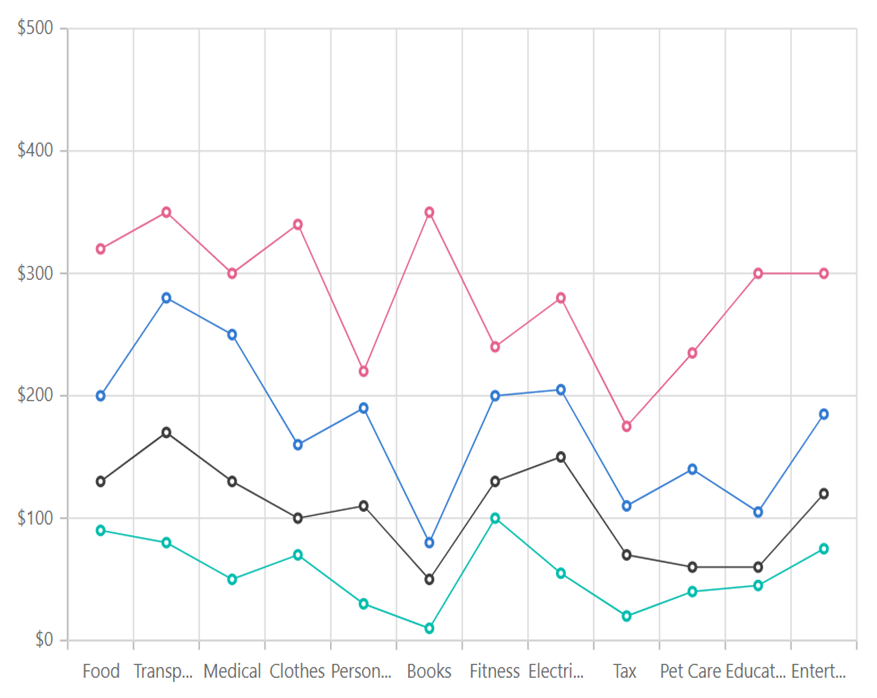
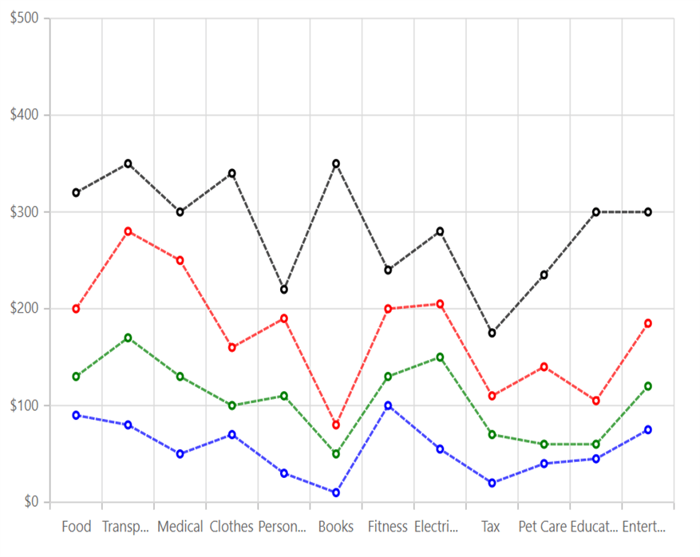

# Stacked Line Chart in Blazor Charts (SfCharts)

## Stacked Line

[`Blazor Stacked Line Chart`](https://www.syncfusion.com/blazor-components/blazor-charts/chart-types/stacked-line-chart) is a chart with Y values stacked over one another in the series order. Shows the relation between individual values to the total sum of the points. To render a [`Stacked Line`](https://www.syncfusion.com/blazor-components/blazor-charts/chart-types/stacked-line-chart) series, use series [`Type`](https://help.syncfusion.com/cr/blazor/Syncfusion.Blazor~Syncfusion.Blazor.Charts.ChartSeries~Type.html) as [`StackingLine`](https://help.syncfusion.com/cr/blazor/Syncfusion.Blazor.Charts.ChartSeriesType.html#Syncfusion_Blazor_Charts_ChartSeriesType_StackingLine).





> Refer to our [`Blazor Stacked Line Chart`](https://www.syncfusion.com/blazor-components/blazor-charts/chart-types/stacked-line-chart) feature tour page to know about its other groundbreaking feature representations. Explore our [`Blazor Stacked Line Chart`](https://blazor.syncfusion.com/demos/chart/stacked-line?theme=bootstrap4) Example to know how to render and configure the Stacked Line type chart.

## Series Customization

The following properties can be used to customize the [`Stacked Line`](https://help.syncfusion.com/cr/blazor/Syncfusion.Blazor.Charts.ChartSeriesType.html#Syncfusion_Blazor_Charts_ChartSeriesType_StackingLine) series.

* [`Fill`](https://help.syncfusion.com/cr/blazor/Syncfusion.Blazor.Charts.ChartSeries.html#Syncfusion_Blazor_Charts_ChartSeries_Fill) – Specifies the color of the series.
* [`Opacity`](https://help.syncfusion.com/cr/blazor/Syncfusion.Blazor.Charts.ChartSeries.html#Syncfusion_Blazor_Charts_ChartSeries_Opacity) – Specifies the opacity of [`Fill`](https://help.syncfusion.com/cr/blazor/Syncfusion.Blazor.Charts.ChartSeries.html#Syncfusion_Blazor_Charts_ChartSeries_Fill).
* [`Width`](https://help.syncfusion.com/cr/blazor/Syncfusion.Blazor~Syncfusion.Blazor.Charts.ChartSeries~Width.html) – Specifies the width of the line stroke.
* [`DashArray`](https://help.syncfusion.com/cr/blazor/Syncfusion.Blazor.Charts.ChartSeries.html#Syncfusion_Blazor_Charts_ChartSeries_DashArray) – Specifies the dashes of line stroke.





> Refer to our [`Blazor Charts`](https://www.syncfusion.com/blazor-components/blazor-charts) feature tour page for its groundbreaking feature representations and also explore our [`Blazor Chart example`](https://blazor.syncfusion.com/demos/chart/line?theme=bootstrap4) to know various chart types and how to represent time-dependent data, showing trends at equal intervals.

## See Also

* [Data Label](../data-labels)
* [Tooltip](../tool-tip)