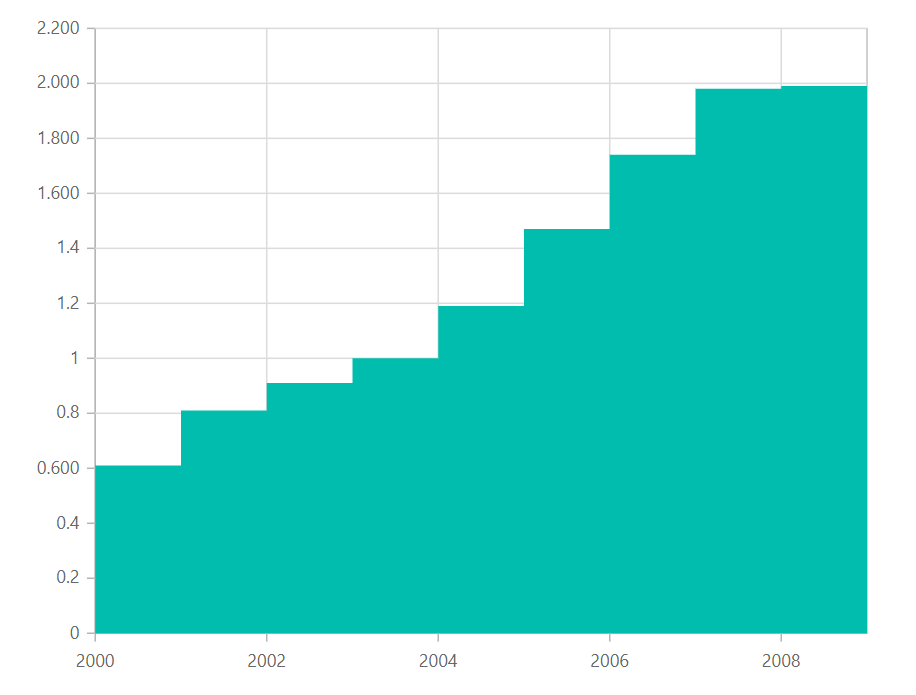
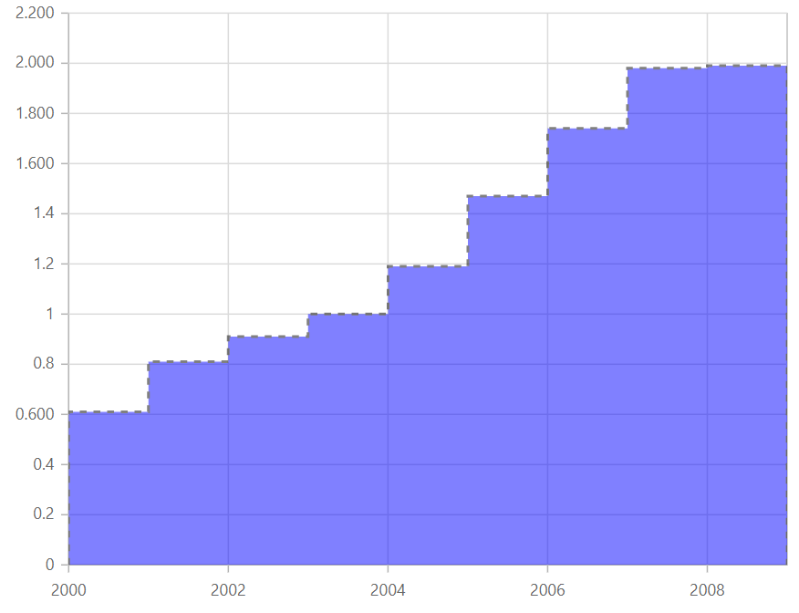

# Step Area in Blazor Charts Component

## Step Area

[`Blazor Step Area chart`](https://www.syncfusion.com/blazor-components/blazor-charts/chart-types/step-area-chart) is like a step line chart except that the area connected through vertical and horizontal lines are shaded with color. To render a [`Step Area`](https://www.syncfusion.com/blazor-components/blazor-charts/chart-types/step-area-chart) series, use series [`Type`](https://help.syncfusion.com/cr/blazor/Syncfusion.Blazor~Syncfusion.Blazor.Charts.ChartSeries~Type.html) as [`StepArea`](https://help.syncfusion.com/cr/blazor/Syncfusion.Blazor.Charts.ChartSeriesType.html#Syncfusion_Blazor_Charts_ChartSeriesType_StepArea).

```csharp

@using Syncfusion.Blazor.Charts

<SfChart>
    <ChartPrimaryXAxis ValueType="Syncfusion.Blazor.Charts.ValueType.Category"/>
    <ChartSeriesCollection>
        <ChartSeries DataSource="@WeatherReports" XName="X" YName="Low" Type="ChartSeriesType.StepArea">
        </ChartSeries>
    </ChartSeriesCollection>
</SfChart>
@code{
    public class ChartData
    {
        public string X { get; set; }
        public double Low { get; set; }
        public double High { get; set; }
    }

    public List<ChartData> WeatherReports = new List<ChartData>
{
         new ChartData { X= "Sun", Low= 2.5, High= 9.8 },
         new ChartData { X= "Mon", Low= 4.7, High= 11.4 },
         new ChartData { X= "Tue", Low= 6.4, High= 14.4 },
         new ChartData { X= "Wed", Low= 9.6, High= 17.2 },
         new ChartData { X= "Thu", Low= 7.5, High= 15.1 },
         new ChartData { X= "Fri", Low= 3.0, High= 10.5 },
         new ChartData { X= "Sat", Low= 1.2, High= 7.9 }
    };
}

```



> Refer to our [`Blazor Step Area Chart`](https://www.syncfusion.com/blazor-components/blazor-charts/chart-types/step-area-chart) feature tour page to know about its other groundbreaking feature representations. Explore our [`Blazor Step Area Chart`](https://blazor.syncfusion.com/demos/chart/step-area?theme=bootstrap4) Example to know how to render and configure the Step Area type chart.

## Series Customization

The following properties can be used to customize the [`Step Area`](https://help.syncfusion.com/cr/blazor/Syncfusion.Blazor.Charts.ChartSeriesType.html#Syncfusion_Blazor_Charts_ChartSeriesType_StepArea) series.

* [`Fill`](https://help.syncfusion.com/cr/blazor/Syncfusion.Blazor.Charts.ChartSeries.html#Syncfusion_Blazor_Charts_ChartSeries_Fill) – Specifies the color of the series.
* [`Opacity`](https://help.syncfusion.com/cr/blazor/Syncfusion.Blazor.Charts.ChartSeries.html#Syncfusion_Blazor_Charts_ChartSeries_Opacity) – Specifies the opacity of [`Fill`](https://help.syncfusion.com/cr/blazor/Syncfusion.Blazor.Charts.ChartSeries.html#Syncfusion_Blazor_Charts_ChartSeries_Fill).
* [`DashArray`](https://help.syncfusion.com/cr/blazor/Syncfusion.Blazor.Charts.ChartSeries.html#Syncfusion_Blazor_Charts_ChartSeries_DashArray) – Specifies the dashes of series border.
* [`ChartSeriesBorder`](https://help.syncfusion.com/cr/blazor/Syncfusion.Blazor.Charts.ChartSeriesBorder.html) – Specifies the [`Color`](https://help.syncfusion.com/cr/blazor/Syncfusion.Blazor.Charts.ChartCommonBorder.html#Syncfusion_Blazor_Charts_ChartCommonBorder_Color) and [`Width`](https://help.syncfusion.com/cr/blazor/Syncfusion.Blazor.Charts.ChartCommonBorder.html#Syncfusion_Blazor_Charts_ChartCommonBorder_Width) of series border.

```cshtml
@using Syncfusion.Blazor.Charts

<SfChart>
    <ChartPrimaryXAxis ValueType="Syncfusion.Blazor.Charts.ValueType.Category" />
    <ChartSeriesCollection>
        <ChartSeries DataSource="@WeatherReports" XName="X" Fill="blue" YName="Low" DashArray="5,5" Opacity="0.5" Type="ChartSeriesType.StepArea">
            <ChartSeriesBorder Width="2" Color="black"></ChartSeriesBorder>
        </ChartSeries>
    </ChartSeriesCollection>
</SfChart>
@code{
    public class ChartData
    {
        public string X { get; set; }
        public double Low { get; set; }
        public double High { get; set; }
    }

    public List<ChartData> WeatherReports = new List<ChartData>
{
         new ChartData { X= "Sun", Low= 2.5, High= 9.8 },
         new ChartData { X= "Mon", Low= 4.7, High= 11.4 },
         new ChartData { X= "Tue", Low= 6.4, High= 14.4 },
         new ChartData { X= "Wed", Low= 9.6, High= 17.2 },
         new ChartData { X= "Thu", Low= 7.5, High= 15.1 },
         new ChartData { X= "Fri", Low= 3.0, High= 10.5 },
         new ChartData { X= "Sat", Low= 1.2, High= 7.9 }
    };
}
```



> Refer to our [`Blazor Charts`](https://www.syncfusion.com/blazor-components/blazor-charts) feature tour page for its groundbreaking feature representations and also explore our [`Blazor Chart example`](https://blazor.syncfusion.com/demos/chart/line?theme=bootstrap4) to know various chart types and how to represent time-dependent data, showing trends at equal intervals.

## See Also

* [Data Label](../data-labels)
* [Tooltip](../tool-tip) [Tooltip](../tool-tip)