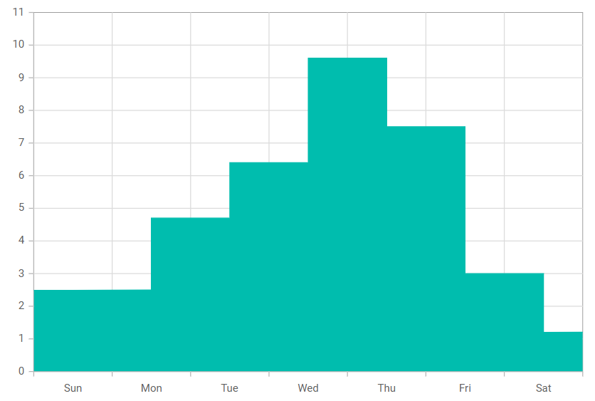

# Step Area in Blazor Charts Component

## Step Area

A [Step Area Chart](https://www.syncfusion.com/blazor-components/blazor-charts/chart-types/step-area-chart) displays values with horizontal and vertical segments and shades the area beneath, producing a step-like appearance. To render a step area series, set the series [`Type`](https://help.syncfusion.com/cr/blazor/Syncfusion.Blazor.Charts.ChartSeries.html#Syncfusion_Blazor_Charts_ChartSeries_Type) to [`StepArea`](https://help.syncfusion.com/cr/blazor/Syncfusion.Blazor.Charts.ChartSeriesType.html#Syncfusion_Blazor_Charts_ChartSeriesType_StepArea) in the chart configuration.

```cshtml

@using Syncfusion.Blazor.Charts

<SfChart>
    <ChartPrimaryXAxis ValueType="Syncfusion.Blazor.Charts.ValueType.Category" />
	
    <ChartSeriesCollection>
        <ChartSeries DataSource="@WeatherReports" XName="X" YName="Y" Type="ChartSeriesType.StepArea">
        </ChartSeries>
    </ChartSeriesCollection>
</SfChart>

@code{
    public class ChartData
    {
        public string X { get; set; }
        public double Y { get; set; }
    }

    public List<ChartData> WeatherReports = new List<ChartData>
	{
         new ChartData { X= "Sun", Y= 2.5 },
         new ChartData { X= "Mon", Y= 4.7 },
         new ChartData { X= "Tue", Y= 6.4 },
         new ChartData { X= "Wed", Y= 9.6 },
         new ChartData { X= "Thu", Y= 7.5 },
         new ChartData { X= "Fri", Y= 3.0 },
         new ChartData { X= "Sat", Y= 1.2 }
    };
}

``` 




N> Refer to the [Blazor Step Area Chart](https://www.syncfusion.com/blazor-components/blazor-charts/chart-types/step-area-chart) feature tour for additional capabilities. Explore the [Blazor Step Area Chart example](https://blazor.syncfusion.com/demos/chart/step-area?theme=bootstrap5) to learn how to render and configure the Step Area Chart.

## Binding data with series

Bind data to the chart using the series [`DataSource`](https://help.syncfusion.com/cr/blazor/Syncfusion.Blazor.Charts.ChartSeries.html#Syncfusion_Blazor_Charts_ChartSeries_DataSource) property. The data source can be a list of business objects or provided via [`SfDataManager`](https://help.syncfusion.com/cr/blazor/Syncfusion.Blazor.Data.SfDataManager.html). For details, see [Working with data](../working-with-data). Map fields to the series using [`XName`](https://help.syncfusion.com/cr/blazor/Syncfusion.Blazor.Charts.ChartSeries.html#Syncfusion_Blazor_Charts_ChartSeries_XName) and [`YName`](https://help.syncfusion.com/cr/blazor/Syncfusion.Blazor.Charts.ChartSeries.html#Syncfusion_Blazor_Charts_ChartSeries_YName).

```cshtml

@using Syncfusion.Blazor.Charts

<SfChart>
    <ChartPrimaryXAxis ValueType="Syncfusion.Blazor.Charts.ValueType.Category" />
	
    <ChartSeriesCollection>
        <ChartSeries DataSource="@WeatherReports" XName="X" YName="Y" Type="ChartSeriesType.StepArea">
        </ChartSeries>
    </ChartSeriesCollection>
</SfChart>

@code{
    public class ChartData
    {
        public string X { get; set; }
        public double Y { get; set; }
    }

    public List<ChartData> WeatherReports = new List<ChartData>
	{
        new ChartData { X= "Sun", Y= 2.5 },
        new ChartData { X= "Mon", Y= 4.7 },
        new ChartData { X= "Tue", Y= 6.4 },
        new ChartData { X= "Wed", Y= 9.6 },
        new ChartData { X= "Thu", Y= 7.5 },
        new ChartData { X= "Fri", Y= 3.0 },
        new ChartData { X= "Sat", Y= 1.2 }
    };
}

``` 


## Series customization

The following properties can be used to customize the [Step Area](https://help.syncfusion.com/cr/blazor/Syncfusion.Blazor.Charts.ChartSeriesType.html#Syncfusion_Blazor_Charts_ChartSeriesType_StepArea) series.

**Fill**

Use the [Fill](https://help.syncfusion.com/cr/blazor/Syncfusion.Blazor.Charts.ChartSeries.html#Syncfusion_Blazor_Charts_ChartSeries_Fill) property to set the series color.

```cshtml

@using Syncfusion.Blazor.Charts

<SfChart>
    <ChartPrimaryXAxis ValueType="Syncfusion.Blazor.Charts.ValueType.Category" />

    <ChartSeriesCollection>
        <ChartSeries DataSource="@WeatherReports" XName="X" YName="Y" Fill="blue" Type="ChartSeriesType.StepArea">
        </ChartSeries>
    </ChartSeriesCollection>
</SfChart>

@code {
    public class ChartData
    {
        public string X { get; set; }
        public double Y { get; set; }
    }

    public List<ChartData> WeatherReports = new List<ChartData>
    {
        new ChartData { X= "Sun", Y= 2.5 },
        new ChartData { X= "Mon", Y= 4.7 },
        new ChartData { X= "Tue", Y= 6.4 },
        new ChartData { X= "Wed", Y= 9.6 },
        new ChartData { X= "Thu", Y= 7.5 },
        new ChartData { X= "Fri", Y= 3.0 },
        new ChartData { X= "Sat", Y= 1.2 }
    };
}

```


The [Fill](https://help.syncfusion.com/cr/blazor/Syncfusion.Blazor.Charts.ChartSeries.html#Syncfusion_Blazor_Charts_ChartSeries_Fill) property also supports gradients by referencing an SVG definition (for example, `url(#grad1)`), enabling smooth color transitions.

```cshtml

@using Syncfusion.Blazor.Charts

<SfChart>
    <ChartPrimaryXAxis ValueType="Syncfusion.Blazor.Charts.ValueType.Category" />

    <ChartSeriesCollection>
        <ChartSeries DataSource="@WeatherReports" XName="X" YName="Y" Fill="url(#grad1)" Type="ChartSeriesType.StepArea">
        </ChartSeries>
    </ChartSeriesCollection>
</SfChart>

<svg style="height: 0">
    <defs>
        <linearGradient id="grad1" x1="0%" y1="0%" x2="0%" y2="100%">
            <stop offset="20%" style="stop-color:orange;stop-opacity:1" />
            <stop offset="100%" style="stop-color:black;stop-opacity:1" />
        </linearGradient>
    </defs>
</svg>

@code {
    public class ChartData
    {
        public string X { get; set; }
        public double Y { get; set; }
    }

    public List<ChartData> WeatherReports = new List<ChartData>
    {
        new ChartData { X= "Sun", Y= 2.5 },
        new ChartData { X= "Mon", Y= 4.7 },
        new ChartData { X= "Tue", Y= 6.4 },
        new ChartData { X= "Wed", Y= 9.6 },
        new ChartData { X= "Thu", Y= 7.5 },
        new ChartData { X= "Fri", Y= 3.0 },
        new ChartData { X= "Sat", Y= 1.2 }
    };
}

```


**Opacity**

Use the [Opacity](https://help.syncfusion.com/cr/blazor/Syncfusion.Blazor.Charts.ChartSeries.html#Syncfusion_Blazor_Charts_ChartSeries_Opacity) property to control the transparency of the series fill.

```cshtml

@using Syncfusion.Blazor.Charts

<SfChart>
    <ChartPrimaryXAxis ValueType="Syncfusion.Blazor.Charts.ValueType.Category" />

    <ChartSeriesCollection>
        <ChartSeries DataSource="@WeatherReports" XName="X" YName="Y" Fill="blue" Opacity="0.5" Type="ChartSeriesType.StepArea">
        </ChartSeries>
    </ChartSeriesCollection>
</SfChart>

@code {
    public class ChartData
    {
        public string X { get; set; }
        public double Y { get; set; }
    }

    public List<ChartData> WeatherReports = new List<ChartData>
    {
        new ChartData { X= "Sun", Y= 2.5 },
        new ChartData { X= "Mon", Y= 4.7 },
        new ChartData { X= "Tue", Y= 6.4 },
        new ChartData { X= "Wed", Y= 9.6 },
        new ChartData { X= "Thu", Y= 7.5 },
        new ChartData { X= "Fri", Y= 3.0 },
        new ChartData { X= "Sat", Y= 1.2 }
    };
}

```


**DashArray**

Use the [DashArray](https://help.syncfusion.com/cr/blazor/Syncfusion.Blazor.Charts.ChartSeries.html#Syncfusion_Blazor_Charts_ChartSeries_DashArray) property to specify the dash and gap pattern for the series border.

```cshtml

@using Syncfusion.Blazor.Charts

<SfChart>
    <ChartPrimaryXAxis ValueType="Syncfusion.Blazor.Charts.ValueType.Category" />
    <ChartSeriesCollection>
        <ChartSeries DataSource="@WeatherReports" XName="X" Fill="blue" YName="Y" DashArray="5,5" Opacity="0.5" Type="ChartSeriesType.StepArea">
            <ChartSeriesBorder Width="2" Color="black"></ChartSeriesBorder>
        </ChartSeries>
    </ChartSeriesCollection>
</SfChart>

@code{
    public class ChartData
    {
        public string X { get; set; }
        public double Y { get; set; }
    }

    public List<ChartData> WeatherReports = new List<ChartData>
    {
        new ChartData { X= "Sun", Y= 2.5 },
        new ChartData { X= "Mon", Y= 4.7 },
        new ChartData { X= "Tue", Y= 6.4 },
        new ChartData { X= "Wed", Y= 9.6 },
        new ChartData { X= "Thu", Y= 7.5 },
        new ChartData { X= "Fri", Y= 3.0 },
        new ChartData { X= "Sat", Y= 1.2 }
    };
}

```


**Series Border**

Use [ChartSeriesBorder](https://help.syncfusion.com/cr/blazor/Syncfusion.Blazor.Charts.ChartSeriesBorder.html) to configure the border [Color](https://help.syncfusion.com/cr/blazor/Syncfusion.Blazor.Charts.ChartCommonBorder.html#Syncfusion_Blazor_Charts_ChartCommonBorder_Color) and [Width](https://help.syncfusion.com/cr/blazor/Syncfusion.Blazor.Charts.ChartCommonBorder.html#Syncfusion_Blazor_Charts_ChartCommonBorder_Width) of the series.

```cshtml

@using Syncfusion.Blazor.Charts

<SfChart>
    <ChartPrimaryXAxis ValueType="Syncfusion.Blazor.Charts.ValueType.Category" />
    <ChartSeriesCollection>
        <ChartSeries DataSource="@WeatherReports" XName="X" Fill="blue" YName="Y" Opacity="0.5" Type="ChartSeriesType.StepArea">
            <ChartSeriesBorder Width="2" Color="black"></ChartSeriesBorder>
        </ChartSeries>
    </ChartSeriesCollection>
</SfChart>

@code{
    public class ChartData
    {
        public string X { get; set; }
        public double Y { get; set; }
    }

    public List<ChartData> WeatherReports = new List<ChartData>
    {
        new ChartData { X= "Sun", Y= 2.5 },
        new ChartData { X= "Mon", Y= 4.7 },
        new ChartData { X= "Tue", Y= 6.4 },
        new ChartData { X= "Wed", Y= 9.6 },
        new ChartData { X= "Thu", Y= 7.5 },
        new ChartData { X= "Fri", Y= 3.0 },
        new ChartData { X= "Sat", Y= 1.2 }
    };
}

```


## Empty points

Data points with `null`, `double.NaN` or `undefined` values are considered empty. Empty data points are ignored and not plotted on the chart.

**Mode**

Use the [`Mode`](https://help.syncfusion.com/cr/blazor/Syncfusion.Blazor.Charts.ChartEmptyPointSettings.html#Syncfusion_Blazor_Charts_ChartEmptyPointSettings_Mode) property to control how empty or missing points are rendered. The default mode is [`Gap`](https://help.syncfusion.com/cr/blazor/Syncfusion.Blazor.Charts.EmptyPointMode.html#Syncfusion_Blazor_Charts_EmptyPointMode_Gap).

```cshtml

@using Syncfusion.Blazor.Charts

<SfChart>
    <ChartPrimaryXAxis ValueType="Syncfusion.Blazor.Charts.ValueType.Category" />

    <ChartSeriesCollection>
        <ChartSeries DataSource="@WeatherReports" XName="X" YName="Y" Type="ChartSeriesType.StepArea">
            <ChartEmptyPointSettings Mode="EmptyPointMode.Zero"></ChartEmptyPointSettings>
        </ChartSeries>
    </ChartSeriesCollection>
</SfChart>

@code {
    public class ChartData
    {
        public string X { get; set; }
        public double Y { get; set; }
    }

    public List<ChartData> WeatherReports = new List<ChartData>
    {
         new ChartData { X= "Sun", Y= 2.5 },
         new ChartData { X= "Mon", Y= 4.7 },
         new ChartData { X= "Tue", Y= 6.4 },
         new ChartData { X= "Wed", Y= double.NaN },
         new ChartData { X= "Thu", Y= 7.5 },
         new ChartData { X= "Fri", Y= 3.0 },
         new ChartData { X= "Sat", Y= 1.2 }
    };
}

```


**Fill**

Use the [`Fill`](https://help.syncfusion.com/cr/blazor/Syncfusion.Blazor.Charts.ChartEmptyPointSettings.html#Syncfusion_Blazor_Charts_ChartEmptyPointSettings_Fill) property to customize the fill color of empty points.

```cshtml

@using Syncfusion.Blazor.Charts

<SfChart>
    <ChartPrimaryXAxis ValueType="Syncfusion.Blazor.Charts.ValueType.Category" />

    <ChartSeriesCollection>
        <ChartSeries DataSource="@WeatherReports" XName="X" YName="Y" Type="ChartSeriesType.StepArea">
            <ChartEmptyPointSettings Mode="EmptyPointMode.Zero" Fill="red"></ChartEmptyPointSettings>
            <ChartMarker Visible="true" Height="7" Width="7" IsFilled="true"></ChartMarker>
        </ChartSeries>
    </ChartSeriesCollection>
</SfChart>

@code {
    public class ChartData
    {
        public string X { get; set; }
        public double Y { get; set; }
    }

    public List<ChartData> WeatherReports = new List<ChartData>
    {
         new ChartData { X= "Sun", Y= 2.5 },
         new ChartData { X= "Mon", Y= 4.7 },
         new ChartData { X= "Tue", Y= 6.4 },
         new ChartData { X= "Wed", Y= double.NaN },
         new ChartData { X= "Thu", Y= 7.5 },
         new ChartData { X= "Fri", Y= 3.0 },
         new ChartData { X= "Sat", Y= 1.2 }
    };
}

```


**Border**

Use the [`Border`](https://help.syncfusion.com/cr/blazor/Syncfusion.Blazor.Charts.ChartEmptyPointSettings.html#Syncfusion_Blazor_Charts_ChartEmptyPointSettings_Border) property to set the border [Width](https://help.syncfusion.com/cr/blazor/Syncfusion.Blazor.Charts.ChartEmptyPointBorder.html#Syncfusion_Blazor_Charts_ChartEmptyPointBorder_Width) and [Color](https://help.syncfusion.com/cr/blazor/Syncfusion.Blazor.Charts.ChartEmptyPointBorder.html#Syncfusion_Blazor_Charts_ChartEmptyPointBorder_Color) for empty points.

```cshtml

@using Syncfusion.Blazor.Charts

<SfChart>
    <ChartPrimaryXAxis ValueType="Syncfusion.Blazor.Charts.ValueType.Category" />

    <ChartSeriesCollection>
        <ChartSeries DataSource="@WeatherReports" XName="X" YName="Y" Type="ChartSeriesType.StepArea">
            <ChartEmptyPointSettings Mode="EmptyPointMode.Zero" Fill="red">
                <ChartEmptyPointBorder Color="green" Width="2"></ChartEmptyPointBorder>
            </ChartEmptyPointSettings>
            <ChartMarker Visible="true" Height="7" Width="7" IsFilled="true"></ChartMarker>
        </ChartSeries>
    </ChartSeriesCollection>
</SfChart>

@code {
    public class ChartData
    {
        public string X { get; set; }
        public double Y { get; set; }
    }

    public List<ChartData> WeatherReports = new List<ChartData>
    {
         new ChartData { X= "Sun", Y= 2.5 },
         new ChartData { X= "Mon", Y= 4.7 },
         new ChartData { X= "Tue", Y= 6.4 },
         new ChartData { X= "Wed", Y= double.NaN },
         new ChartData { X= "Thu", Y= 7.5 },
         new ChartData { X= "Fri", Y= 3.0 },
         new ChartData { X= "Sat", Y= 1.2 }
    };
}

```


## Events

### Series render

The [`OnSeriesRender`](https://help.syncfusion.com/cr/blazor/Syncfusion.Blazor.Charts.ChartEvents.html#Syncfusion_Blazor_Charts_ChartEvents_OnSeriesRender) event lets you adjust series properties—such as [Data](https://help.syncfusion.com/cr/blazor/Syncfusion.Blazor.Charts.SeriesRenderEventArgs.html#Syncfusion_Blazor_Charts_SeriesRenderEventArgs_Data), [Fill](https://help.syncfusion.com/cr/blazor/Syncfusion.Blazor.Charts.SeriesRenderEventArgs.html#Syncfusion_Blazor_Charts_SeriesRenderEventArgs_Fill), and [Series](https://help.syncfusion.com/cr/blazor/Syncfusion.Blazor.Charts.SeriesRenderEventArgs.html#Syncfusion_Blazor_Charts_SeriesRenderEventArgs_Series)—before rendering.

```cshtml

@using Syncfusion.Blazor.Charts

<SfChart>
    <ChartPrimaryXAxis ValueType="Syncfusion.Blazor.Charts.ValueType.Category" />
    <ChartEvents OnSeriesRender="SeriesRender"></ChartEvents>
    <ChartSeriesCollection>
        <ChartSeries DataSource="@WeatherReports" XName="X" YName="Y" Type="ChartSeriesType.StepArea">
        </ChartSeries>
    </ChartSeriesCollection>
</SfChart>

@code {
    public class ChartData
    {
        public string X { get; set; }
        public double Y { get; set; }
    }

    public void SeriesRender(SeriesRenderEventArgs args)
    {
        args.Fill = "#FF4081";
    }

    public List<ChartData> WeatherReports = new List<ChartData>
    {
        new ChartData { X= "Sun", Y= 2.5 },
        new ChartData { X= "Mon", Y= 4.7 },
        new ChartData { X= "Tue", Y= 6.4 },
        new ChartData { X= "Wed", Y= 9.6 },
        new ChartData { X= "Thu", Y= 7.5 },
        new ChartData { X= "Fri", Y= 3.0 },
        new ChartData { X= "Sat", Y= 1.2 }
    };
}


```


### Point render

The [`OnPointRender`](https://help.syncfusion.com/cr/blazor/Syncfusion.Blazor.Charts.ChartEvents.html#Syncfusion_Blazor_Charts_ChartEvents_OnPointRender) event enables per-point customization before each data point is rendered.

```cshtml

@using Syncfusion.Blazor.Charts

<SfChart>
    <ChartPrimaryXAxis ValueType="Syncfusion.Blazor.Charts.ValueType.Category" />
    <ChartEvents OnPointRender="PointRender"></ChartEvents>
    <ChartSeriesCollection>
        <ChartSeries DataSource="@WeatherReports" XName="X" YName="Y" Type="ChartSeriesType.StepArea">
            <ChartMarker Visible="true" Height="10" Width="10"></ChartMarker>
        </ChartSeries>
    </ChartSeriesCollection>
</SfChart>

@code {
    public class ChartData
    {
        public string X { get; set; }
        public double Y { get; set; }
    }

    public void PointRender(PointRenderEventArgs args)
    {
        args.Fill = (args.Point.Index % 2 != 0) ? "#ff6347" : "#009cb8";
    }

    public List<ChartData> WeatherReports = new List<ChartData>
    {
        new ChartData { X= "Sun", Y= 2.5 },
        new ChartData { X= "Mon", Y= 4.7 },
        new ChartData { X= "Tue", Y= 6.4 },
        new ChartData { X= "Wed", Y= 9.6 },
        new ChartData { X= "Thu", Y= 7.5 },
        new ChartData { X= "Fri", Y= 3.0 },
        new ChartData { X= "Sat", Y= 1.2 }
    };
}

```


N> Refer to the [Blazor Charts](https://www.syncfusion.com/blazor-components/blazor-charts) feature tour to explore key capabilities, and see the [Blazor Chart examples](https://blazor.syncfusion.com/demos/chart/line?theme=bootstrap5) for additional chart types.

## See also

* [Data label](../data-labels)
* [Tooltip](../tool-tip)
