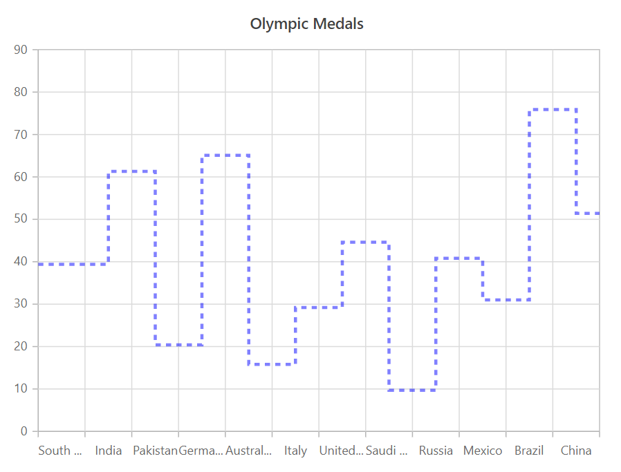

---
title: "Step Line Chart in Blazor Charts component | Syncfusion"

component: "Charts"

description: "Learn here all about Step Line Chart of Syncfusion Charts (SfCharts) component and more."
---
# Step Line Chart in Blazor Charts (SfCharts)

## Step Line

[`Blazor Step Line Chart`](https://www.syncfusion.com/blazor-components/blazor-charts/chart-types/stepline-chart) is like a line chart except that the data points are connected using vertical and horizontal lines, showing a step-like progress. To render a [`Step Line`](https://www.syncfusion.com/blazor-components/blazor-charts/chart-types/stepline-chart) series, use series [`Type`](https://help.syncfusion.com/cr/blazor/Syncfusion.Blazor~Syncfusion.Blazor.Charts.ChartSeries~Type.html) as [`StepLine`](https://help.syncfusion.com/cr/blazor/Syncfusion.Blazor.Charts.ChartSeriesType.html#Syncfusion_Blazor_Charts_ChartSeriesType_StepLine).

T




> Refer to our [`Blazor Step Line Chart`](https://www.syncfusion.com/blazor-components/blazor-charts/chart-types/stepline-chart) feature tour page to know about its other groundbreaking feature representations. Explore our [`Blazor Step Line Chart Example`](https://blazor.syncfusion.com/demos/chart/step-line?theme=bootstrap4) to know how to render a Step Line series.

## Series Customization

The following properties can be used to customize the [`Step Line`](https://help.syncfusion.com/cr/blazor/Syncfusion.Blazor.Charts.ChartSeriesType.html#Syncfusion_Blazor_Charts_ChartSeriesType_StepLine) series.

* [`Fill`](https://help.syncfusion.com/cr/blazor/Syncfusion.Blazor.Charts.ChartSeries.html#Syncfusion_Blazor_Charts_ChartSeries_Fill) – Specifies the color of the series.
* [`Opacity`](https://help.syncfusion.com/cr/blazor/Syncfusion.Blazor.Charts.ChartSeries.html#Syncfusion_Blazor_Charts_ChartSeries_Opacity) – Specifies the opacity of [`Fill`](https://help.syncfusion.com/cr/blazor/Syncfusion.Blazor.Charts.ChartSeries.html#Syncfusion_Blazor_Charts_ChartSeries_Fill).
* [`Width`](https://help.syncfusion.com/cr/blazor/Syncfusion.Blazor~Syncfusion.Blazor.Charts.ChartSeries~Width.html) – Specifies the width of the line stroke.
* [`DashArray`](https://help.syncfusion.com/cr/blazor/Syncfusion.Blazor.Charts.ChartSeries.html#Syncfusion_Blazor_Charts_ChartSeries_DashArray) – Specifies the dashes of line stroke.

```csharp
@using Syncfusion.Blazor.Charts

<SfChart Title="Olympic Medals" Width="60%">
    <ChartPrimaryXAxis ValueType="Syncfusion.Blazor.Charts.ValueType.Category"></ChartPrimaryXAxis>

    <ChartSeriesCollection>
        <ChartSeries DataSource="@MedalDetails" XName="X" YName="Y" Width="3" Opacity="0.5"
                     DashArray="5,5" Fill="blue" Type="ChartSeriesType.StepLine">
        </ChartSeries>
    </ChartSeriesCollection>
</SfChart>

@code{
    public class ChartData
    {
        public string X;
        public double Y;
    }
    public List<ChartData> MedalDetails = new List<ChartData>
{
        new ChartData { X= "South Korea", Y= 39.4 },
        new ChartData { X= "India", Y= 61.3 },
        new ChartData { X= "Pakistan", Y= 20.4 },
        new ChartData { X= "Germany", Y= 65.1 },
        new ChartData { X= "Australia", Y= 15.8 },
        new ChartData { X= "Italy", Y= 29.2 },
        new ChartData { X= "United Kingdom", Y= 44.6 },
        new ChartData { X= "Saudi Arabia", Y= 9.7 },
        new ChartData { X= "Russia", Y= 40.8 },
        new ChartData { X= "Mexico", Y= 31 },
        new ChartData { X= "Brazil", Y= 75.9 },
        new ChartData { X= "China", Y= 51.4 }
    };
}
```



> Refer to our [`Blazor Charts`](https://www.syncfusion.com/blazor-components/blazor-charts) feature tour page for its groundbreaking feature representations and also explore our [`Blazor Chart example`](https://blazor.syncfusion.com/demos/chart/line?theme=bootstrap4) to know various chart types and how to represent time-dependent data, showing trends at equal intervals.

## See Also

* [Data Label](../data-labels)
* [Tooltip](../tool-tip)