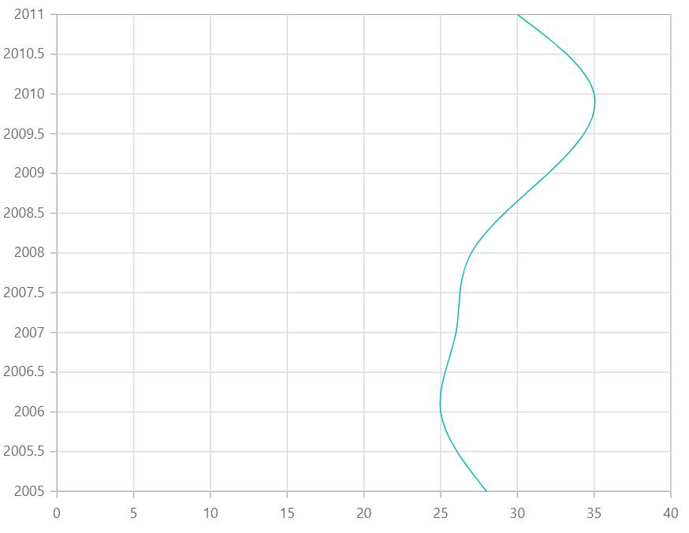

# Vertical Chart in Blazor Charts Component

## Vertical chart

One can draw a vertical chart by changing the axis orientation, and all series types support this option. To render a chart vertically, use the [IsTransposed](https://help.syncfusion.com/cr/blazor/Syncfusion.Blazor.Charts.SfChart.html#Syncfusion_Blazor_Charts_SfChart_IsTransposed) property.

```cshtml

@using Syncfusion.Blazor.Charts

<SfChart IsTransposed="true">
    <ChartSeriesCollection>
        <ChartSeries DataSource="@SalesReports" XName="X" YName="Y" Type="ChartSeriesType.Spline">
        </ChartSeries>
    </ChartSeriesCollection>
</SfChart>

@code{
    public class ChartData
    {
        public double X { get; set; }
        public double Y { get; set; }
    }

    public List<ChartData> SalesReports = new List<ChartData>
	{
        new ChartData{ X= 2005, Y= 28 },
        new ChartData{ X= 2006, Y= 25 },
        new ChartData{ X= 2007, Y= 26 },
        new ChartData{ X= 2008, Y= 27 },
        new ChartData{ X= 2009, Y= 32 },
        new ChartData{ X= 2010, Y= 35 },
        new ChartData{ X= 2011, Y= 30 }
    };
}

``` 
 



## Binding data with series

You can bind data to the chart using the [`DataSource`](https://help.syncfusion.com/cr/blazor/Syncfusion.Blazor.Charts.ChartSeries.html#Syncfusion_Blazor_Charts_ChartSeries_DataSource) property within the series configuration. The [`DataSource`](https://help.syncfusion.com/cr/blazor/Syncfusion.Blazor.Charts.ChartSeries.html#Syncfusion_Blazor_Charts_ChartSeries_DataSource) value can be set using either [`SfDataManager`](https://help.syncfusion.com/cr/blazor/Syncfusion.Blazor.Data.SfDataManager.html) property values or a list of business objects. More information on data binding can be found [here](../working-with-data). To display the data correctly, map the fields from the data to the chart series' [`XName`](https://help.syncfusion.com/cr/blazor/Syncfusion.Blazor.Charts.ChartSeries.html#Syncfusion_Blazor_Charts_ChartSeries_XName) and [`YName`](https://help.syncfusion.com/cr/blazor/Syncfusion.Blazor.Charts.ChartSeries.html#Syncfusion_Blazor_Charts_ChartSeries_YName) properties.

```cshtml

@using Syncfusion.Blazor.Charts

<SfChart IsTransposed="true">
    <ChartSeriesCollection>
        <ChartSeries DataSource="@SalesReports" XName="X" YName="Y" Type="ChartSeriesType.Spline">
        </ChartSeries>
    </ChartSeriesCollection>
</SfChart>

@code{
    public class ChartData
    {
        public double X { get; set; }
        public double Y { get; set; }
    }

    public List<ChartData> SalesReports = new List<ChartData>
	{
        new ChartData{ X= 2005, Y= 28 },
        new ChartData{ X= 2006, Y= 25 },
        new ChartData{ X= 2007, Y= 26 },
        new ChartData{ X= 2008, Y= 27 },
        new ChartData{ X= 2009, Y= 32 },
        new ChartData{ X= 2010, Y= 35 },
        new ChartData{ X= 2011, Y= 30 }
    };
}

``` 
 

## Empty points

Data points with `null`, `double.NaN` or `undefined` values are considered empty. Empty data points are ignored and not plotted on the chart.

**Mode**

Use the [`Mode`](https://help.syncfusion.com/cr/blazor/Syncfusion.Blazor.Charts.ChartEmptyPointSettings.html#Syncfusion_Blazor_Charts_ChartEmptyPointSettings_Mode) property to define how empty or missing data points are handled in the series. The default mode for empty points is [`Gap`](https://help.syncfusion.com/cr/blazor/Syncfusion.Blazor.Charts.EmptyPointMode.html#Syncfusion_Blazor_Charts_EmptyPointMode_Gap).

```cshtml

@using Syncfusion.Blazor.Charts

<SfChart IsTransposed="true">
    <ChartSeriesCollection>
        <ChartSeries DataSource="@SalesReports" XName="X" YName="Y" Type="Syncfusion.Blazor.Charts.ChartSeriesType.Spline">
            <ChartEmptyPointSettings Mode="EmptyPointMode.Gap"></ChartEmptyPointSettings>
            <ChartMarker Visible="true" Height="10" Width="10"></ChartMarker>
        </ChartSeries>
    </ChartSeriesCollection>
</SfChart>

@code {
    public class ChartData
    {
        public double X { get; set; }
        public double Y { get; set; }
    }

    public List<ChartData> SalesReports = new List<ChartData>
    {
        new ChartData{ X= 2005, Y= 28 },
        new ChartData{ X= 2006, Y= 25 },
        new ChartData{ X= 2007, Y= 26 },
        new ChartData{ X= 2008, Y= double.NaN },
        new ChartData{ X= 2009, Y= 32 },
        new ChartData{ X= 2010, Y= 35 },
        new ChartData{ X= 2011, Y= 30 }
    };
}

```
 

**Fill**

Use the [`Fill`](https://help.syncfusion.com/cr/blazor/Syncfusion.Blazor.Charts.ChartEmptyPointSettings.html#Syncfusion_Blazor_Charts_ChartEmptyPointSettings_Fill) property to customize the fill color of empty points in the series.

```cshtml

@using Syncfusion.Blazor.Charts

<SfChart IsTransposed="true">
    <ChartSeriesCollection>
        <ChartSeries DataSource="@SalesReports" XName="X" YName="Y" Type="Syncfusion.Blazor.Charts.ChartSeriesType.Spline">
            <ChartEmptyPointSettings Fill="#FFDE59" Mode="EmptyPointMode.Average"></ChartEmptyPointSettings>
            <ChartMarker Visible="true" Height="10" Width="10"></ChartMarker>
        </ChartSeries>
    </ChartSeriesCollection>
</SfChart>

@code {
    public class ChartData
    {
        public double X { get; set; }
        public double Y { get; set; }
    }

    public List<ChartData> SalesReports = new List<ChartData>
    {
        new ChartData{ X= 2005, Y= 28 },
        new ChartData{ X= 2006, Y= 25 },
        new ChartData{ X= 2007, Y= 26 },
        new ChartData{ X= 2008, Y= double.NaN },
        new ChartData{ X= 2009, Y= 32 },
        new ChartData{ X= 2010, Y= 35 },
        new ChartData{ X= 2011, Y= 30 }
    };
}

```
 

**Border**

Use the [`Border`](https://help.syncfusion.com/cr/blazor/Syncfusion.Blazor.Charts.ChartEmptyPointSettings.html#Syncfusion_Blazor_Charts_ChartEmptyPointSettings_Border) property to customize the [Width](https://help.syncfusion.com/cr/blazor/Syncfusion.Blazor.Charts.ChartEmptyPointBorder.html#Syncfusion_Blazor_Charts_ChartEmptyPointBorder_Width) and [Color](https://help.syncfusion.com/cr/blazor/Syncfusion.Blazor.Charts.ChartEmptyPointBorder.html#Syncfusion_Blazor_Charts_ChartEmptyPointBorder_Color) of the border for empty points.

```cshtml

@using Syncfusion.Blazor.Charts

<SfChart IsTransposed="true">
    <ChartSeriesCollection>
        <ChartSeries DataSource="@SalesReports" XName="X" YName="Y" Type="Syncfusion.Blazor.Charts.ChartSeriesType.Spline">
            <ChartEmptyPointSettings Fill="#FFDE59" Mode="EmptyPointMode.Average">
                <ChartEmptyPointBorder Color="red" Width="2"></ChartEmptyPointBorder>
            </ChartEmptyPointSettings>
            <ChartMarker Visible="true" Height="10" Width="10"></ChartMarker>
        </ChartSeries>
    </ChartSeriesCollection>
</SfChart>

@code {
    public class ChartData
    {
        public double X { get; set; }
        public double Y { get; set; }
    }

    public List<ChartData> SalesReports = new List<ChartData>
    {
        new ChartData{ X= 2005, Y= 28 },
        new ChartData{ X= 2006, Y= 25 },
        new ChartData{ X= 2007, Y= 26 },
        new ChartData{ X= 2008, Y= double.NaN },
        new ChartData{ X= 2009, Y= 32 },
        new ChartData{ X= 2010, Y= 35 },
        new ChartData{ X= 2011, Y= 30 }
    };
}

```
 

## Events

### Series render

The [`OnSeriesRender`](https://help.syncfusion.com/cr/blazor/Syncfusion.Blazor.Charts.ChartEvents.html#Syncfusion_Blazor_Charts_ChartEvents_OnSeriesRender) event allows you to customize series properties, such as [Data](https://help.syncfusion.com/cr/blazor/Syncfusion.Blazor.Charts.SeriesRenderEventArgs.html#Syncfusion_Blazor_Charts_SeriesRenderEventArgs_Data), [Fill](https://help.syncfusion.com/cr/blazor/Syncfusion.Blazor.Charts.SeriesRenderEventArgs.html#Syncfusion_Blazor_Charts_SeriesRenderEventArgs_Fill), and [Series](https://help.syncfusion.com/cr/blazor/Syncfusion.Blazor.Charts.SeriesRenderEventArgs.html#Syncfusion_Blazor_Charts_SeriesRenderEventArgs_Series), before they are rendered on the chart.

```cshtml

@using Syncfusion.Blazor.Charts

<SfChart IsTransposed="true">
    <ChartEvents OnSeriesRender="SeriesRender"></ChartEvents>
    <ChartSeriesCollection>
        <ChartSeries DataSource="@SalesReports" XName="X" YName="Y" Type="Syncfusion.Blazor.Charts.ChartSeriesType.Spline">
        </ChartSeries>
    </ChartSeriesCollection>
</SfChart>

@code {
    public class ChartData
    {
        public double X { get; set; }
        public double Y { get; set; }
    }

    public void SeriesRender(SeriesRenderEventArgs args)
    {
        args.Fill = "#FF4081";
    }

    public List<ChartData> SalesReports = new List<ChartData>
    {
        new ChartData{ X= 2005, Y= 28 },
        new ChartData{ X= 2006, Y= 25 },
        new ChartData{ X= 2007, Y= 26 },
        new ChartData{ X= 2008, Y= 27 },
        new ChartData{ X= 2009, Y= 32 },
        new ChartData{ X= 2010, Y= 35 },
        new ChartData{ X= 2011, Y= 30 }
    };
}

```
 

### Point render

The [`OnPointRender`](https://help.syncfusion.com/cr/blazor/Syncfusion.Blazor.Charts.ChartEvents.html#Syncfusion_Blazor_Charts_ChartEvents_OnPointRender) event allows you to customize each data point before it is rendered on the chart.

```cshtml

@using Syncfusion.Blazor.Charts

<SfChart IsTransposed="true">
    <ChartEvents OnPointRender="PointRender"></ChartEvents>
    <ChartSeriesCollection>
        <ChartSeries DataSource="@SalesReports" XName="X" YName="Y" Type="Syncfusion.Blazor.Charts.ChartSeriesType.Spline">
            <ChartMarker Visible="true" Height="10" Width="10"></ChartMarker>
        </ChartSeries>
    </ChartSeriesCollection>
</SfChart>

@code {
    public class ChartData
    {
        public double X { get; set; }
        public double Y { get; set; }
    }

    public void PointRender(PointRenderEventArgs args)
    {
        args.Fill = args.Point.X.ToString() == "2008" ? "#E91E63" : "#3F51B5";
    }

    public List<ChartData> SalesReports = new List<ChartData>
    {
        new ChartData{ X= 2005, Y= 28 },
        new ChartData{ X= 2006, Y= 25 },
        new ChartData{ X= 2007, Y= 26 },
        new ChartData{ X= 2008, Y= 27 },
        new ChartData{ X= 2009, Y= 32 },
        new ChartData{ X= 2010, Y= 35 },
        new ChartData{ X= 2011, Y= 30 }
    };
}

```
 

N> Refer to our [Blazor Charts](https://www.syncfusion.com/blazor-components/blazor-charts) feature tour page for its groundbreaking feature representations and also explore our [Blazor Chart Example](https://blazor.syncfusion.com/demos/chart/line?theme=bootstrap5) to know various chart types and how to represent time-dependent data, showing trends at equal intervals.

## See also

* [Data Label](../data-labels)
* [Tooltip](../tool-tip)