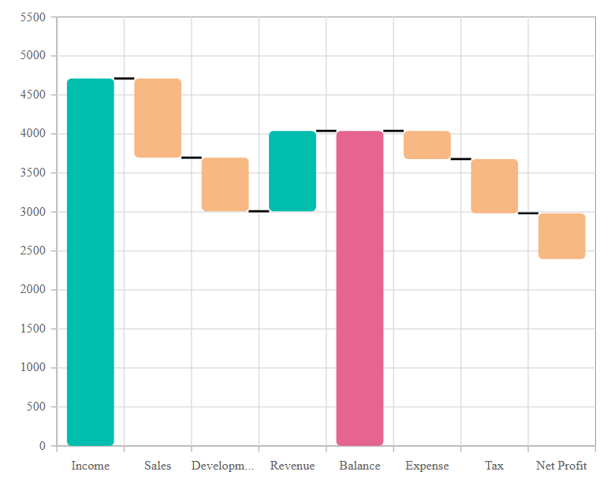

# Waterfall Chart in Blazor Charts Component

## Waterfall Chart

The `Waterfall Chart` illustrates the cumulative effect of sequential positive and negative values. To render a waterfall series, set the series [Type](https://help.syncfusion.com/cr/blazor/Syncfusion.Blazor.Charts.ChartSeries.html#Syncfusion_Blazor_Charts_ChartSeries_Type) to **Waterfall**. Use the [IntermediateSumIndexes](https://help.syncfusion.com/cr/blazor/Syncfusion.Blazor.Charts.ChartSeries.html#Syncfusion_Blazor_Charts_ChartSeries_IntermediateSumIndexes) property to display intermediate sums, and [SumIndexes](https://help.syncfusion.com/cr/blazor/Syncfusion.Blazor.Charts.ChartSeries.html#Syncfusion_Blazor_Charts_ChartSeries_SumIndexes) for cumulative sums.

```cshtml

@using Syncfusion.Blazor.Charts

<SfChart>
    <ChartPrimaryXAxis ValueType="Syncfusion.Blazor.Charts.ValueType.Category" />

    <ChartSeriesCollection>
        <ChartSeries DataSource="@SalesReports" XName="XValue" YName="YValue" Type="ChartSeriesType.Waterfall" IntermediateSumIndexes="@index" SumIndexes="@sumIndex">
            <ChartMarker Height="10" Width="10" Visible="true"></ChartMarker>
        </ChartSeries>
    </ChartSeriesCollection>
</SfChart>

@code {
    double[] index = new double[] { 4 };
    double[] sumIndex = new double[] { 8 };
	
    public class ChartData
    {
        public string XValue { get; set; }
        public double YValue { get; set; }
    }

    public List<ChartData> SalesReports = new List<ChartData>
	{
		new ChartData { XValue = "Income", YValue = 4711 },
		new ChartData { XValue = "Sales", YValue = -1015 },
		new ChartData { XValue = "Development", YValue = -688 },
		new ChartData { XValue = "Revenue", YValue = 1030 },
		new ChartData { XValue = "Balance" },
		new ChartData { XValue = "Expense", YValue = -361 },
		new ChartData { XValue = "Tax", YValue = -695 },
		new ChartData { XValue = "Net Profit" },
	};
}

``` 



N> Explore the [Blazor Waterfall Chart Example](https://blazor.syncfusion.com/demos/chart/waterfall?theme=bootstrap5) to learn how to render and configure the Waterfall type chart with interactive examples.

## Binding data with series

Bind data to the chart using the [`DataSource`](https://help.syncfusion.com/cr/blazor/Syncfusion.Blazor.Charts.ChartSeries.html#Syncfusion_Blazor_Charts_ChartSeries_DataSource) property in the series configuration. The [`DataSource`](https://help.syncfusion.com/cr/blazor/Syncfusion.Blazor.Charts.ChartSeries.html#Syncfusion_Blazor_Charts_ChartSeries_DataSource) value can be set using either [`SfDataManager`](https://help.syncfusion.com/cr/blazor/Syncfusion.Blazor.Data.SfDataManager.html) or a list of business objects. For more information, see [Working with Data](../working-with-data). Map the data fields to the chart series' [`XName`](https://help.syncfusion.com/cr/blazor/Syncfusion.Blazor.Charts.ChartSeries.html#Syncfusion_Blazor_Charts_ChartSeries_XName) and [`YName`](https://help.syncfusion.com/cr/blazor/Syncfusion.Blazor.Charts.ChartSeries.html#Syncfusion_Blazor_Charts_ChartSeries_YName) properties.

```cshtml

@using Syncfusion.Blazor.Charts

<SfChart>
    <ChartPrimaryXAxis ValueType="Syncfusion.Blazor.Charts.ValueType.Category" />

    <ChartSeriesCollection>
        <ChartSeries DataSource="@SalesReports" XName="XValue" YName="YValue" Type="ChartSeriesType.Waterfall" IntermediateSumIndexes="@index" SumIndexes="@sumIndex">
            <ChartMarker Height="10" Width="10" Visible="true"></ChartMarker>
        </ChartSeries>
    </ChartSeriesCollection>
</SfChart>

@code {
    double[] index = new double[] { 4 };
    double[] sumIndex = new double[] { 8 };
	
    public class ChartData
    {
        public string XValue { get; set; }
        public double YValue { get; set; }
    }

    public List<ChartData> SalesReports = new List<ChartData>
	{
		new ChartData { XValue = "Income", YValue = 4711 },
		new ChartData { XValue = "Sales", YValue = -1015 },
		new ChartData { XValue = "Development", YValue = -688 },
		new ChartData { XValue = "Revenue", YValue = 1030 },
		new ChartData { XValue = "Balance" },
		new ChartData { XValue = "Expense", YValue = -361 },
		new ChartData { XValue = "Tax", YValue = -695 },
		new ChartData { XValue = "Net Profit" },
	};
}

``` 


## Series customization

Customize the Waterfall chart using the following properties:

- [NegativeFillColor](https://help.syncfusion.com/cr/blazor/Syncfusion.Blazor.Charts.ChartSeries.html#Syncfusion_Blazor_Charts_ChartSeries_NegativeFillColor) sets the color for negative changes (default: **#E94649**).
- [SummaryFillColor](https://help.syncfusion.com/cr/blazor/Syncfusion.Blazor.Charts.ChartSeries.html#Syncfusion_Blazor_Charts_ChartSeries_SummaryFillColor) sets the color for summary changes (default: **#4E81BC**).

```cshtml

@using Syncfusion.Blazor.Charts

<SfChart>
    <ChartPrimaryXAxis ValueType="Syncfusion.Blazor.Charts.ValueType.Category" />

    <ChartSeriesCollection>
        <ChartSeries DataSource="@SalesReports" SummaryFillColor="#e56590" NegativeFillColor="#f8b883" XName="XValue" YName="YValue" Type="Syncfusion.Blazor.Charts.ChartSeriesType.Waterfall" IntermediateSumIndexes="@index" SumIndexes="@sumIndex">
            <ChartMarker Height="10" Width="10" Visible="true"></ChartMarker>
        </ChartSeries>
    </ChartSeriesCollection>
</SfChart>

@code {
    double[] index = new double[] { 4 };
    double[] sumIndex = new double[] { 8 };

    public class ChartData
    {
        public string XValue { get; set; }
        public double YValue { get; set; }
    }

    public List<ChartData> SalesReports = new List<ChartData>
    {
        new ChartData { XValue = "Income", YValue = 4711 },
        new ChartData { XValue = "Sales", YValue = -1015 },
        new ChartData { XValue = "Development", YValue = -688 },
        new ChartData { XValue = "Revenue", YValue = 1030 },
        new ChartData { XValue = "Balance" },
        new ChartData { XValue = "Expense", YValue = -361 },
        new ChartData { XValue = "Tax", YValue = -695 },
        new ChartData { XValue = "Net Profit" },
    };
}

``` 


### Corner radius

Use the [ChartCornerRadius](https://help.syncfusion.com/cr/blazor/Syncfusion.Blazor.Charts.ChartCornerRadius.html) property to customize the corner radius of Waterfall series columns. Adjust [BottomLeft](https://help.syncfusion.com/cr/blazor/Syncfusion.Blazor.Charts.ChartCornerRadius.html#Syncfusion_Blazor_Charts_ChartCornerRadius_BottomLeft), [BottomRight](https://help.syncfusion.com/cr/blazor/Syncfusion.Blazor.Charts.ChartCornerRadius.html#Syncfusion_Blazor_Charts_ChartCornerRadius_BottomRight), [TopLeft](https://help.syncfusion.com/cr/blazor/Syncfusion.Blazor.Charts.ChartCornerRadius.html#Syncfusion_Blazor_Charts_ChartCornerRadius_TopLeft), and [TopRight](https://help.syncfusion.com/cr/blazor/Syncfusion.Blazor.Charts.ChartCornerRadius.html#Syncfusion_Blazor_Charts_ChartCornerRadius_TopRight) for a polished appearance.

```cshtml

@using Syncfusion.Blazor.Charts

<SfChart>
    <ChartPrimaryXAxis ValueType="Syncfusion.Blazor.Charts.ValueType.Category" />

    <ChartSeriesCollection>
        <ChartSeries DataSource="@SalesReports" SummaryFillColor="#e56590" NegativeFillColor="#f8b883" XName="XValue" YName="YValue" Type="Syncfusion.Blazor.Charts.ChartSeriesType.Waterfall" IntermediateSumIndexes="@index" SumIndexes="@sumIndex">
            <ChartCornerRadius TopLeft="5" TopRight="5" BottomLeft="5" BottomRight="5"></ChartCornerRadius>
        </ChartSeries>
    </ChartSeriesCollection>
</SfChart>

@code {
    double[] index = new double[] { 4 };
    double[] sumIndex = new double[] { 8 };

    public class ChartData
    {
        public string XValue { get; set; }
        public double YValue { get; set; }
    }

    public List<ChartData> SalesReports = new List<ChartData>
    {
        new ChartData { XValue = "Income", YValue = 4711 },
        new ChartData { XValue = "Sales", YValue = -1015 },
        new ChartData { XValue = "Development", YValue = -688 },
        new ChartData { XValue = "Revenue", YValue = 1030 },
        new ChartData { XValue = "Balance" },
        new ChartData { XValue = "Expense", YValue = -361 },
        new ChartData { XValue = "Tax", YValue = -695 },
        new ChartData { XValue = "Net Profit", YValue = -587},
    };
}

```




The corner radius for individual points can be customized using the [OnPointRender](https://blazor.syncfusion.com/documentation/chart/events#onpointrender) event and the [CornerRadius](https://help.syncfusion.com/cr/blazor/Syncfusion.Blazor.Charts.PointRenderEventArgs.html#Syncfusion_Blazor_Charts_PointRenderEventArgs_CornerRadius) property.

```cshtml

@using Syncfusion.Blazor.Charts

<SfChart>
    <ChartEvents OnPointRender="PointRenderEvent" />
    <ChartPrimaryXAxis ValueType="Syncfusion.Blazor.Charts.ValueType.Category" />

    <ChartSeriesCollection>
        <ChartSeries DataSource="@SalesReports" SummaryFillColor="#e56590" NegativeFillColor="#f8b883" XName="XValue" YName="YValue" Type="Syncfusion.Blazor.Charts.ChartSeriesType.Waterfall" IntermediateSumIndexes="@index" SumIndexes="@sumIndex">
        </ChartSeries>
    </ChartSeriesCollection>
</SfChart>

@code {
    double[] index = new double[] { 4 };
    double[] sumIndex = new double[] { 8 };

    public class ChartData
    {
        public string XValue { get; set; }
        public double YValue { get; set; }
    }

    public List<ChartData> SalesReports = new List<ChartData>
    {
        new ChartData { XValue = "Income", YValue = 4711 },
        new ChartData { XValue = "Sales", YValue = -1015 },
        new ChartData { XValue = "Development", YValue = -688 },
        new ChartData { XValue = "Revenue", YValue = 1030 },
        new ChartData { XValue = "Balance" },
        new ChartData { XValue = "Expense", YValue = -361 },
        new ChartData { XValue = "Tax", YValue = -695 },
        new ChartData { XValue = "Net Profit", YValue = -587},
    };

    public void PointRenderEvent(PointRenderEventArgs args)
    {
        if ((args.Point.X as string) == "Income" || (args.Point.X as string) == "Development" || (args.Point.X as string) == "Balance" || (args.Point.X as string) == "Tax")
        {
            args.CornerRadius.BottomLeft = 5;
            args.CornerRadius.BottomRight = 5;
            args.CornerRadius.TopLeft = 5;
            args.CornerRadius.TopRight = 5;
        }
    }
}

```



## Empty points

Data points with `null`, `double.NaN`, or `undefined` values are considered empty and are not plotted.

**Mode**

Use the [`Mode`](https://help.syncfusion.com/cr/blazor/Syncfusion.Blazor.Charts.ChartEmptyPointSettings.html#Syncfusion_Blazor_Charts_ChartEmptyPointSettings_Mode) property to define how empty points are handled. The default is [`Gap`](https://help.syncfusion.com/cr/blazor/Syncfusion.Blazor.Charts.EmptyPointMode.html#Syncfusion_Blazor_Charts_EmptyPointMode_Gap).

```cshtml

@using Syncfusion.Blazor.Charts

<SfChart>
    <ChartPrimaryXAxis ValueType="Syncfusion.Blazor.Charts.ValueType.Category" />

    <ChartSeriesCollection>
        <ChartSeries DataSource="@SalesReports" XName="XValue" YName="YValue" Type="Syncfusion.Blazor.Charts.ChartSeriesType.Waterfall" IntermediateSumIndexes="@index" SumIndexes="@sumIndex">
            <ChartEmptyPointSettings Mode="EmptyPointMode.Gap"></ChartEmptyPointSettings>
            <ChartMarker Height="10" Width="10" Visible="true"></ChartMarker>
        </ChartSeries>
    </ChartSeriesCollection>
</SfChart>

@code {
    double[] index = new double[] { 4 };
    double[] sumIndex = new double[] { 8 };

    public class ChartData
    {
        public string XValue { get; set; }
        public double YValue { get; set; }
    }

    public List<ChartData> SalesReports = new List<ChartData>
    {
        new ChartData { XValue = "Income", YValue = 4711 },
        new ChartData { XValue = "Sales", YValue = -1015 },
        new ChartData { XValue = "Development", YValue = -688 },
        new ChartData { XValue = "Revenue", YValue = double.NaN },
        new ChartData { XValue = "Balance" },
        new ChartData { XValue = "Expense", YValue = -361 },
        new ChartData { XValue = "Tax", YValue = -695 },
        new ChartData { XValue = "Net Profit" },
    };
}

```


**Fill**

Use the [`Fill`](https://help.syncfusion.com/cr/blazor/Syncfusion.Blazor.Charts.ChartEmptyPointSettings.html#Syncfusion_Blazor_Charts_ChartEmptyPointSettings_Fill) property to set the fill color for empty points.

```cshtml

@using Syncfusion.Blazor.Charts

<SfChart>
    <ChartPrimaryXAxis ValueType="Syncfusion.Blazor.Charts.ValueType.Category" />

    <ChartSeriesCollection>
        <ChartSeries DataSource="@SalesReports" XName="XValue" YName="YValue" Type="Syncfusion.Blazor.Charts.ChartSeriesType.Waterfall" IntermediateSumIndexes="@index" SumIndexes="@sumIndex">
            <ChartEmptyPointSettings Fill="#FFDE59" Mode="EmptyPointMode.Average"></ChartEmptyPointSettings>
            <ChartMarker Height="10" Width="10" Visible="true"></ChartMarker>
        </ChartSeries>
    </ChartSeriesCollection>
</SfChart>

@code {
    double[] index = new double[] { 4 };
    double[] sumIndex = new double[] { 8 };

    public class ChartData
    {
        public string XValue { get; set; }
        public double YValue { get; set; }
    }

    public List<ChartData> SalesReports = new List<ChartData>
    {
        new ChartData { XValue = "Income", YValue = 4711 },
        new ChartData { XValue = "Sales", YValue = -1015 },
        new ChartData { XValue = "Development", YValue = -688 },
        new ChartData { XValue = "Revenue", YValue = double.NaN },
        new ChartData { XValue = "Balance" },
        new ChartData { XValue = "Expense", YValue = -361 },
        new ChartData { XValue = "Tax", YValue = -695 },
        new ChartData { XValue = "Net Profit" },
    };
}

```


**Border**

Use the [`Border`](https://help.syncfusion.com/cr/blazor/Syncfusion.Blazor.Charts.ChartEmptyPointSettings.html#Syncfusion_Blazor_Charts_ChartEmptyPointSettings_Border) property to customize the border's [Width](https://help.syncfusion.com/cr/blazor/Syncfusion.Blazor.Charts.ChartEmptyPointBorder.html#Syncfusion_Blazor_Charts_ChartEmptyPointBorder_Width) and [Color](https://help.syncfusion.com/cr/blazor/Syncfusion.Blazor.Charts.ChartEmptyPointBorder.html#Syncfusion_Blazor_Charts_ChartEmptyPointBorder_Color).

```cshtml

@using Syncfusion.Blazor.Charts

<SfChart>
    <ChartPrimaryXAxis ValueType="Syncfusion.Blazor.Charts.ValueType.Category">
    </ChartPrimaryXAxis>

    <ChartSeriesCollection>
        <ChartSeries DataSource="@SalesReports" XName="XValue" YName="YValue" Type="Syncfusion.Blazor.Charts.ChartSeriesType.Waterfall" IntermediateSumIndexes="@index" SumIndexes="@sumIndex">
            <ChartEmptyPointSettings Fill="#FFDE59" Mode="EmptyPointMode.Average">
                <ChartEmptyPointBorder Color="red" Width="2"></ChartEmptyPointBorder>
            </ChartEmptyPointSettings>
            <ChartMarker Height="10" Width="10" Visible="true"></ChartMarker>
        </ChartSeries>
    </ChartSeriesCollection>
</SfChart>

@code {
    double[] index = new double[] { 4 };
    double[] sumIndex = new double[] { 8 };

    public class ChartData
    {
        public string XValue { get; set; }
        public double YValue { get; set; }
    }

    public List<ChartData> SalesReports = new List<ChartData>
    {
        new ChartData { XValue = "Income", YValue = 4711 },
        new ChartData { XValue = "Sales", YValue = -1015 },
        new ChartData { XValue = "Development", YValue = -688 },
        new ChartData { XValue = "Revenue", YValue = double.NaN },
        new ChartData { XValue = "Balance" },
        new ChartData { XValue = "Expense", YValue = -361 },
        new ChartData { XValue = "Tax", YValue = -695 },
        new ChartData { XValue = "Net Profit" },
    };
}

```


## Events

### Series render

The [`OnSeriesRender`](https://help.syncfusion.com/cr/blazor/Syncfusion.Blazor.Charts.ChartEvents.html#Syncfusion_Blazor_Charts_ChartEvents_OnSeriesRender) event enables customization of series properties, such as [Data](https://help.syncfusion.com/cr/blazor/Syncfusion.Blazor.Charts.SeriesRenderEventArgs.html#Syncfusion_Blazor_Charts_SeriesRenderEventArgs_Data), [Fill](https://help.syncfusion.com/cr/blazor/Syncfusion.Blazor.Charts.SeriesRenderEventArgs.html#Syncfusion_Blazor_Charts_SeriesRenderEventArgs_Fill), and [Series](https://help.syncfusion.com/cr/blazor/Syncfusion.Blazor.Charts.SeriesRenderEventArgs.html#Syncfusion_Blazor_Charts_SeriesRenderEventArgs_Series), before rendering.

```cshtml

@using Syncfusion.Blazor.Charts

<SfChart>
    <ChartEvents OnSeriesRender="SeriesRender" />
    <ChartPrimaryXAxis ValueType="Syncfusion.Blazor.Charts.ValueType.Category" />
    <ChartSeriesCollection>
        <ChartSeries DataSource="@SalesReports" XName="XValue" YName="YValue" Type="Syncfusion.Blazor.Charts.ChartSeriesType.Waterfall" IntermediateSumIndexes="@index" SumIndexes="@sumIndex">
        </ChartSeries>
    </ChartSeriesCollection>
</SfChart>

@code {
    double[] index = new double[] { 4 };
    double[] sumIndex = new double[] { 8 };

    public class ChartData
    {
        public string XValue { get; set; }
        public double YValue { get; set; }
    }

    public void SeriesRender(SeriesRenderEventArgs args)
    {
        args.Series.SummaryFillColor = "green";
        args.Series.NegativeFillColor = "blue";
        args.Fill = "red";
    }

    public List<ChartData> SalesReports = new List<ChartData>
    {
        new ChartData { XValue = "Income", YValue = 4711 },
        new ChartData { XValue = "Sales", YValue = -1015 },
        new ChartData { XValue = "Development", YValue = -688 },
        new ChartData { XValue = "Revenue", YValue = 1030 },
        new ChartData { XValue = "Balance" },
        new ChartData { XValue = "Expense", YValue = -361 },
        new ChartData { XValue = "Tax", YValue = -695 },
        new ChartData { XValue = "Net Profit" },
    };
}

```


### Point render

The [`OnPointRender`](https://help.syncfusion.com/cr/blazor/Syncfusion.Blazor.Charts.ChartEvents.html#Syncfusion_Blazor_Charts_ChartEvents_OnPointRender) event allows customization of each data point before rendering.

```cshtml

@using Syncfusion.Blazor.Charts

<SfChart>
    <ChartEvents OnPointRender="PointRender" />
    <ChartPrimaryXAxis ValueType="Syncfusion.Blazor.Charts.ValueType.Category" />
    <ChartSeriesCollection>
        <ChartSeries DataSource="@SalesReports" XName="XValue" YName="YValue" Type="Syncfusion.Blazor.Charts.ChartSeriesType.Waterfall" IntermediateSumIndexes="@index" SumIndexes="@sumIndex">
        </ChartSeries>
    </ChartSeriesCollection>
</SfChart>

@code {
    double[] index = new double[] { 4 };
    double[] sumIndex = new double[] { 8 };

    public class ChartData
    {
        public string XValue { get; set; }
        public double YValue { get; set; }
    }

    public void PointRender(PointRenderEventArgs args)
    {
        args.Fill = args.Point.X.ToString() == "Revenue" ? "#E91E63" : "#3F51B5";
        args.Series.SummaryFillColor = args.Point.X.ToString() == "Revenue" ? "#E91E63" : "#3F51B5";
        args.Series.NegativeFillColor = args.Point.X.ToString() == "Revenue" ? "#E91E63" : "#3F51B5";
    }

    public List<ChartData> SalesReports = new List<ChartData>
    {
        new ChartData { XValue = "Income", YValue = 4711 },
        new ChartData { XValue = "Sales", YValue = -1015 },
        new ChartData { XValue = "Development", YValue = -688 },
        new ChartData { XValue = "Revenue", YValue = 1030 },
        new ChartData { XValue = "Balance" },
        new ChartData { XValue = "Expense", YValue = -361 },
        new ChartData { XValue = "Tax", YValue = -695 },
        new ChartData { XValue = "Net Profit" },
    };
}

```


N> Refer to our [Blazor Charts](https://www.syncfusion.com/blazor-components/blazor-charts) feature tour page for its groundbreaking feature representations and also explore our [Blazor Chart Example](https://blazor.syncfusion.com/demos/chart/line?theme=bootstrap5) to know various chart types and how to represent time-dependent data, showing trends at equal intervals.

## See also

* [Data label](../data-labels)
* [Tooltip](../tool-tip)
