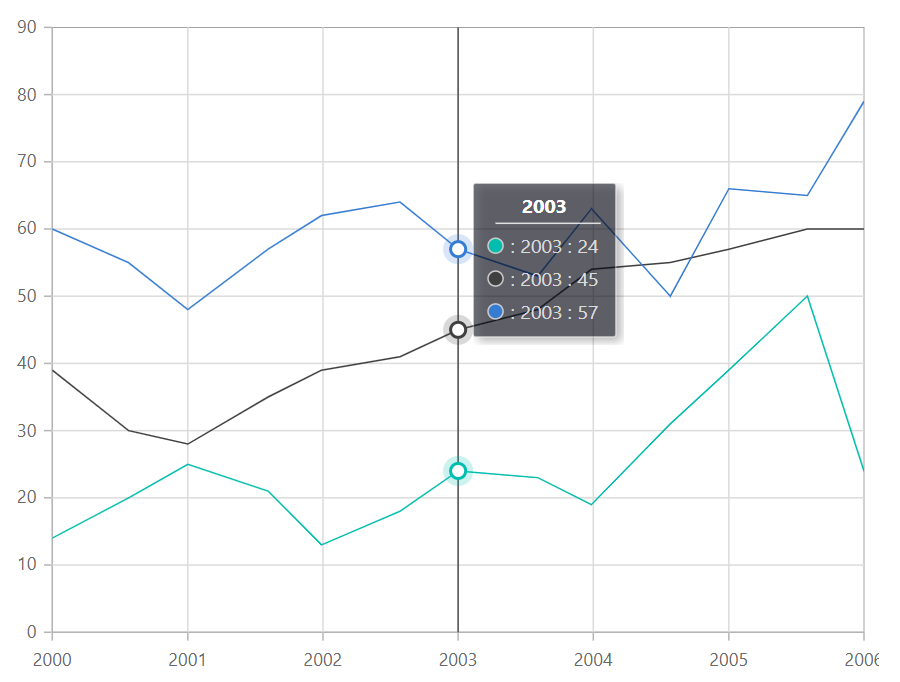

---
title: "Crosshair in Blazor Charts component | Syncfusion"

component: "Charts"

description: "Learn here all about Crosshair of Syncfusion Charts (SfCharts) component and more."
---

# Crosshair in Blazor Charts (SfCharts)

Inspect or target any data point on mouse move or touch position with the help of crosshair. A thin horizontal line and a vertical line indicate the data point with the information displayed in an interactive tooltip. Crosshair lines can be enabled by using [`Enable`](https://help.syncfusion.com/cr/blazor/Syncfusion.Blazor.Charts.ChartCrosshairSettings.html#Syncfusion_Blazor_Charts_ChartCrosshairSettings_Enable) property in the [`ChartCrosshairSettings`](https://help.syncfusion.com/cr/blazor/Syncfusion.Blazor.Charts.ChartCrosshairSettings.html).





## Tooltip for axis

The [`Enable`](https://help.syncfusion.com/cr/blazor/Syncfusion.Blazor.Charts.ChartCommonCrosshairTooltip.html#Syncfusion_Blazor_Charts_ChartCommonCrosshairTooltip_Enable) property of [`ChartAxisCrosshairTooltip`](https://help.syncfusion.com/cr/blazor/Syncfusion.Blazor.Charts.ChartAxisCrosshairTooltip.html) in the corresponding axis can be set to **true** to enable the tooltip label for that axis.





## Customization

The [`Fill`](https://help.syncfusion.com/cr/blazor/Syncfusion.Blazor.Charts.ChartCommonCrosshairTooltip.html#Syncfusion_Blazor_Charts_ChartCommonCrosshairTooltip_Fill) and [`TextStyle`](https://help.syncfusion.com/cr/blazor/Syncfusion.Blazor.Charts.ChartCommonCrosshairTooltip.html#Syncfusion_Blazor_Charts_ChartCommonCrosshairTooltip_TextStyle) property of the [`CrosshairTooltip`](https://help.syncfusion.com/cr/blazor/Syncfusion.Blazor.Charts.ChartCommonCrosshairTooltip.html) is used to customize the background color and font style of the crosshair label respectively. Color and width of the crosshair line can be customized by using the [`Line`](https://help.syncfusion.com/cr/blazor/Syncfusion.Blazor.Charts.ChartCrosshairSettings.html#Syncfusion_Blazor_Charts_ChartCrosshairSettings_Line) property in the crosshair.





## Trackball

The trackball is used to track the data point that is closest to the mouse or touch position. The closest point is indicated by a trackball marker, and the information about the point is displayed via a trackball tooltip. Trackball can be enabled by setting the [`Enable`](https://help.syncfusion.com/cr/blazor/Syncfusion.Blazor.Charts.ChartCrosshairSettings.html#Syncfusion_Blazor_Charts_ChartCrosshairSettings_Enable) property of the [`ChartCrosshairSettings`](https://help.syncfusion.com/cr/blazor/Syncfusion.Blazor.Charts.ChartCrosshairSettings.html) to **true** and [`Shared`](https://help.syncfusion.com/cr/blazor/Syncfusion.Blazor.Charts.ChartTooltipSettings.html#Syncfusion_Blazor_Charts_ChartTooltipSettings_Shared) property in [`Tooltip`](https://help.syncfusion.com/cr/blazor/Syncfusion.Blazor.Charts.ChartTooltipSettings.html) to **true** in chart.





> Refer to our [`Blazor Charts`](https://www.syncfusion.com/blazor-components/blazor-charts) feature tour page for its groundbreaking feature representations and also explore our [`Blazor Chart example`](https://blazor.syncfusion.com/demos/chart/line?theme=bootstrap4) to know various chart types and how to represent time-dependent data, showing trends at equal intervals.

## See Also

* [Data Label](./data-labels)
* [Tooltip](./tool-tip)
* [Marker](./data-markers)