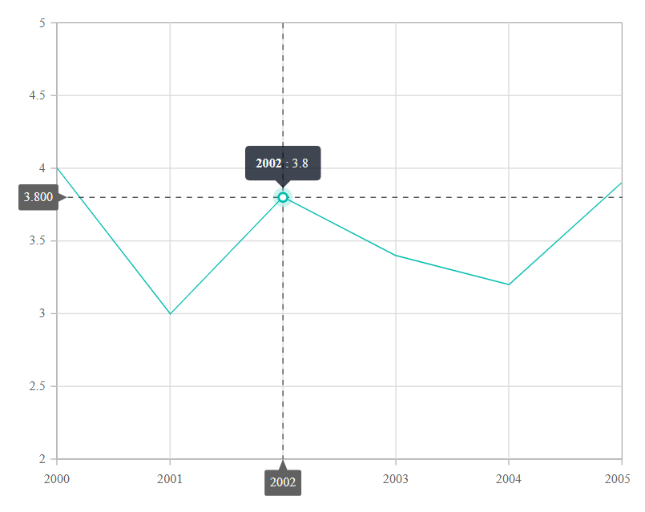

# Crosshair and Trackball in Blazor Charts Component

Inspect or target any data point on mouse move or touch with the help of crosshair. A thin horizontal line and vertical line indicate the data point with the information displayed in an interactive tooltip. The crosshair can be enabled using the [Enable](https://help.syncfusion.com/cr/blazor/Syncfusion.Blazor.Charts.ChartCrosshairSettings.html#Syncfusion_Blazor_Charts_ChartCrosshairSettings_Enable) property in the [ChartCrosshairSettings](https://help.syncfusion.com/cr/blazor/Syncfusion.Blazor.Charts.ChartCrosshairSettings.html).

```cshtml

@using Syncfusion.Blazor.Charts

<SfChart>
    <ChartPrimaryXAxis ValueType="Syncfusion.Blazor.Charts.ValueType.DateTime"></ChartPrimaryXAxis>

    <ChartCrosshairSettings Enable="true"></ChartCrosshairSettings>

    <ChartSeriesCollection>
        <ChartSeries XName="X" YName="Y" DataSource="@SalesDetails" Type="ChartSeriesType.Line">
        </ChartSeries>
    </ChartSeriesCollection>
</SfChart>

@code{
    public class ChartData
    {
        public DateTime X { get; set; }
        public double Y { get; set; }
    }
	
    public List<ChartData> SalesDetails = new List<ChartData>
	{
        new ChartData { X = new DateTime(2000, 01, 01), Y = 4  },
        new ChartData { X = new DateTime(2001, 01, 01), Y = 3.0 },
        new ChartData { X = new DateTime(2002, 01, 01), Y = 3.8 },
        new ChartData { X = new DateTime(2003, 01, 01), Y = 3.4 },
        new ChartData { X = new DateTime(2004, 01, 01), Y = 3.2 },
        new ChartData { X = new DateTime(2005, 01, 01), Y = 3.9 },
    };
}

```



## Enable Tooltip

The [Enable](https://help.syncfusion.com/cr/blazor/Syncfusion.Blazor.Charts.ChartAxisCrosshairTooltip.html#Syncfusion_Blazor_Charts_ChartAxisCrosshairTooltip_Enable) property of [ChartAxisCrosshairTooltip](https://help.syncfusion.com/cr/blazor/Syncfusion.Blazor.Charts.ChartAxisCrosshairTooltip.html) in the corresponding axis can be set to **true**, to enable the tooltip for that axis.

```cshtml

@using Syncfusion.Blazor.Charts

<SfChart>
    <ChartPrimaryXAxis ValueType="Syncfusion.Blazor.Charts.ValueType.DateTime">
        <ChartAxisCrosshairTooltip Enable="true"></ChartAxisCrosshairTooltip>
    </ChartPrimaryXAxis>

    <ChartCrosshairSettings Enable="true"></ChartCrosshairSettings>

    <ChartPrimaryYAxis>
        <ChartAxisCrosshairTooltip Enable="true"></ChartAxisCrosshairTooltip>
    </ChartPrimaryYAxis>

    <ChartSeriesCollection>
        <ChartSeries DataSource="@SalesDetails" XName="X" YName="Y" Type="ChartSeriesType.Line">
        </ChartSeries>
    </ChartSeriesCollection>
</SfChart>

@code{
    public class ChartData
    {
        public DateTime X { get; set; }
        public double Y { get; set; }
    }
	
    public List<ChartData> SalesDetails = new List<ChartData>
	{
        new ChartData { X = new DateTime(2000, 01, 01), Y = 4  },
        new ChartData { X = new DateTime(2001, 01, 01), Y = 3.0 },
        new ChartData { X = new DateTime(2002, 01, 01), Y = 3.8 },
        new ChartData { X = new DateTime(2003, 01, 01), Y = 3.4 },
        new ChartData { X = new DateTime(2004, 01, 01), Y = 3.2 },
        new ChartData { X = new DateTime(2005, 01, 01), Y = 3.9 },
    };
}

```


## Crosshair customization

The [Fill](https://help.syncfusion.com/cr/blazor/Syncfusion.Blazor.Charts.ChartAxisCrosshairTooltip.html#Syncfusion_Blazor_Charts_ChartAxisCrosshairTooltip_Fill) and [ChartCrosshairTextStyle](https://help.syncfusion.com/cr/blazor/Syncfusion.Blazor.Charts.ChartCrosshairTextStyle.html) of the [ChartAxisCrosshairTooltip](https://help.syncfusion.com/cr/blazor/Syncfusion.Blazor.Charts.ChartAxisCrosshairTooltip.html) are used to customize the background color and text style of the crosshair tooltip. The color and width of the crosshair line can be customized using the [ChartCrosshairLine](https://help.syncfusion.com/cr/blazor/Syncfusion.Blazor.Charts.ChartCrosshairLine.html) of [ChartCrosshairSettings](https://help.syncfusion.com/cr/blazor/Syncfusion.Blazor.Charts.ChartCrosshairSettings.html).

```cshtml

@using Syncfusion.Blazor.Charts

<SfChart>
    <ChartPrimaryXAxis ValueType="Syncfusion.Blazor.Charts.ValueType.DateTime">
        <ChartAxisCrosshairTooltip Enable="true" Fill="red">
            <ChartCrosshairTextStyle Size="14px" Color="white"> </ChartCrosshairTextStyle>
        </ChartAxisCrosshairTooltip>
    </ChartPrimaryXAxis>

    <ChartPrimaryYAxis>
        <ChartAxisCrosshairTooltip Enable="true" Fill="red">
            <ChartCrosshairTextStyle Size="14px" Color="white"> </ChartCrosshairTextStyle>
        </ChartAxisCrosshairTooltip>
    </ChartPrimaryYAxis>

    <ChartCrosshairSettings Enable="true">
        <ChartCrosshairLine Width="2" Color="green"></ChartCrosshairLine>
    </ChartCrosshairSettings>

    <ChartSeriesCollection>
        <ChartSeries DataSource="@SalesDetails" XName="X" YName="Y" Type="ChartSeriesType.Line">
        </ChartSeries>
    </ChartSeriesCollection>
</SfChart>

@code{
    public class ChartData
    {
        public DateTime X { get; set; }
        public double Y { get; set; }
    }
	
    public List<ChartData> SalesDetails = new List<ChartData>
	{
        new ChartData { X = new DateTime(2000, 01, 01), Y = 4  },
        new ChartData { X = new DateTime(2001, 01, 01), Y = 3.0 },
        new ChartData { X = new DateTime(2002, 01, 01), Y = 3.8 },
        new ChartData { X = new DateTime(2003, 01, 01), Y = 3.4 },
        new ChartData { X = new DateTime(2004, 01, 01), Y = 3.2 },
        new ChartData { X = new DateTime(2005, 01, 01), Y = 3.9 },
    };
}

```


## Trackball

The trackball is used to track the data point that is closest to the mouse or touch position. The closest point is indicated by a trackball marker, and the information about the point is displayed via a trackball tooltip. Trackball can be enabled by setting the [Enable](https://help.syncfusion.com/cr/blazor/Syncfusion.Blazor.Charts.ChartCrosshairSettings.html#Syncfusion_Blazor_Charts_ChartCrosshairSettings_Enable) property of the [ChartCrosshairSettings](https://help.syncfusion.com/cr/blazor/Syncfusion.Blazor.Charts.ChartCrosshairSettings.html) to **true** and [Shared](https://help.syncfusion.com/cr/blazor/Syncfusion.Blazor.Charts.ChartTooltipSettings.html#Syncfusion_Blazor_Charts_ChartTooltipSettings_Shared) property in [Tooltip](https://help.syncfusion.com/cr/blazor/Syncfusion.Blazor.Charts.ChartTooltipSettings.html) to **true** in the chart.

```cshtml

@using Syncfusion.Blazor.Charts

<SfChart>
    <ChartPrimaryXAxis ValueType="Syncfusion.Blazor.Charts.ValueType.DateTime">
    </ChartPrimaryXAxis>

    <ChartCrosshairSettings Enable="true" LineType="LineType.Vertical"></ChartCrosshairSettings>

    <ChartTooltipSettings Enable="true" Shared="true" Format="${series.name} : ${point.x} : ${point.y}"></ChartTooltipSettings>

    <ChartSeriesCollection>
        <ChartSeries DataSource="@SalesDetails" XName="XValue" YName="YValue" Type="ChartSeriesType.Line">
        </ChartSeries>
        <ChartSeries DataSource="@SalesDetails" XName="XValue" YName="YValue1" Type="ChartSeriesType.Line">
        </ChartSeries>
        <ChartSeries DataSource="@SalesDetails" XName="XValue" YName="YValue2" Type="ChartSeriesType.Line">
        </ChartSeries>
    </ChartSeriesCollection>
</SfChart>

@code{
    public class ChartData
    {
        public DateTime XValue { get; set; }
        public double YValue { get; set; }
        public double YValue1 { get; set; }
        public double YValue2 { get; set; }
    }
	
    public List<ChartData> SalesDetails = new List<ChartData>
	{
        new ChartData { XValue = new DateTime(2000, 2, 11), YValue = 14, YValue1 = 39, YValue2 = 60 },
        new ChartData { XValue = new DateTime(2000, 9, 4), YValue = 20, YValue1 = 30, YValue2 = 55 },
        new ChartData { XValue = new DateTime(2001, 2, 11), YValue = 25, YValue1 = 28, YValue2 = 48 },
        new ChartData { XValue = new DateTime(2001, 9, 16), YValue = 21, YValue1 = 35, YValue2 = 57 },
        new ChartData { XValue = new DateTime(2002, 2, 7), YValue = 13, YValue1 = 39, YValue2 = 62 },
        new ChartData { XValue = new DateTime(2002, 9, 7), YValue = 18, YValue1 = 41, YValue2 = 64 },
        new ChartData { XValue = new DateTime(2003, 2, 11), YValue = 24, YValue1 = 45, YValue2 = 57 },
        new ChartData { XValue = new DateTime(2003, 9, 14), YValue = 23, YValue1 = 48, YValue2 = 53 },
        new ChartData { XValue = new DateTime(2004, 2, 6), YValue = 19, YValue1 = 54, YValue2 = 63 },
        new ChartData { XValue = new DateTime(2004, 9, 6), YValue = 31, YValue1 = 55, YValue2 = 50 },
        new ChartData { XValue = new DateTime(2005, 2, 11), YValue = 39, YValue1 = 57, YValue2 = 66 },
        new ChartData { XValue = new DateTime(2005, 9, 11), YValue = 50, YValue1 = 60, YValue2 = 65 },
        new ChartData { XValue = new DateTime(2006, 2, 11), YValue = 24, YValue1 = 60, YValue2 = 79 },
    };
}

```


N> Refer to our [Blazor Charts](https://www.syncfusion.com/blazor-components/blazor-charts) feature tour page for its groundbreaking feature representations and also explore our [Blazor Chart Example](https://blazor.syncfusion.com/demos/chart/line?theme=bootstrap5) to know various chart types and how to represent time-dependent data, showing trends at equal intervals.

## See also

* [Data Label](./data-labels)
* [Tooltip](./tool-tip)
* [Marker](./data-markers)