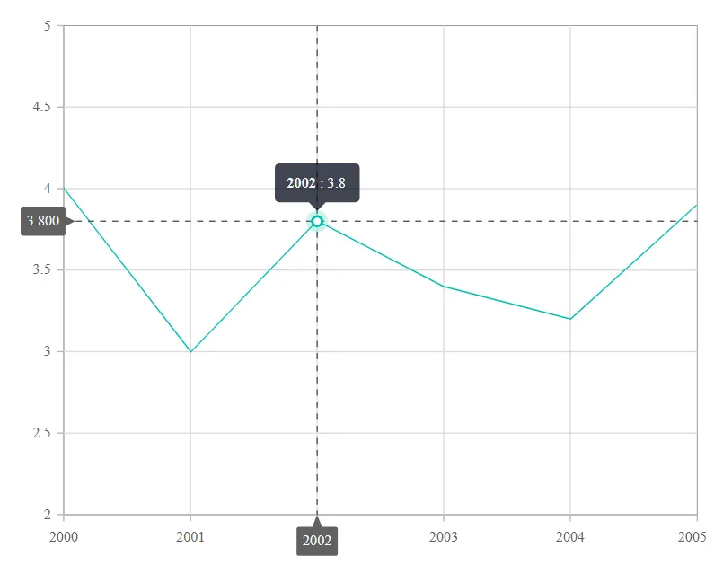
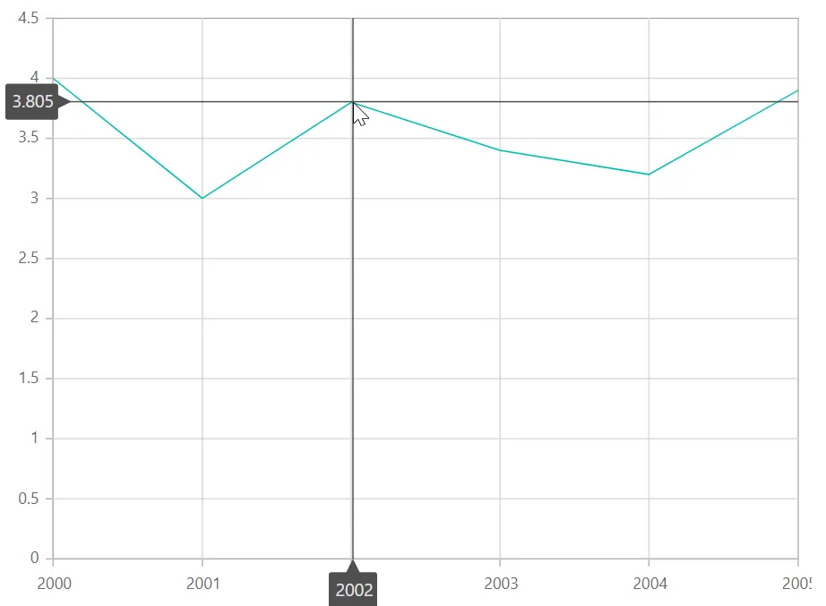
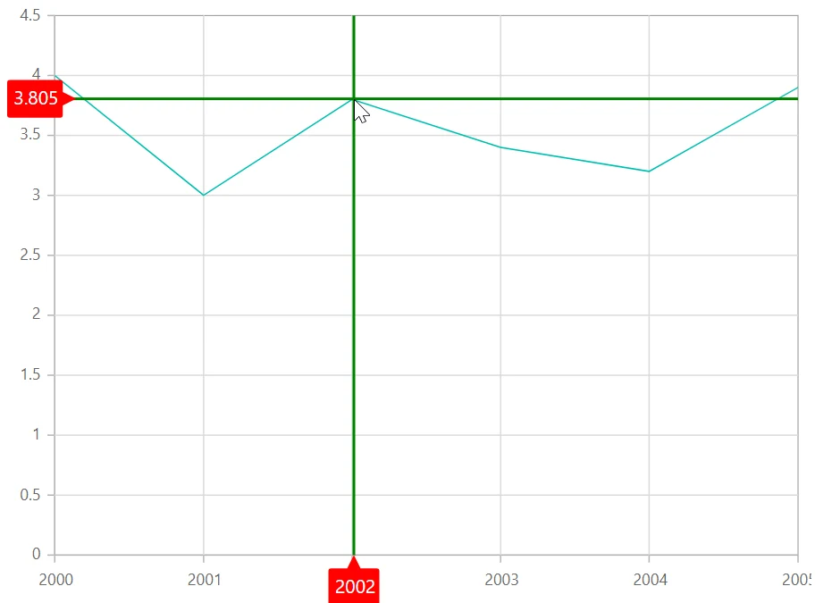
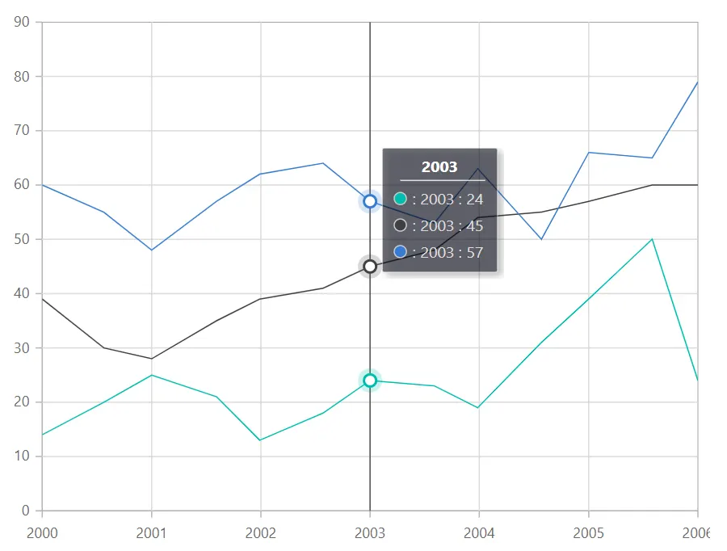

# Blazor Charts Crosshair and Trackball

Inspect or target any data point on mouse move or touch with the help of a crosshair. A thin horizontal line and vertical line indicate the data point with the information displayed in an interactive tooltip. The crosshair can be enabled using the [Enable](https://help.syncfusion.com/cr/blazor/Syncfusion.Blazor.Charts.ChartCrosshairSettings.html#Syncfusion_Blazor_Charts_ChartCrosshairSettings_Enable) property in the [ChartCrosshairSettings](https://help.syncfusion.com/cr/blazor/Syncfusion.Blazor.Charts.ChartCrosshairSettings.html).

A detailed walkthrough demonstrating how to enable and customize the crosshair and trackball in [Blazor Charts](https://www.syncfusion.com/blazor-components/blazor-charts) is presented in the video below.



## SnapToData

Enabling the [SnapToData](https://help.syncfusion.com/cr/blazor/Syncfusion.Blazor.Charts.ChartCrosshairSettings.html#Syncfusion_Blazor_Charts_ChartCrosshairSettings_SnapToData) property on the [ChartCrosshairSettings](https://help.syncfusion.com/cr/blazor/Syncfusion.Blazor.Charts.ChartCrosshairSettings.html) aligns the crosshair with the nearest data point instead of following the exact mouse position. The optional [DashArray](https://help.syncfusion.com/cr/blazor/Syncfusion.Blazor.Charts.ChartCrosshairSettings.html#Syncfusion_Blazor_Charts_ChartCrosshairSettings_DashArray) property accepts a comma-separated pattern (for example, `"5,5"` for a 5-pixel dash followed by a 5-pixel gap) to render the crosshair lines as a dashed stroke.

```cshtml

@using Syncfusion.Blazor.Charts

<SfChart>
    <ChartPrimaryXAxis ValueType="Syncfusion.Blazor.Charts.ValueType.DateTime">
        <ChartAxisCrosshairTooltip Enable="true"></ChartAxisCrosshairTooltip>
    </ChartPrimaryXAxis>
    <ChartPrimaryYAxis Minimum="2" Maximum="5">
        <ChartAxisCrosshairTooltip Enable="true"></ChartAxisCrosshairTooltip>
    </ChartPrimaryYAxis>
    <ChartCrosshairSettings Enable="true" SnapToData="true" DashArray="5,5"></ChartCrosshairSettings>
    <ChartTooltipSettings Enable="true" Shared="true" Format="<b>${point.x}</b> : ${point.y}" Header="" EnableMarker="false"></ChartTooltipSettings>
    <ChartSeriesCollection>
        <ChartSeries XName="X" YName="Y" DataSource="@SalesDetails" Type="ChartSeriesType.Line">
        </ChartSeries>
    </ChartSeriesCollection>
</SfChart>

@code {
    public class SalesData
    {
        public DateTime X { get; set; }
        public double Y { get; set; }
    }

    public List<SalesData> SalesDetails = new List<SalesData>
    {
        new SalesData { X = new DateTime(2000, 01, 01), Y = 4 },
        new SalesData { X = new DateTime(2001, 01, 01), Y = 3.0 },
        new SalesData { X = new DateTime(2002, 01, 01), Y = 3.8 },
        new SalesData { X = new DateTime(2003, 01, 01), Y = 3.4 },
        new SalesData { X = new DateTime(2004, 01, 01), Y = 3.2 },
        new SalesData { X = new DateTime(2005, 01, 01), Y = 3.9 },
    };
}

```



## Crosshair Axis Tooltip

The [Enable](https://help.syncfusion.com/cr/blazor/Syncfusion.Blazor.Charts.ChartAxisCrosshairTooltip.html#Syncfusion_Blazor_Charts_ChartAxisCrosshairTooltip_Enable) property of [ChartAxisCrosshairTooltip](https://help.syncfusion.com/cr/blazor/Syncfusion.Blazor.Charts.ChartAxisCrosshairTooltip.html) on the corresponding axis can be set to **true** to display the axis value of the data point under the crosshair.

```cshtml

@using Syncfusion.Blazor.Charts

<SfChart>
    <ChartPrimaryXAxis ValueType="Syncfusion.Blazor.Charts.ValueType.DateTime">
        <ChartAxisCrosshairTooltip Enable="true"></ChartAxisCrosshairTooltip>
    </ChartPrimaryXAxis>

    <ChartCrosshairSettings Enable="true"></ChartCrosshairSettings>

    <ChartPrimaryYAxis>
        <ChartAxisCrosshairTooltip Enable="true"></ChartAxisCrosshairTooltip>
    </ChartPrimaryYAxis>

    <ChartSeriesCollection>
        <ChartSeries DataSource="@TooltipSalesDetails" XName="X" YName="Y" Type="ChartSeriesType.Line">
        </ChartSeries>
    </ChartSeriesCollection>
</SfChart>

@code {
    public class TooltipSalesData
    {
        public DateTime X { get; set; }
        public double Y { get; set; }
    }

    public List<TooltipSalesData> TooltipSalesDetails = new List<TooltipSalesData>
    {
        new TooltipSalesData { X = new DateTime(2000, 01, 01), Y = 4 },
        new TooltipSalesData { X = new DateTime(2001, 01, 01), Y = 3.0 },
        new TooltipSalesData { X = new DateTime(2002, 01, 01), Y = 3.8 },
        new TooltipSalesData { X = new DateTime(2003, 01, 01), Y = 3.4 },
        new TooltipSalesData { X = new DateTime(2004, 01, 01), Y = 3.2 },
        new TooltipSalesData { X = new DateTime(2005, 01, 01), Y = 3.9 },
    };
}

```



## Crosshair Customization

The [Fill](https://help.syncfusion.com/cr/blazor/Syncfusion.Blazor.Charts.ChartAxisCrosshairTooltip.html#Syncfusion_Blazor_Charts_ChartAxisCrosshairTooltip_Fill) and [ChartCrosshairTextStyle](https://help.syncfusion.com/cr/blazor/Syncfusion.Blazor.Charts.ChartCrosshairTextStyle.html) of the [ChartAxisCrosshairTooltip](https://help.syncfusion.com/cr/blazor/Syncfusion.Blazor.Charts.ChartAxisCrosshairTooltip.html) customize the background color and text style of the crosshair tooltip. The [Fill](https://help.syncfusion.com/cr/blazor/Syncfusion.Blazor.Charts.ChartAxisCrosshairTooltip.html#Syncfusion_Blazor_Charts_ChartAxisCrosshairTooltip_Fill) property accepts CSS color values such as named colors, hex strings, or `rgba()` functions.

The color and width of the crosshair line can be customized using the [ChartCrosshairLine](https://help.syncfusion.com/cr/blazor/Syncfusion.Blazor.Charts.ChartCrosshairLine.html) of [ChartCrosshairSettings](https://help.syncfusion.com/cr/blazor/Syncfusion.Blazor.Charts.ChartCrosshairSettings.html).

```cshtml

@using Syncfusion.Blazor.Charts

<SfChart>
    <ChartPrimaryXAxis ValueType="Syncfusion.Blazor.Charts.ValueType.DateTime">
        <ChartAxisCrosshairTooltip Enable="true" Fill="red">
            <ChartCrosshairTextStyle Size="14px" Color="white"> </ChartCrosshairTextStyle>
        </ChartAxisCrosshairTooltip>
    </ChartPrimaryXAxis>

    <ChartPrimaryYAxis>
        <ChartAxisCrosshairTooltip Enable="true" Fill="red">
            <ChartCrosshairTextStyle Size="14px" Color="white"> </ChartCrosshairTextStyle>
        </ChartAxisCrosshairTooltip>
    </ChartPrimaryYAxis>

    <ChartCrosshairSettings Enable="true">
        <ChartCrosshairLine Width="2" Color="green"></ChartCrosshairLine>
    </ChartCrosshairSettings>

    <ChartSeriesCollection>
        <ChartSeries DataSource="@CustomSalesDetails" XName="X" YName="Y" Type="ChartSeriesType.Line">
        </ChartSeries>
    </ChartSeriesCollection>
</SfChart>

@code {
    public class CustomSalesData
    {
        public DateTime X { get; set; }
        public double Y { get; set; }
    }

    public List<CustomSalesData> CustomSalesDetails = new List<CustomSalesData>
    {
        new CustomSalesData { X = new DateTime(2000, 01, 01), Y = 4 },
        new CustomSalesData { X = new DateTime(2001, 01, 01), Y = 3.0 },
        new CustomSalesData { X = new DateTime(2002, 01, 01), Y = 3.8 },
        new CustomSalesData { X = new DateTime(2003, 01, 01), Y = 3.4 },
        new CustomSalesData { X = new DateTime(2004, 01, 01), Y = 3.2 },
        new CustomSalesData { X = new DateTime(2005, 01, 01), Y = 3.9 },
    };
}

```



## Trackball

The trackball highlights the data point closest to the mouse or touch position. The closest point is indicated by a trackball marker, and the information about the point is displayed via a trackball tooltip. To enable the trackball, configure the following on [ChartCrosshairSettings](https://help.syncfusion.com/cr/blazor/Syncfusion.Blazor.Charts.ChartCrosshairSettings.html) and [ChartTooltipSettings](https://help.syncfusion.com/cr/blazor/Syncfusion.Blazor.Charts.ChartTooltipSettings.html):

- Set [Enable](https://help.syncfusion.com/cr/blazor/Syncfusion.Blazor.Charts.ChartCrosshairSettings.html#Syncfusion_Blazor_Charts_ChartCrosshairSettings_Enable) to **true**.
- Set [LineType](https://help.syncfusion.com/cr/blazor/Syncfusion.Blazor.Charts.ChartCrosshairSettings.html#Syncfusion_Blazor_Charts_ChartCrosshairSettings_LineType) to `LineType.Vertical` for a single vertical guide, `LineType.Horizontal` for a horizontal guide, or `LineType.Both` for a full cross.
- Set [Shared](https://help.syncfusion.com/cr/blazor/Syncfusion.Blazor.Charts.ChartTooltipSettings.html#Syncfusion_Blazor_Charts_ChartTooltipSettings_Shared) to **true** so the tooltip aggregates all series at the hovered x-value.
- Set [EnableMarker](https://help.syncfusion.com/cr/blazor/Syncfusion.Blazor.Charts.ChartTooltipSettings.html#Syncfusion_Blazor_Charts_ChartTooltipSettings_EnableMarker) to **true** (default) so the closest point is marked.

```cshtml

@using Syncfusion.Blazor.Charts

<SfChart>
    <ChartPrimaryXAxis ValueType="Syncfusion.Blazor.Charts.ValueType.DateTime">
    </ChartPrimaryXAxis>

    <ChartCrosshairSettings Enable="true" LineType="LineType.Vertical"></ChartCrosshairSettings>

    <ChartTooltipSettings Enable="true" Shared="true" Format="${series.name} : ${point.x} : ${point.y}"></ChartTooltipSettings>

    <ChartSeriesCollection>
        <ChartSeries DataSource="@TrackballDetails" XName="XValue" YName="YValue" Name="Product A" Type="ChartSeriesType.Line">
        </ChartSeries>
        <ChartSeries DataSource="@TrackballDetails" XName="XValue" YName="YValue1" Name="Product B" Type="ChartSeriesType.Line">
        </ChartSeries>
        <ChartSeries DataSource="@TrackballDetails" XName="XValue" YName="YValue2" Name="Product C" Type="ChartSeriesType.Line">
        </ChartSeries>
    </ChartSeriesCollection>
</SfChart>

@code {
    public class TrackballData
    {
        public DateTime XValue { get; set; }
        public double YValue { get; set; }
        public double YValue1 { get; set; }
        public double YValue2 { get; set; }
    }

    public List<TrackballData> TrackballDetails = new List<TrackballData>
    {
        new TrackballData { XValue = new DateTime(2000, 2, 11), YValue = 14, YValue1 = 39, YValue2 = 60 },
        new TrackballData { XValue = new DateTime(2000, 9, 4), YValue = 20, YValue1 = 30, YValue2 = 55 },
        new TrackballData { XValue = new DateTime(2001, 2, 11), YValue = 25, YValue1 = 28, YValue2 = 48 },
        new TrackballData { XValue = new DateTime(2001, 9, 16), YValue = 21, YValue1 = 35, YValue2 = 57 },
        new TrackballData { XValue = new DateTime(2002, 2, 7), YValue = 13, YValue1 = 39, YValue2 = 62 },
        new TrackballData { XValue = new DateTime(2002, 9, 7), YValue = 18, YValue1 = 41, YValue2 = 64 },
        new TrackballData { XValue = new DateTime(2003, 2, 11), YValue = 24, YValue1 = 45, YValue2 = 57 },
        new TrackballData { XValue = new DateTime(2003, 9, 14), YValue = 23, YValue1 = 48, YValue2 = 53 },
        new TrackballData { XValue = new DateTime(2004, 2, 6), YValue = 19, YValue1 = 54, YValue2 = 63 },
        new TrackballData { XValue = new DateTime(2004, 9, 6), YValue = 31, YValue1 = 55, YValue2 = 50 },
        new TrackballData { XValue = new DateTime(2005, 2, 11), YValue = 39, YValue1 = 57, YValue2 = 66 },
        new TrackballData { XValue = new DateTime(2005, 9, 11), YValue = 50, YValue1 = 60, YValue2 = 65 },
        new TrackballData { XValue = new DateTime(2006, 2, 11), YValue = 24, YValue1 = 60, YValue2 = 79 },
    };
}

```



## Highlighting Data Range with Crosshair

The [HighlightCategory](https://help.syncfusion.com/cr/blazor/Syncfusion.Blazor.Charts.ChartCrosshairSettings.html#Syncfusion_Blazor_Charts_ChartCrosshairSettings_HighlightCategory) property on [ChartCrosshairSettings](https://help.syncfusion.com/cr/blazor/Syncfusion.Blazor.Charts.ChartCrosshairSettings.html) highlights the entire vertical band of the hovered category, making trend comparisons across multiple series clearer. `HighlightCategory` requires [LineType](https://help.syncfusion.com/cr/blazor/Syncfusion.Blazor.Charts.ChartCrosshairSettings.html#Syncfusion_Blazor_Charts_ChartCrosshairSettings_LineType) to be set to `LineType.Vertical` or `LineType.Both`; the highlight is not rendered when the line type is `Horizontal`. This example uses a category axis to demonstrate the highlight band across discrete year labels.

```cshtml

@using Syncfusion.Blazor.Charts

<SfChart Title="Unemployment Rates 1975-2010">
    <ChartPrimaryXAxis ValueType="Syncfusion.Blazor.Charts.ValueType.Category">
        <ChartAxisMajorGridLines Width="0"></ChartAxisMajorGridLines>
        <ChartAxisMajorTickLines Width="0"></ChartAxisMajorTickLines>
    </ChartPrimaryXAxis>
    <ChartPrimaryYAxis>
        <ChartAxisLineStyle Width="0"></ChartAxisLineStyle>
        <ChartAxisMajorTickLines Width="0"></ChartAxisMajorTickLines>
    </ChartPrimaryYAxis>
    <ChartCrosshairSettings Enable="true" LineType="LineType.Vertical" HighlightCategory="true"></ChartCrosshairSettings>
    <ChartTooltipSettings Enable="true" Shared="true" Format="${series.name} : ${point.x} : ${point.y}"></ChartTooltipSettings>
    <ChartSeriesCollection>
        <ChartSeries DataSource="StepChartValues" Type="Syncfusion.Blazor.Charts.ChartSeriesType.Line" XName="Year" YName="Y" Name="China">
            <ChartMarker Visible="true" Width="10" Height="10">
            </ChartMarker>
        </ChartSeries>
        <ChartSeries DataSource="StepChartValues" Type="Syncfusion.Blazor.Charts.ChartSeriesType.Line" XName="Year" YName="Y1" Name="Australia">
            <ChartMarker Visible="true" Width="10" Height="10">
            </ChartMarker>
        </ChartSeries>
        <ChartSeries DataSource="StepChartValues" Type="Syncfusion.Blazor.Charts.ChartSeriesType.Line" XName="Year" YName="Y2" Name="Japan">
            <ChartMarker Visible="true" Width="10" Height="10">
            </ChartMarker>
        </ChartSeries>
    </ChartSeriesCollection>
</SfChart>

@code {
    public List<StepChartData> StepChartValues = new List<StepChartData>
    {
        new StepChartData { Year = "1975", Y = 16, Y1 = 10, Y2 = 4.5 },
        new StepChartData { Year = "1980", Y = 12.5, Y1 = 7.5, Y2 = 5 },
        new StepChartData { Year = "1985", Y = 19, Y1 = 11, Y2 = 6.5 },
        new StepChartData { Year = "1990", Y = 14.4, Y1 = 7, Y2 = 4.4 },
        new StepChartData { Year = "1995", Y = 11.5, Y1 = 8, Y2 = 5 },
        new StepChartData { Year = "2000", Y = 14, Y1 = 6, Y2 = 1.5 },
        new StepChartData { Year = "2005", Y = 10, Y1 = 3.5, Y2 = 2.5 },
        new StepChartData { Year = "2010", Y = 16, Y1 = 7, Y2 = 3.7 }
    };

    public class StepChartData
    {
        public string Year { get; set; }
        public double Y { get; set; }
        public double Y1 { get; set; }
        public double Y2 { get; set; }
    }
}

```



## See also

* [Data Label](./data-labels)
* [Tooltip](./tool-tip)
* [Marker](./data-markers)
* [Chart Series](./chart-series)

