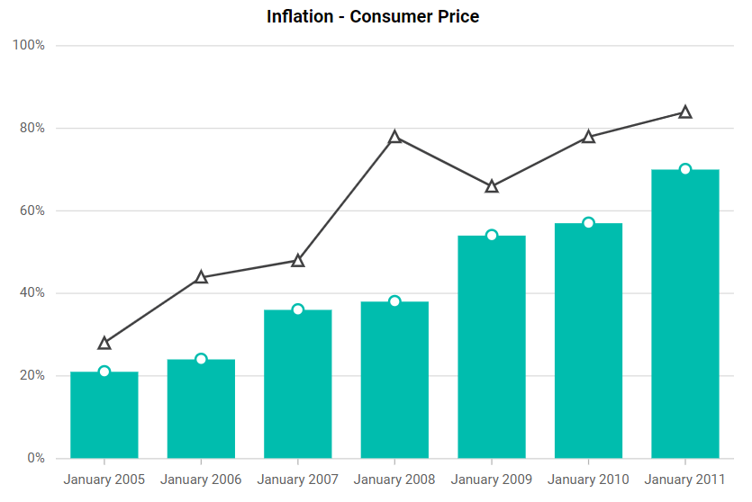

# Data Editing in Blazor Charts Component

Data editing allows the rendered points to be dragged and dropped at run-time. End user can adjust the points position or value based on its y-value. To enable data editing, set the [Enable](https://help.syncfusion.com/cr/blazor/Syncfusion.Blazor.Charts.ChartDataEditSettings.html#Syncfusion_Blazor_Charts_ChartDataEditSettings_Enable) property in the [ChartDataEditSettings](https://help.syncfusion.com/cr/blazor/Syncfusion.Blazor.Charts.ChartSeries.html#Syncfusion_Blazor_Charts_ChartSeries_ChartDataEditSettings) to **true**. One can also use the [Fill](https://help.syncfusion.com/cr/blazor/Syncfusion.Blazor.Charts.ChartDataEditSettings.html#Syncfusion_Blazor_Charts_ChartDataEditSettings_Fill) property to specify the color, and the [MinY](https://help.syncfusion.com/cr/blazor/Syncfusion.Blazor.Charts.ChartDataEditSettings.html#Syncfusion_Blazor_Charts_ChartDataEditSettings_MinY) and [MaxY](https://help.syncfusion.com/cr/blazor/Syncfusion.Blazor.Charts.ChartDataEditSettings.html#Syncfusion_Blazor_Charts_ChartDataEditSettings_MaxY) properties to determine data editing's minimum and maximum range.

```cshtml

@using Syncfusion.Blazor.Charts

<SfChart Title="Inflation - Consumer Price">
    <ChartArea><ChartAreaBorder Width="0"></ChartAreaBorder></ChartArea>

    <ChartPrimaryXAxis ValueType="Syncfusion.Blazor.Charts.ValueType.DateTime" LabelFormat="y"
                       IntervalType="IntervalType.Years" EdgeLabelPlacement="EdgeLabelPlacement.Shift">
        <ChartAxisMajorGridLines Width="0"></ChartAxisMajorGridLines>
    </ChartPrimaryXAxis>

    <ChartPrimaryYAxis LabelFormat="{value}%" RangePadding="ChartRangePadding.None" Minimum="0" Maximum="100"
                       Interval="20">
        <ChartAxisLineStyle Width="0"></ChartAxisLineStyle>
        <ChartAxisMajorTickLines Width="0"></ChartAxisMajorTickLines>
    </ChartPrimaryYAxis>

    <ChartTooltipSettings Enable="true"></ChartTooltipSettings>

    <ChartSeriesCollection>
        <ChartSeries DataSource="@ConsumerDetails" XName="XValue" Width="2"
                     Opacity="1" YName="YValue" Type="ChartSeriesType.Column">
            <ChartMarker Visible="true" Width="10" Height="10">
            </ChartMarker>
            <ChartDataEditSettings Enable="true"></ChartDataEditSettings>
        </ChartSeries>
        <ChartSeries DataSource="@ConsumerDetails" XName="XValue" Width="2"
                     Opacity="1" YName="YValue1" Type="ChartSeriesType.Line">
            <ChartMarker Visible="true" Width="10" Height="10">
            </ChartMarker>
            <ChartDataEditSettings Enable="true"></ChartDataEditSettings>
        </ChartSeries>
    </ChartSeriesCollection>
</SfChart>

@code{
    public class ChartData
    {
        public DateTime XValue { get; set; }
        public double YValue { get; set; }
        public double YValue1 { get; set; }
    }
	
    public List<ChartData> ConsumerDetails = new List<ChartData>
	{
        new ChartData { XValue = new DateTime(2005, 01, 01), YValue = 21, YValue1 = 28 },
        new ChartData { XValue = new DateTime(2006, 01, 01), YValue = 24, YValue1 = 44 },
        new ChartData { XValue = new DateTime(2007, 01, 01), YValue = 36, YValue1 = 48 },
        new ChartData { XValue = new DateTime(2008, 01, 01), YValue = 38, YValue1 = 50 },
        new ChartData { XValue = new DateTime(2009, 01, 01), YValue = 54, YValue1 = 66 },
        new ChartData { XValue = new DateTime(2010, 01, 01), YValue = 57, YValue1 = 78 },
        new ChartData { XValue = new DateTime(2011, 01, 01), YValue = 70, YValue1 = 84 },
    };
}

```



N> Refer to our [Blazor Charts](https://www.syncfusion.com/blazor-components/blazor-charts) feature tour page for its groundbreaking feature representations and also explore our [Blazor Chart Example](https://blazor.syncfusion.com/demos/chart/line?theme=bootstrap5) to know various chart types and how to represent time-dependent data, showing trends at equal intervals.

## See Also

* [Tooltip](./tool-tip)
* [Legend](./legend)
* [Marker](./data-markers)