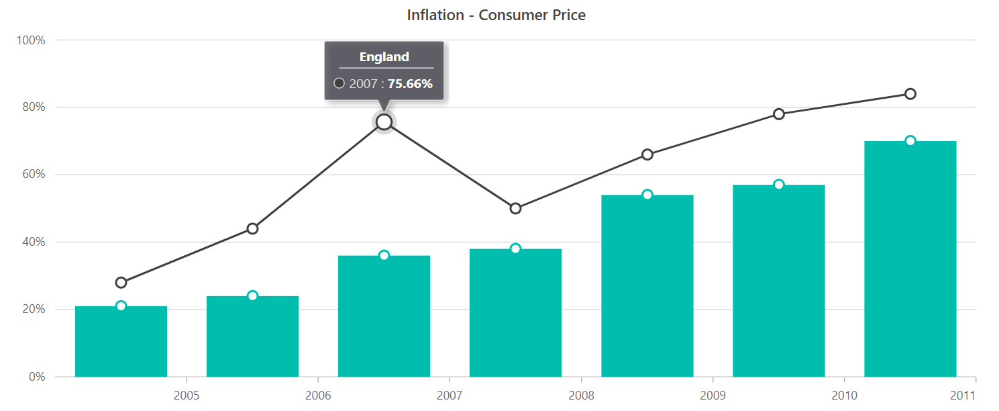

# Data Editing in Blazor Charts (SfCharts)

## Enable Data Editing

Data editing allows the rendered points to be dragged and dropped. We can now adjust the point's position or value based on its **y** value. Set the [`Enable`](https://help.syncfusion.com/cr/blazor/Syncfusion.Blazor.Charts.ChartDataEditSettings.html#Syncfusion_Blazor_Charts_ChartDataEditSettings_Enable) property of the series' [`ChartDataEditSettings`](https://help.syncfusion.com/cr/blazor/Syncfusion.Blazor.Charts.ChartSeries.html#Syncfusion_Blazor_Charts_ChartSeries_ChartDataEditSettings) to **true** to enable data editing. We can also use the [`Fill`](https://help.syncfusion.com/cr/blazor/Syncfusion.Blazor.Charts.ChartDataEditSettings.html#Syncfusion_Blazor_Charts_ChartDataEditSettings_Fill) property to specify the colour, and the [`MinY`](https://help.syncfusion.com/cr/blazor/Syncfusion.Blazor.Charts.ChartDataEditSettings.html#Syncfusion_Blazor_Charts_ChartDataEditSettings_MinY) and [`MaxY`](https://help.syncfusion.com/cr/blazor/Syncfusion.Blazor.Charts.ChartDataEditSettings.html#Syncfusion_Blazor_Charts_ChartDataEditSettings_MaxY) properties to determine the data editing minimum and maximum range.





> Refer to our [`Blazor Charts`](https://www.syncfusion.com/blazor-components/blazor-charts) feature tour page for its groundbreaking feature representations and also explore our [`Blazor Chart example`](https://blazor.syncfusion.com/demos/chart/line?theme=bootstrap4) to know various chart types and how to represent time-dependent data, showing trends at equal intervals.

## See Also

* [Tooltip](./tool-tip)
* [Legend](./legend)
* [Marker](./data-markers)