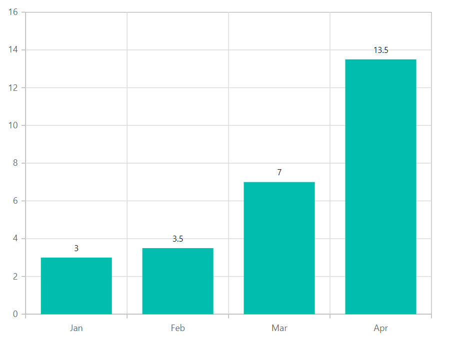
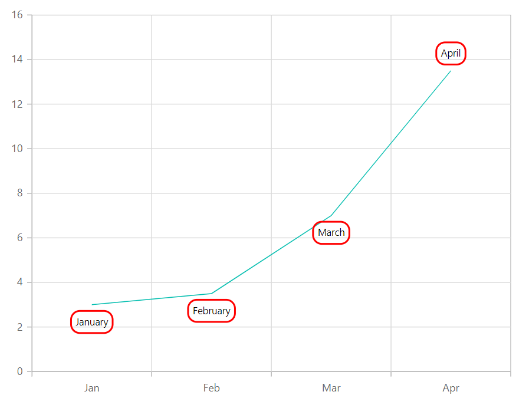

# Data Labels in Blazor Charts Component

Data label can be added to a chart series by enabling the [`Visible`](https://help.syncfusion.com/cr/blazor/Syncfusion.Blazor.Charts.ChartDataLabel.html#Syncfusion_Blazor_Charts_ChartDataLabel_Visible) option in the data label. By default, the labels will arrange smartly without overlapping.

```csharp

@using Syncfusion.Blazor.Charts

<SfChart>
    <ChartPrimaryXAxis ValueType="Syncfusion.Blazor.Charts.ValueType.Category"/>

    <ChartSeriesCollection>
        <ChartSeries DataSource="@WeatherReports" XName="X" YName="Y" Type="ChartSeriesType.Column">
            <ChartMarker>
                <ChartDataLabel Visible="true"/>
            </ChartMarker>
        </ChartSeries>
    </ChartSeriesCollection>
</SfChart>

@code{
    public class Data
    {
        public string X { get; set; }
        public double Y { get; set; }
    }
    public List<Data> WeatherReports = new List<Data>
{
        new Data{ X= "Jan", Y= 3 },
        new Data{ X= "Feb", Y= 3.5 },
        new Data{ X= "Mar", Y= 7 },
        new Data{ X= "Apr", Y= 13.5 }
    };
}

```



## Position

Using [`Position`](https://help.syncfusion.com/cr/blazor/Syncfusion.Blazor.Charts.ChartDataLabel.html#Syncfusion_Blazor_Charts_ChartDataLabel_Position) property, you can place the label either on `Top`, `Middle`, `Bottom` or `Outer`.

```csharp

@using Syncfusion.Blazor.Charts

<SfChart>
    <ChartPrimaryXAxis ValueType="Syncfusion.Blazor.Charts.ValueType.Category"/>
    <ChartSeriesCollection>
        <ChartSeries DataSource="@WeatherReports" XName="X" YName="Y" Type="ChartSeriesType.Column">
            <ChartMarker>
                <ChartDataLabel Visible="true" Position="Position="Syncfusion.Blazor.Charts.LabelPosition.Middle"/>
            </ChartMarker>
        </ChartSeries>
    </ChartSeriesCollection>
</SfChart>

@code{
    public class Data
    {
        public string X { get; set; }
        public double Y { get; set; }
    }
    public List<Data> WeatherReports = new List<Data>
    {
        new Data{ X= "Jan", Y= 3 },
        new Data{ X= "Feb", Y= 3.5 },
        new Data{ X= "Mar", Y= 7 },
        new Data{ X= "Apr", Y= 13.5 }
    };
}

```


>Note: The position `Outer` is applicable for column and bar type series.

## Data label template

Label content can be formatted by using the [`Template`](https://help.syncfusion.com/cr/blazor/Syncfusion.Blazor.Charts.ChartDataLabel.html#Syncfusion_Blazor_Charts_ChartDataLabel_Template) option. Inside the template, you can add the placeholder text `${point.x}` and `${point.y}` to display corresponding data point value.

## Text Mapping

Text from the data source can be mapped to data label using [`Name`](https://help.syncfusion.com/cr/blazor/Syncfusion.Blazor.Charts.ChartDataLabel.html#Syncfusion_Blazor_Charts_ChartDataLabel_Name) property.

```csharp

@using Syncfusion.Blazor.Charts

<SfChart>
    <ChartPrimaryXAxis ValueType="Syncfusion.Blazor.Charts.ValueType.Category"></ChartPrimaryXAxis>

    <ChartSeriesCollection>
        <ChartSeries DataSource="@WeatherReports" XName="X" YName="Y" Type="ChartSeriesType.Column">
            <ChartMarker>
                <ChartDataLabel Visible="true" Name="Text"></ChartDataLabel>
            </ChartMarker>
        </ChartSeries>
    </ChartSeriesCollection>
</SfChart>

@code{
    public class Data
    {
        public string X { get; set; }
        public double Y { get; set; }
        public string Text { get; set; }
    }

    public List<Data> WeatherReports = new List<Data> {
           new Data{ X= "Jan", Y= 3, Text= "January" },
           new Data{ X= "Feb", Y= 3.5, Text= "February" },
           new Data{ X= "Mar", Y= 7, Text= "March" },
           new Data{ X= "Apr", Y= 13.5, Text= "April" }
        };
}


```


## Margin

[`Margin`](https://help.syncfusion.com/cr/blazor/Syncfusion.Blazor.Charts.ChartDataLabel.html#Syncfusion_Blazor_Charts_ChartDataLabel_Margin) can be applied to the data label to create space around the element.

```csharp

@using Syncfusion.Blazor.Charts

<SfChart>
    <ChartPrimaryXAxis ValueType="Syncfusion.Blazor.Charts.ValueType.Category"/>

    <ChartSeriesCollection>
        <ChartSeries DataSource="@WeatherReports" XName="X" YName="Y" Type="ChartSeriesType.Column">
            <ChartMarker>
                <ChartDataLabel Visible="true" Name="Text">
                    <ChartDataLabelBorder Width="2" Color="red"/>
                    <ChartDataLabelMargin Left="15" Right="15" Top="15" Bottom="15"/>
                </ChartDataLabel>
            </ChartMarker>
        </ChartSeries>
    </ChartSeriesCollection>
</SfChart>

@code{
    public class Data
    {
        public string X { get; set; }
        public double Y { get; set; }
        public string Text { get; set; }
    }

    public List<Data> WeatherReports = new List<Data> {
           new Data{ X= "Jan", Y= 3, Text= "January" },
           new Data{ X= "Feb", Y= 3.5, Text= "February" },
           new Data{ X= "Mar", Y= 7, Text= "March" },
           new Data{ X= "Apr", Y= 13.5, Text= "April" }
        };
}

```


## Customization

Data label can be further customized using [`Fill`](https://help.syncfusion.com/cr/blazor/Syncfusion.Blazor.Charts.ChartDataLabel.html#Syncfusion_Blazor_Charts_ChartDataLabel_Fill) and [`Border`](https://help.syncfusion.com/cr/blazor/Syncfusion.Blazor.Charts.ChartDataLabel.html#Syncfusion_Blazor_Charts_ChartDataLabel_Border) properties. Rounded corners can be customized using [`Rx`](https://help.syncfusion.com/cr/blazor/Syncfusion.Blazor.Charts.ChartDataLabel.html#Syncfusion_Blazor_Charts_ChartDataLabel_Rx) and [`Ry`](https://help.syncfusion.com/cr/blazor/Syncfusion.Blazor.Charts.ChartDataLabel.html#Syncfusion_Blazor_Charts_ChartDataLabel_Ry) properties. Rx and Ry properties requires `Border` values not to be null.

```csharp

@using Syncfusion.Blazor.Charts

<SfChart>
    <ChartPrimaryXAxis ValueType="Syncfusion.Blazor.Charts.ValueType.Category"/>   

    <ChartSeriesCollection>
        <ChartSeries DataSource="@WeatherReports" XName="X" YName="Y" >
            <ChartMarker>
                <ChartDataLabel Visible="true" Name="Text" Rx="10" Ry="10">
                    <ChartDataLabelBorder Width="2" Color="red"></ChartDataLabelBorder>
                </ChartDataLabel>
            </ChartMarker>
        </ChartSeries>
    </ChartSeriesCollection>
</SfChart>

@code{
    public class Data
    {
        public string X { get; set; }
        public double Y { get; set; }
        public string Text { get; set; }
    }

    public List<Data> WeatherReports = new List<Data> {
           new Data{ X= "Jan", Y= 3, Text= "January" },
           new Data{ X= "Feb", Y= 3.5, Text= "February" },
           new Data{ X= "Mar", Y= 7, Text= "March" },
           new Data{ X= "Apr", Y= 13.5, Text= "April" }
        };
}

```



> Note: You can refer to our [`Blazor Charts`](https://www.syncfusion.com/blazor-components/blazor-charts) feature tour page for its groundbreaking feature representations. You can also explore our [`Blazor Chart example`](https://blazor.syncfusion.com/demos/chart/line?theme=bootstrap4) to knows various chart types and how to represent time-dependent data, showing trends in data at equal intervals.

## See Also

* [Tooltip](./tool-tip)
* [Legend](./legend)