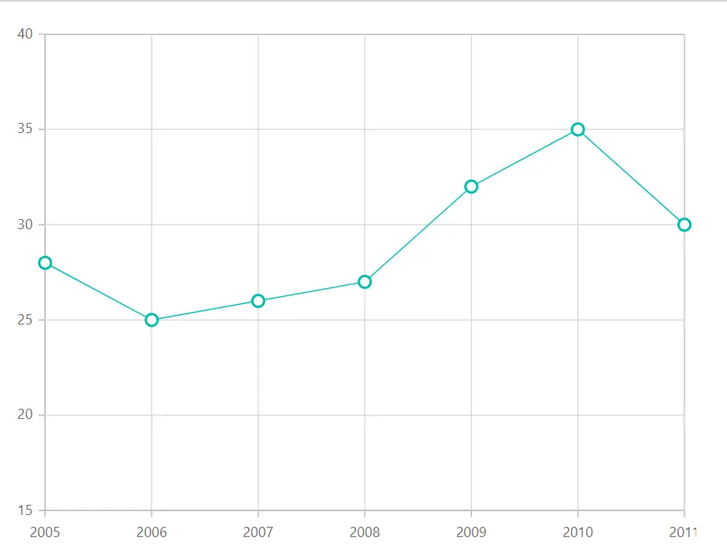
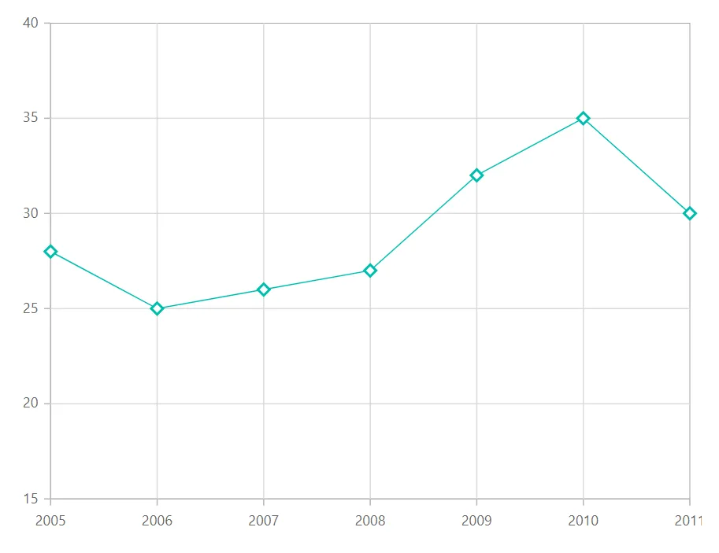
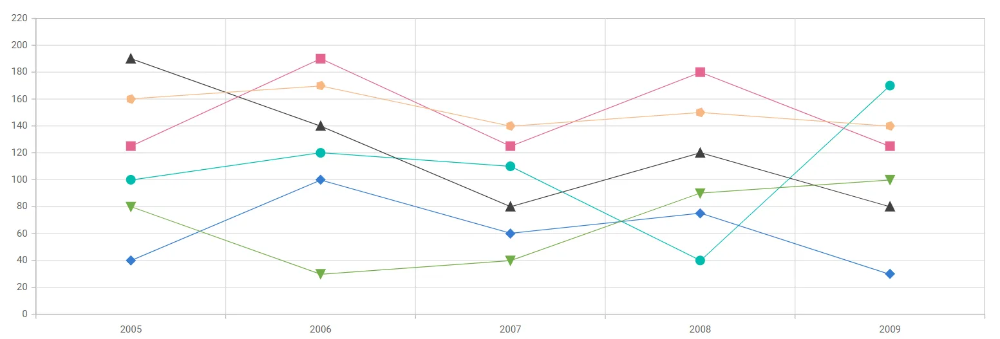
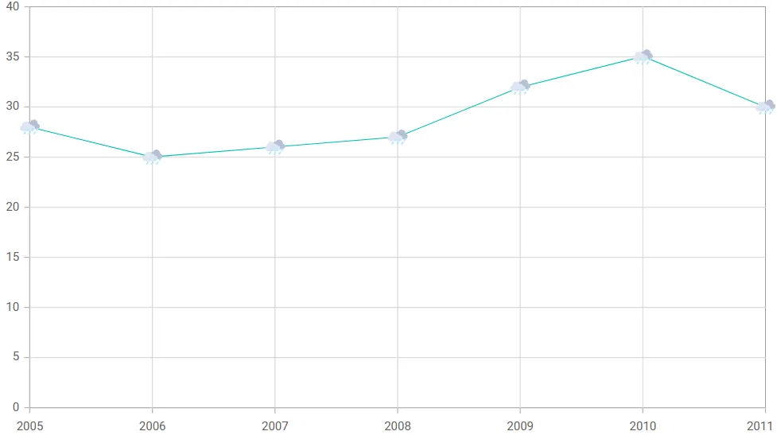
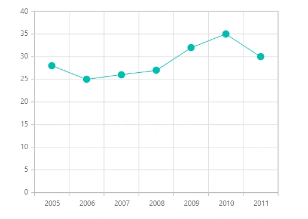
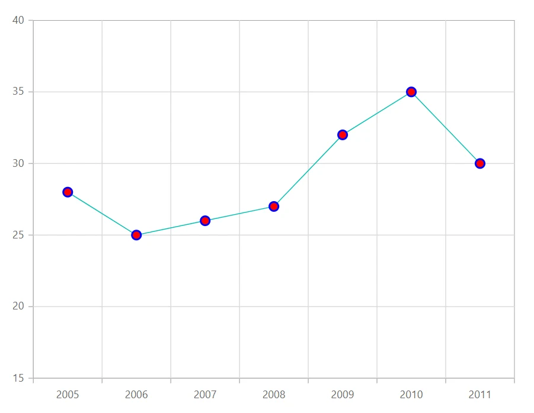

# Blazor Charts Data Markers

[Data markers](https://help.syncfusion.com/cr/blazor/Syncfusion.Blazor.Charts.ChartCommonMarker.html) are used to provide information about the data points in a series. Each data point can be adorned with a shape. Use markers to highlight key values, distinguish overlapping series, or make trends easier to read in dense charts.

<!-- markdownlint-disable MD036 -->

## Markers

Markers can be added to the points by enabling the [Visible](https://help.syncfusion.com/cr/blazor/Syncfusion.Blazor.Charts.ChartCommonMarker.html#Syncfusion_Blazor_Charts_ChartCommonMarker_Visible) property to **true** of [ChartMarker](https://help.syncfusion.com/cr/blazor/Syncfusion.Blazor.Charts.ChartMarker.html).

```cshtml

@using Syncfusion.Blazor.Charts

<SfChart>
    <ChartSeriesCollection>
        <ChartSeries DataSource="@ConsumerReports" XName="X" YName="Y" Type="ChartSeriesType.Line">
            <ChartMarker Visible="true" Height="10" Width="10"/>            
        </ChartSeries>
    </ChartSeriesCollection>
</SfChart>

@code {
    public class ChartData
    {
        public double X { get; set; }
        public double Y { get; set; }
    }

    public List<ChartData> ConsumerReports = new List<ChartData>
	{
		new ChartData{ X= 2005, Y= 28 },
		new ChartData{ X= 2006, Y= 25 },
		new ChartData{ X= 2007, Y= 26 },
		new ChartData{ X= 2008, Y= 27 },
		new ChartData{ X= 2009, Y= 32 },
		new ChartData{ X= 2010, Y= 35 },
		new ChartData{ X= 2011, Y= 30 }
	};
}

```



## Shape

Markers can be assigned with different shapes such as [Rectangle](https://help.syncfusion.com/cr/blazor/Syncfusion.Blazor.Charts.ChartShape.html#Syncfusion_Blazor_Charts_ChartShape_Rectangle), [Circle](https://help.syncfusion.com/cr/blazor/Syncfusion.Blazor.Charts.ChartShape.html#Syncfusion_Blazor_Charts_ChartShape_Circle), [Diamond](https://help.syncfusion.com/cr/blazor/Syncfusion.Blazor.Charts.ChartShape.html#Syncfusion_Blazor_Charts_ChartShape_Diamond) etc. using the [Shape](https://help.syncfusion.com/cr/blazor/Syncfusion.Blazor.Charts.ChartCommonMarker.html#Syncfusion_Blazor_Charts_ChartCommonMarker_Shape) property.

```cshtml

@using Syncfusion.Blazor.Charts

<SfChart>
    <ChartSeriesCollection>
        <ChartSeries DataSource="@ConsumerReports" XName="X" YName="Y" Type="ChartSeriesType.Line">
            <ChartMarker Visible="true" Height="10" Width="10" Shape="ChartShape.Diamond"/>            
        </ChartSeries>
    </ChartSeriesCollection>
</SfChart>

@code {
    public class ChartData
    {
        public double X { get; set; }
        public double Y { get; set; }
    }

    public List<ChartData> ConsumerReports = new List<ChartData>
	{
		new ChartData{ X= 2005, Y= 28 },
		new ChartData{ X= 2006, Y= 25 },
		new ChartData{ X= 2007, Y= 26 },
		new ChartData{ X= 2008, Y= 27 },
		new ChartData{ X= 2009, Y= 32 },
		new ChartData{ X= 2010, Y= 35 },
		new ChartData{ X= 2011, Y= 30 }
	};
}

```



## Auto marker shape

By default, the chart [marker shape](https://help.syncfusion.com/cr/blazor/Syncfusion.Blazor.Charts.ChartCommonMarker.html#Syncfusion_Blazor_Charts_ChartCommonMarker_Shape) is set to [Auto](https://help.syncfusion.com/cr/blazor/Syncfusion.Blazor.Charts.ChartShape.html#Syncfusion_Blazor_Charts_ChartShape_Auto). When markers are enabled and `Shape` is left at the default `Auto`, each series is assigned a different shape automatically based on its series index.

```cshtml

@using Syncfusion.Blazor.Charts

<SfChart>    
    <ChartPrimaryXAxis ValueType="Syncfusion.Blazor.Charts.ValueType.DateTimeCategory" Format="yyyy"></ChartPrimaryXAxis>
    <ChartSeriesCollection>
        <ChartSeries Name="Series1" DataSource="@ConsumerReports" XName="X" YName="Y1" Type="ChartSeriesType.Line">
            <ChartMarker Visible="true" Height="10" Width="10" IsFilled="true"/>
        </ChartSeries>
        <ChartSeries Name="Series2" DataSource="@ConsumerReports" XName="X" YName="Y2" Type="ChartSeriesType.Line">
            <ChartMarker Visible="true" Height="10" Width="10" IsFilled="true" />
        </ChartSeries>
        <ChartSeries Name="Series3" DataSource="@ConsumerReports" XName="X" YName="Y3" Type="ChartSeriesType.Line">
            <ChartMarker Visible="true" Height="10" Width="10" IsFilled="true" />
        </ChartSeries>
        <ChartSeries Name="Series4" DataSource="@ConsumerReports" XName="X" YName="Y4" Type="ChartSeriesType.Line">
            <ChartMarker Visible="true" Height="10" Width="10" IsFilled="true" />
        </ChartSeries>
        <ChartSeries Name="Series5" DataSource="@ConsumerReports" XName="X" YName="Y5" Type="ChartSeriesType.Line">
            <ChartMarker Visible="true" Height="10" Width="10" IsFilled="true" />
        </ChartSeries>
        <ChartSeries Name="Series6" DataSource="@ConsumerReports" XName="X" YName="Y6" Type="ChartSeriesType.Line">
            <ChartMarker Visible="true" Height="10" Width="10" IsFilled="true" />
        </ChartSeries>       
    </ChartSeriesCollection>
</SfChart>

@code {
    public class ChartData
    {
        public DateTime X { get; set; }
        public double Y1 { get; set; }
        public double Y2 { get; set; }
        public double Y3 { get; set; }
        public double Y4 { get; set; }
        public double Y5 { get; set; }
        public double Y6 { get; set; }       
    }

    public List<ChartData> ConsumerReports = new List<ChartData>
    {
        new ChartData{ X= new DateTime(2005,01,01), Y1 = 100, Y2 = 190, Y3 = 40, Y4 = 125, Y5 = 160, Y6 = 80 },
        new ChartData{ X= new DateTime(2006,01,01), Y1 = 120, Y2 = 140, Y3 = 100, Y4 = 190, Y5 = 170, Y6 = 30 },
        new ChartData{ X= new DateTime(2007,01,01), Y1 = 110, Y2 = 80, Y3 = 60, Y4 = 125, Y5 = 140, Y6 = 40 },
        new ChartData{ X= new DateTime(2008,01,01), Y1 = 40, Y2 = 120, Y3 = 75, Y4 = 180, Y5 = 150, Y6 = 90 },
        new ChartData{ X= new DateTime(2009,01,01), Y1 = 170, Y2 = 80, Y3 = 30, Y4 = 125, Y5 = 140, Y6 = 100 },
    };     
}

```



## Images

You can also use a custom image instead of a built-in shape by setting `Shape` to `ChartShape.Image` and providing the image path in the [ImageUrl](https://help.syncfusion.com/cr/blazor/Syncfusion.Blazor.Charts.ChartCommonMarker.html#Syncfusion_Blazor_Charts_ChartCommonMarker_ImageUrl) property.

```cshtml

@using Syncfusion.Blazor.Charts

<SfChart>
    <ChartSeriesCollection>
        <ChartSeries DataSource="@ConsumerReports" XName="X" YName="Y" Type="ChartSeriesType.Line">
            <ChartMarker Visible="true" Shape="ChartShape.Image" Height="20" Width="20" ImageUrl="https://ej2.syncfusion.com/demos/src/chart/images/cloud.webp">
            </ChartMarker>
        </ChartSeries>
    </ChartSeriesCollection>
</SfChart>

@code {
    public class ChartData
    {
        public double X { get; set; }
        public double Y { get; set; }
    }

    public List<ChartData> ConsumerReports = new List<ChartData>
	{
		new ChartData{ X= 2005, Y= 28 },
		new ChartData{ X= 2006, Y= 25 },
		new ChartData{ X= 2007, Y= 26 },
		new ChartData{ X= 2008, Y= 27 },
		new ChartData{ X= 2009, Y= 32 },
		new ChartData{ X= 2010, Y= 35 },
		new ChartData{ X= 2011, Y= 30 }
	};
}

```



## Fill marker with series color

Markers can be filled with the series color by setting the [IsFilled](https://help.syncfusion.com/cr/blazor/Syncfusion.Blazor.Charts.ChartCommonMarker.html#Syncfusion_Blazor_Charts_ChartCommonMarker_IsFilled) property to **true** on [ChartMarker](https://help.syncfusion.com/cr/blazor/Syncfusion.Blazor.Charts.ChartMarker.html).

```cshtml

@using Syncfusion.Blazor.Charts

<SfChart>
    <ChartSeriesCollection>
        <ChartSeries DataSource="@ConsumerReports" XName="X" YName="Y" Type="ChartSeriesType.Line">
            <ChartMarker Visible="true" Height="10" Width="10" IsFilled="true">
            </ChartMarker>
        </ChartSeries>
    </ChartSeriesCollection>
</SfChart>

@code {
    public class ChartData
    {
        public double X { get; set; }
        public double Y { get; set; }
    }

    public List<ChartData> ConsumerReports = new List<ChartData>
	{
		new ChartData{ X= 2005, Y= 28 },
		new ChartData{ X= 2006, Y= 25 },
		new ChartData{ X= 2007, Y= 26 },
		new ChartData{ X= 2008, Y= 27 },
		new ChartData{ X= 2009, Y= 32 },
		new ChartData{ X= 2010, Y= 35 },
		new ChartData{ X= 2011, Y= 30 }
	};
}

```



## Customization

The marker color can be customized using the [Fill](https://help.syncfusion.com/cr/blazor/Syncfusion.Blazor.Charts.ChartCommonMarker.html#Syncfusion_Blazor_Charts_ChartCommonMarker_Fill) property, and the border color and width can be customized using [ChartMarkerBorder](https://help.syncfusion.com/cr/blazor/Syncfusion.Blazor.Charts.ChartMarkerBorder.html).

```cshtml

@using Syncfusion.Blazor.Charts

<SfChart>
    <ChartSeriesCollection>
        <ChartSeries DataSource="@ConsumerReports" XName="X" YName="Y" Type="ChartSeriesType.Line">
            <ChartMarker Visible="true" Height="10" Width="10" Fill="red">
                <ChartMarkerBorder Width="2" Color="blue"></ChartMarkerBorder>
            </ChartMarker>
        </ChartSeries>
    </ChartSeriesCollection>
</SfChart>

@code {
    public class ChartData
    {
        public double X { get; set; }
        public double Y { get; set; }
    }

    public List<ChartData> ConsumerReports = new List<ChartData>
	{
		new ChartData{ X= 2005, Y= 28 },
		new ChartData{ X= 2006, Y= 25 },
		new ChartData{ X= 2007, Y= 26 },
		new ChartData{ X= 2008, Y= 27 },
		new ChartData{ X= 2009, Y= 32 },
		new ChartData{ X= 2010, Y= 35 },
		new ChartData{ X= 2011, Y= 30 }
	};
}

```



N> Combine markers with [data labels](./data-labels) to display the value of each point, or surface marker details on hover with the [tooltip](./tool-tip).

## See also

* [Legend](./legend)
* [Getting started](./getting-started)
