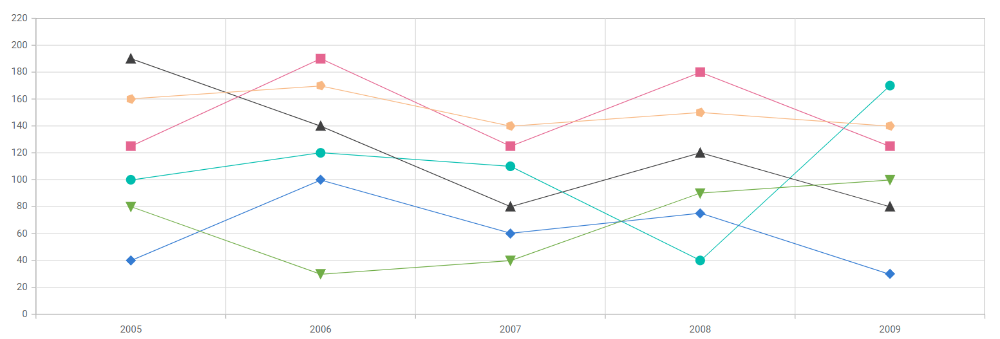
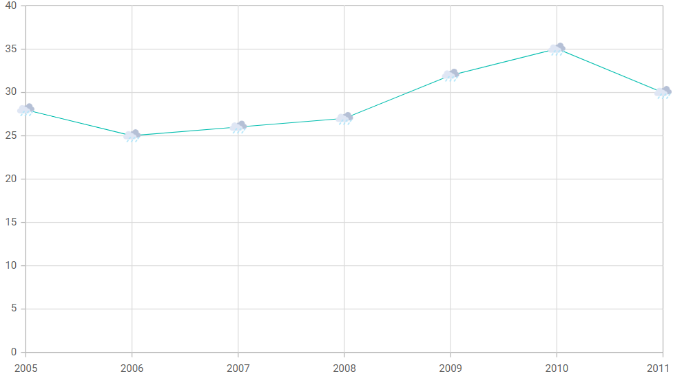

# Markers in Blazor Charts Component

[Data markers](https://help.syncfusion.com/cr/blazor/Syncfusion.Blazor.Charts.ChartCommonMarker.html) provide information about data points in a series. Each point can be adorned with a shape.

<!-- markdownlint-disable MD036 -->

## Markers

<!-- markdownlint-disable MD036 -->

Enable markers by setting the [Visible](https://help.syncfusion.com/cr/blazor/Syncfusion.Blazor.Charts.ChartCommonMarker.html#Syncfusion_Blazor_Charts_ChartCommonMarker_Visible) property to **true** in [ChartMarker](https://help.syncfusion.com/cr/blazor/Syncfusion.Blazor.Charts.ChartMarker.html).

```cshtml

@using Syncfusion.Blazor.Charts

<SfChart>
    <ChartSeriesCollection>
        <ChartSeries DataSource="@ConsumerReports" XName="X" YName="Y" Type="ChartSeriesType.Line">
            <ChartMarker Visible="true" Height="10" Width="10"/>            
        </ChartSeries>
    </ChartSeriesCollection>
</SfChart>

@code {
    public class ChartData
    {
        public double X { get; set; }
        public double Y { get; set; }
    }

    public List<ChartData> ConsumerReports = new List<ChartData>
	{
        new ChartData { X = 2005, Y = 28 },
        new ChartData { X = 2006, Y = 25 },
        new ChartData { X = 2007, Y = 26 },
        new ChartData { X = 2008, Y = 27 },
        new ChartData { X = 2009, Y = 32 },
        new ChartData { X = 2010, Y = 35 },
        new ChartData { X = 2011, Y = 30 }
	};
}

```



## Shape

Assign different shapes to markers, such as [Rectangle](https://help.syncfusion.com/cr/blazor/Syncfusion.Blazor.Charts.ChartShape.html#Syncfusion_Blazor_Charts_ChartShape_Rectangle), [Circle](https://help.syncfusion.com/cr/blazor/Syncfusion.Blazor.Charts.ChartShape.html#Syncfusion_Blazor_Charts_ChartShape_Circle), or [Diamond](https://help.syncfusion.com/cr/blazor/Syncfusion.Blazor.Charts.ChartShape.html#Syncfusion_Blazor_Charts_ChartShape_Diamond), using the [Shape](https://help.syncfusion.com/cr/blazor/Syncfusion.Blazor.Charts.ChartCommonMarker.html#Syncfusion_Blazor_Charts_ChartCommonMarker_Shape) property.

```cshtml

@using Syncfusion.Blazor.Charts

<SfChart>
    <ChartSeriesCollection>
        <ChartSeries DataSource="@ConsumerReports" XName="X" YName="Y" Type="ChartSeriesType.Line">
            <ChartMarker Visible="true" Height="10" Width="10" Shape="ChartShape.Diamond"/>            
        </ChartSeries>
    </ChartSeriesCollection>
</SfChart>

@code{
    public class ChartData
    {
        public double X { get; set; }
        public double Y { get; set; }
    }

    public List<ChartData> ConsumerReports = new List<ChartData>
	{
        new ChartData { X = 2005, Y = 28 },
        new ChartData { X = 2006, Y = 25 },
        new ChartData { X = 2007, Y = 26 },
        new ChartData { X = 2008, Y = 27 },
        new ChartData { X = 2009, Y = 32 },
        new ChartData { X = 2010, Y = 35 },
        new ChartData { X = 2011, Y = 30 }
	};
}

```


## Auto marker shape

By default, the chart [marker shape](https://help.syncfusion.com/cr/blazor/Syncfusion.Blazor.Charts.ChartCommonMarker.html#Syncfusion_Blazor_Charts_ChartCommonMarker_Shape) is set to [Auto](https://help.syncfusion.com/cr/blazor/Syncfusion.Blazor.Charts.ChartShape.html#Syncfusion_Blazor_Charts_ChartShape_Auto). When enabled, each series is rendered with a unique marker shape.

```cshtml

@using Syncfusion.Blazor.Charts

<SfChart ID="container">    
    <ChartPrimaryXAxis ValueType="Syncfusion.Blazor.Charts.ValueType.DateTimeCategory" Format="yyyy" />
    <ChartSeriesCollection>
        <ChartSeries Name="Series1" DataSource="@ConsumerReports" XName="X" YName="Y1" Type="ChartSeriesType.Line">
            <ChartMarker Visible="true" Height="10" Width="10" IsFilled="true"/>
        </ChartSeries>
        <ChartSeries Name="Series2" DataSource="@ConsumerReports" XName="X" YName="Y2" Type="ChartSeriesType.Line">
            <ChartMarker Visible="true" Height="10" Width="10" IsFilled="true" />
        </ChartSeries>
        <ChartSeries Name="Series3" DataSource="@ConsumerReports" XName="X" YName="Y3" Type="ChartSeriesType.Line">
            <ChartMarker Visible="true" Height="10" Width="10" IsFilled="true" />
        </ChartSeries>
        <ChartSeries Name="Series4" DataSource="@ConsumerReports" XName="X" YName="Y4" Type="ChartSeriesType.Line">
            <ChartMarker Visible="true" Height="10" Width="10" IsFilled="true" />
        </ChartSeries>
        <ChartSeries Name="Series5" DataSource="@ConsumerReports" XName="X" YName="Y5" Type="ChartSeriesType.Line">
            <ChartMarker Visible="true" Height="10" Width="10" IsFilled="true" />
        </ChartSeries>
        <ChartSeries Name="Series6" DataSource="@ConsumerReports" XName="X" YName="Y6" Type="ChartSeriesType.Line">
            <ChartMarker Visible="true" Height="10" Width="10" IsFilled="true" />
        </ChartSeries>       
    </ChartSeriesCollection>
</SfChart>

@code {
    public class ChartData
    {
        public DateTime X { get; set; }
        public double Y { get; set; }
        public double Y1 { get; set; }
        public double Y2 { get; set; }
        public double Y3 { get; set; }
        public double Y4 { get; set; }
        public double Y5 { get; set; }
        public double Y6 { get; set; }       
    }

    public List<ChartData> ConsumerReports = new List<ChartData>
    {
        new ChartData { X= new DateTime(2005, 01, 01), Y1 = 100, Y2 = 190, Y3 = 40, Y4 = 125, Y5 = 160, Y6 = 80 },
        new ChartData { X= new DateTime(2006, 01, 01), Y1 = 120, Y2 = 140, Y3 = 100, Y4 = 190, Y5 = 170, Y6 = 30 },
        new ChartData { X= new DateTime(2007, 01, 01), Y1 = 110, Y2 = 80, Y3 = 60, Y4 = 125, Y5 = 140, Y6 = 40 },
        new ChartData { X= new DateTime(2008, 01, 01), Y1 = 40, Y2 = 120, Y3 = 75, Y4 = 180, Y5 = 150, Y6 = 90 },
        new ChartData { X= new DateTime(2009, 01, 01), Y1 = 170, Y2 = 80, Y3 = 30, Y4 = 125, Y5 = 140, Y6 = 100 }
    };     
}

```



## Images

Custom images can be used as markers by setting the [ImageUrl](https://help.syncfusion.com/cr/blazor/Syncfusion.Blazor.Charts.ChartCommonMarker.html#Syncfusion_Blazor_Charts_ChartCommonMarker_ImageUrl) property and specifying [Image](https://help.syncfusion.com/cr/blazor/Syncfusion.Blazor.Charts.ChartShape.html#Syncfusion_Blazor_Charts_ChartShape_Image) as the marker shape.

```cshtml

@using Syncfusion.Blazor.Charts

<SfChart>
    <ChartSeriesCollection>
        <ChartSeries DataSource="@ConsumerReports" XName="X" YName="Y" Type="ChartSeriesType.Line">
            <ChartMarker Visible="true" Shape="ChartShape.Image" Height="20" Width="20" ImageUrl="https://ej2.syncfusion.com/demos/src/chart/images/cloud.png">
            </ChartMarker>
        </ChartSeries>
    </ChartSeriesCollection>
</SfChart>

@code {
    public class ChartData
    {
        public double X { get; set; }
        public double Y { get; set; }
    }

    public List<ChartData> ConsumerReports = new List<ChartData>
	{
        new ChartData { X = 2005, Y = 28 },
        new ChartData { X = 2006, Y = 25 },
        new ChartData { X = 2007, Y = 26 },
        new ChartData { X = 2008, Y = 27 },
        new ChartData { X = 2009, Y = 32 },
        new ChartData { X = 2010, Y = 35 },
        new ChartData { X = 2011, Y = 30 }
	};
}

```



## Fill marker with series color

Fill markers with the series color by setting [IsFilled](https://help.syncfusion.com/cr/blazor/Syncfusion.Blazor.Charts.ChartCommonMarker.html#Syncfusion_Blazor_Charts_ChartCommonMarker_IsFilled) to **true** in [ChartMarker](https://help.syncfusion.com/cr/blazor/Syncfusion.Blazor.Charts.ChartMarker.html).

```cshtml

@using Syncfusion.Blazor.Charts

<SfChart>
    <ChartPrimaryXAxis ValueType="Syncfusion.Blazor.Charts.ValueType.Category" />

    <ChartSeriesCollection>
        <ChartSeries DataSource="@ConsumerReports" XName="X" YName="Y" Type="ChartSeriesType.Line">
            <ChartMarker Visible="true" Height="10" Width="10" IsFilled="true">
            </ChartMarker>
        </ChartSeries>
    </ChartSeriesCollection>
</SfChart>

@code{
    public class ChartData
    {
        public double X { get; set; }
        public double Y { get; set; }
    }

    public List<ChartData> ConsumerReports = new List<ChartData>
	{
        new ChartData { X = 2005, Y = 28 },
        new ChartData { X = 2006, Y = 25 },
        new ChartData { X = 2007, Y = 26 },
        new ChartData { X = 2008, Y = 27 },
        new ChartData { X = 2009, Y = 32 },
        new ChartData { X = 2010, Y = 35 },
        new ChartData { X = 2011, Y = 30 }
	};
}

```


## Customization

Customize marker color using the [Fill](https://help.syncfusion.com/cr/blazor/Syncfusion.Blazor.Charts.ChartCommonMarker.html#Syncfusion_Blazor_Charts_ChartCommonMarker_Fill) property. Adjust border color and width with [ChartMarkerBorder](https://help.syncfusion.com/cr/blazor/Syncfusion.Blazor.Charts.ChartMarkerBorder.html).

```cshtml

@using Syncfusion.Blazor.Charts

<SfChart>
    <ChartPrimaryXAxis ValueType="Syncfusion.Blazor.Charts.ValueType.Category" />

    <ChartSeriesCollection>
        <ChartSeries DataSource="@ConsumerReports" XName="X" YName="Y" Type="ChartSeriesType.Line">
            <ChartMarker Visible="true" Height="10" Width="10" Fill="red">
                <ChartMarkerBorder Width="2" Color="blue"></ChartMarkerBorder>
            </ChartMarker>
        </ChartSeries>
    </ChartSeriesCollection>
</SfChart>

@code{
    public class ChartData
    {
        public double X { get; set; }
        public double Y { get; set; }
    }

    public List<ChartData> ConsumerReports = new List<ChartData>
	{
        new ChartData { X = 2005, Y = 28 },
        new ChartData { X = 2006, Y = 25 },
        new ChartData { X = 2007, Y = 26 },
        new ChartData { X = 2008, Y = 27 },
        new ChartData { X = 2009, Y = 32 },
        new ChartData { X = 2010, Y = 35 },
        new ChartData { X = 2011, Y = 30 }
	};
}

```


N> Refer to our [Blazor Charts](https://www.syncfusion.com/blazor-components/blazor-charts) feature tour page for its groundbreaking feature representations and also explore our [Blazor Chart Example](https://blazor.syncfusion.com/demos/chart/line?theme=bootstrap5) to know various chart types and how to represent time-dependent data, showing trends at equal intervals.

## See also

* [Tooltip](./tool-tip)
* [Legend](./legend)
