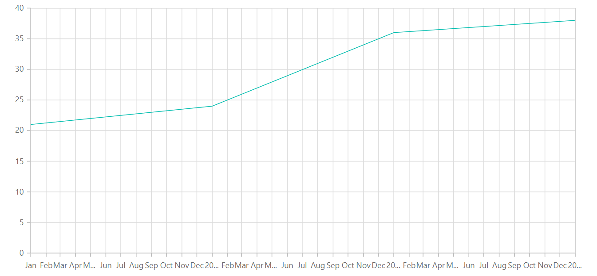

<!-- markdownlint-disable MD036 -->

# DateTime Axis in Blazor Charts Component

## DateTime Axis

 Date time axis uses date time scale and displays the date time values as axis labels in the specified format.

```csharp

@using Syncfusion.Blazor.Charts

<SfChart Width="60%">
    <ChartPrimaryXAxis ValueType="Syncfusion.Blazor.Charts.ValueType.DateTime">
    </ChartPrimaryXAxis>

    <ChartSeriesCollection>
        <ChartSeries DataSource="@WeatherReports" XName="XValue" YName="YValue" Type="ChartSeriesType.Line">
        </ChartSeries>
    </ChartSeriesCollection>
</SfChart>

@code{
    public class ChartData
    {
        public DateTime XValue { get; set;}
        public double YValue {get; set;}
    }
    public List<ChartData> WeatherReports = new List<ChartData>
{
     new ChartData { XValue = new DateTime(2005, 01, 01), YValue = 21 },
     new ChartData { XValue = new DateTime(2006, 01, 01), YValue = 24 },
     new ChartData { XValue = new DateTime(2007, 01, 01), YValue = 36 },
     new ChartData { XValue = new DateTime(2008, 01, 01), YValue = 38 },
   };
}

```


## DateTimeCategory Axis

Date-time category axis is used to display the date-time values with non-linear intervals. For example, the business days alone can been depicted in a week here.

```csharp

@using Syncfusion.Blazor.Charts

<SfChart Width="60%">
    <ChartPrimaryXAxis Skeleton="Ed" ValueType="Syncfusion.Blazor.Charts.ValueType.DateTimeCategory">
    </ChartPrimaryXAxis>

    <ChartSeriesCollection>
        <ChartSeries DataSource="@WeatherReports" XName="XValue" YName="YValue" Type="ChartSeriesType.Line">
        </ChartSeries>
    </ChartSeriesCollection>
</SfChart>

@code{
    public class ChartData
    {
        public DateTime XValue{ get; set; }
        public double YValue { get; set; }
    }
    public List<ChartData> WeatherReports = new List<ChartData>
{
     new ChartData { XValue = new DateTime(2005, 01, 01), YValue = 21 },
     new ChartData { XValue = new DateTime(2006, 01, 01), YValue = 24 },
     new ChartData { XValue = new DateTime(2007, 01, 01), YValue = 36 },
     new ChartData { XValue = new DateTime(2008, 01, 01), YValue = 38 },
   };
}

```

### Range

Range for the axis, will be calculated automatically based on the provided data, you can also customize the range
of the axis using [`Minimum`](https://help.syncfusion.com/cr/blazor/Syncfusion.Blazor.Charts.AxisModel.html#Syncfusion_Blazor_Charts_AxisModel_Minimum),
[`Maximum`](https://help.syncfusion.com/cr/blazor/Syncfusion.Blazor.Charts.AxisModel.html#Syncfusion_Blazor_Charts_AxisModel_Maximum) and [`Interval`](https://help.syncfusion.com/cr/blazor/Syncfusion.Blazor.Charts.AxisModel.html#Syncfusion_Blazor_Charts_AxisModel_Interval) property of the axis.

```csharp

@using Syncfusion.Blazor.Charts

<SfChart Width="60%">
    <ChartPrimaryXAxis Interval="1" ValueType="Syncfusion.Blazor.Charts.ValueType.DateTime">
    </ChartPrimaryXAxis>

    <ChartSeriesCollection>
        <ChartSeries DataSource="@WeatherReports" XName="XValue" YName="YValue" Type="ChartSeriesType.Line">
        </ChartSeries>
    </ChartSeriesCollection>
</SfChart>

@code{
    public class ChartData
    {
        public DateTime XValue { get; set; }
        public double YValue { get; set; }
    }
    public List<ChartData> WeatherReports = new List<ChartData>
{
     new ChartData { XValue = new DateTime(2005, 01, 01), YValue = 21 },
     new ChartData { XValue = new DateTime(2006, 01, 01), YValue = 24 },
     new ChartData { XValue = new DateTime(2007, 01, 01), YValue = 36 },
     new ChartData { XValue = new DateTime(2008, 01, 01), YValue = 38 },
   };
}

```



### Interval Customization

Date time intervals can be customized by using the [`Interval`](https://help.syncfusion.com/cr/blazor/Syncfusion.Blazor.Charts.AxisModel.html#Syncfusion_Blazor_Charts_AxisModel_Interval) and
[`IntervalType`](https://help.syncfusion.com/cr/blazor/Syncfusion.Blazor.Charts.AxisModel.html#Syncfusion_Blazor_Charts_AxisModel_IntervalType) properties of the axis.
For example, when you set Interval as 2 and IntervalType as years, it considers 2 years as Interval.
DateTime axis supports following Interval types,

* Auto
* Years
* Months
* Days
* Hours
* Minutes
* Seconds

```csharp

@using Syncfusion.Blazor.Charts

<SfChart Width="60%">
    <ChartPrimaryXAxis IntervalType="IntervalType.Years" ValueType="Syncfusion.Blazor.Charts.ValueType.DateTime">
    </ChartPrimaryXAxis>

    <ChartSeriesCollection>
        <ChartSeries DataSource="@WeatherReports" XName="XValue" YName="YValue" Type="ChartSeriesType.Line">
        </ChartSeries>
    </ChartSeriesCollection>
</SfChart>

@code{
    public class ChartData
    {
        public DateTime XValue { get; set;}
        public double YValue { get; set; }
    }
    public List<ChartData> WeatherReports = new List<ChartData>
{
     new ChartData { XValue = new DateTime(2005, 01, 01), YValue = 21 },
     new ChartData { XValue = new DateTime(2006, 01, 01), YValue = 24 },
     new ChartData { XValue = new DateTime(2007, 01, 01), YValue = 36 },
     new ChartData { XValue = new DateTime(2008, 01, 01), YValue = 38 },
   };
}

```

**Applying Padding to the Range**

Padding can be applied to the minimum and maximum extremes of the range by using the
[`RangePadding`](https://help.syncfusion.com/cr/blazor/Syncfusion.Blazor.Charts.AxisModel.html#Syncfusion_Blazor_Charts_AxisModel_RangePadding) property. Date time axis supports the following types
of padding,

* None
* Round
* Additional

**DateTime - None**

When the [`RangePadding`](https://help.syncfusion.com/cr/blazor/Syncfusion.Blazor.Charts.AxisModel.html#Syncfusion_Blazor_Charts_AxisModel_RangePadding) is set to **None**, minimum and maximum of the axis is based on the data.

```csharp

@using Syncfusion.Blazor.Charts

<SfChart Width="60%">
    <ChartPrimaryXAxis RangePadding="ChartRangePadding.None" ValueType="Syncfusion.Blazor.Charts.ValueType.DateTime">
    </ChartPrimaryXAxis>

    <ChartSeriesCollection>
        <ChartSeries DataSource="@WeatherReports" XName="XValue" YName="YValue" Type="ChartSeriesType.Line">
        </ChartSeries>
    </ChartSeriesCollection>
</SfChart>

@code{
    public class ChartData
    {
        public DateTime XValue { get; set; }
        public double YValue { get; set; }
    }
    public List<ChartData> WeatherReports = new List<ChartData>
{
     new ChartData { XValue = new DateTime(2005, 01, 01), YValue = 21 },
     new ChartData { XValue = new DateTime(2006, 01, 01), YValue = 24 },
     new ChartData { XValue = new DateTime(2007, 01, 01), YValue = 36 },
     new ChartData { XValue = new DateTime(2008, 01, 01), YValue = 38 },
   };
}

```

**DateTime - Round**

When the [`RangePadding`](https://help.syncfusion.com/cr/blazor/Syncfusion.Blazor.Charts.AxisModel.html#Syncfusion_Blazor_Charts_AxisModel_RangePadding) is set to **Round**, minimum and maximum will be
rounded to the nearest possible value divisible by interval. For example, when the minimum is 15th Jan, interval is
1 and the interval type is ‘month’, then the axis minimum will be Jan 1st.

```csharp

@using Syncfusion.Blazor.Charts

<SfChart Width="60%">
    <ChartPrimaryXAxis RangePadding="ChartRangePadding.Round" ValueType="Syncfusion.Blazor.Charts.ValueType.DateTime">
    </ChartPrimaryXAxis>

    <ChartSeriesCollection>
        <ChartSeries DataSource="@WeatherReports" XName="XValue" YName="YValue" Type="ChartSeriesType.Line">
        </ChartSeries>
    </ChartSeriesCollection>
</SfChart>

@code{
    public class ChartData
    {
        public DateTime XValue { get; set; }
        public double YValue { get; set; }
    }
    public List<ChartData> WeatherReports = new List<ChartData>
{
     new ChartData { XValue = new DateTime(2005, 01, 01), YValue = 21 },
     new ChartData { XValue = new DateTime(2006, 01, 01), YValue = 24 },
     new ChartData { XValue = new DateTime(2007, 01, 01), YValue = 36 },
     new ChartData { XValue = new DateTime(2008, 01, 01), YValue = 38 },
   };
}

```

**DateTime - Additional**

When the [`RangePadding`](https://help.syncfusion.com/cr/blazor/Syncfusion.Blazor.Charts.AxisModel.html#Syncfusion_Blazor_Charts_AxisModel_RangePadding) is set to **Additional**, interval of an axis will
be padded to the minimum and maximum of the axis.

```csharp

@using Syncfusion.Blazor.Charts

<SfChart>
    <ChartPrimaryXAxis RangePadding="ChartRangePadding.Additional" 
                       ValueType="Syncfusion.Blazor.Charts.ValueType.DateTime"/>

    <ChartSeriesCollection>
        <ChartSeries DataSource="@WeatherReports" XName="@nameof(ChartData.XValue)" YName=@nameof(ChartData.YValue)/>
    </ChartSeriesCollection>
</SfChart>

@code{
    public class ChartData
    {
        public DateTime XValue { get; set; }
        public double YValue { get; set; }
    }
    public List<ChartData> WeatherReports = new List<ChartData>
{
     new ChartData { XValue = new DateTime(2005, 01, 01), YValue = 21 },
     new ChartData { XValue = new DateTime(2006, 01, 01), YValue = 24 },
     new ChartData { XValue = new DateTime(2007, 01, 01), YValue = 36 },
     new ChartData { XValue = new DateTime(2008, 01, 01), YValue = 38 },
   };
}

```

## Label Format

You can format and parse the date to all globalize format using [`LabelFormat`](https://help.syncfusion.com/cr/blazor/Syncfusion.Blazor.Charts.AxisModel.html#Syncfusion_Blazor_Charts_AxisModel_LabelFormat) property in an axis.

```csharp

@using Syncfusion.Blazor.Charts

<SfChart Width="60%">
    <ChartPrimaryXAxis LabelFormat="d" ValueType="Syncfusion.Blazor.Charts.ValueType.DateTime"/>
    

    <ChartSeriesCollection>
        <ChartSeries DataSource="@WeatherReports" XName="XValue" YName="YValue" />        
    </ChartSeriesCollection>
</SfChart>

@code{
    public class ChartData
    {
        public DateTime XValue { get; set; }
        public double YValue { get; set; }
    }
    public List<ChartData> WeatherReports = new List<ChartData>
{
     new ChartData { XValue = new DateTime(2005, 01, 01), YValue = 21 },
     new ChartData { XValue = new DateTime(2006, 01, 01), YValue = 24 },
     new ChartData { XValue = new DateTime(2007, 01, 01), YValue = 36 },
     new ChartData { XValue = new DateTime(2008, 01, 01), YValue = 38 },
   };
}

```

The following table describes the result of applying some common date time formats to the labelFormat property

<!-- markdownlint-disable MD033 -->

<table>
<tr>
<td><b>Label Value</b></td>
<td><b>Label Format Property Value</b></td>
<td><b>Result </b></td>
<td><b>Description </b></td>
</tr>
<tr>
<td>new Date(2000, 03, 10)</td>
<td>EEEE</td>
<td>Monday</td>
<td>The Date is displayed in day format</td>
</tr>
<tr>
<td>new Date(2000, 03, 10)</td>
<td>yMd</td>
<td>04/10/2000</td>
<td>The Date is displayed in month/date/year format</td>
</tr>
<tr>
<td>new Date(2000, 03, 10)</td>
<td> MMM </td>
<td>Apr</td>
<td>The Shorthand month for the date is displayed</td>
</tr>
<tr>
<td>new Date(2000, 03, 10)</td>
<td>hm</td>
<td>12:00 AM</td>
<td>Time of the date value is displayed as label</td>
</tr>
<tr>
<td>new Date(2000, 03, 10)</td>
<td>hms</td>
<td>12:00:00 AM</td>
<td>The Label is displayed in hours:minutes:seconds format</td>
</tr>
</table>

<!-- markdownlint-disable MD033 -->

> Note: You can refer to our [`Blazor Charts`](https://www.syncfusion.com/blazor-components/blazor-charts) feature tour page for its groundbreaking feature representations. You can also explore our [`Blazor Chart example`](https://blazor.syncfusion.com/demos/chart/line?theme=bootstrap4) to knows various chart types and how to represent time-dependent data, showing trends in data at equal intervals.

## See Also

* [Data label](./data-labels)
* [Tooltip](./tool-tip)
* [Marker](./data-markers)