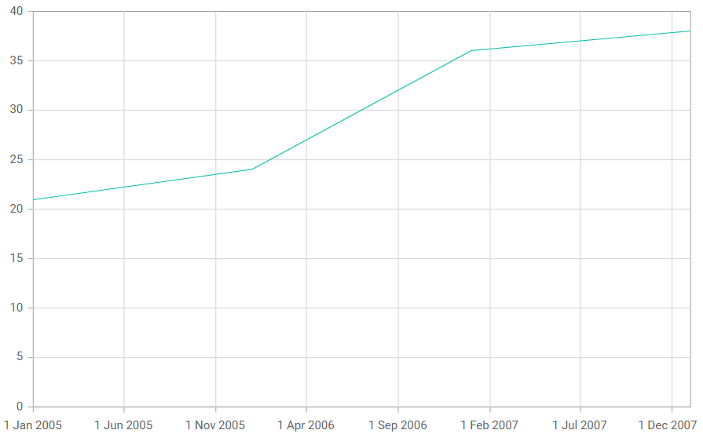

<!-- markdownlint-disable MD036 -->

# DateTime axis in Blazor Charts

## DateTime axis

The [DateTime](https://help.syncfusion.com/cr/blazor/Syncfusion.Blazor.Charts.ValueType.html#Syncfusion_Blazor_Charts_ValueType_DateTime) axis uses a date-time scale and renders date and time values as axis labels in the specified format.

Watch the video below to learn how to customize the DateTime axis.



```cshtml

@using Syncfusion.Blazor.Charts

<SfChart>
    <ChartPrimaryXAxis ValueType="Syncfusion.Blazor.Charts.ValueType.DateTime">
    </ChartPrimaryXAxis>

    <ChartSeriesCollection>
        <ChartSeries DataSource="@WeatherReports" XName="XValue" YName="YValue" Type="ChartSeriesType.Line">
        </ChartSeries>
    </ChartSeriesCollection>
</SfChart>

@code{
    public class ChartData
    {
        public DateTime XValue { get; set;}
        public double YValue {get; set;}
    }
	
    public List<ChartData> WeatherReports = new List<ChartData>
	{
		new ChartData { XValue = new DateTime(2005, 01, 01), YValue = 21 },
		new ChartData { XValue = new DateTime(2006, 01, 01), YValue = 24 },
		new ChartData { XValue = new DateTime(2007, 01, 01), YValue = 36 },
		new ChartData { XValue = new DateTime(2008, 01, 01), YValue = 38 },
	};
}

```



## DateTimeCategory axis

The [DateTimeCategory](https://help.syncfusion.com/cr/blazor/Syncfusion.Blazor.Charts.ValueType.html#Syncfusion_Blazor_Charts_ValueType_DateTimeCategory) axis displays date-time values with non-linear intervals. For example, it can skip non-business days and show only business days in a week.

```cshtml

@using Syncfusion.Blazor.Charts

<SfChart>
    <ChartPrimaryXAxis Format="d MMM yyyy" ValueType="Syncfusion.Blazor.Charts.ValueType.DateTimeCategory">
    </ChartPrimaryXAxis>

    <ChartSeriesCollection>
        <ChartSeries DataSource="@WeatherReports" XName="XValue" YName="YValue" Type="ChartSeriesType.Line">
        </ChartSeries>
    </ChartSeriesCollection>
</SfChart>

@code{
    public class ChartData
    {
        public DateTime XValue { get; set; }
        public double YValue { get; set; }
    }
	
    public List<ChartData> WeatherReports = new List<ChartData>
	{
		new ChartData { XValue = new DateTime(2005, 01, 01), YValue = 21 },
		new ChartData { XValue = new DateTime(2006, 01, 01), YValue = 24 },
		new ChartData { XValue = new DateTime(2007, 01, 01), YValue = 36 },
		new ChartData { XValue = new DateTime(2008, 01, 01), YValue = 38 }
	};
}

```



### Range

The axis range is calculated automatically based on the data. You can also customize it using the [Minimum](https://help.syncfusion.com/cr/blazor/Syncfusion.Blazor.Charts.ChartAxis.html#Syncfusion_Blazor_Charts_ChartAxis_Minimum), [Maximum](https://help.syncfusion.com/cr/blazor/Syncfusion.Blazor.Charts.ChartAxis.html#Syncfusion_Blazor_Charts_ChartAxis_Maximum), and [Interval](https://help.syncfusion.com/cr/blazor/Syncfusion.Blazor.Charts.ChartAxis.html#Syncfusion_Blazor_Charts_ChartAxis_Interval) properties.

```cshtml

@using Syncfusion.Blazor.Charts

<SfChart>
    <ChartPrimaryXAxis IntervalType="IntervalType.Months" ValueType="Syncfusion.Blazor.Charts.ValueType.DateTime">
    </ChartPrimaryXAxis>

    <ChartSeriesCollection>
        <ChartSeries DataSource="@WeatherReports" XName="XValue" YName="YValue" Type="ChartSeriesType.Line">
        </ChartSeries>
    </ChartSeriesCollection>
</SfChart>

@code{
    public class ChartData
    {
        public DateTime XValue { get; set; }
        public double YValue { get; set; }
    }
	
    public List<ChartData> WeatherReports = new List<ChartData>
	{
		new ChartData { XValue = new DateTime(2016, 4, 1), YValue = 21 },
		new ChartData { XValue = new DateTime(2016, 5, 1), YValue = 24 },
		new ChartData { XValue = new DateTime(2016, 6, 1), YValue = 36 },
		new ChartData { XValue = new DateTime(2016, 7, 1), YValue = 38 },
		new ChartData { XValue = new DateTime(2016, 8, 1), YValue = 46 },
		new ChartData { XValue = new DateTime(2016, 9, 1), YValue = 28 },
		new ChartData { XValue = new DateTime(2016, 10, 1), YValue = 68 }
	};
}

```



### Interval customization

Use the [Interval](https://help.syncfusion.com/cr/blazor/Syncfusion.Blazor.Charts.ChartAxis.html#Syncfusion_Blazor_Charts_ChartAxis_Interval) and [IntervalType](https://help.syncfusion.com/cr/blazor/Syncfusion.Blazor.Charts.ChartAxis.html#Syncfusion_Blazor_Charts_ChartAxis_IntervalType) properties of the [axis](https://help.syncfusion.com/cr/blazor/Syncfusion.Blazor.Charts.ChartAxis.html) to customize date-time intervals. For example, setting Interval to **2** and IntervalType to **Months** uses a two‑months interval.

Supported interval types for the DateTime axis:

* Auto
* Years
* Months
* Days
* Hours
* Minutes
* Seconds

```cshtml

@using Syncfusion.Blazor.Charts

<SfChart>
	<ChartPrimaryXAxis Interval="2" IntervalType="IntervalType.Months" ValueType="Syncfusion.Blazor.Charts.ValueType.DateTime">
    </ChartPrimaryXAxis>

    <ChartSeriesCollection>
        <ChartSeries DataSource="@WeatherReports" XName="XValue" YName="YValue" Type="ChartSeriesType.Line">
        </ChartSeries>
    </ChartSeriesCollection>
</SfChart>

@code{
    public class ChartData
    {
        public DateTime XValue { get; set; }
        public double YValue { get; set; }
    }
	
    public List<ChartData> WeatherReports = new List<ChartData>
	{
		new ChartData { XValue = new DateTime(2016, 4, 1), YValue = 21 },
		new ChartData { XValue = new DateTime(2016, 5, 1), YValue = 24 },
		new ChartData { XValue = new DateTime(2016, 6, 1), YValue = 36 },
		new ChartData { XValue = new DateTime(2016, 7, 1), YValue = 38 },
		new ChartData { XValue = new DateTime(2016, 8, 1), YValue = 46 },
		new ChartData { XValue = new DateTime(2016, 9, 1), YValue = 28 },
		new ChartData { XValue = new DateTime(2016, 10, 1), YValue = 68 }
	};
}

```



## Apply padding to the range

Use [RangePadding](https://help.syncfusion.com/cr/blazor/Syncfusion.Blazor.Charts.ChartAxis.html#Syncfusion_Blazor_Charts_ChartAxis_RangePadding) to add padding to the minimum and maximum extremes of the range. The DateTime axis supports the following padding types:

* None
* Round
* Additional

### Range padding: None

When [RangePadding](https://help.syncfusion.com/cr/blazor/Syncfusion.Blazor.Charts.ChartAxis.html#Syncfusion_Blazor_Charts_ChartAxis_RangePadding) is set to **None**, the axis minimum and maximum are determined based on the data.

```cshtml

@using Syncfusion.Blazor.Charts

<SfChart>
    <ChartPrimaryXAxis RangePadding="ChartRangePadding.None" ValueType="Syncfusion.Blazor.Charts.ValueType.DateTime">
    </ChartPrimaryXAxis>

    <ChartSeriesCollection>
        <ChartSeries DataSource="@WeatherReports" XName="XValue" YName="YValue" Type="ChartSeriesType.Line">
        </ChartSeries>
    </ChartSeriesCollection>
</SfChart>

@code{
    public class ChartData
    {
        public DateTime XValue { get; set; }
        public double YValue { get; set; }
    }
	
    public List<ChartData> WeatherReports = new List<ChartData>
	{
		new ChartData { XValue = new DateTime(2005, 01, 01), YValue = 21 },
		new ChartData { XValue = new DateTime(2006, 01, 01), YValue = 24 },
		new ChartData { XValue = new DateTime(2007, 01, 01), YValue = 36 },
		new ChartData { XValue = new DateTime(2008, 01, 01), YValue = 38 }
    };
}

```



### Range padding: Round

When [RangePadding](https://help.syncfusion.com/cr/blazor/Syncfusion.Blazor.Charts.ChartAxis.html#Syncfusion_Blazor_Charts_ChartAxis_RangePadding) is set to **Round**, the minimum and maximum are rounded to the nearest values divisible by the interval.

```cshtml

@using Syncfusion.Blazor.Charts

<SfChart>
    <ChartPrimaryXAxis RangePadding="ChartRangePadding.Round" ValueType="Syncfusion.Blazor.Charts.ValueType.DateTime">
    </ChartPrimaryXAxis>

    <ChartSeriesCollection>
        <ChartSeries DataSource="@WeatherReports" XName="XValue" YName="YValue" Type="ChartSeriesType.Line">
        </ChartSeries>
    </ChartSeriesCollection>
</SfChart>

@code{
    public class ChartData
    {
        public DateTime XValue { get; set; }
        public double YValue { get; set; }
    }
	
    public List<ChartData> WeatherReports = new List<ChartData>
	{
		new ChartData { XValue = new DateTime(2005, 01, 01), YValue = 21 },
		new ChartData { XValue = new DateTime(2006, 01, 01), YValue = 24 },
		new ChartData { XValue = new DateTime(2007, 01, 01), YValue = 36 },
		new ChartData { XValue = new DateTime(2008, 01, 01), YValue = 38 }
    };
}

```


### Range padding: Additional

When [RangePadding](https://help.syncfusion.com/cr/blazor/Syncfusion.Blazor.Charts.ChartAxis.html#Syncfusion_Blazor_Charts_ChartAxis_RangePadding) is set to **Additional**, the axis interval is padded at both the minimum and maximum ends.

```cshtml

@using Syncfusion.Blazor.Charts

<SfChart>
    <ChartPrimaryXAxis RangePadding="ChartRangePadding.Additional" 
                       ValueType="Syncfusion.Blazor.Charts.ValueType.DateTime"/>

    <ChartSeriesCollection>
        <ChartSeries DataSource="@WeatherReports" XName="@nameof(ChartData.XValue)" YName=@nameof(ChartData.YValue)/>
    </ChartSeriesCollection>
</SfChart>

@code{
    public class ChartData
    {
        public DateTime XValue { get; set; }
        public double YValue { get; set; }
    }
	
    public List<ChartData> WeatherReports = new List<ChartData>
	{
		new ChartData { XValue = new DateTime(2005, 01, 01), YValue = 21 },
		new ChartData { XValue = new DateTime(2006, 01, 01), YValue = 24 },
		new ChartData { XValue = new DateTime(2007, 01, 01), YValue = 36 },
		new ChartData { XValue = new DateTime(2008, 01, 01), YValue = 38 }
    };
}

```


## Label format

Use the [LabelFormat](https://help.syncfusion.com/cr/blazor/Syncfusion.Blazor.Charts.ChartAxis.html#Syncfusion_Blazor_Charts_ChartAxis_LabelFormat) property to format axis labels using standard date and time globalization formats.

```cshtml

@using Syncfusion.Blazor.Charts

<SfChart>
    <ChartPrimaryXAxis LabelFormat="d" ValueType="Syncfusion.Blazor.Charts.ValueType.DateTime"/>

    <ChartSeriesCollection>
        <ChartSeries DataSource="@WeatherReports" XName="XValue" YName="YValue" />        
    </ChartSeriesCollection>
</SfChart>

@code{
    public class ChartData
    {
        public DateTime XValue { get; set; }
        public double YValue { get; set; }
    }
	
    public List<ChartData> WeatherReports = new List<ChartData>
	{
		new ChartData { XValue = new DateTime(2005, 01, 01), YValue = 21 },
		new ChartData { XValue = new DateTime(2006, 01, 01), YValue = 24 },
		new ChartData { XValue = new DateTime(2007, 01, 01), YValue = 36 },
		new ChartData { XValue = new DateTime(2008, 01, 01), YValue = 38 }
    };
}

```




The table below shows the results of applying several common date and time formats to the [LabelFormat](https://help.syncfusion.com/cr/blazor/Syncfusion.Blazor.Charts.ChartAxis.html#Syncfusion_Blazor_Charts_ChartAxis_LabelFormat) property.

<!-- markdownlint-disable MD033 -->

<table>
<tr>
<td><b>Label Value</b></td>
<td><b>Label Format Property Value</b></td>
<td><b>Result </b></td>
<td><b>Description </b></td>
</tr>
<tr>
<td>new Date(2000, 03, 10)</td>
<td>EEEE</td>
<td>Monday</td>
<td>The date is displayed in day format.</td>
</tr>
<tr>
<td>new Date(2000, 03, 10)</td>
<td>yMd</td>
<td>04/10/2000</td>
<td>The date is displayed in month/date/year format.</td>
</tr>
<tr>
<td>new Date(2000, 03, 10)</td>
<td> MMM </td>
<td>Apr</td>
<td>The shorthand month for the date is displayed.</td>
</tr>
<tr>
<td>new Date(2000, 03, 10)</td>
<td>hm</td>
<td>12:00 AM</td>
<td>Time of the date value is displayed as label.</td>
</tr>
<tr>
<td>new Date(2000, 03, 10)</td>
<td>hms</td>
<td>12:00:00 AM</td>
<td>The label is displayed in hours:minutes:seconds format.</td>
</tr>
</table>

<!-- markdownlint-disable MD033 -->

N> Refer to our [Blazor Charts](https://www.syncfusion.com/blazor-components/blazor-charts) feature tour page for its feature representations and explore our [Blazor Chart Example](https://blazor.syncfusion.com/demos/chart/line?theme=bootstrap5) to see various chart types and time-dependent data representations.

## See also

* [Data label](./data-labels)
* [Tooltip](./tool-tip)
* [Marker](./data-markers)
