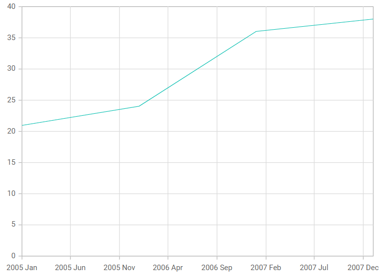

<!-- markdownlint-disable MD036 -->

# DateTime Axis in Blazor Charts Component

## DateTime axis

The [DateTime](https://help.syncfusion.com/cr/blazor/Syncfusion.Blazor.Charts.ValueType.html#Syncfusion_Blazor_Charts_ValueType_DateTime) axis uses a date time scale and displays date time values as axis labels in the format specified.

You can learn how to customize the DateTime axis by watching the video below.



```cshtml

@using Syncfusion.Blazor.Charts

<SfChart>
    <ChartPrimaryXAxis ValueType="Syncfusion.Blazor.Charts.ValueType.DateTime">
    </ChartPrimaryXAxis>

    <ChartSeriesCollection>
        <ChartSeries DataSource="@WeatherReports" XName="XValue" YName="YValue" Type="ChartSeriesType.Line">
        </ChartSeries>
    </ChartSeriesCollection>
</SfChart>

@code{
    public class ChartData
    {
        public DateTime XValue { get; set;}
        public double YValue {get; set;}
    }
	
    public List<ChartData> WeatherReports = new List<ChartData>
	{
		new ChartData { XValue = new DateTime(2005, 01, 01), YValue = 21 },
		new ChartData { XValue = new DateTime(2006, 01, 01), YValue = 24 },
		new ChartData { XValue = new DateTime(2007, 01, 01), YValue = 36 },
		new ChartData { XValue = new DateTime(2008, 01, 01), YValue = 38 },
	};
}

```




## DateTime category axis

The [DateTime Category](https://help.syncfusion.com/cr/blazor/Syncfusion.Blazor.Charts.ValueType.html#Syncfusion_Blazor_Charts_ValueType_DateTimeCategory) axis is used to display date-time values with non-linear intervals. For example, the business days alone can be represented in a week here.

```cshtml

@using Syncfusion.Blazor.Charts

<SfChart>
    <ChartPrimaryXAxis Format="d MMM yyyy" ValueType="Syncfusion.Blazor.Charts.ValueType.DateTimeCategory">
    </ChartPrimaryXAxis>

    <ChartSeriesCollection>
        <ChartSeries DataSource="@WeatherReports" XName="XValue" YName="YValue" Type="ChartSeriesType.Line">
        </ChartSeries>
    </ChartSeriesCollection>
</SfChart>

@code{
    public class ChartData
    {
        public DateTime XValue { get; set; }
        public double YValue { get; set; }
    }
	
    public List<ChartData> WeatherReports = new List<ChartData>
	{
		new ChartData { XValue = new DateTime(2005, 01, 01), YValue = 21 },
		new ChartData { XValue = new DateTime(2006, 01, 01), YValue = 24 },
		new ChartData { XValue = new DateTime(2007, 01, 01), YValue = 36 },
		new ChartData { XValue = new DateTime(2008, 01, 01), YValue = 38 },
	};
}

```



### Range

The axis range will be calculated automatically based on the provided data; however, the axis range can also be customized using [Minimum](https://help.syncfusion.com/cr/blazor/Syncfusion.Blazor.Charts.ChartAxis.html#Syncfusion_Blazor_Charts_ChartAxis_Minimum), [Maximum](https://help.syncfusion.com/cr/blazor/Syncfusion.Blazor.Charts.ChartAxis.html#Syncfusion_Blazor_Charts_ChartAxis_Maximum), and [Interval](https://help.syncfusion.com/cr/blazor/Syncfusion.Blazor.Charts.ChartAxis.html#Syncfusion_Blazor_Charts_ChartAxis_Interval) properties.

```cshtml

@using Syncfusion.Blazor.Charts

<SfChart>
    <ChartPrimaryXAxis  IntervalType="IntervalType.Years" ValueType="Syncfusion.Blazor.Charts.ValueType.DateTime">
    </ChartPrimaryXAxis>

    <ChartSeriesCollection>
        <ChartSeries DataSource="@WeatherReports" XName="XValue" YName="YValue" Type="ChartSeriesType.Line">
        </ChartSeries>
    </ChartSeriesCollection>
</SfChart>

@code{
    public class ChartData
    {
        public DateTime XValue { get; set; }
        public double YValue { get; set; }
    }
	
    public List<ChartData> WeatherReports = new List<ChartData>
	{
		new ChartData { XValue = new DateTime(2016, 4, 1), YValue = 21 },
		new ChartData { XValue = new DateTime(2016, 5, 1), YValue = 24 },
		new ChartData { XValue = new DateTime(2016, 6, 1), YValue = 36 },
		new ChartData { XValue = new DateTime(2016, 7, 1), YValue = 38 },
		new ChartData { XValue = new DateTime(2016, 8, 1), YValue = 46 },
		new ChartData { XValue = new DateTime(2016, 9, 1), YValue = 28 },
		new ChartData { XValue = new DateTime(2016, 10, 1), YValue = 68 }
	};
}

```



### Interval customization

The [Interval](https://help.syncfusion.com/cr/blazor/Syncfusion.Blazor.Charts.ChartAxis.html#Syncfusion_Blazor_Charts_ChartAxis_Interval) and [IntervalType](https://help.syncfusion.com/cr/blazor/Syncfusion.Blazor.Charts.ChartAxis.html#Syncfusion_Blazor_Charts_ChartAxis_IntervalType) properties of the [Axis](https://help.syncfusion.com/cr/blazor/Syncfusion.Blazor.Charts.ChartAxis.html) can be used to customize date time intervals. When interval is set to **2** and interval type is set to **Years**, it considers 2 years to be the interval. The following interval types are supported by the DateTime axis:

* Auto
* Years
* Months
* Days
* Hours
* Minutes
* Seconds

```cshtml

@using Syncfusion.Blazor.Charts

<SfChart>
    
	<ChartPrimaryXAxis Interval="2" IntervalType="IntervalType.Months" ValueType="Syncfusion.Blazor.Charts.ValueType.DateTime">
    </ChartPrimaryXAxis>

    <ChartSeriesCollection>
        <ChartSeries DataSource="@WeatherReports" XName="XValue" YName="YValue" Type="ChartSeriesType.Line">
        </ChartSeries>
    </ChartSeriesCollection>
</SfChart>

@code{
    public class ChartData
    {
        public DateTime XValue { get; set; }
        public double YValue { get; set; }
    }
	
    public List<ChartData> WeatherReports = new List<ChartData>
	{
		new ChartData { XValue = new DateTime(2016, 4, 1), YValue = 21 },
		new ChartData { XValue = new DateTime(2016, 5, 1), YValue = 24 },
		new ChartData { XValue = new DateTime(2016, 6, 1), YValue = 36 },
		new ChartData { XValue = new DateTime(2016, 7, 1), YValue = 38 },
		new ChartData { XValue = new DateTime(2016, 8, 1), YValue = 46 },
		new ChartData { XValue = new DateTime(2016, 9, 1), YValue = 28 },
		new ChartData { XValue = new DateTime(2016, 10, 1), YValue = 68 }
	};
}

```



**Applying padding to the Range**

The [RangePadding](https://help.syncfusion.com/cr/blazor/Syncfusion.Blazor.Charts.ChartAxis.html#Syncfusion_Blazor_Charts_ChartAxis_RangePadding) property can be used to apply padding to the minimum and maximum extremes of range. The following types of padding are supported by the DateTime axis:

* None
* Round
* Additional

**DateTime - None**

When the [RangePadding](https://help.syncfusion.com/cr/blazor/Syncfusion.Blazor.Charts.ChartAxis.html#Syncfusion_Blazor_Charts_ChartAxis_RangePadding) is set to **None**, the minimum and maximum of the axis is based on the data.

```cshtml

@using Syncfusion.Blazor.Charts

<SfChart>
    <ChartPrimaryXAxis RangePadding="ChartRangePadding.None" ValueType="Syncfusion.Blazor.Charts.ValueType.DateTime">
    </ChartPrimaryXAxis>

    <ChartSeriesCollection>
        <ChartSeries DataSource="@WeatherReports" XName="XValue" YName="YValue" Type="ChartSeriesType.Line">
        </ChartSeries>
    </ChartSeriesCollection>
</SfChart>

@code{
    public class ChartData
    {
        public DateTime XValue { get; set; }
        public double YValue { get; set; }
    }
	
    public List<ChartData> WeatherReports = new List<ChartData>
	{
		new ChartData { XValue = new DateTime(2005, 01, 01), YValue = 21 },
		new ChartData { XValue = new DateTime(2006, 01, 01), YValue = 24 },
		new ChartData { XValue = new DateTime(2007, 01, 01), YValue = 36 },
		new ChartData { XValue = new DateTime(2008, 01, 01), YValue = 38 },
    };
}

```



**DateTime - Round**

When the [RangePadding](https://help.syncfusion.com/cr/blazor/Syncfusion.Blazor.Charts.ChartAxis.html#Syncfusion_Blazor_Charts_ChartAxis_RangePadding) property is set to **Round**, the minimum and maximum will be rounded to the nearest possible value divisible by interval.

```cshtml

@using Syncfusion.Blazor.Charts

<SfChart>
    <ChartPrimaryXAxis RangePadding="ChartRangePadding.Round" ValueType="Syncfusion.Blazor.Charts.ValueType.DateTime">
    </ChartPrimaryXAxis>

    <ChartSeriesCollection>
        <ChartSeries DataSource="@WeatherReports" XName="XValue" YName="YValue" Type="ChartSeriesType.Line">
        </ChartSeries>
    </ChartSeriesCollection>
</SfChart>

@code{
    public class ChartData
    {
        public DateTime XValue { get; set; }
        public double YValue { get; set; }
    }
	
    public List<ChartData> WeatherReports = new List<ChartData>
	{
		new ChartData { XValue = new DateTime(2005, 01, 01), YValue = 21 },
		new ChartData { XValue = new DateTime(2006, 01, 01), YValue = 24 },
		new ChartData { XValue = new DateTime(2007, 01, 01), YValue = 36 },
		new ChartData { XValue = new DateTime(2008, 01, 01), YValue = 38 },
    };
}

```


**DateTime - Additional**

When the [RangePadding](https://help.syncfusion.com/cr/blazor/Syncfusion.Blazor.Charts.ChartAxis.html#Syncfusion_Blazor_Charts_ChartAxis_RangePadding) property is set to **Additional**, the interval of an axis will be padded to the minimum and maximum of the axis.

```cshtml

@using Syncfusion.Blazor.Charts

<SfChart>
    <ChartPrimaryXAxis RangePadding="ChartRangePadding.Additional" 
                       ValueType="Syncfusion.Blazor.Charts.ValueType.DateTime"/>

    <ChartSeriesCollection>
        <ChartSeries DataSource="@WeatherReports" XName="@nameof(ChartData.XValue)" YName=@nameof(ChartData.YValue)/>
    </ChartSeriesCollection>
</SfChart>

@code{
    public class ChartData
    {
        public DateTime XValue { get; set; }
        public double YValue { get; set; }
    }
	
    public List<ChartData> WeatherReports = new List<ChartData>
	{
		new ChartData { XValue = new DateTime(2005, 01, 01), YValue = 21 },
		new ChartData { XValue = new DateTime(2006, 01, 01), YValue = 24 },
		new ChartData { XValue = new DateTime(2007, 01, 01), YValue = 36 },
		new ChartData { XValue = new DateTime(2008, 01, 01), YValue = 38 },
    };
}

```


## Label format

Using the [LabelFormat](https://help.syncfusion.com/cr/blazor/Syncfusion.Blazor.Charts.ChartAxis.html#Syncfusion_Blazor_Charts_ChartAxis_LabelFormat) property on an axis, it is possible to format and parse the date to all globalize formats.

```cshtml

@using Syncfusion.Blazor.Charts

<SfChart>
    <ChartPrimaryXAxis LabelFormat="d" ValueType="Syncfusion.Blazor.Charts.ValueType.DateTime"/>
    

    <ChartSeriesCollection>
        <ChartSeries DataSource="@WeatherReports" XName="XValue" YName="YValue" />        
    </ChartSeriesCollection>
</SfChart>

@code{
    public class ChartData
    {
        public DateTime XValue { get; set; }
        public double YValue { get; set; }
    }
	
    public List<ChartData> WeatherReports = new List<ChartData>
	{
		new ChartData { XValue = new DateTime(2005, 01, 01), YValue = 21 },
		new ChartData { XValue = new DateTime(2006, 01, 01), YValue = 24 },
		new ChartData { XValue = new DateTime(2007, 01, 01), YValue = 36 },
		new ChartData { XValue = new DateTime(2008, 01, 01), YValue = 38 },
    };
}

```



The table below shows the results of applying various popular date and time formats to the [LabelFormat](https://help.syncfusion.com/cr/blazor/Syncfusion.Blazor.Charts.ChartAxis.html#Syncfusion_Blazor_Charts_ChartAxis_LabelFormat) property.

<!-- markdownlint-disable MD033 -->

<table>
<tr>
<td><b>Label Value</b></td>
<td><b>Label Format Property Value</b></td>
<td><b>Result </b></td>
<td><b>Description </b></td>
</tr>
<tr>
<td>new Date(2000, 03, 10)</td>
<td>EEEE</td>
<td>Monday</td>
<td>The date is displayed in day format.</td>
</tr>
<tr>
<td>new Date(2000, 03, 10)</td>
<td>yMd</td>
<td>04/10/2000</td>
<td>The date is displayed in month/date/year format.</td>
</tr>
<tr>
<td>new Date(2000, 03, 10)</td>
<td> MMM </td>
<td>Apr</td>
<td>The shorthand month for the date is displayed.</td>
</tr>
<tr>
<td>new Date(2000, 03, 10)</td>
<td>hm</td>
<td>12:00 AM</td>
<td>Time of the date value is displayed as label.</td>
</tr>
<tr>
<td>new Date(2000, 03, 10)</td>
<td>hms</td>
<td>12:00:00 AM</td>
<td>The label is displayed in hours:minutes:seconds format.</td>
</tr>
</table>

<!-- markdownlint-disable MD033 -->

N> Refer to our [Blazor Charts](https://www.syncfusion.com/blazor-components/blazor-charts) feature tour page for its groundbreaking feature representations and also explore our [Blazor Chart Example](https://blazor.syncfusion.com/demos/chart/line?theme=bootstrap5) to know various chart types and how to represent time-dependent data, showing trends at equal intervals.

## See also

* [Data label](./data-labels)
* [Tooltip](./tool-tip)
* [Marker](./data-markers)