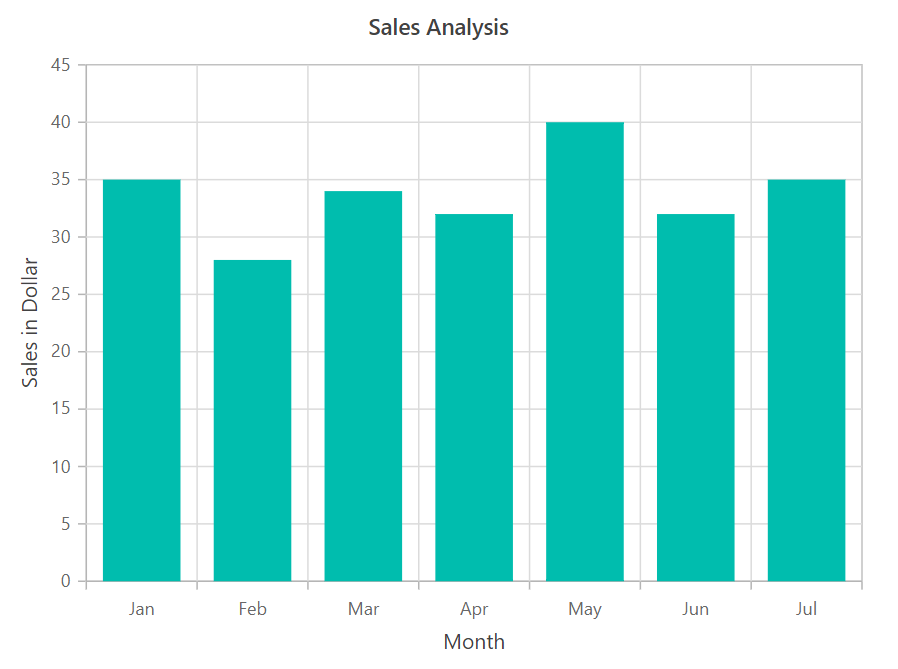

<!-- markdownlint-disable MD040 -->

# Getting Started with Blazor Chart Component in Blazor WASM App

This section briefly explains about how to include [Blazor Charts](https://www.syncfusion.com/blazor-components/blazor-charts) component in your Blazor WebAssembly (WASM) App using Visual Studio.

## Prerequisites

* [System requirements for Blazor components](https://blazor.syncfusion.com/documentation/system-requirements)

## Create a new Blazor App in Visual Studio

You can create **Blazor WebAssembly App** using Visual Studio in one of the following ways,

* [Create a Project using Microsoft Templates](https://docs.microsoft.com/en-us/aspnet/core/blazor/tooling?pivots=windows)

* [Create a Project using Syncfusion Blazor Extension](https://blazor.syncfusion.com/documentation/visual-studio-integration/vs2019-extensions/create-project)

## Install Syncfusion Blazor Charts NuGet in the App

Syncfusion Blazor components are available in [nuget.org](https://www.nuget.org/packages?q=syncfusion.blazor). To use Syncfusion Blazor components in the application, add reference to the corresponding NuGet. Refer to [NuGet packages topic](https://blazor.syncfusion.com/documentation/nuget-packages) for available NuGet packages list with component details.

To add Blazor Chart component in the app, open the NuGet package manager in Visual Studio (*Tools → NuGet Package Manager → Manage NuGet Packages for Solution*), search for [Syncfusion.Blazor.Charts](https://www.nuget.org/packages/Syncfusion.Blazor.Charts) and then install it.

## Register Syncfusion Blazor Service

Open **~/_Imports.razor** file and import the Syncfusion.Blazor namespace.




@using Syncfusion.Blazor




Now, register the Syncfusion Blazor Service in the Blazor WebAssembly App. Here, Syncfusion Blazor Service is registered by setting [IgnoreScriptIsolation](https://help.syncfusion.com/cr/blazor/Syncfusion.Blazor.GlobalOptions.html#Syncfusion_Blazor_GlobalOptions_IgnoreScriptIsolation) property as true to load the scripts externally in the [next steps](#add-script-reference).

* Open **~/Program.cs** file and register the Syncfusion Blazor Service in the client web app.




using Microsoft.AspNetCore.Components.Web;
using Microsoft.AspNetCore.Components.WebAssembly.Hosting;
using Syncfusion.Blazor;

var builder = WebAssemblyHostBuilder.CreateDefault(args);
builder.RootComponents.Add<App>("#app");
builder.RootComponents.Add<HeadOutlet>("head::after");

builder.Services.AddScoped(sp => new HttpClient { BaseAddress = new Uri(builder.HostEnvironment.BaseAddress) });

builder.Services.AddSyncfusionBlazor(options => { options.IgnoreScriptIsolation = true; });
await builder.Build().RunAsync();
....





using Syncfusion.Blazor;

namespace WebApplication1
{
    public class Program
    {
        public static async Task Main(string[] args)
        {
            ....
            builder.Services.AddSyncfusionBlazor(options => { options.IgnoreScriptIsolation = true; });
            await builder.Build().RunAsync();
        }
    }
}




## Add style sheet

Checkout the [Blazor Themes topic](https://blazor.syncfusion.com/documentation/appearance/themes) to learn different ways ([Static Web Assets](https://blazor.syncfusion.com/documentation/appearance/themes#static-web-assets), [CDN](https://blazor.syncfusion.com/documentation/appearance/themes#cdn-reference) and [CRG](https://blazor.syncfusion.com/documentation/common/custom-resource-generator)) to refer themes in Blazor application, and to have the expected appearance for Syncfusion Blazor components. Here, the theme is referred using [Static Web Assets](https://blazor.syncfusion.com/documentation/appearance/themes#static-web-assets). Refer to [Enable static web assets usage](https://blazor.syncfusion.com/documentation/appearance/themes#enable-static-web-assets-usage) topic to use static assets in your project.

To add theme to the app, open the NuGet package manager in Visual Studio (*Tools → NuGet Package Manager → Manage NuGet Packages for Solution*), search for [Syncfusion.Blazor.Themes](https://www.nuget.org/packages/Syncfusion.Blazor.Themes/) and then install it. Then, the theme style sheet from NuGet can be referred as follows,

Refer the theme style sheet from NuGet in the `<head>` of **wwwroot/index.html** file in the client web app.




<head>
    <link href="_content/Syncfusion.Blazor.Themes/bootstrap5.css" rel="stylesheet" />
</head>




## Add script reference

Checkout [Adding Script Reference topic](https://blazor.syncfusion.com/documentation/common/adding-script-references) to learn different ways to add script reference in Blazor Application. In this getting started walk-through, the required scripts are referred using [Static Web Assets](https://blazor.syncfusion.com/documentation/common/adding-script-references#static-web-assets) externally inside the `<head>` as follows. Refer to [Enable static web assets usage](https://blazor.syncfusion.com/documentation/common/adding-script-references#enable-static-web-assets-usage) topic to use static assets in your project.

Refer script in the `<head>` of the **~/index.html** file.




<head>
    ....
    <link href="_content/Syncfusion.Blazor.Themes/bootstrap5.css" rel="stylesheet" />
    
</head>




> Syncfusion recommends to reference scripts using [Static Web Assets](https://blazor.syncfusion.com/documentation/common/adding-script-references#static-web-assets), [CDN](https://blazor.syncfusion.com/documentation/common/adding-script-references#cdn-reference) and [CRG](https://blazor.syncfusion.com/documentation/common/custom-resource-generator) by [disabling JavaScript isolation](https://blazor.syncfusion.com/documentation/common/adding-script-references#disable-javascript-isolation) for better loading performance of the Blazor application.

## Add Blazor Chart Component

* Open **~/_Imports.razor** file or any other page under the `~/Pages` folder where the component is to be added and import the **Syncfusion.Blazor.Charts** namespace.




@using Syncfusion.Blazor
@using Syncfusion.Blazor.Charts




* Now, add the Syncfusion Chart component in razor file. Here, the Chart component is added in the **~/Pages/Index.razor** file under the **~/Pages** folder.




<SfChart>

</SfChart>




* Press <kbd>Ctrl</kbd>+<kbd>F5</kbd> (Windows) or <kbd>⌘</kbd>+<kbd>F5</kbd> (macOS) to run the application. Then, the Syncfusion `Blazor Chart` component will be rendered in the default web browser.

## Populate chart with data

To bind data for the chart component, you can assign a IEnumerable object to the [DataSource](https://help.syncfusion.com/cr/blazor/Syncfusion.Blazor.Charts.ChartSeries.html#Syncfusion_Blazor_Charts_ChartSeries_DataSource) property. It can also be provided as an instance of the [DataManager](https://help.syncfusion.com/cr/blazor/Syncfusion.Blazor.DataManager.html).




public class SalesInfo
{
    public string Month { get; set; }
    public double SalesValue { get; set; }
}

public List<SalesInfo> Sales = new List<SalesInfo>
{
    new SalesInfo { Month = "Jan", SalesValue = 35 },
    new SalesInfo { Month = "Feb", SalesValue = 28 },
    new SalesInfo { Month = "Mar", SalesValue = 34 },
    new SalesInfo { Month = "Apr", SalesValue = 32 },
    new SalesInfo { Month = "May", SalesValue = 40 },
    new SalesInfo { Month = "Jun", SalesValue = 32 },
    new SalesInfo { Month = "Jul", SalesValue = 35 }
};




Now, map the data fields  `Month` and `Sales` to the series [XName](https://help.syncfusion.com/cr/blazor/Syncfusion.Blazor.Charts.ChartSeries.html#Syncfusion_Blazor_Charts_ChartSeries_XName) and [YName](https://help.syncfusion.com/cr/blazor/Syncfusion.Blazor.Charts.ChartSeries.html#Syncfusion_Blazor_Charts_ChartSeries_YName) properties, then set the data to the [DataSource](https://help.syncfusion.com/cr/blazor/Syncfusion.Blazor.Charts.ChartSeries.html#Syncfusion_Blazor_Charts_ChartSeries_DataSource) property, and the [chart type](https://help.syncfusion.com/cr/blazor/Syncfusion.Blazor.Charts.ChartSeries.html#Syncfusion_Blazor_Charts_ChartSeries_Type) to **Column** because we will be viewing the data in a column chart.




<SfChart>
    <ChartPrimaryXAxis ValueType="Syncfusion.Blazor.Charts.ValueType.Category"></ChartPrimaryXAxis>
    <ChartSeriesCollection>
        <ChartSeries DataSource="@Sales" XName="Month" YName="SalesValue" Type="ChartSeriesType.Column">
        </ChartSeries>
    </ChartSeriesCollection>
</SfChart>

@code {
    public class SalesInfo
    {
        public string Month { get; set;}
        public double SalesValue { get; set;}
    }
    
    public List<SalesInfo> Sales = new List<SalesInfo>
    {
        new SalesInfo { Month = "Jan", SalesValue = 35 },
        new SalesInfo { Month = "Feb", SalesValue = 28 },
        new SalesInfo { Month = "Mar", SalesValue = 34 },
        new SalesInfo { Month = "Apr", SalesValue = 32 },
        new SalesInfo { Month = "May", SalesValue = 40 },
        new SalesInfo { Month = "Jun", SalesValue = 32 },
        new SalesInfo { Month = "Jul", SalesValue = 35 }
    };
}




## Add titles

Using the [Title](https://help.syncfusion.com/cr/blazor/Syncfusion.Blazor.Charts.SfChart.html#Syncfusion_Blazor_Charts_SfChart_Title) property, you can add a title to the chart and the axes to provide the user with quick information about the data plotted in the chart.




<SfChart Title="Sales Analysis">
    <ChartPrimaryXAxis Title="Month" ValueType="Syncfusion.Blazor.Charts.ValueType.Category"></ChartPrimaryXAxis>
    <ChartPrimaryYAxis Title="Sales in Dollar"></ChartPrimaryYAxis>
    <ChartSeriesCollection>
        <ChartSeries DataSource="@Sales" XName="Month" YName="SalesValue" Type="ChartSeriesType.Column">
        </ChartSeries>
    </ChartSeriesCollection>
</SfChart>




## Add data label

You can add data labels to improve the readability of the chart. This can be achieved by setting the [Visible](https://help.syncfusion.com/cr/blazor/Syncfusion.Blazor.Charts.ChartDataLabel.html#Syncfusion_Blazor_Charts_ChartDataLabel_Visible) property to **true** in the [ChartDataLabel](https://help.syncfusion.com/cr/blazor/Syncfusion.Blazor.Charts.ChartDataLabel.html).




<SfChart Title="Sales Analysis">
    <ChartPrimaryXAxis Title="Month" ValueType="Syncfusion.Blazor.Charts.ValueType.Category"></ChartPrimaryXAxis>
    <ChartPrimaryYAxis Title="Sales in Dollar"></ChartPrimaryYAxis>
    <ChartSeriesCollection>
        <ChartSeries DataSource="@Sales" XName="Month" YName="SalesValue" Type="ChartSeriesType.Column">
            <ChartMarker>
                <ChartDataLabel Visible="true"></ChartDataLabel>
            </ChartMarker>
        </ChartSeries>
    </ChartSeriesCollection>
</SfChart>




## Enable Tooltip

When space constraints prevent you from displaying information using data labels, the tooltip comes in handy. The tooltip can be enabled by setting the [Enable](https://help.syncfusion.com/cr/blazor/Syncfusion.Blazor.Charts.ChartTooltipSettings.html#Syncfusion_Blazor_Charts_ChartTooltipSettings_Enable) property in [ChartTooltipSettings](https://help.syncfusion.com/cr/blazor/Syncfusion.Blazor.Charts.ChartTooltipSettings.html) to **true**.




<SfChart Title="Sales Analysis">
    <ChartPrimaryXAxis Title="Month" ValueType="Syncfusion.Blazor.Charts.ValueType.Category"></ChartPrimaryXAxis>
    <ChartPrimaryYAxis Title="Sales in Dollar"></ChartPrimaryYAxis>
    <ChartTooltipSettings Enable="true"></ChartTooltipSettings>
    <ChartSeriesCollection>
        <ChartSeries DataSource="@Sales" XName="Month" YName="SalesValue" Type="ChartSeriesType.Column">
        </ChartSeries>
    </ChartSeriesCollection>
</SfChart>




## Enable legend

You can use legend for the chart by setting the [Visible](https://help.syncfusion.com/cr/blazor/Syncfusion.Blazor.Charts.ChartLegendSettings.html#Syncfusion_Blazor_Charts_ChartLegendSettings_Visible) property to **true** in [ChartLegendSettings](https://help.syncfusion.com/cr/blazor/Syncfusion.Blazor.Charts.ChartLegendSettings.html). The legend name can be changed by using the [Name](https://help.syncfusion.com/cr/blazor/Syncfusion.Blazor.Charts.ChartSeries.html#Syncfusion_Blazor_Charts_ChartSeries_Name) property in the series.




<SfChart Title="Sales Analysis">
    <ChartPrimaryXAxis Title="Month" ValueType="Syncfusion.Blazor.Charts.ValueType.Category"></ChartPrimaryXAxis>
    <ChartPrimaryYAxis Title="Sales in Dollar"></ChartPrimaryYAxis>
    <ChartLegendSettings Visible="true"></ChartLegendSettings>
    <ChartSeriesCollection>
        <ChartSeries DataSource="@Sales" Name="Sales" XName="Month" YName="SalesValue" Type="ChartSeriesType.Column">
        </ChartSeries>
    </ChartSeriesCollection>
</SfChart>




> [View Sample in GitHub](https://github.com/SyncfusionExamples/Blazor-Getting-Started-Examples/tree/main/Chart)

## See also

* [Getting Started with Syncfusion Blazor for Client-Side in .NET Core CLI](https://blazor.syncfusion.com/documentation/getting-started/blazor-webassembly-dotnet-cli/)
* [Getting Started with Syncfusion Blazor for Server-Side in Visual Studio](https://blazor.syncfusion.com/documentation/getting-started/blazor-server-side-visual-studio)
* [Getting Started with Syncfusion Blazor for Server-Side in .NET Core CLI](https://blazor.syncfusion.com/documentation/getting-started/blazor-server-side-dotnet-cli/)