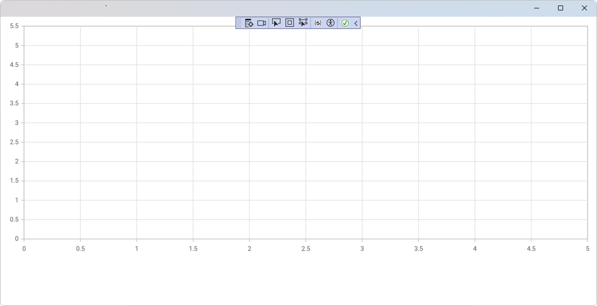

# Getting Started with Blazor Chart

This section explains you through the step-by-step process of integrating the Syncfusion<sup style="font-size:70%">&reg;</sup> Blazor Chart component into your Blazor MAUI application using both Visual Studio and Visual Studio Code.

> **Ready to streamline your Syncfusion<sup style="font-size:70%">&reg;</sup> Blazor development?** <br/>Discover the full potential of Syncfusion<sup style="font-size:70%">&reg;</sup> Blazor components with Syncfusion<sup style="font-size:70%">&reg;</sup> AI Coding Assistant. Effortlessly integrate, configure, and enhance your projects with intelligent, context-aware code suggestions, streamlined setups, and real-time insights—all seamlessly integrated into your preferred AI-powered IDEs like VS Code, Cursor, Syncfusion<sup style="font-size:70%">&reg;</sup> CodeStudio and more. [Explore Syncfusion<sup style="font-size:70%">&reg;</sup> AI Coding Assistant](https://blazor.syncfusion.com/documentation/ai-coding-assistant/overview)





## Prerequisites

To use the MAUI project templates, install the Mobile development with the .NET extension for Visual Studio. For more details, refer to [here](https://learn.microsoft.com/en-us/dotnet/MAUI/get-started/installation?tabs=vswin) or the [Syncfusion® Blazor Extension](https://blazor.syncfusion.com/documentation/visual-studio-integration/template-studio).

## Create a new Blazor MAUI App in Visual Studio

You can create a Blazor MAUI App using Visual Studio via [Microsoft Templates](https://learn.microsoft.com/en-us/dotnet/maui/get-started/first-app?pivots=devices-windows&view=net-maui-9.0&tabs=vswin). For detailed instructions, refer to [this Blazor MAUI App Getting Started](https://blazor.syncfusion.com/documentation/getting-started/maui-blazor-app) documentation.

## Install Syncfusion<sup style="font-size:70%">&reg;</sup> Blazor Charts NuGet in the app

To add **Blazor Chart**  component in the app, open the NuGet package manager in Visual Studio (Tools → NuGet Package Manager → Manage NuGet Packages for Solution), search and install [Syncfusion.Blazor.Charts](https://www.nuget.org/packages/Syncfusion.Blazor.Charts).




Install-Package Syncfusion.Blazor.Charts -Version {{ site.releaseversion }}




N> Syncfusion<sup style="font-size:70%">&reg;</sup> Blazor components are available in [nuget.org](https://www.nuget.org/packages?q=syncfusion.blazor). Refer to [NuGet packages](https://blazor.syncfusion.com/documentation/nuget-packages) topic for available NuGet packages list with component details.





## Prerequisites

To use the MAUI project templates, install the Mobile development with the .NET extension for Visual Studio Code. For more details, refer to [here](https://learn.microsoft.com/en-us/dotnet/maui/get-started/installation?view=net-maui-9.0&tabs=visual-studio-code) or the [Syncfusion® Blazor Extension](https://blazor.syncfusion.com/documentation/visual-studio-code-integration/create-project).

## Create a new Blazor MAUI App in Visual Studio Code

You can create a Blazor MAUI App using Visual Studio Code via [Microsoft Templates](https://learn.microsoft.com/en-us/dotnet/maui/get-started/first-app?pivots=devices-windows&view=net-maui-9.0&tabs=visual-studio-code) or the [Syncfusion® Blazor Extension](https://blazor.syncfusion.com/documentation/visual-studio-code-integration/create-project). For detailed instructions, refer to [this Blazor MAUI App Getting Started](https://blazor.syncfusion.com/documentation/getting-started/maui-blazor-app) documentation.

## Install Blazor Charts NuGet in the App

To add **Blazor Chart**  component in the app, open the NuGet package manager in Visual Studio (Tools → NuGet Package Manager → Manage NuGet Packages for Solution), search and install [Syncfusion.Blazor.Charts](https://www.nuget.org/packages/Syncfusion.Blazor.Charts).





dotnet add package Syncfusion.Blazor.Charts -v {{ site.releaseversion }}
dotnet restore





N> Syncfusion<sup style="font-size:70%">&reg;</sup> Blazor components are available in [nuget.org](https://www.nuget.org/packages?q=syncfusion.blazor). Refer to [NuGet packages](https://blazor.syncfusion.com/documentation/nuget-packages) topic for available NuGet packages list with component details.





## Add Import Namespaces

Open the **~/_Imports.razor** file and import the `Syncfusion.Blazor` and `Syncfusion.Blazor.Charts` namespace.




@using Syncfusion.Blazor 
@using Syncfusion.Blazor.Charts




## Register Syncfusion<sup style="font-size:70%">&reg;</sup> Blazor Service

Register the Syncfusion<sup style="font-size:70%">&reg;</sup> Blazor Service in the **~/MauiProgram.cs** file.




using Microsoft.Extensions.Logging;
using Syncfusion.Blazor;

namespace MauiBlazorWindow;

    public static class MauiProgram
    {
        public static MauiApp CreateMauiApp()
        {
            var builder = MauiApp.CreateBuilder();
            builder
                .UseMauiApp<App>()
                .ConfigureFonts(fonts =>
                {
                    fonts.AddFont("OpenSans-Regular.ttf", "OpenSansRegular");
                });

            builder.Services.AddMauiBlazorWebView();
            builder.Services.AddSyncfusionBlazor();
#if DEBUG
            builder.Services.AddBlazorWebViewDeveloperTools();
            builder.Logging.AddDebug();
#endif

            return builder.Build();
        }
    }




## Add script resources

The theme stylesheet and script can be accessed from NuGet through [Static Web Assets](https://blazor.syncfusion.com/documentation/appearance/themes#static-web-assets). Include the stylesheet and script references in the `<head>` section of the **~/index.html** file.

```html
<head>
    ....
    <script src="_content/Syncfusion.Blazor.Core/scripts/syncfusion-blazor.min.js" type="text/javascript"></script>

    //Blazor Chart Component script reference.
    <!-- <script src="_content/Syncfusion.Blazor.Charts/scripts/sf-chart.min.js" type="text/javascript"></script> -->
</head>
```

N> Check out the [Blazor Themes](https://blazor.syncfusion.com/documentation/appearance/themes) topic to discover various methods ([Static Web Assets](https://blazor.syncfusion.com/documentation/appearance/themes#static-web-assets), [CDN](https://blazor.syncfusion.com/documentation/appearance/themes#cdn-reference), and [CRG](https://blazor.syncfusion.com/documentation/common/custom-resource-generator)) for referencing themes in your Blazor application. Also, check out the [Adding Script Reference](https://blazor.syncfusion.com/documentation/common/adding-script-references) topic to learn different approaches for adding script references in your Blazor application.

## Add Blazor Chart component

Add the Syncfusion<sup style="font-size:70%">&reg;</sup> Blazor Chart component in the **~/Pages/Home.razor** file.




<SfChart>

</SfChart>




### How to Run the Sample on Windows

Run the sample in Windows Machine mode, and it will run Blazor MAUI in Windows.



### How to Run the Sample on Android

To run the Blazor Chart in a Blazor Android MAUI application using the Android emulator, follow these steps:

Refer [here](https://learn.microsoft.com/en-us/dotnet/maui/android/emulator/device-manager#android-device-manager-on-windows) to install and launch Android emulator.

N> If you encounter any errors while using the Android Emulator, refer to the following link for troubleshooting guidance[Troubleshooting Android Emulator](https://learn.microsoft.com/en-us/dotnet/maui/android/emulator/troubleshooting).


## See also

* [Getting Started with Syncfusion<sup style="font-size:70%">&reg;</sup> Blazor Web Assembly App in Visual Studio or .NET CLI](https://blazor.syncfusion.com/documentation/getting-started/blazor-webassembly-app)
* [Getting Started with Syncfusion<sup style="font-size:70%">&reg;</sup> Blazor Web App in Visual Studio or .NET CLI](https://blazor.syncfusion.com/documentation/getting-started/blazor-web-app)
