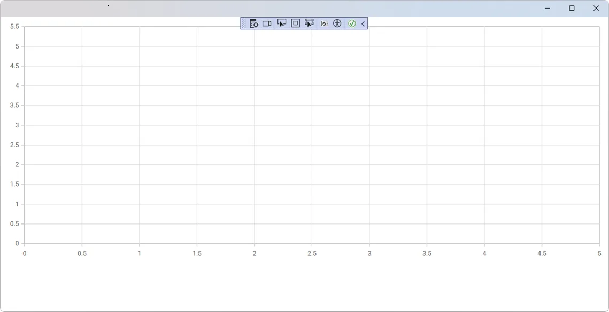
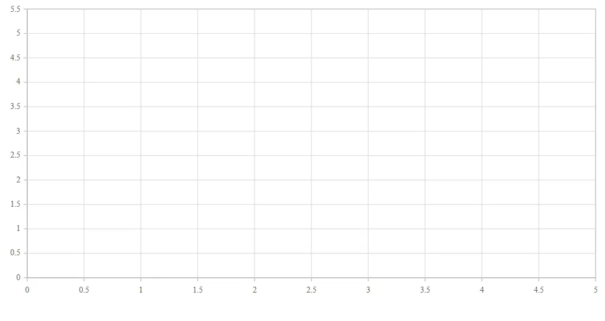

# Getting Started with Blazor Chart

This section explains you through the step-by-step process of integrating the [Syncfusion<sup style="font-size:70%">&reg;</sup> Blazor Charts](https://www.syncfusion.com/blazor-components/blazor-charts) component in your Blazor MAUI App using both [Visual Studio](https://visualstudio.microsoft.com/vs/) and [Visual Studio Code](https://code.visualstudio.com/).

> **Ready to streamline your Syncfusion<sup style="font-size:70%">&reg;</sup> Blazor development?** <br/>Discover the full potential of Syncfusion<sup style="font-size:70%">&reg;</sup> Blazor components with Syncfusion<sup style="font-size:70%">&reg;</sup> AI Coding Assistants. Effortlessly integrate, configure, and enhance your projects with intelligent, context-aware code suggestions, streamlined setups, and real-time insights—all seamlessly integrated into your preferred AI-powered IDEs like VS Code, Cursor, Syncfusion<sup style="font-size:70%">&reg;</sup> CodeStudio and more. [Explore Syncfusion<sup style="font-size:70%">&reg;</sup> AI Coding Assistants](https://blazor.syncfusion.com/documentation/ai-coding-assistant/overview)





## Prerequisites

To use the MAUI project templates, install the Mobile development with the .NET extension for Visual Studio. For more details, refer to [here](https://learn.microsoft.com/en-us/dotnet/MAUI/get-started/installation?tabs=vswin) or the [Syncfusion® Blazor Extension](https://blazor.syncfusion.com/documentation/visual-studio-integration/template-studio).

## Create a new Blazor MAUI App in Visual Studio

Create a Blazor MAUI App using Visual Studio via [Microsoft Templates](https://learn.microsoft.com/en-us/dotnet/maui/get-started/first-app?pivots=devices-windows&view=net-maui-9.0&tabs=vswin). For detailed instructions, refer to the [Blazor MAUI App Getting Started](https://blazor.syncfusion.com/documentation/getting-started/maui-blazor-app) documentation.





## Prerequisites

To use the MAUI project templates, install the Mobile development with the .NET extension for Visual Studio Code. For more details, refer to [here](https://learn.microsoft.com/en-us/dotnet/maui/get-started/installation?view=net-maui-9.0&tabs=visual-studio-code) or the [Syncfusion® Blazor Extension](https://blazor.syncfusion.com/documentation/visual-studio-code-integration/create-project).

## Create a new Blazor MAUI App in Visual Studio Code

Create a Blazor MAUI App using Visual Studio Code via [Microsoft Templates](https://learn.microsoft.com/en-us/dotnet/maui/get-started/first-app?pivots=devices-windows&view=net-maui-9.0&tabs=visual-studio-code) or the [Syncfusion® Blazor Extension](https://blazor.syncfusion.com/documentation/visual-studio-code-integration/create-project). For detailed instructions, refer to the [Blazor MAUI App Getting Started](https://blazor.syncfusion.com/documentation/getting-started/maui-blazor-app) documentation.

Alternatively, create a MAUI application by using the following command in the integrated terminal (<kbd>Ctrl</kbd>+<kbd>`</kbd>).




dotnet new maui-blazor -o MauiBlazorApp
cd MauiBlazorApp








## Install Syncfusion<sup style="font-size:70%">&reg;</sup> Blazor packages

Install [Syncfusion.Blazor.Charts](https://www.nuget.org/packages/Syncfusion.Blazor.Charts/) NuGet package in your project using the NuGet Package Manager in Visual Studio (*Tools → NuGet Package Manager → Manage NuGet Packages for Solution*), or the integrated terminal in Visual Studio Code (`dotnet add package`).

Alternatively, run the following command in the Package Manager Console to achieve the same.




Install-Package Syncfusion.Blazor.Charts -Version {{ site.releaseversion }}




N> All Syncfusion Blazor packages are available on [nuget.org](https://www.nuget.org/packages?q=syncfusion.blazor). See the [NuGet packages](https://blazor.syncfusion.com/documentation/nuget-packages) topic for details.

## Add import namespaces

After the package is installed, open the **~/_Imports.razor** file and import the `Syncfusion.Blazor` and `Syncfusion.Blazor.Charts` namespaces.




@using Syncfusion.Blazor 
@using Syncfusion.Blazor.Charts




## Register Syncfusion<sup style="font-size:70%">&reg;</sup> Blazor service

Register the Syncfusion<sup style="font-size:70%">&reg;</sup> Blazor service in the **~/MauiProgram.cs** file.




....
using Syncfusion.Blazor;

....

public static class MauiProgram
{
    public static MauiApp CreateMauiApp()
    {
        ....
        builder.Services.AddSyncfusionBlazor();
        ....
    }
}




## Add script resources

The script can be accessed from NuGet through [Static Web Assets](https://blazor.syncfusion.com/documentation/appearance/themes#static-web-assets). Include the script reference in the **~/index.html** file.

```html

<script src="_content/Syncfusion.Blazor.Core/scripts/syncfusion-blazor.min.js" type="text/javascript"></script>

```

N> Check out the [Adding Script Reference](https://blazor.syncfusion.com/documentation/common/adding-script-references) topic to learn different approaches for adding script references in your Blazor application.

## Add Syncfusion<sup style="font-size:70%">&reg;</sup> Blazor Chart component

Add the Syncfusion<sup style="font-size:70%">&reg;</sup> Blazor Chart component in the **~/Pages/Home.razor** file.




<SfChart>

</SfChart>




### How to run the sample on windows

Run the sample in Windows Machine mode, and it will run Blazor MAUI in Windows.



### How to run the sample on android

To run the Blazor Chart in a Blazor Android MAUI application using the Android emulator, follow these steps:

Refer [here](https://learn.microsoft.com/en-us/dotnet/maui/android/emulator/device-manager#android-device-manager-on-windows) to install and launch Android emulator.

N> If you encounter any errors while using the Android Emulator, refer to the following link for troubleshooting guidance[Troubleshooting Android Emulator](https://learn.microsoft.com/en-us/dotnet/maui/android/emulator/troubleshooting).



## See also

* [Getting Started with Syncfusion<sup style="font-size:70%">&reg;</sup> Blazor Web Assembly App in Visual Studio or .NET CLI](https://blazor.syncfusion.com/documentation/getting-started/blazor-webassembly-app)
* [Getting Started with Syncfusion<sup style="font-size:70%">&reg;</sup> Blazor Web App in Visual Studio or .NET CLI](https://blazor.syncfusion.com/documentation/getting-started/blazor-web-app)
