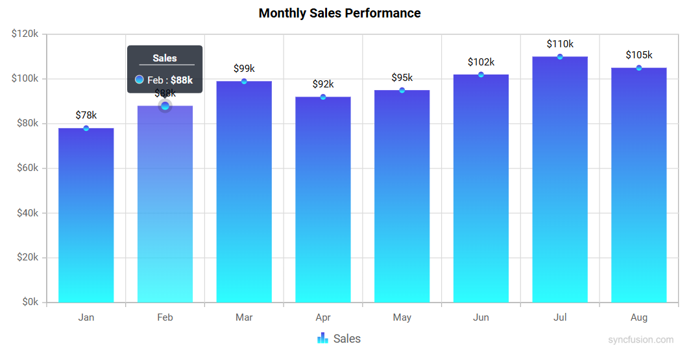
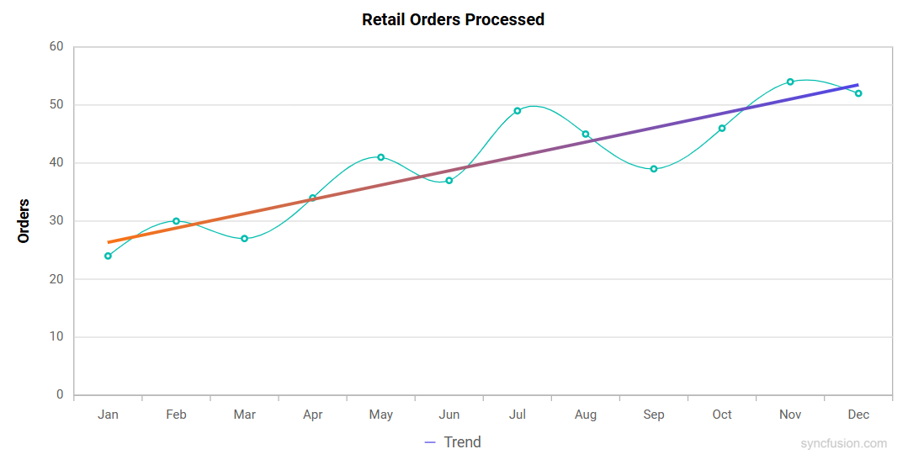
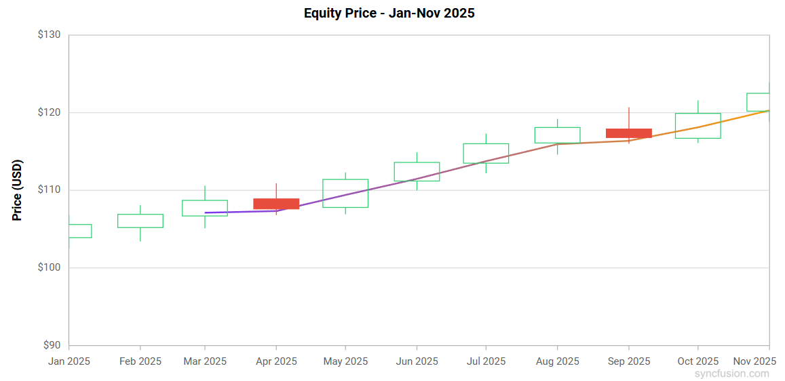
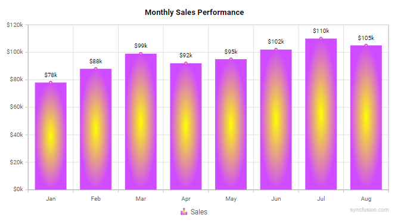

# Gradient in Blazor Charts Component

Gradients add depth and modern styling to charts by smoothly blending multiple colors. The Charts component supports two gradient types:

- Linear gradient
- Radial gradient

Gradients can be applied to:

- Series
- Trendlines
- Technical Indicators

## Linear gradient

A linear gradient blends colors along a straight path from a defined start point to an end point. Configure it by adding `ChartLinearGradient` inside the target element (Series, Trendline, or Indicator) and define one or more color stops that control how colors transition across the gradient. Set the start and end positions of the gradient using `X1`, `Y1`, `X2`, and `Y2` properties. The color stop values such as `Offset`, `Color`, `Opacity`, `Lighten`, and `Brighten` are set using the `ChartGradientColorStop` property.

In the `ChartLinearGradient`:
```
X1 - Sets the horizontal start position of the gradient (0 to 1).
Y1 - Sets the vertical start position of the gradient (0 to 1).
X2 - Sets the horizontal end position of the gradient (0 to 1).
Y2 - Sets the vertical end position of the gradient (0 to 1).
```

In the `ChartGradientColorStop`:
- Offset - Specifies the position of the color stop along the gradient (0 to 100).
- Color - Sets the color at the stop.
- Opacity - Defines the transparency of the stop (0 to 1).
- Lighten - Adjusts lightness at the stop. Positive values lighten the color; negative values darken it.
- Brighten - Adjusts brightness at the stop. Positive values increase brightness; negative values decrease it.

### Series

Apply a linear gradient to a series by adding `ChartLinearGradient` inside the target Series. The same gradient is applied to the series markers, legend symbol and tooltip marker for visual consistency.

```

@using Syncfusion.Blazor.Charts

@* Initialize the Chart to display monthly sales revenue by month using Column series *@
<SfChart Title="Monthly Sales Performance">
    <ChartPrimaryXAxis ValueType="Syncfusion.Blazor.Charts.ValueType.Category" />
    <ChartPrimaryYAxis LabelFormat="${value}k" />

    <ChartSeriesCollection>
        <ChartSeries Name="Sales" Type="ChartSeriesType.Column" DataSource="@SalesData" XName="Month" YName="Amount">
            @* Series Linear Gradient: defines color stops for the entire series *@
            <ChartLinearGradient X1="0" Y1="0" X2="0" Y2="1">
                <ChartGradientColorStops>
                    <ChartGradientColorStop Offset="0" Color="#4F46E5" Opacity="1" Lighten="0" Brighten="1" />
                    <ChartGradientColorStop Offset="100" Color="#22D3EE" Opacity="0.95" Lighten="-0.05" Brighten="0.9" />
                </ChartGradientColorStops>
            </ChartLinearGradient>

            <ChartMarker Visible="true" IsFilled="true">
                <ChartDataLabel Visible="true"></ChartDataLabel>
            </ChartMarker>
        </ChartSeries>
    </ChartSeriesCollection>

    <ChartTooltipSettings Enable="true"></ChartTooltipSettings>
    <ChartLegendSettings Visible="true"></ChartLegendSettings>
</SfChart>

@code {
    public class SalesPoint
    {
        public string Month { get; set; }
        public double Amount { get; set; }
    }

    public List<SalesPoint> SalesData = new ()
    {
        new SalesPoint { Month = "Jan", Amount = 78 },
        new SalesPoint { Month = "Feb", Amount = 88 },
        new SalesPoint { Month = "Mar", Amount = 99 },
        new SalesPoint { Month = "Apr", Amount = 92 },
        new SalesPoint { Month = "May", Amount = 95 },
        new SalesPoint { Month = "Jun", Amount = 102 },
        new SalesPoint { Month = "Jul", Amount = 110 },
        new SalesPoint { Month = "Aug", Amount = 105 }
    };
}

```


### Trendlines

Apply a linear gradient to a trendline by adding `ChartLinearGradient` inside the target Trendline.

```

@using Syncfusion.Blazor.Charts

@* Initialize the Chart to display orders processed by month using Spline series *@
<SfChart Title="Retail Orders Processed">
    <ChartPrimaryXAxis ValueType="Syncfusion.Blazor.Charts.ValueType.Category">
        <ChartAxisMajorGridLines Width="0"></ChartAxisMajorGridLines>
    </ChartPrimaryXAxis>
    <ChartPrimaryYAxis Title="Orders">
        <ChartAxisLineStyle Width="0"></ChartAxisLineStyle>
        <ChartAxisMajorTickLines Width="0"></ChartAxisMajorTickLines>
    </ChartPrimaryYAxis>

    <ChartSeriesCollection>
        <ChartSeries DataSource="@OrdersData" XName="Month" YName="Orders" Type="ChartSeriesType.Spline">
            <ChartMarker Visible="true"></ChartMarker>
            <ChartTrendlines>
                <ChartTrendline Type="TrendlineTypes.Linear" Width="3" Name="Trend">
                    @* Trendline Linear Gradient: applied to trendline stroke *@
                    <ChartLinearGradient X1="0" Y1="0" X2="1" Y2="0">
                        <ChartGradientColorStops>
                            <ChartGradientColorStop Offset="0" Color="#F97316" Opacity="1" />
                            <ChartGradientColorStop Offset="100" Color="#4F46E5" Opacity="1" />
                        </ChartGradientColorStops>
                    </ChartLinearGradient>
                </ChartTrendline>
            </ChartTrendlines>
        </ChartSeries>
    </ChartSeriesCollection>

    <ChartLegendSettings Visible="true"></ChartLegendSettings>
</SfChart>

@code {
    public class OrdersPoint
    {
        public string Month { get; set; }
        public double Orders { get; set; }
    }

    public List<OrdersPoint> OrdersData = new ()
    {
        new OrdersPoint { Month = "Jan", Orders = 24 },
        new OrdersPoint { Month = "Feb", Orders = 30 },
        new OrdersPoint { Month = "Mar", Orders = 27 },
        new OrdersPoint { Month = "Apr", Orders = 34 },
        new OrdersPoint { Month = "May", Orders = 41 },
        new OrdersPoint { Month = "Jun", Orders = 37 },
        new OrdersPoint { Month = "Jul", Orders = 49 },
        new OrdersPoint { Month = "Aug", Orders = 45 },
        new OrdersPoint { Month = "Sep", Orders = 39 },
        new OrdersPoint { Month = "Oct", Orders = 46 },
        new OrdersPoint { Month = "Nov", Orders = 54 },
        new OrdersPoint { Month = "Dec", Orders = 52 }
    };
}

```


### Technical Indicators

Apply a linear gradient to a technical indicator by adding `ChartLinearGradient` inside the target Indicator.

```

@using Syncfusion.Blazor.Charts

@* Initialize the Chart to display equity price by month using Candle series and EMA indicator *@
<SfChart Title="Equity Price - Jan-Nov 2025">
    <ChartPrimaryXAxis ValueType="Syncfusion.Blazor.Charts.ValueType.DateTime" LabelFormat="MMM yyyy" IntervalType="IntervalType.Months" EdgeLabelPlacement="EdgeLabelPlacement.Shift">
        <ChartAxisMajorGridLines Width="0"></ChartAxisMajorGridLines>
    </ChartPrimaryXAxis>
    <ChartPrimaryYAxis Title="Price (USD)" LabelFormat="${value}" Minimum="90" Maximum="130" Interval="10">
        <ChartAxisLineStyle Width="0"></ChartAxisLineStyle>
        <ChartAxisMajorTickLines Width="0"></ChartAxisMajorTickLines>
    </ChartPrimaryYAxis>

    <ChartSeriesCollection>
        <ChartSeries DataSource="@PriceSeries" Name="Equity Price" XName="Date" Low="Low" High="High" Close="Close" Volume="Volume" Open="Open" Type="ChartSeriesType.Candle">
        </ChartSeries>
    </ChartSeriesCollection>

    <ChartIndicators>
        <ChartIndicator Type="TechnicalIndicators.Ema" Field="FinancialDataFields.Close" SeriesName="Equity Price" XName="Date" Period="3" Width="2">
            @* Indicator Linear Gradient: applied to the EMA indicator line *@
            <ChartLinearGradient X1="0" Y1="0" X2="1" Y2="0">
                <ChartGradientColorStops>
                    <ChartGradientColorStop Offset="0" Color="#7C3AED" Opacity="1" />
                    <ChartGradientColorStop Offset="100" Color="#F59E0B" Opacity="1" />
                </ChartGradientColorStops>
            </ChartLinearGradient>
        </ChartIndicator>
    </ChartIndicators>

    <ChartTooltipSettings Enable="true"></ChartTooltipSettings>
    <ChartLegendSettings Visible="false"></ChartLegendSettings>
</SfChart>

@code {
    public class EMAChartData
    {
        public DateTime Date { get; set; }
        public double Open  { get; set; }
        public double High  { get; set; }
        public double Low   { get; set; }
        public double Close { get; set; }
        public double Volume { get; set; }
    }

    public List<EMAChartData> PriceSeries = new ()
    {
        new EMAChartData { Date = new DateTime(2025, 01, 01), Open = 103.9, High = 106.8, Low = 102.5, Close = 105.6, Volume = 182540000 },
        new EMAChartData { Date = new DateTime(2025, 02, 01), Open = 105.2, High = 108.1, Low = 103.4, Close = 106.9, Volume = 176310000 },
        new EMAChartData { Date = new DateTime(2025, 03, 01), Open = 106.7, High = 110.6, Low = 105.1, Close = 108.7, Volume = 189250000 },
        new EMAChartData { Date = new DateTime(2025, 04, 01), Open = 108.9, High = 110.9, Low = 106.8, Close = 107.6, Volume = 171900000 },
        new EMAChartData { Date = new DateTime(2025, 05, 01), Open = 107.8, High = 112.3, Low = 106.9, Close = 111.4, Volume = 196700000 },
        new EMAChartData { Date = new DateTime(2025, 06, 01), Open = 111.2, High = 114.9, Low = 110.0, Close = 113.6, Volume = 205600000 },
        new EMAChartData { Date = new DateTime(2025, 07, 01), Open = 113.5, High = 117.3, Low = 112.2, Close = 116.0, Volume = 213400000 },
        new EMAChartData { Date = new DateTime(2025, 08, 01), Open = 116.1, High = 119.2, Low = 114.6, Close = 118.1, Volume = 221900000 },
        new EMAChartData { Date = new DateTime(2025, 09, 01), Open = 117.9, High = 120.7, Low = 116.0, Close = 116.8, Volume = 198300000 },
        new EMAChartData { Date = new DateTime(2025, 10, 01), Open = 116.7, High = 121.6, Low = 116.1, Close = 119.9, Volume = 234600000 },
        new EMAChartData { Date = new DateTime(2025, 11, 01), Open = 120.2, High = 123.9, Low = 118.8, Close = 122.5, Volume = 226100000 }
    };
}

```


## Radial gradient

A radial gradient blends colors outward from a central point, creating a circular or elliptical color progression. Configure it by adding `ChartRadialGradient` inside the target element (Series, Trendline, or Indicator) and define one or more color stops to control how colors transition from the center to the outer edge. Set the gradient’s center, optional focal point, and radius using `ChartRadialGradient` properties. The color stop values such as `Offset`, `Color`, `Opacity`, `Lighten`, and `Brighten` are set using the `ChartGradientColorStop` property.

In the `ChartRadialGradient`:
```
Cx - Sets the normalized horizontal center of the gradient (0 to 1).
Cy - Sets the normalized vertical center of the gradient (0 to 1).
Fx - Sets the normalized horizontal focal point from which the gradient appears to originate (0 to 1).
Fy - Sets the normalized vertical focal point (0 to 1).
R - Sets the normalized radius of the gradient circle (0 to 1).
```

In the `ChartGradientColorStop`:
- Offset - Specifies the position of the color stop along the gradient (0 to 100).
- Color - Sets the color at the stop.
- Opacity - Defines the transparency of the stop (0 to 1).
- Lighten - Adjusts lightness at the stop. Positive values lighten the color; negative values darken it.
- Brighten - Adjusts brightness at the stop. Positive values increase brightness; negative values decrease it.

### Series

Apply a radial gradient to a series by adding `ChartRadialGradient` inside the target Series. The same gradient is applied to the series markers, legend symbol and tooltip marker for visual consistency.

```

@using Syncfusion.Blazor.Charts

@* Initialize the Chart to display monthly sales revenue by month using Column series *@
<SfChart Title="Monthly Sales Performance">
    <ChartPrimaryXAxis ValueType="Syncfusion.Blazor.Charts.ValueType.Category" />
    <ChartPrimaryYAxis LabelFormat="${value}k" />

    <ChartSeriesCollection>
        <ChartSeries Name="Sales" Type="ChartSeriesType.Column" DataSource="@SalesData" XName="Month" YName="Amount">
            @* Series Radial Gradient: defines color stops for the entire series *@
            <ChartRadialGradient Cx="0.5" Cy="0.5" Fx="0.5" Fy="0.5" R="0.5">
                <ChartGradientColorStops>
                    <ChartGradientColorStop Offset="0" Color="#FFFF00" Opacity="1" Lighten="0" Brighten="1" />
                    <ChartGradientColorStop Offset="100" Color="#7C3AED" Opacity="0.95" Lighten="-0.05" Brighten="0.9" />
                </ChartGradientColorStops>
            </ChartRadialGradient>

            <ChartMarker Visible="true" IsFilled="true">
                <ChartDataLabel Visible="true"></ChartDataLabel>
            </ChartMarker>
        </ChartSeries>
    </ChartSeriesCollection>

    <ChartTooltipSettings Enable="true"></ChartTooltipSettings>
    <ChartLegendSettings Visible="true"></ChartLegendSettings>
</SfChart>

@code {
    public class SalesPoint
    {
        public string Month { get; set; }
        public double Amount { get; set; }
    }

    public List<SalesPoint> SalesData = new ()
    {
        new SalesPoint { Month = "Jan", Amount = 78 },
        new SalesPoint { Month = "Feb", Amount = 88 },
        new SalesPoint { Month = "Mar", Amount = 99 },
        new SalesPoint { Month = "Apr", Amount = 92 },
        new SalesPoint { Month = "May", Amount = 95 },
        new SalesPoint { Month = "Jun", Amount = 102 },
        new SalesPoint { Month = "Jul", Amount = 110 },
        new SalesPoint { Month = "Aug", Amount = 105 }
    };
}

```


N> Radial gradients can also be applied to Trendlines and Technical Indicators in the same way by placing a `ChartRadialGradient` with color stops inside the target `ChartTrendline` or `ChartIndicator`.

## See also

* [Appearance](./chart-appearance.md)
* [Markers](./data-markers.md)
* [Legend](./legend.md)
* [Tooltip](./tool-tip)
* [Technical Indicators](./technical-indicators.md)
* [Trendlines](./trend-lines.md)