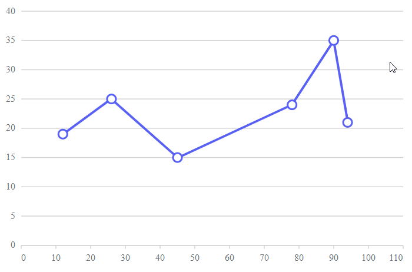

# Dynamic Data Points in Blazor Charts Component

The ability to dynamically add and remove data points within the chart area provides users with a flexible and interactive way to manipulate datasets, empowering more efficient and precise data analysis and visualization. Syncfusion Blazor chart provides the support to add or remove data points dynamically by using mouse events.

We can add data points to the existing dataset by clicking on the chart area. When we click inside the chart area the X and Y value of that point is taken by using [ChartMouseEventArgs](https://help.syncfusion.com/cr/blazor/Syncfusion.Blazor.Charts.ChartMouseEventArgs.html) and added dynamically to data source using [ChartMouseClick](https://help.syncfusion.com/cr/blazor/Syncfusion.Blazor.Charts.ChartEvents.html#Syncfusion_Blazor_Charts_ChartEvents_ChartMouseClick). If you want to remove the existing data points clink on the point that you want to remove from the series.

``` cshtml

@using Syncfusion.Blazor
@using Syncfusion.Blazor.Charts
@inject NavigationManager NavigationManager

<div class="control-section" align='center'>
    <SfChart @ref="Chart" Width="@Width" Height="450px" Theme="@Theme">
        <ChartEvents ChartMouseClick="MouseClick"></ChartEvents>
        <ChartArea><ChartAreaBorder Width="0"></ChartAreaBorder></ChartArea>
        <ChartPrimaryXAxis @ref="XAxis" ValueType="Syncfusion.Blazor.Charts.ValueType.Double" RangePadding="ChartRangePadding.Additional" EdgeLabelPlacement="EdgeLabelPlacement.Shift">
            <ChartAxisMajorGridLines Width="0"></ChartAxisMajorGridLines>
        </ChartPrimaryXAxis>
        <ChartPrimaryYAxis>
            <ChartAxisMajorTickLines Width="0"></ChartAxisMajorTickLines>
            <ChartAxisLineStyle Width="0"></ChartAxisLineStyle>
        </ChartPrimaryYAxis>
        <ChartTooltipSettings Enable="true" Format="${point.x} : <b>${point.y} </b>"></ChartTooltipSettings>
        <ChartSeriesCollection>
            <ChartSeries DataSource="@MouseClickPoints" XName="X" YName="Y" Opacity="1" Width="2" Type="ChartSeriesType.Line">
                <ChartMarker Visible="true" Height="10" Width="10" />
            </ChartSeries>
        </ChartSeriesCollection>
    </SfChart>
</div>
@code {
#nullable enable
    SfChart? Chart;
    ChartPrimaryXAxis? XAxis;
    private Theme Theme { get; set; }
    public string Width { get; set; } = "90%";
    object xPoint, yPoint;
    int index;
     
    public void MouseClick(ChartMouseEventArgs args)
    {
        if (args.AxisData.Count > 0)
        {
            if (args.AxisData.TryGetValue("PrimaryXAxis", out object xValue) && args.AxisData.TryGetValue("PrimaryYAxis", out object yValue))
            {
                xPoint = Math.Round(Convert.ToDouble(xValue, null));
                yPoint = Math.Round(Convert.ToDouble(yValue, null));
                bool isSamePoint;
                if (MouseClickPoints.Count >= 1)
                {
                    index = -1;
                    isSamePoint = IsSamePoint();
                    if (isSamePoint && MouseClickPoints.Count >= 1)
                    {
                        MouseClickPoints.RemoveAt(index);
                    }
                    else if (!isSamePoint)
                    {
                        AddToDataSource(xPoint, yPoint);
                    }
                }
                else
                {
                    AddToDataSource(xPoint, yPoint);
                }
                StateHasChanged();
            }
        }
    }
    public bool IsSamePoint()
    {
        foreach (PointData item in MouseClickPoints)
        {
            index = index + 1;
            if (item.X == Convert.ToDouble(xPoint, null) && item.Y == Convert.ToDouble(yPoint, null))
            {
                return true;
            }
        }
        return false;
    }
    public void AddToDataSource(object xValue, object yValue)
    {
        MouseClickPoints.Add(new PointData() { X = Convert.ToDouble(xValue, null), Y = Convert.ToDouble(yValue, null) });
    }
    public class PointData
    {
        public Nullable<double> X { get; set; }
        public Nullable<double> Y { get; set; }
    }
    public List<PointData> MouseClickPoints = new List<PointData>
    {
        new PointData { X= 12, Y= 19 },
        new PointData { X= 26, Y= 25 },
        new PointData { X= 45, Y= 15 },
        new PointData { X= 78, Y= 24 },
        new PointData { X= 90, Y= 35 }
    };
}

```



N> Refer to our [Blazor Charts](https://www.syncfusion.com/blazor-components/blazor-charts) feature tour page for its groundbreaking feature representations and also explore our [Blazor Chart Example](https://blazor.syncfusion.com/demos/chart/line?theme=bootstrap4) to know various chart types and how to represent time-dependent data, showing trends at equal intervals.

## See Also

* [Tooltip](./tool-tip)
* [Legend](./legend)
* [Marker](./data-markers)