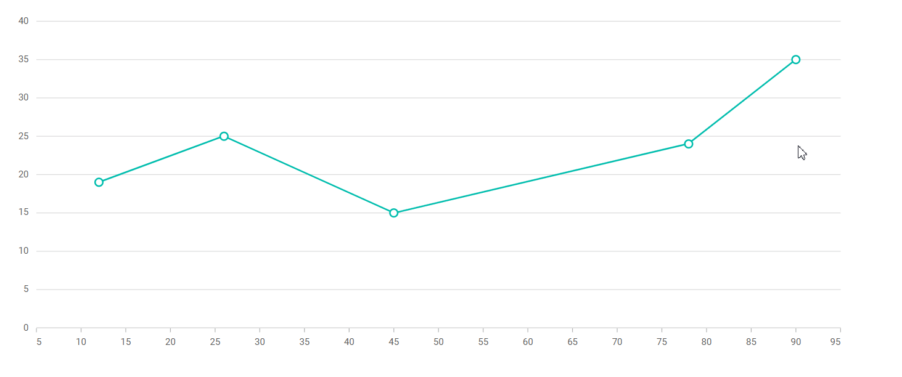

# Dynamic Points in Blazor Charts Component

Syncfusion Blazor Charts support dynamic addition and removal of points using mouse or touch events. Users can interactively update the data source by clicking within the chart area. Follow these steps to implement dynamic points:

## Step 1: Configure ChartMouseClick Event

Attach the [ChartMouseClick](https://help.syncfusion.com/cr/blazor/Syncfusion.Blazor.Charts.ChartEvents.html#Syncfusion_Blazor_Charts_ChartEvents_ChartMouseClick) event and its handler to the chart to enable point interaction.

```cshtml

<SfChart>
    <ChartEvents ChartMouseClick="MouseClick"></ChartEvents>
    ...
<SfChart>

@code {
    public void MouseClick(ChartMouseEventArgs args)
    {
    
    }
}

```

## Step 2: Add Points to Data Source

Retrieve the X and Y values from the event arguments and add new points to the data source.

```cshtml
...
public void MouseClick(ChartMouseEventArgs args)
{
    if (args.AxisData.Count > 0)
    {
        if (args.AxisData.TryGetValue("PrimaryXAxis", out object xValue) &&
            args.AxisData.TryGetValue("PrimaryYAxis", out object yValue))
        {
            xPoint = Math.Round(Convert.ToDouble(xValue, null));
            yPoint = Math.Round(Convert.ToDouble(yValue, null));
            AddToDataSource(xPoint, yPoint);
            StateHasChanged();
        }
    }
}

public void AddToDataSource(object xValue, object yValue)
{
    MouseClickPoints.Add(new PointData() { X = Convert.ToDouble(xValue, null), Y = Convert.ToDouble(yValue, null) });
}

```

## Step 3: Remove Points from Data Source

Determine if the clicked point exists in the data source. If present, remove it; if not, add it as a new point.

```cshtml

public void MouseClick(ChartMouseEventArgs args)
{
    ...
    bool isSamePoint;
    if (MouseClickPoints.Count >= 1)
    {
        index = -1;
        isSamePoint = IsSamePoint();
        if (isSamePoint && MouseClickPoints.Count >= 1)
        {
            MouseClickPoints.RemoveAt(index);
        }
        else if (!isSamePoint)
        {
            AddToDataSource(xPoint, yPoint);
        }
    }
    ...
}

public bool IsSamePoint()
{
    foreach (PointData item in MouseClickPoints)
    {
        index = index + 1;
        if (item.X == Convert.ToDouble(xPoint, null) &&
            item.Y == Convert.ToDouble(yPoint, null))
        {
            return true;
        }
    }
    return false;
}

```

## Action

Clicking in the chart area adds new points, while clicking on an existing point removes it from the data source. The complete code sample is provided below.

``` cshtml
@using Syncfusion.Blazor
@using Syncfusion.Blazor.Charts

<SfChart @ref="Chart">
    <ChartEvents ChartMouseClick="MouseClick" />
    <ChartArea>
        <ChartAreaBorder Width="0" />
    </ChartArea>
    <ChartPrimaryXAxis @ref="XAxis" ValueType="Syncfusion.Blazor.Charts.ValueType.Double" RangePadding="ChartRangePadding.Additional" EdgeLabelPlacement="EdgeLabelPlacement.Shift">
        <ChartAxisMajorGridLines Width="0"></ChartAxisMajorGridLines>
    </ChartPrimaryXAxis>
    <ChartPrimaryYAxis>
        <ChartAxisMajorTickLines Width="0"></ChartAxisMajorTickLines>
        <ChartAxisLineStyle Width="0"></ChartAxisLineStyle>
    </ChartPrimaryYAxis>
    <ChartTooltipSettings Enable="true" Format="${point.x} : <b>${point.y} </b>"></ChartTooltipSettings>
    <ChartSeriesCollection>
        <ChartSeries DataSource="@MouseClickPoints" XName="X" YName="Y" Opacity="1" Width="2" Type="ChartSeriesType.Line">
            <ChartMarker Visible="true" Height="10" Width="10" />
        </ChartSeries>
    </ChartSeriesCollection>
</SfChart>

@code {

    SfChart? Chart;
    ChartPrimaryXAxis? XAxis;
    Theme Theme { get; set; }
    public string Width { get; set; } = "90%";
    object xPoint, yPoint;
    int index;
     
    public void MouseClick(ChartMouseEventArgs args)
    {
        if (args.AxisData.Count > 0)
        {
            if (args.AxisData.TryGetValue("PrimaryXAxis", out object xValue) && args.AxisData.TryGetValue("PrimaryYAxis", out object yValue))
            {
                xPoint = Math.Round(Convert.ToDouble(xValue, null));
                yPoint = Math.Round(Convert.ToDouble(yValue, null));
                bool isSamePoint;
                if (MouseClickPoints.Count >= 1)
                {
                    index = -1;
                    isSamePoint = IsSamePoint();
                    if (isSamePoint && MouseClickPoints.Count >= 1)
                    {
                        MouseClickPoints.RemoveAt(index);
                    }
                    else if (!isSamePoint)
                    {
                        AddToDataSource(xPoint, yPoint);
                    }
                }
                else
                {
                    AddToDataSource(xPoint, yPoint);
                }
                StateHasChanged();
            }
        }
    }

    public bool IsSamePoint()
    {
        foreach (PointData item in MouseClickPoints)
        {
            index = index + 1;
            if (item.X == Convert.ToDouble(xPoint, null) && item.Y == Convert.ToDouble(yPoint, null))
            {
                return true;
            }
        }
        return false;
    }

    public void AddToDataSource(object xValue, object yValue)
    {
        MouseClickPoints.Add(new PointData() { X = Convert.ToDouble(xValue, null), Y = Convert.ToDouble(yValue, null) });
    }

    public class PointData
    {
        public Nullable<double> X { get; set; }
        public Nullable<double> Y { get; set; }
    }
    
    public List<PointData> MouseClickPoints = new List<PointData>
    {
        new PointData { X= 12, Y= 19 },
        new PointData { X= 26, Y= 25 },
        new PointData { X= 45, Y= 15 },
        new PointData { X= 78, Y= 24 },
        new PointData { X= 90, Y= 35 }
    };
}

```



N> Refer to our [Blazor Charts](https://www.syncfusion.com/blazor-components/blazor-charts) feature tour page for its groundbreaking feature representations and also explore our [Blazor Chart Example](https://blazor.syncfusion.com/demos/chart/line?theme=bootstrap4) to know various chart types and how to represent time-dependent data, showing trends at equal intervals.

## See Also

* [Tooltip](./tool-tip)
* [Legend](./legend)
* [Marker](./data-markers)
