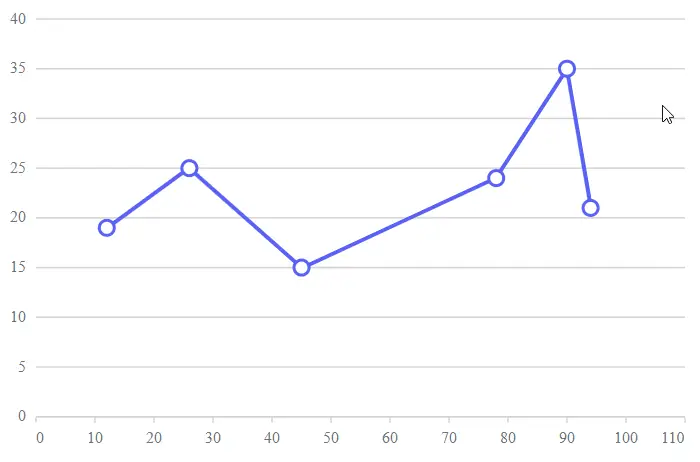

# How to Add Dynamic Points in Blazor Charts

This sample demonstrates how to add and remove points in a Blazor Chart at runtime. By handling the `ChartMouseClick` event, you can append a point based on the current cursor location and remove it when the user clicks on an existing marker.

**Step 1**

Add the [ChartMouseClick](https://help.syncfusion.com/cr/blazor/Syncfusion.Blazor.Charts.ChartEvents.html#Syncfusion_Blazor_Charts_ChartEvents_ChartMouseClick) event to the chart and add the event handler to that.


```cshtml
<SfChart>
    <ChartEvents ChartMouseClick="MouseClick"></ChartEvents>
    <!-- other chart configuration -->
</SfChart>

@code {
    public void MouseClick(ChartMouseEventArgs args)
    {

    }
}
```

**Step 2: Add a point at the clicked location**

Read the X and Y values at the click position from the [ChartMouseClick](https://help.syncfusion.com/cr/blazor/Syncfusion.Blazor.Charts.ChartEvents.html#Syncfusion_Blazor_Charts_ChartEvents_ChartMouseClick) event args. `Math.Round` is used to normalize the floating-point values returned by the chart. Then add the point to the data source using the `AddToDataSource` helper, as shown below.

```cshtml
public void MouseClick(ChartMouseEventArgs args)
{
    if (args.AxisData.Count > 0)
    {
        if (args.AxisData.TryGetValue("PrimaryXAxis", out object xValue) &&
            args.AxisData.TryGetValue("PrimaryYAxis", out object yValue))
        {
            xPoint = Math.Round(Convert.ToDouble(xValue, null));
            yPoint = Math.Round(Convert.ToDouble(yValue, null));
            AddToDataSource(xPoint, yPoint);
            StateHasChanged();
        }
    }
}

public void AddToDataSource(object xValue, object yValue)
{
    MouseClickPoints.Add(new PointData()
    {
        X = Convert.ToDouble(xValue, System.Globalization.CultureInfo.InvariantCulture),
        Y = Convert.ToDouble(yValue, System.Globalization.CultureInfo.InvariantCulture)
    });
}
```

**Step 3: Remove a point by clicking on it**

To remove an existing point, click on its marker. Implement an `IsSamePoint` helper that checks whether the point obtained from [ChartMouseClick](https://help.syncfusion.com/cr/blazor/Syncfusion.Blazor.Charts.ChartEvents.html#Syncfusion_Blazor_Charts_ChartEvents_ChartMouseClick) is already present in the data source. If the point exists, remove it; otherwise, add the new point.

```csharp
public void MouseClick(ChartMouseEventArgs args)
{
    // ...previous X/Y extraction from args.AxisData...
    bool isSamePoint;
    if (MouseClickPoints.Count >= 1)
    {
        index = -1;
        isSamePoint = IsSamePoint();
        if (isSamePoint && MouseClickPoints.Count >= 1)
        {
            MouseClickPoints.RemoveAt(index);
        }
        else if (!isSamePoint)
        {
            AddToDataSource(xPoint, yPoint);
        }
    }
}

public bool IsSamePoint()
{
    foreach (PointData item in MouseClickPoints)
    {
        index = index + 1;
        if (item.X == Convert.ToDouble(xPoint, System.Globalization.CultureInfo.InvariantCulture) &&
            item.Y == Convert.ToDouble(yPoint, System.Globalization.CultureInfo.InvariantCulture))
        {
            return true;
        }
    }
    return false;
}
```

**Complete Example**

The following code snippet shows a chart that lets users add new data and update the existing data source by clicking in the chart area. Clicking on an existing point removes that point from the data source.

```cshtml
@using Syncfusion.Blazor
@using Syncfusion.Blazor.Charts

<SfChart>
    <ChartEvents ChartMouseClick="MouseClick"></ChartEvents>
    <ChartArea><ChartAreaBorder Color="transparent"></ChartAreaBorder></ChartArea>
    <ChartPrimaryXAxis ValueType="Syncfusion.Blazor.Charts.ValueType.Double" RangePadding="ChartRangePadding.Additional" EdgeLabelPlacement="EdgeLabelPlacement.Shift">
        <ChartAxisMajorGridLines Width="0"></ChartAxisMajorGridLines>
    </ChartPrimaryXAxis>
    <ChartPrimaryYAxis>
        <ChartAxisMajorTickLines Width="0"></ChartAxisMajorTickLines>
        <ChartAxisLineStyle Width="0"></ChartAxisLineStyle>
    </ChartPrimaryYAxis>
    <ChartTooltipSettings Enable="true" Format="${point.x} : <b>${point.y} </b>"></ChartTooltipSettings>
    <ChartSeriesCollection>
        <ChartSeries DataSource="@MouseClickPoints" XName="X" YName="Y" Opacity="1" Width="2" Type="ChartSeriesType.Line">
            <ChartMarker Visible="true" Height="10" Width="10" />
        </ChartSeries>
    </ChartSeriesCollection>
</SfChart>
@code {

    object xPoint, yPoint;
    int index;

    public void MouseClick(ChartMouseEventArgs args)
    {
        if (args.AxisData.Count > 0)
        {
            if (args.AxisData.TryGetValue("PrimaryXAxis", out object xValue) && args.AxisData.TryGetValue("PrimaryYAxis", out object yValue))
            {
                xPoint = Math.Round(Convert.ToDouble(xValue, System.Globalization.CultureInfo.InvariantCulture));
                yPoint = Math.Round(Convert.ToDouble(yValue, System.Globalization.CultureInfo.InvariantCulture));
                bool isSamePoint;
                if (MouseClickPoints.Count >= 1)
                {
                    index = -1;
                    isSamePoint = IsSamePoint();
                    if (isSamePoint && MouseClickPoints.Count >= 1)
                    {
                        MouseClickPoints.RemoveAt(index);
                    }
                    else if (!isSamePoint)
                    {
                        AddToDataSource(xPoint, yPoint);
                    }
                }
                else
                {
                    AddToDataSource(xPoint, yPoint);
                }
                StateHasChanged();
            }
        }
    }

    public bool IsSamePoint()
    {
        foreach (PointData item in MouseClickPoints)
        {
            index = index + 1;
            if (item.X == Convert.ToDouble(xPoint, System.Globalization.CultureInfo.InvariantCulture) && item.Y == Convert.ToDouble(yPoint, System.Globalization.CultureInfo.InvariantCulture))
            {
                return true;
            }
        }
        return false;
    }

    public void AddToDataSource(object xValue, object yValue)
    {
        MouseClickPoints.Add(new PointData()
        {
            X = Convert.ToDouble(xValue, System.Globalization.CultureInfo.InvariantCulture),
            Y = Convert.ToDouble(yValue, System.Globalization.CultureInfo.InvariantCulture)
        });
    }

    public class PointData
    {
        public double? X { get; set; }
        public double? Y { get; set; }
    }

    public List<PointData> MouseClickPoints = new List<PointData>
    {
        new PointData { X = 12, Y = 19 },
        new PointData { X = 26, Y = 25 },
        new PointData { X = 45, Y = 15 },
        new PointData { X = 78, Y = 24 },
        new PointData { X = 90, Y = 35 }
    };
}
```



N> Refer to the [Blazor Charts](https://www.syncfusion.com/blazor-components/blazor-charts) feature tour page for its groundbreaking feature representations and also explore the [Blazor Chart Example](https://blazor.syncfusion.com/demos/chart/line?theme=fluent2) to know various chart types and how to represent time-dependent data, showing trends at equal intervals.

## See Also

* [Tooltip](./tool-tip)
* [Legend](./legend)
* [Marker](./data-markers)
