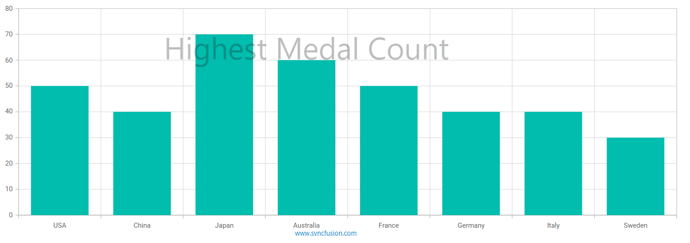

<!-- markdownlint-disable MD036 -->

# Footer and Watermark in Blazor Component

By using ``Annotations``, you can place any html element to the chart in a desired view.

Annotations are texts, shapes, or images that are used to highlight a specific region of interest in a chart. The [ChartAnnotations](https://help.syncfusion.com/cr/blazor/Syncfusion.Blazor.Charts.ChartAnnotations.html#Syncfusion_Blazor_Charts_ChartAnnotations__ctor) property allows to add annotations to the chart. Specify the ID of the element that needs to be displayed in the chart area by using the [Content](https://help.syncfusion.com/cr/blazor/Syncfusion.Blazor.Charts.ChartAnnotation.html#Syncfusion_Blazor_Charts_ChartAnnotation_ContentTemplate) property of the annotation.

To create footer and watermark for the chart, follow the given steps.

**Step 1:**

Initialize the custom elements by using the [ChartAnnotations](https://help.syncfusion.com/cr/blazor/Syncfusion.Blazor.Charts.ChartAnnotations.html#Syncfusion_Blazor_Charts_ChartAnnotations__ctor).

By using the [Content](https://help.syncfusion.com/cr/blazor/Syncfusion.Blazor.Charts.ChartAnnotation.html#Syncfusion_Blazor_Charts_ChartAnnotation_ContentTemplate) option of the annotation object, you can specify the id of the element that needs to be displayed in the chart area as follow,

```cshtml
@using Syncfusion.Blazor.Charts

<SfChart Title="Olympic Medals">
    <ChartPrimaryXAxis ValueType="Syncfusion.Blazor.Charts.ValueType.Category">
    </ChartPrimaryXAxis>

    <ChartAnnotations>
        <ChartAnnotation X="@Country" Y="65" Region="Regions.Series" CoordinateUnits="Units.Point">
            <ContentTemplate  >
                <div style="font-size:450%; opacity: 0.3;" >Highest Medal Count</div>                
            </ContentTemplate>            
        </ChartAnnotation>
        <ChartAnnotation  X="@Xloc" Y="@Yloc" Region="Regions.Chart">
            <ContentTemplate>
                <div>
                    <div style="height:100px; font-size:large"  id="chart"> <a href="https://www.syncfusion.com" target="_blank">www.syncfusion.com</a></div>
                </div>
            </ContentTemplate>
        </ChartAnnotation>
    </ChartAnnotations>

    <ChartSeriesCollection>
        <ChartSeries DataSource="@MedalDetails" XName="Country" YName="Gold" Type="ChartSeriesType.Column">
        </ChartSeries>
    </ChartSeriesCollection>
</SfChart>

<style>
    .e-chart {
        overflow: visible !important;
    }
</style>

@code {
    string Country = "Australia";

    public string Xloc { get; set; } = "50%";
    public string Yloc { get; set; } = "135%";

    public class ChartData
    {
        public string Country { get; set; }
        public double Gold { get; set; }
    }

    public List<ChartData> MedalDetails = new List<ChartData>
    {
        new ChartData{ Country= "USA", Gold=50  },
        new ChartData{ Country= "China", Gold=40 },
        new ChartData{ Country= "Japan", Gold=70 },
        new ChartData{ Country= "Australia", Gold=60},
        new ChartData{ Country= "France", Gold=50 },
        new ChartData{ Country= "Germany", Gold=40 },
        new ChartData{ Country= "Italy", Gold=40 },
        new ChartData{ Country= "Sweden", Gold=30 }
    };
}

```


N> Refer to our [Blazor Charts](https://www.syncfusion.com/blazor-components/blazor-charts) feature tour page for its groundbreaking feature representations and also explore our [Blazor Chart Example](https://blazor.syncfusion.com/demos/chart/line?theme=bootstrap4) to know various chart types and how to represent time-dependent data, showing trends at equal intervals.