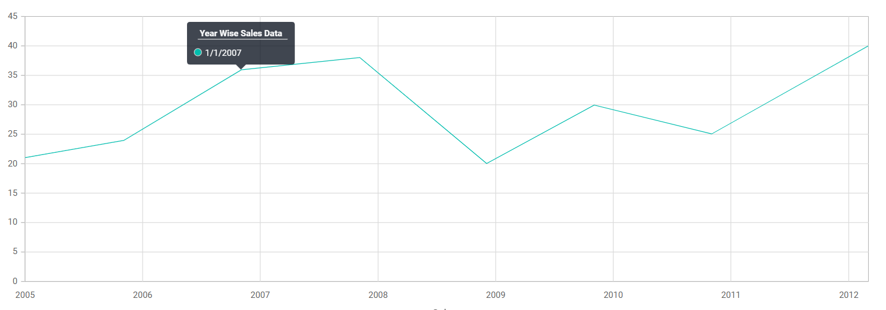

<!-- markdownlint-disable MD036 -->

# Tooltip Format in Blazor Chart Components

Using [TooltipRender](https://help.syncfusion.com/cr/blazor/Syncfusion.Blazor.Charts.ChartEvents.html#Syncfusion_Blazor_Charts_ChartEvents_TooltipRender) event you can format the ``HeaderText`` and ``Text`` for the tooltip.

To format the tooltip header text and text follow the following steps.

**Step 1**
By using [TooltipRender](https://help.syncfusion.com/cr/blazor/Syncfusion.Blazor.Charts.ChartEvents.html#Syncfusion_Blazor_Charts_ChartEvents_TooltipRender) event we can able to get the header text and tooltip text and we can modify them while tooltip rendering.

```cshtml

@using Syncfusion.Blazor.Charts           

<SfChart>
    <ChartEvents TooltipRender="TooltipEvent"></ChartEvents>
    <ChartPrimaryXAxis ValueType="Syncfusion.Blazor.Charts.ValueType.DateTime"></ChartPrimaryXAxis>
    <ChartSeriesCollection>
        <ChartSeries DataSource="@Sales" XName="XValue" YName="YValue" Name="Sales" Type="ChartSeriesType.Line">
        </ChartSeries>
    </ChartSeriesCollection>
    <ChartTooltipSettings Enable="true" ></ChartTooltipSettings>
</SfChart>

@code {
    public class ChartData
    {
        public DateTime XValue { get; set; }
        public double YValue { get; set; }
    }

    public List<ChartData> Sales = new List<ChartData>
    {
        new ChartData { XValue = new DateTime(2005, 01, 01), YValue = 21 },
        new ChartData { XValue = new DateTime(2006, 01, 01), YValue = 24 },
        new ChartData { XValue = new DateTime(2007, 01, 01), YValue = 36 },
        new ChartData { XValue = new DateTime(2008, 01, 01), YValue = 38 },
        new ChartData { XValue = new DateTime(2009, 01, 01), YValue = 20 },
        new ChartData { XValue = new DateTime(2010, 01, 01), YValue = 30 },
        new ChartData { XValue = new DateTime(2011, 01, 01), YValue = 25 },
        new ChartData { XValue = new DateTime(2012, 01, 01), YValue = 40 },
    };

    public void TooltipEvent(TooltipRenderEventArgs args)
    {
        args.HeaderText = "Year Wise Sales Data";
        DateTime date = DateTime.Parse(args.Data.PointX.ToString());         
        args.Text = date.ToString("M/d/yyyy");
    }
}
```


N> Refer to our [Blazor Charts](https://www.syncfusion.com/blazor-components/blazor-charts) feature tour page for its groundbreaking feature representations and also explore our [Blazor Chart Example](https://blazor.syncfusion.com/demos/chart/line?theme=bootstrap4) to know various chart types and how to represent time-dependent data, showing trends at equal intervals.
