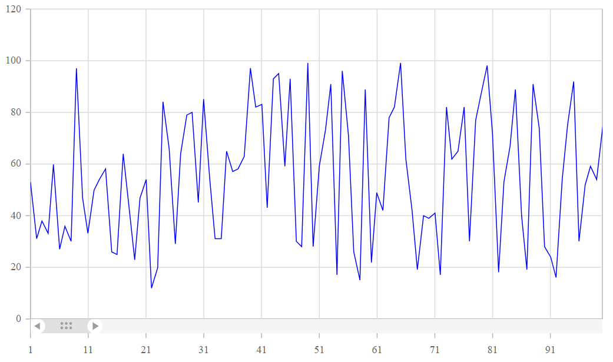

# Lazy Loading in Blazor Charts Component

The lazy loading loads data for the chart on demand. The  [OnScrollChanged](https://help.syncfusion.com/cr/blazor/Syncfusion.Blazor.Charts.ChartEvents.html#Syncfusion_Blazor_Charts_ChartEvents_OnScrollChanged) event will be fired by the chart, allowing us to get the minimum and maximum ranges of the axes and then upload the data to the chart.

```cshtml
<ChartEvents OnScrollChanged="@ScrollChange"></ChartEvents>

private void ScrollChange(ScrollEventArgs e)
{
    this.dataSource = GetRangeData(Convert.ToInt32(e.CurrentRange.Minimum), Convert.ToInt32(e.CurrentRange.Maximum));
    this.StateHasChanged();
}

```

The complete code snippet is available below.

```cshtml
@using Syncfusion.Blazor.Charts
@using System.Collections.ObjectModel

@if (dataSource != null)
{
    <SfChart Title="Lazy Loading Chart">
        <ChartEvents OnScrollChanged="@ScrollChange"></ChartEvents>
        <ChartPrimaryXAxis>
            <ChartAxisScrollbarSettings Enable="true" PointsLength="1000"></ChartAxisScrollbarSettings>
        </ChartPrimaryXAxis>
        <ChartSeriesCollection>
            <ChartSeries DataSource="@dataSource" Fill="blue" XName="x" YName="y" Type="ChartSeriesType.Line">
            </ChartSeries>
        </ChartSeriesCollection>
    </SfChart>
}
else
{
    <p>Chart Loading</p>
}

@code {

    int count = 1;
    Random random = new Random();
    public ObservableCollection < ColumnChartData > dataSource;

    protected override void OnInitialized() {
        dataSource = this.GetData();
    }

    public void ScrollChange(ScrollEventArgs e) {
        this.dataSource = GetRangeData(Convert.ToInt32(e.CurrentRange.Minimum), Convert.ToInt32(e.CurrentRange.Maximum));
        this.StateHasChanged();
    }

    public ObservableCollection < ColumnChartData > GetRangeData(int min, int max) {
        ObservableCollection < ColumnChartData > data = new ObservableCollection < ColumnChartData > ();
        for (; min <= max; min++) {
            data.Add(new ColumnChartData {
                x = min, y = random.Next(10, 100)
            });
        }
        return data;
    }

    public ObservableCollection < ColumnChartData > GetData() {
        ObservableCollection < ColumnChartData > data = new ObservableCollection < ColumnChartData > ();
        for (; count <= 100; count++) {
            data.Add(new ColumnChartData {
                x = count, y = random.Next(10, 100)
            });
        }
        return data;
    }

    public class ColumnChartData {
        public double x {
            get;
            set;
        }
        public double y {
            get;
            set;
        }
    }
}
```



### Line 



### Column 



N> Refer to our [Blazor Charts](https://www.syncfusion.com/blazor-components/blazor-charts) feature tour page for its groundbreaking feature representations and also explore our [Blazor Chart Example](https://blazor.syncfusion.com/demos/chart/line?theme=bootstrap5) to know various chart types and how to represent time-dependent data, showing trends at equal intervals.
