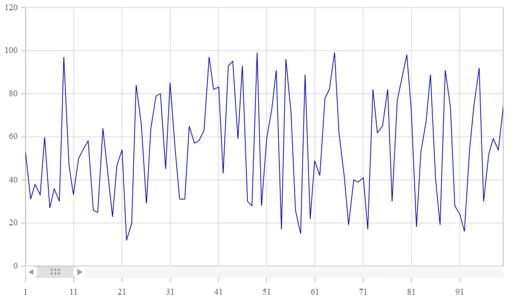
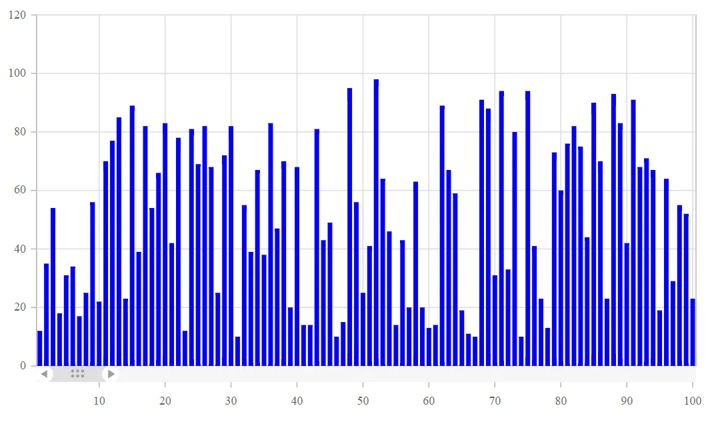

# How to Enable Lazy Loading in Blazor Charts

Lazy loading fetches chart data on demand. The chart triggers the [OnScrollChanged](https://help.syncfusion.com/cr/blazor/Syncfusion.Blazor.Charts.ChartEvents.html#Syncfusion_Blazor_Charts_ChartEvents_OnScrollChanged) event, which provides the minimum and maximum X-axis values of the visible range. Use these values to retrieve only the data points within the visible range and update the chart's data source accordingly.

The following example is supported in Blazor Server, Blazor WebAssembly, and Blazor Hybrid (MAUI) applications using Syncfusion® Blazor Charts

```cshtml
<ChartEvents OnScrollChanged="@ScrollChange"></ChartEvents>

@code {
    private void ScrollChange(ScrollEventArgs e)
    {
        if (e.CurrentRange == null)
        {
            return;
        }

        this.dataSource = GetRangeData(Convert.ToInt32(e.CurrentRange.Minimum), Convert.ToInt32(e.CurrentRange.Maximum));
        this.StateHasChanged();
    }
}
```

The complete code snippet is available below. The scrollbar is configured via `ChartAxisScrollbarSettings`, where `PointsLength` defines the number of data points visible in the viewport (1000 in this example). Use `ScrollBarSettings` on the series for chart-level options such as `Enable`.

```cshtml
@using Syncfusion.Blazor
@using Syncfusion.Blazor.Charts
@using System.Collections.ObjectModel

@if (dataSource != null)
{
    <SfChart Title="Lazy Loading Chart">
        <ChartEvents OnScrollChanged="@ScrollChange"></ChartEvents>
        <ChartPrimaryXAxis>
            <ChartAxisScrollbarSettings Enable="true" PointsLength="1000"></ChartAxisScrollbarSettings>
        </ChartPrimaryXAxis>
        <ChartSeriesCollection>
            <ChartSeries DataSource="@dataSource" Fill="blue" XName="x" YName="y" Type="ChartSeriesType.Line">
                <ChartSeriesScrollbarSettings Enable="true"></ChartSeriesScrollbarSettings>
            </ChartSeries>
        </ChartSeriesCollection>
    </SfChart>
}
else
{
    <p>Chart Loading</p>
}

@code {

    private int count = 1;
    private readonly Random random = new Random();
    public ObservableCollection<ChartData> dataSource = new ObservableCollection<ChartData>();

    protected override void OnInitialized()
    {
        dataSource = this.GetData();
    }

    public void ScrollChange(ScrollEventArgs e)
    {
        if (e.CurrentRange == null)
        {
            return;
        }

        this.dataSource = GetRangeData(Convert.ToInt32(e.CurrentRange.Minimum), Convert.ToInt32(e.CurrentRange.Maximum));
        this.StateHasChanged();
    }

    public ObservableCollection<ChartData> GetRangeData(int min, int max)
    {
        ObservableCollection<ChartData> data = new ObservableCollection<ChartData>();
        for (; min <= max; min++)
        {
            data.Add(new ChartData { x = min, y = random.Next(10, 100) });
        }
        return data;
    }

    public ObservableCollection<ChartData> GetData()
    {
        ObservableCollection<ChartData> data = new ObservableCollection<ChartData>();
        for (int i = 1; i <= 100; i++)
        {
            data.Add(new ChartData { x = i, y = random.Next(10, 100) });
        }
        return data;
    }

    public class ChartData
    {
        public double x { get; set; }
        public double y { get; set; }
    }
}
```



## Line



## Column





N> Refer to the [Blazor Charts](https://www.syncfusion.com/blazor-components/blazor-charts) feature tour page for its groundbreaking feature representations and also explore the [Blazor Chart Example](https://blazor.syncfusion.com/demos/chart/line?theme=fluent2) to know various chart types and how to represent time-dependent data, showing trends at equal intervals.
