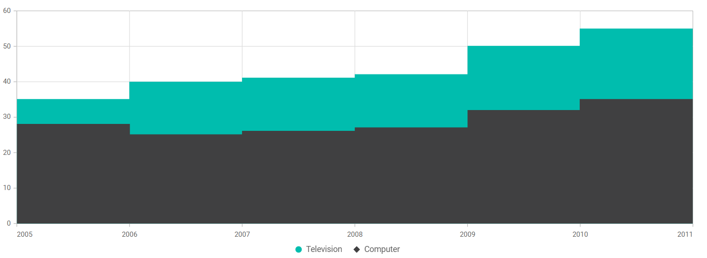

<!-- markdownlint-disable MD036 -->

# Legend Customization 

By using [OnLegendItemRender](https://help.syncfusion.com/cr/blazor/Syncfusion.Blazor.Charts.ChartEvents.html#Syncfusion_Blazor_Charts_ChartEvents_OnLegendItemRender) event, you can customize the legend shape for each series.

To Customize the Legend shape, folow the given steps.

**Step 1:**

Customize the Legend shape in each data point by using the [OnLegendItemRender](https://help.syncfusion.com/cr/blazor/Syncfusion.Blazor.Charts.ChartEvents.html#Syncfusion_Blazor_Charts_ChartEvents_OnLegendItemRender) event. Using this event, you can set the shape value to the argument.

```cshtml

@using Syncfusion.Blazor.Charts

<SfChart>
    <ChartEvents OnLegendItemRender="@LegendRender"></ChartEvents>
    <ChartPrimaryXAxis Interval="1" EdgeLabelPlacement="EdgeLabelPlacement.Shift"></ChartPrimaryXAxis>
    <ChartSeriesCollection>
        <ChartSeries DataSource="@ConsumerReports" XName="X" YName="Y1" Name="Television" Type="ChartSeriesType.StepArea">            
        </ChartSeries>
        <ChartSeries DataSource="@ConsumerReports" XName="X" YName="Y" Name="Computer" Type="ChartSeriesType.StepArea">            
        </ChartSeries>
    </ChartSeriesCollection>
</SfChart>

@code {
    ChartShape[] Shape = { ChartShape.Circle, ChartShape.Triangle, ChartShape.Diamond,ChartShape.Rectangle,
                           ChartShape.InvertedTriangle,ChartShape.Pentagon, ChartShape.Cross };

    public class ChartData
    {
        public double X { get; set; }
        public double Y { get; set; }
        public double Y1 { get; set; }
    }

    public List<ChartData> ConsumerReports = new List<ChartData>
    {
        new ChartData{ X= 2005, Y= 28, Y1= 35 },
        new ChartData{ X= 2006, Y= 25, Y1= 40 },
        new ChartData{ X= 2007, Y= 26, Y1= 41 },
        new ChartData{ X= 2008, Y= 27, Y1= 42 },
        new ChartData{ X= 2009, Y= 32, Y1= 50 },
        new ChartData{ X= 2010, Y= 35, Y1= 55 },
        new ChartData{ X= 2011, Y= 30, Y1= 45 }
    };
    public void LegendRender(LegendRenderEventArgs args)
    {
        if(args.Text == "Television")
        {
            args.Shape = LegendShape.Circle;
        }
        if(args.Text =="Computer")
        {
            args.Shape = LegendShape.Diamond;
        }
    }
}
```


N> Refer to our [Blazor Charts](https://www.syncfusion.com/blazor-components/blazor-charts) feature tour page for its groundbreaking feature representations and also explore our [Blazor Chart Example](https://blazor.syncfusion.com/demos/chart/line?theme=bootstrap4) to know various chart types and how to represent time-dependent data, showing trends at equal intervals.


