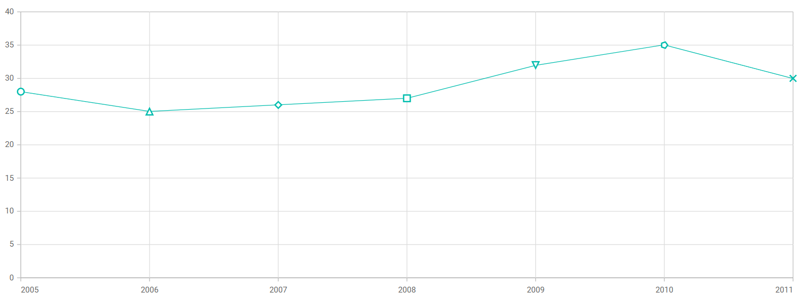

<!-- markdownlint-disable MD036 -->

# Marker Customization in Blazor

By using the [OnPointRender](https://help.syncfusion.com/cr/blazor/Syncfusion.Blazor.Charts.ChartEvents.html#Syncfusion_Blazor_Charts_ChartEvents_OnPointRender) event, you can customize the marker shape for each point.

To Customize the Marker shape, follow the given steps:

**Step 1:**

Customize the marker shape in each data point by using the [OnPointRender](https://help.syncfusion.com/cr/blazor/Syncfusion.Blazor.Charts.ChartEvents.html#Syncfusion_Blazor_Charts_ChartEvents_OnPointRender) event. Using this event, you can set the shape value to the argument.

```cshtml
@using Syncfusion.Blazor.Charts

<SfChart>
    <ChartEvents OnPointRender="@PointRender"></ChartEvents>
    <ChartPrimaryXAxis Interval="1" EdgeLabelPlacement="EdgeLabelPlacement.Shift"></ChartPrimaryXAxis>
    <ChartSeriesCollection>
        <ChartSeries DataSource="@ConsumerReports" XName="X" YName="Y" Type="ChartSeriesType.Line">
            <ChartMarker Visible="true"  Height="10" Width="10" />
        </ChartSeries>
    </ChartSeriesCollection>
</SfChart>

@code {
    ChartShape[] Shape = { ChartShape.Circle, ChartShape.Triangle, ChartShape.Diamond,ChartShape.Rectangle,
                           ChartShape.InvertedTriangle,ChartShape.Pentagon, ChartShape.Cross};
     
    public class ChartData
    {
        public double X { get; set; }
        public double Y { get; set; }
    }

    public List<ChartData> ConsumerReports = new List<ChartData>
    {
        new ChartData{ X= 2005, Y= 28 },
        new ChartData{ X= 2006, Y= 25 },
        new ChartData{ X= 2007, Y= 26 },
        new ChartData{ X= 2008, Y= 27 },
        new ChartData{ X= 2009, Y= 32 },
        new ChartData{ X= 2010, Y= 35 },
        new ChartData{ X= 2011, Y= 30 }
    };
    public void PointRender (PointRenderEventArgs args)
    {
        args.Shape = Shape[args.Point.Index];        
    }
}
```


N> Refer to our [Blazor Charts](https://www.syncfusion.com/blazor-components/blazor-charts) feature tour page for its groundbreaking feature representations and also explore our [Blazor Chart Example](https://blazor.syncfusion.com/demos/chart/line?theme=bootstrap4) to know various chart types and how to represent time-dependent data, showing trends at equal intervals.
