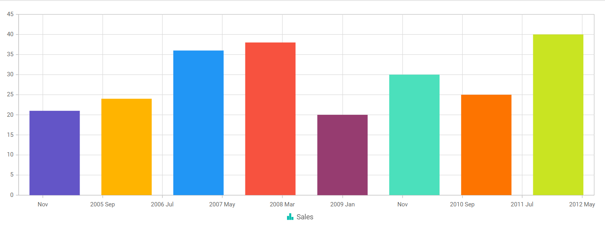

<!-- markdownlint-disable MD036 -->
# Points Customization in Blazor

You can customize the series points with different color by using the ``PointColorMapping`` property.

To customize the series points color, follow the given steps.

**Step 1:**

Define the color in each series and map the value to the series color using ``PointColorMapping`` property in series.

```cshtml

@using Syncfusion.Blazor.Charts                 

<SfChart>    
    <ChartPrimaryXAxis ValueType="Syncfusion.Blazor.Charts.ValueType.DateTime"></ChartPrimaryXAxis>
    <ChartSeriesCollection>
        <ChartSeries DataSource="@Sales" XName="XValue" PointColorMapping="Color" YName="YValue" Name="Sales" Type="ChartSeriesType.Column">
        </ChartSeries>
    </ChartSeriesCollection>
    <ChartTooltipSettings Enable="true" ></ChartTooltipSettings>
</SfChart>

@code {
    public class ChartData
    {
        public DateTime XValue { get; set; }
        public double YValue { get; set; }
        public string Color { get; set; }
    }

    public List<ChartData> Sales = new List<ChartData>
    {
        new ChartData { XValue = new DateTime(2005, 01, 01), YValue = 21, Color="#6355C7" },
        new ChartData { XValue = new DateTime(2006, 01, 01), YValue = 24, Color="#FFB400" },
        new ChartData { XValue = new DateTime(2007, 01, 01), YValue = 36, Color="#2196F5" },
        new ChartData { XValue = new DateTime(2008, 01, 01), YValue = 38, Color="#F7523F" },
        new ChartData { XValue = new DateTime(2009, 01, 01), YValue = 20, Color="#963C70" },
        new ChartData { XValue = new DateTime(2010, 01, 01), YValue = 30, Color="#4BE0BC" },
        new ChartData { XValue = new DateTime(2011, 01, 01), YValue = 25, Color="#FD7400" },
        new ChartData { XValue = new DateTime(2012, 01, 01), YValue = 40, Color="#C9E422" },
}
```


N> Refer to our [Blazor Charts](https://www.syncfusion.com/blazor-components/blazor-charts) feature tour page for its groundbreaking feature representations and also explore our [Blazor Chart Example](https://blazor.syncfusion.com/demos/chart/line?theme=bootstrap4) to know various chart types and how to represent time-dependent data, showing trends at equal intervals.