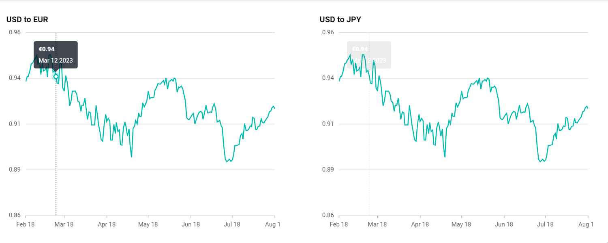

<!-- markdownlint-disable MD036 -->

# Synchronized Chart in Blazor Charts Component

Synchronized chart has the ability to access and interact with two or more charts concurrently. This means that actions performed on one chart—such as placing a cursor, clicking on a specific point, or activating a tooltip—reflect simultaneously on corresponding positions or data points across other synchronized charts based on its X-Y coordinates.

We can synchronize the tooltip, crosshair and zooming across multiple chart using Blazor Synchronized chart. This can be achieved by using various chart events such as [ChartMouseMove](https://help.syncfusion.com/cr/blazor/Syncfusion.Blazor.Charts.ChartEvents.html#Syncfusion_Blazor_Charts_ChartEvents_ChartMouseMove), [ChartMouseUp](https://help.syncfusion.com/cr/blazor/Syncfusion.Blazor.Charts.ChartEvents.html#Syncfusion_Blazor_Charts_ChartEvents_ChartMouseUp), [ChartMouseDown](https://help.syncfusion.com/cr/blazor/Syncfusion.Blazor.Charts.ChartEvents.html#Syncfusion_Blazor_Charts_ChartEvents_ChartMouseDown), [OnCrosshairMove](https://help.syncfusion.com/cr/blazor/Syncfusion.Blazor.Charts.ChartEvents.html#Syncfusion_Blazor_Charts_ChartEvents_OnCrosshairMove) and [OnZoomEnd](https://help.syncfusion.com/cr/blazor/Syncfusion.Blazor.Charts.ChartEvents.html#Syncfusion_Blazor_Charts_ChartEvents_OnZoomEnd) based on the requirements.

```cshtml

@using Syncfusion.Blazor.Charts;
@using Syncfusion.Blazor 
@using System.Net.Http.Json
@inject NavigationManager NavigationManager
@inject HttpClient Http

<div class="row">
    <div class ="col">
        <SfChart Title="USD to EUR" @ref="_chart1" Width="400" >
            <ChartEvents ChartMouseMove="OnMouseEventChart1" ChartMouseUp="OnMouseLeaveChart1" ChartMouseDown="ChartMouseDown" OnCrosshairMove="OnCrosshairMove" OnZoomEnd="ZoomEvent"></ChartEvents>
            <ChartArea>
                <ChartTitleStyle TextAlignment="Alignment.Near"></ChartTitleStyle>
                <ChartAreaBorder Width="0"></ChartAreaBorder>
            </ChartArea>
            <ChartPrimaryXAxis ZoomFactor=@zoomFactor ZoomPosition=@zoomPosition ValueType="Syncfusion.Blazor.Charts.ValueType.DateTime" Minimum="new DateTime(2023, 02, 18)" Maximum="new DateTime(2023, 08, 18)" LabelFormat="MMM d" IntervalType="IntervalType.Months" LabelIntersectAction="LabelIntersectAction.Hide">
                <ChartAxisMajorGridLines Width="0"></ChartAxisMajorGridLines>
                <ChartAxisLineStyle Width="0"></ChartAxisLineStyle>
            </ChartPrimaryXAxis>
            <ChartPrimaryYAxis Minimum="0.86" Maximum="0.96" LabelFormat="n2" Interval="0.025">
                <ChartAxisMajorTickLines Width="0"></ChartAxisMajorTickLines>
                <ChartAxisLineStyle Width="0"></ChartAxisLineStyle>
            </ChartPrimaryYAxis>
            <ChartSeriesCollection>
                <ChartSeries DataSource="@ChartPoints" XName="USD" YName="EUR" Type="ChartSeriesType.Line" Width="2"  >
                    <ChartEmptyPointSettings Mode="EmptyPointMode.Drop"></ChartEmptyPointSettings>
                </ChartSeries>
            </ChartSeriesCollection>

            <ChartTooltipSettings Enable="true"   Shared="true" Header="" Format="<b>€${point.y}</b> <br> ${point.x} 2023" EnableMarker="false"></ChartTooltipSettings>
            <ChartCrosshairSettings Enable="true" DashArray="2,2" LineType="LineType.Vertical"></ChartCrosshairSettings>
            <ChartZoomSettings EnableMouseWheelZooming="true" EnablePinchZooming="true" EnableScrollbar="false" EnableDeferredZooming="false" EnablePan="true" Mode="ZoomMode.X" ToolbarItems="@toolbarItems"></ChartZoomSettings>
        </SfChart>    
    </div>
    <div class="col">
        <SfChart Title="USD to JPY" @ref="_chart2" Width="400">
            <ChartEvents ChartMouseMove="OnMouseEventChart2" ChartMouseUp="OnMouseLeaveChart2" ChartMouseDown="ChartMouseDown" OnCrosshairMove="OnCrosshairMove" OnZoomEnd="ZoomEvent"></ChartEvents>
            <ChartArea>
                <ChartTitleStyle TextAlignment="Alignment.Near"></ChartTitleStyle>
                <ChartAreaBorder Width="0"></ChartAreaBorder>
            </ChartArea>
            <ChartPrimaryXAxis ZoomFactor=@zoomFactor ZoomPosition=@zoomPosition ValueType="Syncfusion.Blazor.Charts.ValueType.DateTime" Minimum="new DateTime(2023, 02, 18)" Maximum="new DateTime(2023, 08, 18)" LabelFormat="MMM d" IntervalType="IntervalType.Months" LabelIntersectAction="LabelIntersectAction.Hide">
                <ChartAxisMajorGridLines Width="0"></ChartAxisMajorGridLines>
                <ChartAxisLineStyle Width="0"></ChartAxisLineStyle>
            </ChartPrimaryXAxis>
            <ChartPrimaryYAxis Minimum="0.86" Maximum="0.96" LabelFormat="n2" Interval="0.025">
                <ChartAxisMajorTickLines Width="0"></ChartAxisMajorTickLines>
                <ChartAxisLineStyle Width="0"></ChartAxisLineStyle>
            </ChartPrimaryYAxis>
            <ChartSeriesCollection>
                <ChartSeries DataSource="@ChartPoints" XName="USD" YName="EUR" Type="ChartSeriesType.Line" Width="2"  >
                    <ChartEmptyPointSettings Mode="EmptyPointMode.Drop"></ChartEmptyPointSettings>
                </ChartSeries>
            </ChartSeriesCollection>
            <ChartTooltipSettings Enable="true"   Shared="true" Header="" Format="<b>€${point.y}</b> <br> ${point.x} 2023" EnableMarker="false"></ChartTooltipSettings>
            <ChartCrosshairSettings Enable="true" DashArray="2,2" LineType="LineType.Vertical"></ChartCrosshairSettings>
            <ChartZoomSettings EnableMouseWheelZooming="true" EnablePinchZooming="true" EnableScrollbar="false" EnableDeferredZooming="false" EnablePan="true" Mode="ZoomMode.X" ToolbarItems="@toolbarItems"></ChartZoomSettings>
        </SfChart>       
    </div>

</div>

@code{
  
    public SfChart? _chart1;
    public SfChart? _chart2;
    private bool isMouseMoveUpDetected;
    private bool isTouch;
    private bool isTapHold = false;
    public double zoomFactor = 1;
    public double zoomPosition = 0;

    List<ToolbarItems> toolbarItems = new List<ToolbarItems>() { ToolbarItems.Pan, ToolbarItems.Reset };

    protected override async Task OnInitializedAsync()
    {   
        ChartPoints = await Http.GetFromJsonAsync<CurrencyRates[]>(NavigationManager.BaseUri + "./synchronized-data.json");
    }

    public class CurrencyRates
    {
        public DateTime USD { get; set; }
        public double EUR { get; set; }
        public double JPY { get; set; }
        public double SGD { get; set; }
        public double INR { get; set; }
    }

    public CurrencyRates[] ChartPoints { get; set; } = new CurrencyRates[] { };

    public void ZoomEvent(ZoomingEventArgs args)
    {
        zoomFactor = args.AxisCollection.Find(item => item.AxisName == "PrimaryXAxis").ZoomFactor;
        zoomPosition = args.AxisCollection.Find(item => item.AxisName == "PrimaryXAxis").ZoomPosition;
        InvokeAsync(StateHasChanged);
    }

     public void OnCrosshairMove(CrosshairMoveEventArgs changeEventArgs)
    {
        isTapHold = isMouseMoveUpDetected ? false : true;
    }
    public void ChartMouseDown(ChartMouseEventArgs changeEventArgs)
    {
        isMouseMoveUpDetected = false;
        isTouch = true;
    }

    public void OnMouseEventChart1(ChartMouseEventArgs args)
    {        
        _chart2.ShowTooltip(args.MouseX, args.MouseY, false);          
        _chart2.ShowCrosshair(args.MouseX, args.MouseY);       
    }

    public void OnMouseEventChart2(ChartMouseEventArgs args)
    {            
        _chart1.ShowTooltip(args.MouseX, args.MouseY, false);
        _chart1.ShowCrosshair(args.MouseX, args.MouseY);        
    }
    public void OnMouseLeaveChart1()
    {
        _chart2.HideTooltip();        
        _chart2.HideCrosshair();
        
    }
    public void OnMouseLeaveChart2()
    {
        _chart1.HideTooltip();        
        _chart1.HideCrosshair();
       
    }

    public void OnMouseLeaveChart1(ChartMouseEventArgs args)
    {        
            isTapHold = false;
            isTouch = false;
            isMouseMoveUpDetected = true;
            _chart2.HideTooltip();        
            _chart2.HideCrosshair();  
         
    }
    public void OnMouseLeaveChart2(ChartMouseEventArgs args)
    { 
        
            isTapHold = false;
            isTouch = false;
            isMouseMoveUpDetected = true;
            _chart1.HideTooltip();         
            _chart1.HideCrosshair();
               
    }
}

```


N> Refer to our [Blazor Charts](https://www.syncfusion.com/blazor-components/blazor-charts) feature tour page for its groundbreaking feature representations and also explore our [Blazor Chart Example](https://blazor.syncfusion.com/demos/chart/line?theme=bootstrap4) to know various chart types and how to represent time-dependent data, showing trends at equal intervals.
