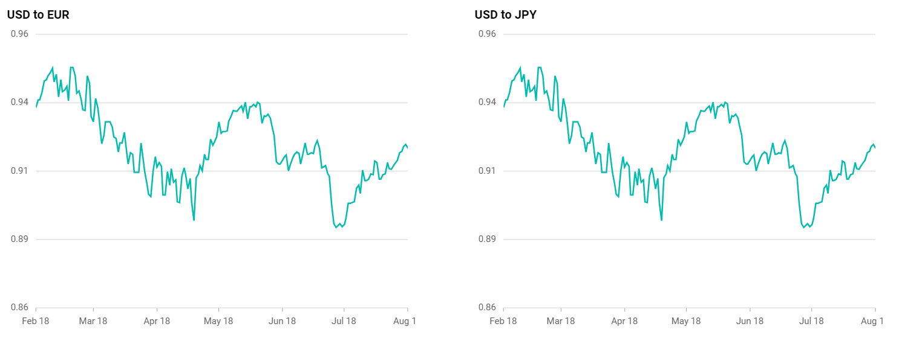
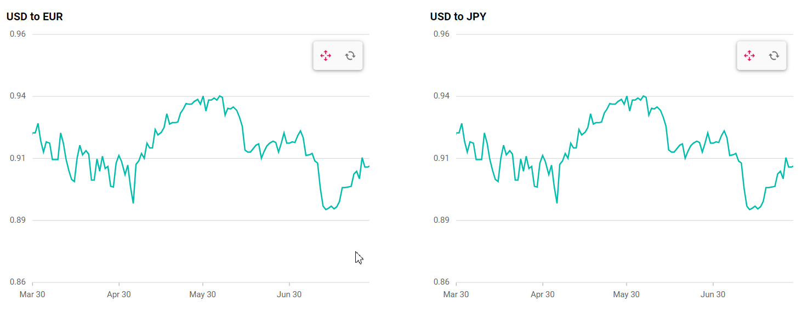

<!-- markdownlint-disable MD036 -->

# Synchronized chart in Blazor Charts Component

Synchronized chart has the ability to access and interact with two or more charts concurrently. This means that actions performed on one chart, such as placing a cursor, clicking on a specific point, or activating a tooltip are reflect simultaneously on corresponding positions or data points across other synchronized charts based on its X-Y coordinates. 

## Tooltip synchronization

The tooltip can be synchronized across multiple charts using the `ShowTooltip` and `HideTooltip` methods. When we hover over a data point in one chart, we call the `ShowTooltip` method for the other charts to display related information in other connected charts simultaneously.

In the showTooltip method, specify the following parameters programmatically to enable tooltip for a particular chart:

* x - x-value of point or x-coordinate value.
* y - y-value of point or y-coordinate value.

```cshtml

@using Syncfusion.Blazor.Charts;
@using Syncfusion.Blazor
@using System.Net.Http.Json
@inject NavigationManager NavigationManager
@inject HttpClient Http

<div class="row">
    <div class ="col">
        <SfChart Title="USD to EUR" @ref="_chart1" Width="550">
            <ChartEvents ChartMouseMove="OnMouseEventChart1" ChartMouseUp="OnMouseLeaveChart1" ChartMouseDown="ChartMouseDown"></ChartEvents>
            <ChartArea>
                <ChartTitleStyle TextAlignment="Alignment.Near"></ChartTitleStyle>
                <ChartAreaBorder Width="0"></ChartAreaBorder>
            </ChartArea>
            <ChartPrimaryXAxis ZoomFactor=@zoomFactor ZoomPosition=@zoomPosition ValueType="Syncfusion.Blazor.Charts.ValueType.DateTime" Minimum="new DateTime(2023, 02, 18)" Maximum="new DateTime(2023, 08, 18)" LabelFormat="MMM d" IntervalType="IntervalType.Months" LabelIntersectAction="LabelIntersectAction.Hide">
                <ChartAxisMajorGridLines Width="0"></ChartAxisMajorGridLines>
                <ChartAxisLineStyle Width="0"></ChartAxisLineStyle>
            </ChartPrimaryXAxis>
            <ChartPrimaryYAxis Minimum="0.86" Maximum="0.96" LabelFormat="n2" Interval="0.025">
                <ChartAxisMajorTickLines Width="0"></ChartAxisMajorTickLines>
                <ChartAxisLineStyle Width="0"></ChartAxisLineStyle>
            </ChartPrimaryYAxis>
            <ChartSeriesCollection>
                <ChartSeries DataSource="@ChartPoints" XName="USD" YName="EUR" Type="ChartSeriesType.Line" Width="2"  >
                    <ChartEmptyPointSettings Mode="EmptyPointMode.Drop"></ChartEmptyPointSettings>
                </ChartSeries>
            </ChartSeriesCollection>

            <ChartTooltipSettings Enable="true"   Shared="true" Header="" Format="<b>€${point.y}</b> <br> ${point.x} 2023" EnableMarker="false"></ChartTooltipSettings>
            <ChartCrosshairSettings   DashArray="2,2" LineType="LineType.Vertical"></ChartCrosshairSettings>
            <ChartZoomSettings EnableMouseWheelZooming="true" EnablePinchZooming="true" EnableScrollbar="false" EnableDeferredZooming="false" EnablePan="true" Mode="ZoomMode.X" ToolbarItems="@toolbarItems"></ChartZoomSettings>
        </SfChart>
    </div>
    <div class="col">
        <SfChart Title="USD to JPY" @ref="_chart2" Width="550">
            <ChartEvents ChartMouseMove="OnMouseEventChart2" ChartMouseUp="OnMouseLeaveChart2" ChartMouseDown="ChartMouseDown"></ChartEvents>
            <ChartArea>
                <ChartTitleStyle TextAlignment="Alignment.Near"></ChartTitleStyle>
                <ChartAreaBorder Width="0"></ChartAreaBorder>
            </ChartArea>
            <ChartPrimaryXAxis ZoomFactor=@zoomFactor ZoomPosition=@zoomPosition ValueType="Syncfusion.Blazor.Charts.ValueType.DateTime" Minimum="new DateTime(2023, 02, 18)" Maximum="new DateTime(2023, 08, 18)" LabelFormat="MMM d" IntervalType="IntervalType.Months" LabelIntersectAction="LabelIntersectAction.Hide">
                <ChartAxisMajorGridLines Width="0"></ChartAxisMajorGridLines>
                <ChartAxisLineStyle Width="0"></ChartAxisLineStyle>
            </ChartPrimaryXAxis>
            <ChartPrimaryYAxis Minimum="0.86" Maximum="0.96" LabelFormat="n2" Interval="0.025">
                <ChartAxisMajorTickLines Width="0"></ChartAxisMajorTickLines>
                <ChartAxisLineStyle Width="0"></ChartAxisLineStyle>
            </ChartPrimaryYAxis>
            <ChartSeriesCollection>
                <ChartSeries DataSource="@ChartPoints" XName="USD" YName="EUR" Type="ChartSeriesType.Line" Width="2"  >
                    <ChartEmptyPointSettings Mode="EmptyPointMode.Drop"></ChartEmptyPointSettings>
                </ChartSeries>
            </ChartSeriesCollection>
            <ChartTooltipSettings Enable="true"   Shared="true" Header="" Format="<b>€${point.y}</b> <br> ${point.x} 2023" EnableMarker="false"></ChartTooltipSettings>
            <ChartCrosshairSettings   DashArray="2,2" LineType="LineType.Vertical"></ChartCrosshairSettings>
            <ChartZoomSettings EnableMouseWheelZooming="true" EnablePinchZooming="true" EnableScrollbar="false" EnableDeferredZooming="false" EnablePan="true" Mode="ZoomMode.X" ToolbarItems="@toolbarItems"></ChartZoomSettings>
        </SfChart>
    </div>

</div>

@code{

    public SfChart? _chart1;
    public SfChart? _chart2;
    private bool isMouseMoveUpDetected;
    private bool isTouch;
    private bool isTapHold = false;
    public double zoomFactor = 1;
    public double zoomPosition = 0;

    List<ToolbarItems> toolbarItems = new List<ToolbarItems>() { ToolbarItems.Pan, ToolbarItems.Reset };

    protected override async Task OnInitializedAsync()
    {
        ChartPoints = await Http.GetFromJsonAsync<CurrencyRates[]>(NavigationManager.BaseUri + "./synchronized-data.json");
    }

    public class CurrencyRates
    {
        public DateTime USD { get; set; }
        public double EUR { get; set; }
        public double JPY { get; set; }
        public double SGD { get; set; }
        public double INR { get; set; }
    }

    public CurrencyRates[] ChartPoints { get; set; } = new CurrencyRates[] { };     

    public void ChartMouseDown(ChartMouseEventArgs changeEventArgs)
    {
        isMouseMoveUpDetected = false;
        isTouch = true;
    }

    public void OnMouseEventChart1(ChartMouseEventArgs args)
    {
        _chart2.ShowTooltip(args.MouseX, args.MouseY, false);         
    }

    public void OnMouseEventChart2(ChartMouseEventArgs args)
    {
        _chart1.ShowTooltip(args.MouseX, args.MouseY, false);       
    }
    public void OnMouseLeaveChart1()
    {
        _chart2.HideTooltip();
    }
    public void OnMouseLeaveChart2()
    {
        _chart1.HideTooltip();     

    }

    public void OnMouseLeaveChart1(ChartMouseEventArgs args)
    {
            isTapHold = false;
            isTouch = false;
            isMouseMoveUpDetected = true;
            _chart2.HideTooltip();            

    }
    public void OnMouseLeaveChart2(ChartMouseEventArgs args)
    {

            isTapHold = false;
            isTouch = false;
            isMouseMoveUpDetected = true;
            _chart1.HideTooltip();            

    }
}

```



## Crosshair synchronization

The crosshair can be synchronized across multiple charts using the `ShowCrosshair` and `HideCrosshair` methods. When we hover over one chart, we call the showCrosshair method for the other charts to align with data points in other connected charts, simplifying data comparison and analysis.

In the showCrosshair method, specify the following parameters programmatically to enable crosshair for a particular chart:

* x - x-value of point or x-coordinate value.
* y - y-value of point or y-coordinate value.

```cshtml 
 
@using Syncfusion.Blazor.Charts;
@using Syncfusion.Blazor
@using System.Net.Http.Json
@inject NavigationManager NavigationManager
@inject HttpClient Http

<div class="row">
    <div class="col">
        <SfChart Title="USD to EUR" @ref="_chart1" Width="550">
            <ChartEvents ChartMouseMove="OnMouseEventChart1" ChartMouseUp="OnMouseLeaveChart1" ChartMouseDown="ChartMouseDown" OnCrosshairMove="OnCrosshairMove" ></ChartEvents>
            <ChartArea>
                <ChartTitleStyle TextAlignment="Alignment.Near"></ChartTitleStyle>
                <ChartAreaBorder Width="0"></ChartAreaBorder>
            </ChartArea>
            <ChartPrimaryXAxis ZoomFactor=@zoomFactor ZoomPosition=@zoomPosition ValueType="Syncfusion.Blazor.Charts.ValueType.DateTime" Minimum="new DateTime(2023, 02, 18)" Maximum="new DateTime(2023, 08, 18)" LabelFormat="MMM d" IntervalType="IntervalType.Months" LabelIntersectAction="LabelIntersectAction.Hide">
                <ChartAxisMajorGridLines Width="0"></ChartAxisMajorGridLines>
                <ChartAxisLineStyle Width="0"></ChartAxisLineStyle>
            </ChartPrimaryXAxis>
            <ChartPrimaryYAxis Minimum="0.86" Maximum="0.96" LabelFormat="n2" Interval="0.025">
                <ChartAxisMajorTickLines Width="0"></ChartAxisMajorTickLines>
                <ChartAxisLineStyle Width="0"></ChartAxisLineStyle>
            </ChartPrimaryYAxis>
            <ChartSeriesCollection>
                <ChartSeries DataSource="@ChartPoints" XName="USD" YName="EUR" Type="ChartSeriesType.Line" Width="2">
                    <ChartEmptyPointSettings Mode="EmptyPointMode.Drop"></ChartEmptyPointSettings>
                </ChartSeries>
            </ChartSeriesCollection>

            <ChartTooltipSettings Shared="true" Header="" Format="<b>€${point.y}</b> <br> ${point.x} 2023" EnableMarker="false"></ChartTooltipSettings>
            <ChartCrosshairSettings Enable="true" DashArray="2,2" LineType="LineType.Vertical"></ChartCrosshairSettings>
            <ChartZoomSettings EnableMouseWheelZooming="true" EnablePinchZooming="true" EnableScrollbar="false" EnableDeferredZooming="false" EnablePan="true" Mode="ZoomMode.X" ToolbarItems="@toolbarItems"></ChartZoomSettings>
        </SfChart>
    </div>
    <div class="col">
        <SfChart Title="USD to JPY" @ref="_chart2" Width="550">
            <ChartEvents ChartMouseMove="OnMouseEventChart2" ChartMouseUp="OnMouseLeaveChart2" ChartMouseDown="ChartMouseDown" OnCrosshairMove="OnCrosshairMove" ></ChartEvents>
            <ChartArea>
                <ChartTitleStyle TextAlignment="Alignment.Near"></ChartTitleStyle>
                <ChartAreaBorder Width="0"></ChartAreaBorder>
            </ChartArea>
            <ChartPrimaryXAxis ZoomFactor=@zoomFactor ZoomPosition=@zoomPosition ValueType="Syncfusion.Blazor.Charts.ValueType.DateTime" Minimum="new DateTime(2023, 02, 18)" Maximum="new DateTime(2023, 08, 18)" LabelFormat="MMM d" IntervalType="IntervalType.Months" LabelIntersectAction="LabelIntersectAction.Hide">
                <ChartAxisMajorGridLines Width="0"></ChartAxisMajorGridLines>
                <ChartAxisLineStyle Width="0"></ChartAxisLineStyle>
            </ChartPrimaryXAxis>
            <ChartPrimaryYAxis Minimum="0.86" Maximum="0.96" LabelFormat="n2" Interval="0.025">
                <ChartAxisMajorTickLines Width="0"></ChartAxisMajorTickLines>
                <ChartAxisLineStyle Width="0"></ChartAxisLineStyle>
            </ChartPrimaryYAxis>
            <ChartSeriesCollection>
                <ChartSeries DataSource="@ChartPoints" XName="USD" YName="EUR" Type="ChartSeriesType.Line" Width="2">
                    <ChartEmptyPointSettings Mode="EmptyPointMode.Drop"></ChartEmptyPointSettings>
                </ChartSeries>
            </ChartSeriesCollection>
            <ChartTooltipSettings Shared="true" Header="" Format="<b>€${point.y}</b> <br> ${point.x} 2023" EnableMarker="false"></ChartTooltipSettings>
            <ChartCrosshairSettings Enable="true" DashArray="2,2" LineType="LineType.Vertical"></ChartCrosshairSettings>
            <ChartZoomSettings EnableMouseWheelZooming="true" EnablePinchZooming="true" EnableScrollbar="false" EnableDeferredZooming="false" EnablePan="true" Mode="ZoomMode.X" ToolbarItems="@toolbarItems"></ChartZoomSettings>
        </SfChart>
    </div>

</div>

@code {

    public SfChart? _chart1;
    public SfChart? _chart2;
    private bool isMouseMoveUpDetected;
    private bool isTouch;
    private bool isTapHold = false;
    public double zoomFactor = 1;
    public double zoomPosition = 0;

    List<ToolbarItems> toolbarItems = new List<ToolbarItems>() { ToolbarItems.Pan, ToolbarItems.Reset };

    protected override async Task OnInitializedAsync()
    {
        ChartPoints = await Http.GetFromJsonAsync<CurrencyRates[]>(NavigationManager.BaseUri + "./synchronized-data.json");
    }

    public class CurrencyRates
    {
        public DateTime USD { get; set; }
        public double EUR { get; set; }
        public double JPY { get; set; }
        public double SGD { get; set; }
        public double INR { get; set; }
    }

    public CurrencyRates[] ChartPoints { get; set; } = new CurrencyRates[] { };
     
    public void OnCrosshairMove(CrosshairMoveEventArgs changeEventArgs)
    {
        isTapHold = isMouseMoveUpDetected ? false : true;
    }
    public void ChartMouseDown(ChartMouseEventArgs changeEventArgs)
    {
        isMouseMoveUpDetected = false;
        isTouch = true;
    }

    public void OnMouseEventChart1(ChartMouseEventArgs args)
    {      
        _chart2.ShowCrosshair(args.MouseX, args.MouseY);
    }

    public void OnMouseEventChart2(ChartMouseEventArgs args)
    {       
        _chart1.ShowCrosshair(args.MouseX, args.MouseY);
    }
    public void OnMouseLeaveChart1()
    {     
        _chart2.HideCrosshair();
    }
    public void OnMouseLeaveChart2()
    {        
        _chart1.HideCrosshair();
    }

    public void OnMouseLeaveChart1(ChartMouseEventArgs args)
    {
        isTapHold = false;
        isTouch = false;
        isMouseMoveUpDetected = true;       
        _chart2.HideCrosshair();
    }
    public void OnMouseLeaveChart2(ChartMouseEventArgs args)
    {
        isTapHold = false;
        isTouch = false;
        isMouseMoveUpDetected = true;       
        _chart1.HideCrosshair();
    }
}

```


## Zooming synchronization

You can maintain constant zoom levels across multiple charts using the [OnZoomEnd](https://help.syncfusion.com/cr/blazor/Syncfusion.Blazor.Charts.ChartEvents.html#Syncfusion_Blazor_Charts_ChartEvents_OnZoomEnd) event. In the [OnZoomEnd](https://help.syncfusion.com/cr/blazor/Syncfusion.Blazor.Charts.ChartEvents.html#Syncfusion_Blazor_Charts_ChartEvents_OnZoomEnd) event, obtain the `ZoomFactor` and `ZoomPosition` values of the particular chart, and then apply those values to the other charts.

```cshtml
 
@using Syncfusion.Blazor.Charts;
@using Syncfusion.Blazor
@using System.Net.Http.Json
@inject NavigationManager NavigationManager
@inject HttpClient Http

<div class="row">
    <div class="col">
        <SfChart Title="USD to EUR" @ref="_chart1" Width="550">
            <ChartEvents OnZoomEnd="ZoomEvent"></ChartEvents>
            <ChartArea>
                <ChartTitleStyle TextAlignment="Alignment.Near"></ChartTitleStyle>
                <ChartAreaBorder Width="0"></ChartAreaBorder>
            </ChartArea>
            <ChartPrimaryXAxis ZoomFactor=@zoomFactor ZoomPosition=@zoomPosition ValueType="Syncfusion.Blazor.Charts.ValueType.DateTime" Minimum="new DateTime(2023, 02, 18)" Maximum="new DateTime(2023, 08, 18)" LabelFormat="MMM d" IntervalType="IntervalType.Months" LabelIntersectAction="LabelIntersectAction.Hide">
                <ChartAxisMajorGridLines Width="0"></ChartAxisMajorGridLines>
                <ChartAxisLineStyle Width="0"></ChartAxisLineStyle>
            </ChartPrimaryXAxis>
            <ChartPrimaryYAxis Minimum="0.86" Maximum="0.96" LabelFormat="n2" Interval="0.025">
                <ChartAxisMajorTickLines Width="0"></ChartAxisMajorTickLines>
                <ChartAxisLineStyle Width="0"></ChartAxisLineStyle>
            </ChartPrimaryYAxis>
            <ChartSeriesCollection>
                <ChartSeries DataSource="@ChartPoints" XName="USD" YName="EUR" Type="ChartSeriesType.Line" Width="2">
                    <ChartEmptyPointSettings Mode="EmptyPointMode.Drop"></ChartEmptyPointSettings>
                </ChartSeries>
            </ChartSeriesCollection>             
            <ChartZoomSettings EnableMouseWheelZooming="true" EnablePinchZooming="true" EnableScrollbar="false" EnableDeferredZooming="false" EnablePan="true" Mode="ZoomMode.X" ToolbarItems="@toolbarItems"></ChartZoomSettings>
        </SfChart>
    </div>
    <div class="col">
        <SfChart Title="USD to JPY" @ref="_chart2" Width="550">
            <ChartEvents OnZoomEnd="ZoomEvent"></ChartEvents>
            <ChartArea>
                <ChartTitleStyle TextAlignment="Alignment.Near"></ChartTitleStyle>
                <ChartAreaBorder Width="0"></ChartAreaBorder>
            </ChartArea>
            <ChartPrimaryXAxis ZoomFactor=@zoomFactor ZoomPosition=@zoomPosition ValueType="Syncfusion.Blazor.Charts.ValueType.DateTime" Minimum="new DateTime(2023, 02, 18)" Maximum="new DateTime(2023, 08, 18)" LabelFormat="MMM d" IntervalType="IntervalType.Months" LabelIntersectAction="LabelIntersectAction.Hide">
                <ChartAxisMajorGridLines Width="0"></ChartAxisMajorGridLines>
                <ChartAxisLineStyle Width="0"></ChartAxisLineStyle>
            </ChartPrimaryXAxis>
            <ChartPrimaryYAxis Minimum="0.86" Maximum="0.96" LabelFormat="n2" Interval="0.025">
                <ChartAxisMajorTickLines Width="0"></ChartAxisMajorTickLines>
                <ChartAxisLineStyle Width="0"></ChartAxisLineStyle>
            </ChartPrimaryYAxis>
            <ChartSeriesCollection>
                <ChartSeries DataSource="@ChartPoints" XName="USD" YName="EUR" Type="ChartSeriesType.Line" Width="2">
                    <ChartEmptyPointSettings Mode="EmptyPointMode.Drop"></ChartEmptyPointSettings>
                </ChartSeries>
            </ChartSeriesCollection>             
            <ChartZoomSettings EnableMouseWheelZooming="true" EnablePinchZooming="true" EnableScrollbar="false" EnableDeferredZooming="false" EnablePan="true" Mode="ZoomMode.X" ToolbarItems="@toolbarItems"></ChartZoomSettings>
        </SfChart>
    </div>

</div>

@code {

    public SfChart? _chart1;
    public SfChart? _chart2;  
    public double zoomFactor = 1;
    public double zoomPosition = 0;

    List<ToolbarItems> toolbarItems = new List<ToolbarItems>() { ToolbarItems.Pan, ToolbarItems.Reset };

    protected override async Task OnInitializedAsync()
    {
        ChartPoints = await Http.GetFromJsonAsync<CurrencyRates[]>(NavigationManager.BaseUri + "./synchronized-data.json");
    }

    public class CurrencyRates
    {
        public DateTime USD { get; set; }
        public double EUR { get; set; }
        public double JPY { get; set; }
        public double SGD { get; set; }
        public double INR { get; set; }
    }

    public CurrencyRates[] ChartPoints { get; set; } = new CurrencyRates[] { };

    public void ZoomEvent(ZoomingEventArgs args)
    {
        zoomFactor = args.AxisCollection.Find(item => item.AxisName == "PrimaryXAxis").ZoomFactor;
        zoomPosition = args.AxisCollection.Find(item => item.AxisName == "PrimaryXAxis").ZoomPosition;
        InvokeAsync(StateHasChanged);
    }
 
} 

```



N> Refer to our [Blazor Charts](https://www.syncfusion.com/blazor-components/blazor-charts) feature tour page for its groundbreaking feature representations and also explore our [Blazor Chart Example](https://blazor.syncfusion.com/demos/chart/line?theme=bootstrap4) to know various chart types and how to represent time-dependent data, showing trends at equal intervals.
