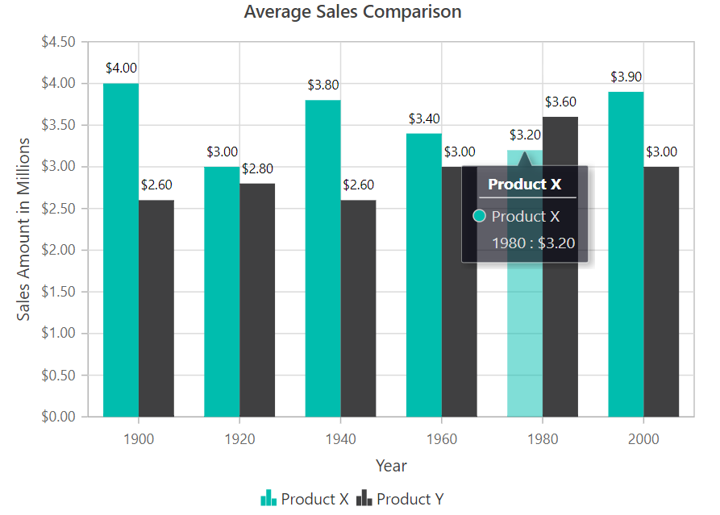

# Internationalization in Blazor Charts Component

Internationalization enables the Blazor Charts component to adapt for users from any culture, region, or language. The following [Chart](https://help.syncfusion.com/cr/blazor/Syncfusion.Blazor.Charts.SfChart.html) elements display content based on internationalization settings:

* Data label
* Axis label
* Tooltip

<!-- markdownlint-disable MD036 -->
## Globalization

The [LabelFormat](https://help.syncfusion.com/cr/blazor/Syncfusion.Blazor.Charts.ChartAxis.html#Syncfusion_Blazor_Charts_ChartAxis_LabelFormat) property in the axis globalize number, date, and time values for [Axis label](https://help.syncfusion.com/cr/blazor/Syncfusion.Blazor.Charts.ChartAxis.html), [Data label](https://help.syncfusion.com/cr/blazor/Syncfusion.Blazor.Charts.ChartDataLabel.html), and [Tooltip](https://help.syncfusion.com/cr/blazor/Syncfusion.Blazor.Charts.ChartTooltipSettings.html) in the [Chart](https://help.syncfusion.com/cr/blazor/Syncfusion.Blazor.Charts.SfChart.html) component.

In the example below, axis, point and tooltip labels are globalized to EUR.

```cshtml

@using Syncfusion.Blazor.Charts

<SfChart Title="Average Sales Comparison">
    <ChartPrimaryXAxis Title="Year" />

    <ChartPrimaryYAxis LabelFormat="c" Title="Sales Amount in Millions" />

    <ChartTooltipSettings Enable="true" Format="${series.name} <br>${point.x} : ${point.y}">
    </ChartTooltipSettings>

    <ChartSeriesCollection>
        <ChartSeries DataSource="@SalesReports" XName="X" YName="Y" Type="ChartSeriesType.Column" Name="Product X">
            <ChartMarker>
                <ChartDataLabel Visible="true"></ChartDataLabel>
            </ChartMarker>
        </ChartSeries>
        <ChartSeries DataSource="@SalesReports" XName="X" YName="Y1" Type="ChartSeriesType.Column" Name="Product Y">
            <ChartMarker>
                <ChartDataLabel Visible="true"></ChartDataLabel>
            </ChartMarker>
        </ChartSeries>
    </ChartSeriesCollection>
</SfChart>

@code {
    public class ChartData
    {
        public double X { get; set; }
        public double Y { get; set; }
        public double Y1 { get; set; }
    }

    public List<ChartData> SalesReports = new List<ChartData>
	{
        new ChartData { X = 1900, Y = 4, Y1 = 2.6 },
        new ChartData { X = 1920, Y = 3.0, Y1 = 2.8 },
        new ChartData { X = 1940, Y = 3.8, Y1 = 2.6},
        new ChartData { X = 1960, Y = 3.4, Y1 = 3 },
        new ChartData { X = 1980, Y = 3.2, Y1 = 3.6 },
        new ChartData { X = 2000, Y = 3.9, Y1 = 3 }
    };
}


```



## Label format

Learn more about axis label formats for different axis types:

* [Numeric Label Format](./numeric-axis#label-format)
* [DateTime Label Format](./date-time-axis#label-format)
* [Logarithmic Label Format](./logarithmic-axis#label-format)
* [Custom Label Format](./numeric-axis#custom-label-format)

N> Refer to our [Blazor Charts](https://www.syncfusion.com/blazor-components/blazor-charts) feature tour page for its groundbreaking feature representations and also explore our [Blazor Chart Example](https://blazor.syncfusion.com/demos/chart/line?theme=bootstrap5) to know various chart types and how to represent time-dependent data, showing trends at equal intervals.

## See also

* [Data label](./data-labels)
* [Tooltip](./tool-tip)
* [Legend](./legend)
* [Marker](./data-markers)
