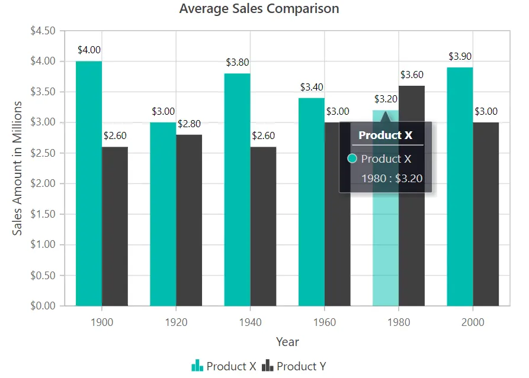

# Blazor Charts Internationalization

Internationalization formats numeric, date, and time values in the [Chart](https://help.syncfusion.com/cr/blazor/Syncfusion.Blazor.Charts.SfChart.html) according to the culture of the user. The following elements honor the configured [LabelFormat](https://help.syncfusion.com/cr/blazor/Syncfusion.Blazor.Charts.ChartAxis.html#Syncfusion_Blazor_Charts_ChartAxis_LabelFormat) and culture:

* Data label
* Axis label
* Tooltip

To localize text resources (such as the title, axis title, legend text, and tooltip header) for a specific culture, see [Localization](./localization).

<!-- markdownlint-disable MD036 -->
## Globalization

The [LabelFormat](https://help.syncfusion.com/cr/blazor/Syncfusion.Blazor.Charts.ChartAxis.html#Syncfusion_Blazor_Charts_ChartAxis_LabelFormat) property of the axis, together with the application's [CultureInfo](https://learn.microsoft.com/dotnet/api/system.globalization.cultureinfo), formats the [Axis label](https://help.syncfusion.com/cr/blazor/Syncfusion.Blazor.Charts.ChartAxis.html), [Data label](https://help.syncfusion.com/cr/blazor/Syncfusion.Blazor.Charts.ChartDataLabel.html), and [Tooltip](https://help.syncfusion.com/cr/blazor/Syncfusion.Blazor.Charts.ChartTooltipSettings.html) values in the [Chart](https://help.syncfusion.com/cr/blazor/Syncfusion.Blazor.Charts.SfChart.html) component.

The standard format specifier `c` (currency) renders values using the current culture. In the following example the application culture is set to `de-DE`, so values render as EUR; switch the `CultureInfo` to `ja-JP` to render values in yen.

```cshtml

@using Syncfusion.Blazor.Charts

<SfChart Title="Average Sales Comparison">
    <ChartPrimaryXAxis Title="Year"></ChartPrimaryXAxis>

    <ChartPrimaryYAxis LabelFormat="c" Title="Sales Amount in Millions">
    </ChartPrimaryYAxis>

    <ChartTooltipSettings Enable="true" Format="${series.name} <br>${point.x} : ${point.y}">
    </ChartTooltipSettings>

    <ChartSeriesCollection>
        <ChartSeries DataSource="@SalesReports" XName="X" YName="Y" Type="ChartSeriesType.Column" Name="Product X">
            <ChartMarker>
                <ChartDataLabel Visible="true"></ChartDataLabel>
            </ChartMarker>
        </ChartSeries>
        <ChartSeries DataSource="@SalesReports" XName="X" YName="Y1" Type="ChartSeriesType.Column" Name="Product Y">
            <ChartMarker>
                <ChartDataLabel Visible="true"></ChartDataLabel>
            </ChartMarker>
        </ChartSeries>
    </ChartSeriesCollection>
</SfChart>

@code {
    public class ChartData
    {
        public double X { get; set; }
        public double Y { get; set; }
        public double Y1 { get; set; }
    }

    public List<ChartData> SalesReports = new List<ChartData>
    {
        new ChartData { X = 1900, Y = 4, Y1 = 2.6 },
        new ChartData { X = 1920, Y = 3.0, Y1 = 2.8 },
        new ChartData { X = 1940, Y = 3.8, Y1 = 2.6 },
        new ChartData { X = 1960, Y = 3.4, Y1 = 3 },
        new ChartData { X = 1980, Y = 3.2, Y1 = 3.6 },
        new ChartData { X = 2000, Y = 3.9, Y1 = 3 }
    };
}
```



N> The `Locale` property on `SfChart` and the application's `CultureInfo` must agree. If the chart still renders in `en-US`, verify that `app.UseRequestLocalization()` is called in `Program.cs` (Blazor Server) and that the desired culture is included in the supported cultures list (Blazor WebAssembly). To format values independently of the user's culture, use a fixed format string such as `n2` or `0.00` instead of `c`.

## Label format

See the following pages for label format options for each axis type:

* [Numeric Label Format](./numeric-axis#label-format)
* [DateTime Label Format](./date-time-axis#label-format)
* [Logarithmic Label Format](./logarithmic-axis#label-format)
* [Custom Label Format](./numeric-axis#custom-label-format)

## See also

* [Data label](./data-labels)
* [Tooltip](./tool-tip)
* [Legend](./legend)
* [Marker](./data-markers)
* [Localization](./localization)
* [Numeric axis](./numeric-axis)
* [DateTime axis](./date-time-axis)