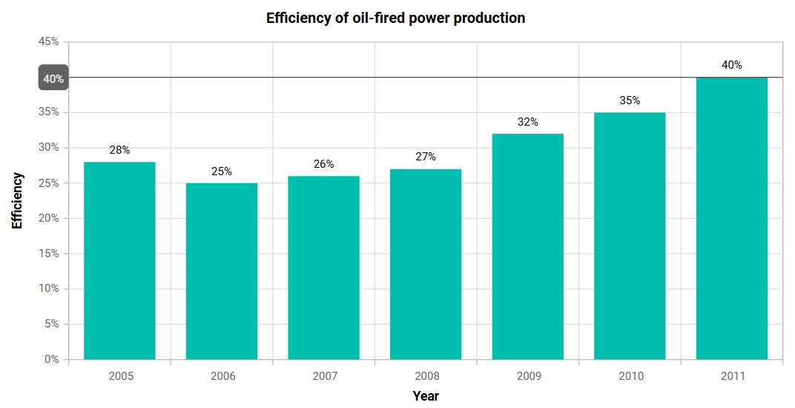
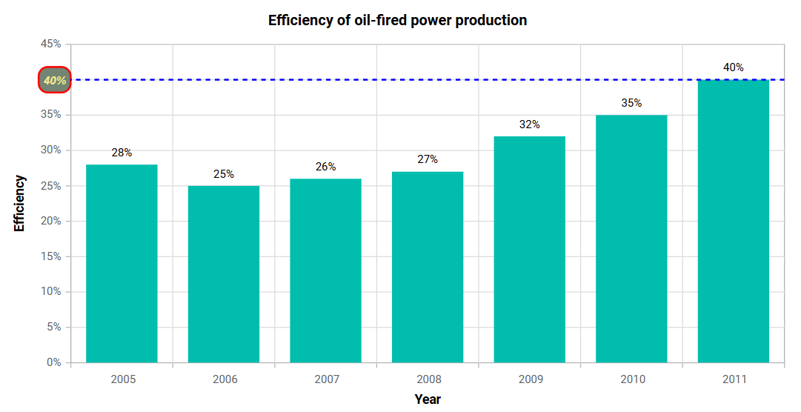

# Last Data Label in Blazor Charts Component

The last data label feature highlights the most recent data point in a series by displaying a label along with an indicator line. This enhancement improves visibility and makes it easier to identify the latest value in the chart. The label can be enabled and customized using the [ChartLastDataLabel](https://help.syncfusion.com/cr/blazor/Syncfusion.Blazor.Charts.ChartLastDataLabel.html) property.

## Enable last data label

To enable the last data label, set the [ShowLabel](https://help.syncfusion.com/cr/blazor/Syncfusion.Blazor.Charts.ChartLastDataLabel.html#Syncfusion_Blazor_Charts_ChartLastDataLabel_ShowLabel) property of the `ChartLastDataLabel` configuration to **true** within the series settings.

```cshtml

@using Syncfusion.Blazor.Charts

<SfChart Title="Efficiency of oil-fired power production" Width="70%">
    <ChartPrimaryXAxis ValueType="Syncfusion.Blazor.Charts.ValueType.Category" Title="Year"></ChartPrimaryXAxis>
    <ChartPrimaryYAxis Title="Efficiency" LabelFormat="{value}%"></ChartPrimaryYAxis>
    <ChartTooltipSettings Enable="true"></ChartTooltipSettings>
    <ChartSeriesCollection>
        <ChartSeries DataSource="@ProductionDetails" XName="X" YName="Y" Type="Syncfusion.Blazor.Charts.ChartSeriesType.Column">
            <ChartLastDataLabel ShowLabel="true"></ChartLastDataLabel>
            <ChartMarker>
                <ChartDataLabel Visible="true"></ChartDataLabel>
            </ChartMarker>
        </ChartSeries>
    </ChartSeriesCollection>
</SfChart>

@code {
    public class ChartData
    {
        public string X { get; set; }
        public double Y { get; set; }
    }

    public List<ChartData> ProductionDetails = new List<ChartData>
    {
        new ChartData { X = "2005", Y = 28 }, 
        new ChartData { X = "2006", Y = 25 }, 
        new ChartData { X = "2007", Y = 26 }, 
        new ChartData { X = "2008", Y = 27 },
        new ChartData { X = "2009", Y = 32 }, 
        new ChartData { X = "2010", Y = 35 }, 
        new ChartData { X = "2011", Y = 40 }
    };
}

```




## Customization

The appearance of the last data label can be customized using various properties defined across different settings.

In the `ChartLastDataLabel`:
* [Background](https://help.syncfusion.com/cr/blazor/Syncfusion.Blazor.Charts.ChartLastDataLabel.html#Syncfusion_Blazor_Charts_ChartLastDataLabel_Background): Sets the background color of the last data label container.
* [LineColor](https://help.syncfusion.com/cr/blazor/Syncfusion.Blazor.Charts.ChartLastDataLabel.html#Syncfusion_Blazor_Charts_ChartLastDataLabel_LineColor): Sets the color of the indicator line.
* [LineWidth](https://help.syncfusion.com/cr/blazor/Syncfusion.Blazor.Charts.ChartLastDataLabel.html#Syncfusion_Blazor_Charts_ChartLastDataLabel_LineWidth): Sets the width of the indicator line.
* [DashArray](https://help.syncfusion.com/cr/blazor/Syncfusion.Blazor.Charts.ChartLastDataLabel.html#Syncfusion_Blazor_Charts_ChartLastDataLabel_DashArray): Defines the dash pattern of the indicator line.
* [Rx](https://help.syncfusion.com/cr/blazor/Syncfusion.Blazor.Charts.ChartLastDataLabel.html#Syncfusion_Blazor_Charts_ChartLastDataLabel_Rx): Sets the horizontal corner radius of the label container.
* [Ry](https://help.syncfusion.com/cr/blazor/Syncfusion.Blazor.Charts.ChartLastDataLabel.html#Syncfusion_Blazor_Charts_ChartLastDataLabel_Ry): Sets the vertical corner radius of the label container.

In the [ChartLastDataLabelBorder](https://help.syncfusion.com/cr/blazor/Syncfusion.Blazor.Charts.ChartLastDataLabelBorder.html):
* [Color](https://help.syncfusion.com/cr/blazor/Syncfusion.Blazor.Charts.ChartLastDataLabelBorder.html#Syncfusion_Blazor_Charts_ChartLastDataLabelBorder_Color): Sets the border color of the label container.
* [Width](https://help.syncfusion.com/cr/blazor/Syncfusion.Blazor.Charts.ChartLastDataLabelBorder.html#Syncfusion_Blazor_Charts_ChartLastDataLabelBorder_Width): Sets the border width of the label container.

In the [ChartLastDataLabelFont](https://help.syncfusion.com/cr/blazor/Syncfusion.Blazor.Charts.ChartLastDataLabelFont.html):
* [Size](https://help.syncfusion.com/cr/blazor/Syncfusion.Blazor.Charts.ChartLastDataLabelFont.html#Syncfusion_Blazor_Charts_ChartLastDataLabelFont_Size): Sets the font size of the label text.
* [Color](https://help.syncfusion.com/cr/blazor/Syncfusion.Blazor.Charts.ChartLastDataLabelFont.html#Syncfusion_Blazor_Charts_ChartLastDataLabelFont_Color): Sets the font color of the label text.
* [FontFamily](https://help.syncfusion.com/cr/blazor/Syncfusion.Blazor.Charts.ChartLastDataLabelFont.html#Syncfusion_Blazor_Charts_ChartLastDataLabelFont_FontFamily): Specifies the font family of the label text.
* [FontWeight](https://help.syncfusion.com/cr/blazor/Syncfusion.Blazor.Charts.ChartLastDataLabelFont.html#Syncfusion_Blazor_Charts_ChartLastDataLabelFont_FontWeight): Sets the font weight of the label text.
* [FontStyle](https://help.syncfusion.com/cr/blazor/Syncfusion.Blazor.Charts.ChartLastDataLabelFont.html#Syncfusion_Blazor_Charts_ChartLastDataLabelFont_FontStyle): Sets the font style of the label text.

```cshtml

@using Syncfusion.Blazor.Charts

<SfChart Title="Efficiency of oil-fired power production" Width="70%">
    <ChartPrimaryXAxis ValueType="Syncfusion.Blazor.Charts.ValueType.Category" Title="Year"></ChartPrimaryXAxis>
    <ChartPrimaryYAxis Title="Efficiency" LabelFormat="{value}%"></ChartPrimaryYAxis>
    <ChartTooltipSettings Enable="true"></ChartTooltipSettings>
    <ChartSeriesCollection>
        <ChartSeries DataSource="@ProductionDetails" XName="X" YName="Y" Type="Syncfusion.Blazor.Charts.ChartSeriesType.Column">
            <ChartLastDataLabel ShowLabel="true" Background="#748574" LineColor="blue" LineWidth="2" DashArray="5" Rx="10" Ry="10">
                <ChartLastDataLabelBorder Color="red" Width="2"></ChartLastDataLabelBorder>
                <ChartLastDataLabelFont Color="#F0E68C" FontFamily="Arial" FontStyle="Italic" FontWeight="bold" Size="12px"></ChartLastDataLabelFont>
            </ChartLastDataLabel>
            <ChartMarker>
                <ChartDataLabel Visible="true"></ChartDataLabel>
            </ChartMarker>
        </ChartSeries>
    </ChartSeriesCollection>
</SfChart>

@code {
    public class ChartData
    {
        public string X { get; set; }
        public double Y { get; set; }
    }

    public List<ChartData> ProductionDetails = new List<ChartData>
    {
        new ChartData { X = "2005", Y = 28 },
        new ChartData { X = "2006", Y = 25 },
        new ChartData { X = "2007", Y = 26 },
        new ChartData { X = "2008", Y = 27 },
        new ChartData { X = "2009", Y = 32 },
        new ChartData { X = "2010", Y = 35 },
        new ChartData { X = "2011", Y = 40 }
    };
}

```




## See also

* [Data Label](./data-labels)
* [Tooltip](./tool-tip)
* [Marker](./data-markers)

N> Refer to our [Blazor Charts](https://www.syncfusion.com/blazor-components/blazor-charts) feature tour page for its groundbreaking feature representations and also explore our [Blazor Chart Example](https://blazor.syncfusion.com/demos/chart/line?theme=bootstrap5) to know various chart types and how to represent time-dependent data, showing trends at equal intervals.
