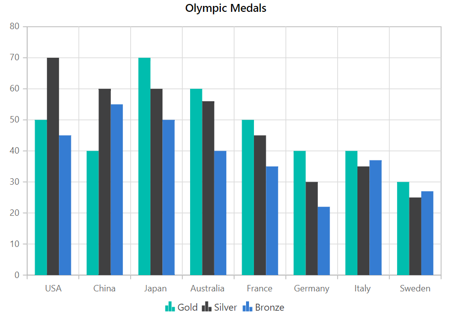
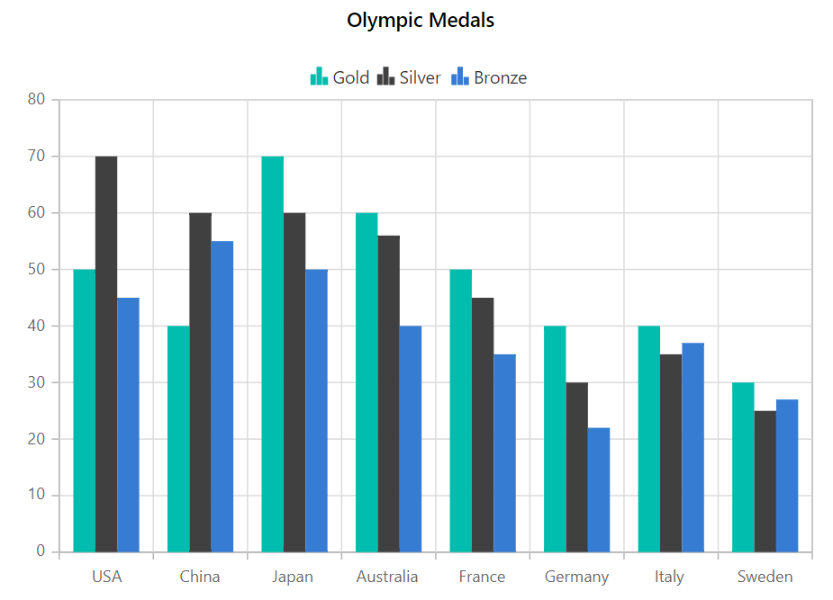
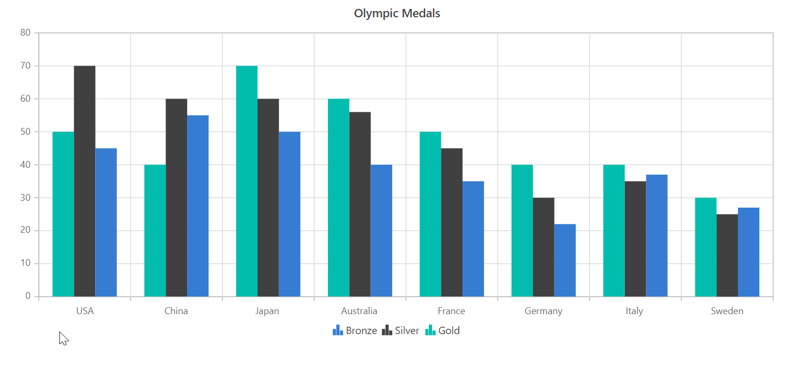
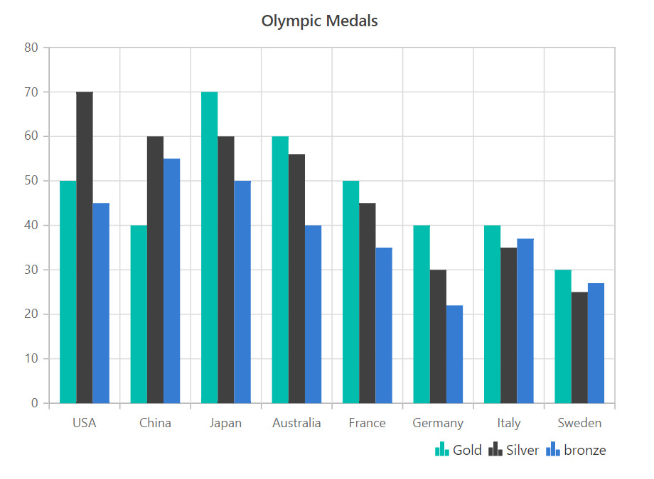
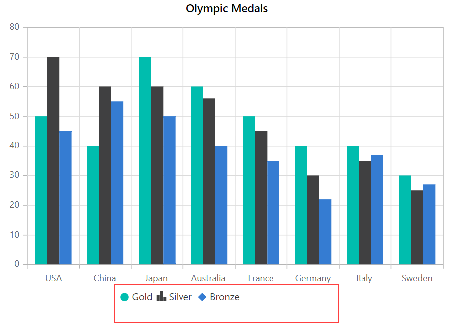
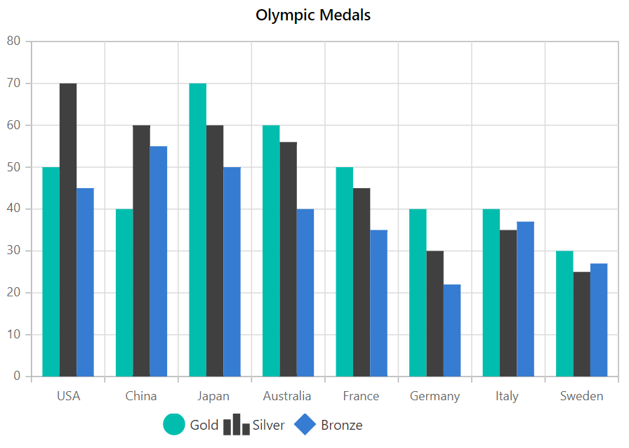
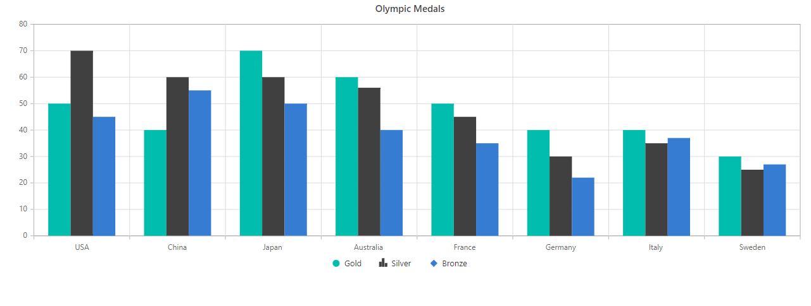
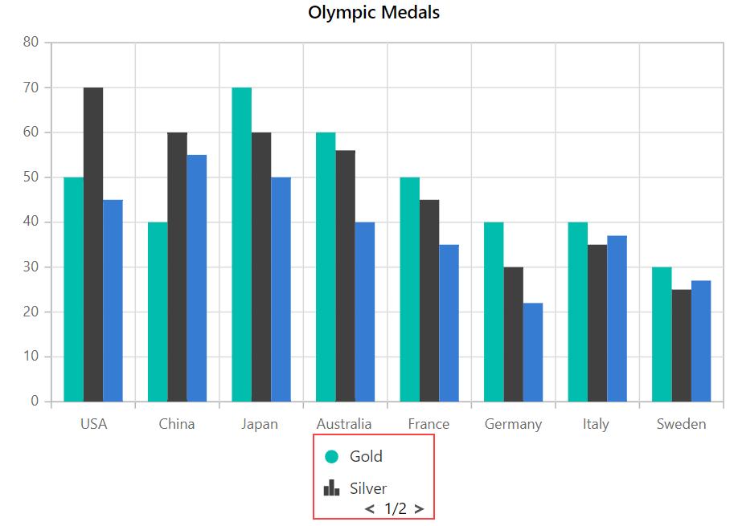
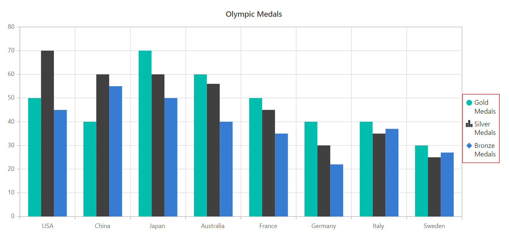
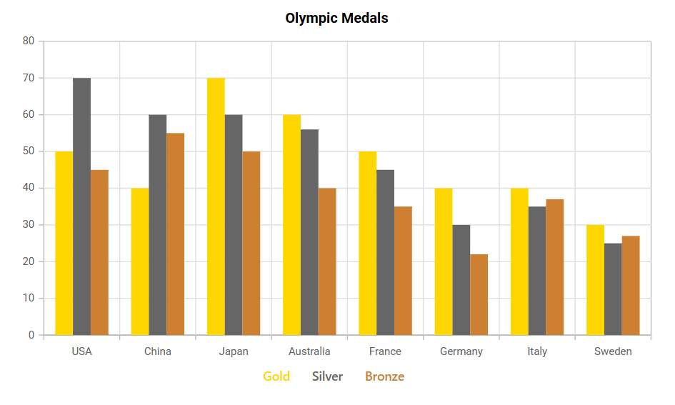

# Legend in Blazor Charts Component

The [legend](https://help.syncfusion.com/cr/blazor/Syncfusion.Blazor.Charts.ChartLegendSettings.html) provides information on the series shown in the chart.

You can learn how to add legend to Blazor Charts by watching the video below.



## Enable legend

To display the legend for the chart, set the [Visible](https://help.syncfusion.com/cr/blazor/Syncfusion.Blazor.Charts.ChartLegendSettings.html#Syncfusion_Blazor_Charts_ChartLegendSettings_Visible) property in [ChartLegendSettings](https://help.syncfusion.com/cr/blazor/Syncfusion.Blazor.Charts.ChartLegendSettings.html) to **true**.

```cshtml

@using Syncfusion.Blazor.Charts

<SfChart Title="Olympic Medals">
    <ChartPrimaryXAxis ValueType="Syncfusion.Blazor.Charts.ValueType.Category"/>    

    <ChartSeriesCollection>
        <ChartSeries DataSource="@MedalDetails" Name="Gold" XName="Country" Width="2" Opacity="1" YName="Gold" Type="ChartSeriesType.Column"/>      
        <ChartSeries DataSource="@MedalDetails" Name="Silver" XName="Country" Width="2" Opacity="1" YName="Silver" Type="ChartSeriesType.Column"/>     
        <ChartSeries DataSource="@MedalDetails" Name="Bronze" XName="Country" Width="2" Opacity="1" YName="Bronze" Type="ChartSeriesType.Column"/>      
    </ChartSeriesCollection>

    <ChartLegendSettings Visible="true"/>
</SfChart>

@code{

    public class ChartData
    {
        public string Country { get; set; }
        public double Gold { get; set; }
        public double Silver { get; set; }
        public double Bronze { get; set; }
    }

    public List<ChartData> MedalDetails = new List<ChartData>
	{
		new ChartData{ Country= "USA", Gold=50, Silver=70, Bronze=45 },
		new ChartData{ Country="China", Gold=40, Silver= 60, Bronze=55 },
		new ChartData{ Country= "Japan", Gold=70, Silver= 60, Bronze=50 },
		new ChartData{ Country= "Australia", Gold=60, Silver= 56, Bronze=40 },
		new ChartData{ Country= "France", Gold=50, Silver= 45, Bronze=35 },
		new ChartData{ Country= "Germany", Gold=40, Silver=30, Bronze=22 },
		new ChartData{ Country= "Italy", Gold=40, Silver=35, Bronze=37 },
		new ChartData{ Country= "Sweden", Gold=30, Silver=25, Bronze=27 }
	};
}

```



## Position and alignment

<!-- markdownlint-disable MD036 -->

**Legend Position**

<!-- markdownlint-disable MD036 -->

The legend can be placed at [Left](https://help.syncfusion.com/cr/blazor/Syncfusion.Blazor.Charts.LegendPosition.html#Syncfusion_Blazor_Charts_LegendPosition_Left), [Right](https://help.syncfusion.com/cr/blazor/Syncfusion.Blazor.Charts.LegendPosition.html#Syncfusion_Blazor_Charts_LegendPosition_Right), [Top](https://help.syncfusion.com/cr/blazor/Syncfusion.Blazor.Charts.LegendPosition.html#Syncfusion_Blazor_Charts_LegendPosition_Top), [Bottom](https://help.syncfusion.com/cr/blazor/Syncfusion.Blazor.Charts.LegendPosition.html#Syncfusion_Blazor_Charts_LegendPosition_Bottom) or [Custom](https://help.syncfusion.com/cr/blazor/Syncfusion.Blazor.Charts.LegendPosition.html#Syncfusion_Blazor_Charts_LegendPosition_Custom) position of the chart using the [Position](https://help.syncfusion.com/cr/blazor/Syncfusion.Blazor.Charts.ChartLegendSettings.html#Syncfusion_Blazor_Charts_ChartLegendSettings_Position) property. By default, the legend appears at the bottom of the chart.

```cshtml

@using Syncfusion.Blazor.Charts

<SfChart Title="Olympic Medals">
    <ChartPrimaryXAxis ValueType="Syncfusion.Blazor.Charts.ValueType.Category"/>    

    <ChartSeriesCollection>
        <ChartSeries DataSource="@MedalDetails" Name="Gold" XName="Country" Width="2" Opacity="1" YName="Gold" Type="ChartSeriesType.Column"/>      
        <ChartSeries DataSource="@MedalDetails" Name="Silver" XName="Country" Width="2" Opacity="1" YName="Silver" Type="ChartSeriesType.Column"/>     
        <ChartSeries DataSource="@MedalDetails" Name="Bronze" XName="Country" Width="2" Opacity="1" YName="Bronze" Type="ChartSeriesType.Column"/>      
    </ChartSeriesCollection>

    <ChartLegendSettings Visible="true" Position="LegendPosition.Top"/>
</SfChart>

@code{

    public class ChartData
    {
        public string Country { get; set; }
        public double Gold { get; set; }
        public double Silver { get; set; }
        public double Bronze { get; set; }
    }

    public List<ChartData> MedalDetails = new List<ChartData>
	{
		new ChartData{ Country= "USA", Gold=50, Silver=70, Bronze=45 },
		new ChartData{ Country="China", Gold=40, Silver= 60, Bronze=55 },
		new ChartData{ Country= "Japan", Gold=70, Silver= 60, Bronze=50 },
		new ChartData{ Country= "Australia", Gold=60, Silver= 56, Bronze=40 },
		new ChartData{ Country= "France", Gold=50, Silver= 45, Bronze=35 },
		new ChartData{ Country= "Germany", Gold=40, Silver=30, Bronze=22 },
		new ChartData{ Country= "Italy", Gold=40, Silver=35, Bronze=37 },
		new ChartData{ Country= "Sweden", Gold=30, Silver=25, Bronze=27 }
	};
}

```



The [Custom](https://help.syncfusion.com/cr/blazor/Syncfusion.Blazor.Charts.LegendPosition.html#Syncfusion_Blazor_Charts_LegendPosition_Custom) position helps to position the legend anywhere in the chart using x and y coordinates.

```cshtml

@using Syncfusion.Blazor.Charts

<SfChart Title="Olympic Medals">
    <ChartPrimaryXAxis ValueType="Syncfusion.Blazor.Charts.ValueType.Category"/>    

    <ChartSeriesCollection>
        <ChartSeries DataSource="@MedalDetails" Name="Gold" XName="Country" Width="2" Opacity="1" YName="Gold" Type="ChartSeriesType.Column">
        </ChartSeries>
        <ChartSeries DataSource="@MedalDetails" Name="Silver" XName="Country" Width="2" Opacity="1" YName="Silver" Type="ChartSeriesType.Column">
        </ChartSeries>
        <ChartSeries DataSource="@MedalDetails" Name="Bronze" XName="Country" Width="2" Opacity="1" YName="Bronze" Type="ChartSeriesType.Column">
        </ChartSeries>
    </ChartSeriesCollection>

    <ChartLegendSettings Visible="true" Position="LegendPosition.Custom">
        <ChartLocation X="200" Y="100"/>
    </ChartLegendSettings>
</SfChart>

@code{

    public class ChartData
    {
        public string Country { get; set; }
        public double Gold { get; set; }
        public double Silver { get; set; }
        public double Bronze { get; set; }
    }

    public List<ChartData> MedalDetails = new List<ChartData>
    {
        new ChartData{ Country= "USA", Gold=50, Silver=70, Bronze=45 },
        new ChartData{ Country="China", Gold=40, Silver= 60, Bronze=55 },
        new ChartData{ Country= "Japan", Gold=70, Silver= 60, Bronze=50 },
        new ChartData{ Country= "Australia", Gold=60, Silver= 56, Bronze=40 },
        new ChartData{ Country= "France", Gold=50, Silver= 45, Bronze=35 },
        new ChartData{ Country= "Germany", Gold=40, Silver=30, Bronze=22 },
        new ChartData{ Country= "Italy", Gold=40, Silver=35, Bronze=37 },
        new ChartData{ Country= "Sweden", Gold=30, Silver=25, Bronze=27 }
    };
}

```


<!-- markdownlint-disable MD036 -->

## Legend Reverse

You can reverse the order of the legend items by using the [Reverse](https://help.syncfusion.com/cr/blazor/Syncfusion.Blazor.Charts.ChartLegendSettings.html#Syncfusion_Blazor_Charts_ChartLegendSettings_Reverse) property. By default, legend for the first series in the collection will be placed first.

```cshtml

@using Syncfusion.Blazor.Charts

<SfChart Title="Olympic Medals">
    <ChartPrimaryXAxis ValueType="Syncfusion.Blazor.Charts.ValueType.Category">
    </ChartPrimaryXAxis>

    <ChartSeriesCollection>
        <ChartSeries DataSource="@MedalDetails" Name="Gold" XName="Country" Width="2" Opacity="1" YName="Gold" Type="ChartSeriesType.Column">
        </ChartSeries>
        <ChartSeries DataSource="@MedalDetails" Name="Silver" XName="Country" Width="2" Opacity="1" YName="Silver" Type="ChartSeriesType.Column">
        </ChartSeries>
        <ChartSeries DataSource="@MedalDetails" Name="Bronze" XName="Country" Width="2" Opacity="1" YName="Bronze" Type="ChartSeriesType.Column">
        </ChartSeries>
    </ChartSeriesCollection>

    <ChartLegendSettings Visible="true" Reverse="true"></ChartLegendSettings>
</SfChart>

@code{

    public class ChartData
    {
        public string Country { get; set; }
        public double Gold { get; set; }
        public double Silver { get; set; }
        public double Bronze { get; set; }
    }

    public List<ChartData> MedalDetails = new List<ChartData>
	{
		new ChartData{ Country= "USA", Gold=50, Silver=70, Bronze=45 },
		new ChartData{ Country="China", Gold=40, Silver= 60, Bronze=55 },
		new ChartData{ Country= "Japan", Gold=70, Silver= 60, Bronze=50 },
		new ChartData{ Country= "Australia", Gold=60, Silver= 56, Bronze=40 },
		new ChartData{ Country= "France", Gold=50, Silver= 45, Bronze=35 },
		new ChartData{ Country= "Germany", Gold=40, Silver=30, Bronze=22 },
		new ChartData{ Country= "Italy", Gold=40, Silver=35, Bronze=37 },
		new ChartData{ Country= "Sweden", Gold=30, Silver=25, Bronze=27 }
	};
}


```



**Legend Alignment**

<!-- markdownlint-disable MD036 -->

Using the [Alignment](https://help.syncfusion.com/cr/blazor/Syncfusion.Blazor.Charts.ChartLegendSettings.html#Syncfusion_Blazor_Charts_ChartLegendSettings_Alignment) property, place the legend in [Centre](https://help.syncfusion.com/cr/blazor/Syncfusion.Blazor.Charts.Alignment.html#Syncfusion_Blazor_Charts_Alignment_Center), [Far](https://help.syncfusion.com/cr/blazor/Syncfusion.Blazor.Charts.Alignment.html#Syncfusion_Blazor_Charts_Alignment_Far), or [Near](https://help.syncfusion.com/cr/blazor/Syncfusion.Blazor.Charts.Alignment.html#Syncfusion_Blazor_Charts_Alignment_Near) alignment.

```cshtml

@using Syncfusion.Blazor.Charts

<SfChart Title="Olympic Medals">
    <ChartPrimaryXAxis ValueType="Syncfusion.Blazor.Charts.ValueType.Category">
    </ChartPrimaryXAxis>

    <ChartSeriesCollection>
        <ChartSeries DataSource="@MedalDetails" Name="Gold" XName="Country" Width="2" Opacity="1" YName="Gold" Type="ChartSeriesType.Column">
        </ChartSeries>
        <ChartSeries DataSource="@MedalDetails" Name="Silver" XName="Country" Width="2" Opacity="1" YName="Silver" Type="ChartSeriesType.Column">
        </ChartSeries>
        <ChartSeries DataSource="@MedalDetails" Name="Bronze" XName="Country" Width="2" Opacity="1" YName="Bronze" Type="ChartSeriesType.Column">
        </ChartSeries>
    </ChartSeriesCollection>

    <ChartLegendSettings Visible="true" Alignment="Alignment.Far"></ChartLegendSettings>
</SfChart>

@code{

    public class ChartData
    {
        public string Country { get; set; }
        public double Gold { get; set; }
        public double Silver { get; set; }
        public double Bronze { get; set; }
    }

    public List<ChartData> MedalDetails = new List<ChartData>
	{
		new ChartData{ Country= "USA", Gold=50, Silver=70, Bronze=45 },
		new ChartData{ Country="China", Gold=40, Silver= 60, Bronze=55 },
		new ChartData{ Country= "Japan", Gold=70, Silver= 60, Bronze=50 },
		new ChartData{ Country= "Australia", Gold=60, Silver= 56, Bronze=40 },
		new ChartData{ Country= "France", Gold=50, Silver= 45, Bronze=35 },
		new ChartData{ Country= "Germany", Gold=40, Silver=30, Bronze=22 },
		new ChartData{ Country= "Italy", Gold=40, Silver=35, Bronze=37 },
		new ChartData{ Country= "Sweden", Gold=30, Silver=25, Bronze=27 }
	};
}


```



## Legend customization

### Legend Shape

The [LegendShape](https://help.syncfusion.com/cr/blazor/Syncfusion.Blazor.Charts.ChartSeries.html#Syncfusion_Blazor_Charts_ChartSeries_LegendShape) property in the [Series](https://help.syncfusion.com/cr/blazor/Syncfusion.Blazor.Charts.ChartSeries.html) can be used to change the shape of the legend icon. The default icon shape for legends is [SeriesType](https://help.syncfusion.com/cr/blazor/Syncfusion.Blazor.Charts.LegendShape.html#Syncfusion_Blazor_Charts_LegendShape_SeriesType).

```cshtml

@using Syncfusion.Blazor.Charts

<SfChart Title="Olympic Medals">
    <ChartPrimaryXAxis ValueType="Syncfusion.Blazor.Charts.ValueType.Category" />

    <ChartSeriesCollection>
        <ChartSeries DataSource="@MedalDetails" Name="Gold" XName="Country" Width="2" Opacity="1" YName="Gold" Type="ChartSeriesType.Column" LegendShape="LegendShape.Circle"/>
        <ChartSeries DataSource="@MedalDetails" Name="Silver" XName="Country" Width="2" Opacity="1" YName="Silver" Type="ChartSeriesType.Column" LegendShape="LegendShape.SeriesType"/>
        <ChartSeries DataSource="@MedalDetails" Name="Bronze" XName="Country" Width="2" Opacity="1" YName="Bronze" Type="ChartSeriesType.Column" LegendShape="LegendShape.Diamond"/>
    </ChartSeriesCollection>

    <ChartLegendSettings Visible="true" />
</SfChart>

@code{

    public class ChartData
    {
        public string Country { get; set; }
        public double Gold { get; set; }
        public double Silver { get; set; }
        public double Bronze { get; set; }
    }

    public List<ChartData> MedalDetails = new List<ChartData>
	{
        new ChartData{ Country= "USA", Gold=50, Silver=70, Bronze=45 },
        new ChartData{ Country="China", Gold=40, Silver= 60, Bronze=55 },
        new ChartData{ Country= "Japan", Gold=70, Silver= 60, Bronze=50 },
        new ChartData{ Country= "Australia", Gold=60, Silver= 56, Bronze=40 },
        new ChartData{ Country= "France", Gold=50, Silver= 45, Bronze=35 },
        new ChartData{ Country= "Germany", Gold=40, Silver=30, Bronze=22 },
        new ChartData{ Country= "Italy", Gold=40, Silver=35, Bronze=37 },
        new ChartData{ Country= "Sweden", Gold=30, Silver=25, Bronze=27 }
    };
}

```


### Legend Size

When the legend is placed on the top or bottom of the chart, it takes up 20% - 25% of the chart's height, and 20% - 25% of the chart's width when it is positioned on the left or right side of the chart. So, the [Width](https://help.syncfusion.com/cr/blazor/Syncfusion.Blazor.Charts.ChartLegendSettings.html#Syncfusion_Blazor_Charts_ChartLegendSettings_Width) and [Height](https://help.syncfusion.com/cr/blazor/Syncfusion.Blazor.Charts.ChartLegendSettings.html#Syncfusion_Blazor_Charts_ChartLegendSettings_Height) properties can be used to adjust the default legend size.

```cshtml

@using Syncfusion.Blazor.Charts

<SfChart Title="Olympic Medals">
    <ChartPrimaryXAxis ValueType="Syncfusion.Blazor.Charts.ValueType.Category"/>    

    <ChartSeriesCollection>
        <ChartSeries DataSource="@MedalDetails" Name="Gold" XName="Country" Width="2" LegendShape="LegendShape.Circle" Opacity="1" YName="Gold" Type="ChartSeriesType.Column">
        </ChartSeries>
        <ChartSeries DataSource="@MedalDetails" Name="Silver" XName="Country" Width="2" LegendShape="LegendShape.SeriesType" Opacity="1" YName="Silver" Type="ChartSeriesType.Column">
        </ChartSeries>
        <ChartSeries DataSource="@MedalDetails" Name="Bronze" XName="Country" Width="2" LegendShape="LegendShape.Diamond" Opacity="1" YName="Bronze" Type="ChartSeriesType.Column">
        </ChartSeries>
    </ChartSeriesCollection>

    <ChartLegendSettings Visible="true" Height="50" Width="300" >
        <ChartLegendBorder Color="red" Width="1"/>
    </ChartLegendSettings>
</SfChart>

@code{

    public class ChartData
    {
        public string Country { get; set; }
        public double Gold { get; set; }
        public double Silver { get; set; }
        public double Bronze { get; set; }
    }

    public List<ChartData> MedalDetails = new List<ChartData>
	{
        new ChartData{ Country= "USA", Gold=50, Silver=70, Bronze=45 },
        new ChartData{ Country="China", Gold=40, Silver= 60, Bronze=55 },
        new ChartData{ Country= "Japan", Gold=70, Silver= 60, Bronze=50 },
        new ChartData{ Country= "Australia", Gold=60, Silver= 56, Bronze=40 },
        new ChartData{ Country= "France", Gold=50, Silver= 45, Bronze=35 },
        new ChartData{ Country= "Germany", Gold=40, Silver=30, Bronze=22 },
        new ChartData{ Country= "Italy", Gold=40, Silver=35, Bronze=37 },
        new ChartData{ Country= "Sweden", Gold=30, Silver=25, Bronze=27 }
    };
}

```



### Legend Shape Size

The [ShapeHeight](https://help.syncfusion.com/cr/blazor/Syncfusion.Blazor.Charts.ChartLegendSettings.html#Syncfusion_Blazor_Charts_ChartLegendSettings_ShapeHeight) and [ShapeWidth](https://help.syncfusion.com/cr/blazor/Syncfusion.Blazor.Charts.ChartLegendSettings.html#Syncfusion_Blazor_Charts_ChartLegendSettings_ShapeWidth) properties can be used to adjust the dimensions of the legend shape.

```cshtml

@using Syncfusion.Blazor.Charts

<SfChart Title="Olympic Medals">
    <ChartPrimaryXAxis ValueType="Syncfusion.Blazor.Charts.ValueType.Category"/>    

    <ChartSeriesCollection>
        <ChartSeries DataSource="@MedalDetails" Name="Gold" XName="Country" Width="2" LegendShape="LegendShape.Circle" Opacity="1" YName="Gold" Type="ChartSeriesType.Column">
        </ChartSeries>
        <ChartSeries DataSource="@MedalDetails" Name="Silver" XName="Country" Width="2" LegendShape="LegendShape.SeriesType" Opacity="1" YName="Silver" Type="ChartSeriesType.Column">
        </ChartSeries>
        <ChartSeries DataSource="@MedalDetails" Name="Bronze" XName="Country" Width="2" LegendShape="LegendShape.Diamond" Opacity="1" YName="Bronze" Type="ChartSeriesType.Column">
        </ChartSeries>
    </ChartSeriesCollection>

    <ChartLegendSettings Visible="true" Height="50" Width="300" ShapeHeight="20" ShapeWidth="20">
    </ChartLegendSettings>
</SfChart>

@code{

    public class ChartData
    {
        public string Country { get; set; }
        public double Gold { get; set; }
        public double Silver { get; set; }
        public double Bronze { get; set; }
    }

    public List<ChartData> MedalDetails = new List<ChartData>
	{
		new ChartData{ Country= "USA", Gold=50, Silver=70, Bronze=45 },
		new ChartData{ Country="China", Gold=40, Silver= 60, Bronze=55 },
		new ChartData{ Country= "Japan", Gold=70, Silver= 60, Bronze=50 },
		new ChartData{ Country= "Australia", Gold=60, Silver= 56, Bronze=40 },
		new ChartData{ Country= "France", Gold=50, Silver= 45, Bronze=35 },
		new ChartData{ Country= "Germany", Gold=40, Silver=30, Bronze=22 },
		new ChartData{ Country= "Italy", Gold=40, Silver=35, Bronze=37 },
		new ChartData{ Country= "Sweden", Gold=30, Silver=25, Bronze=27 }
    };
}

```



### Legend Item Padding

The [ItemPadding](https://help.syncfusion.com/cr/blazor/Syncfusion.Blazor.Charts.ChartLegendSettings.html#Syncfusion_Blazor_Charts_ChartLegendSettings_ItemPadding) property can be used to adjust the space between the legend items.

```cshtml

@using Syncfusion.Blazor.Charts

<SfChart Title="Olympic Medals">
    <ChartPrimaryXAxis ValueType="Syncfusion.Blazor.Charts.ValueType.Category"/>
    <ChartSeriesCollection>
        <ChartSeries DataSource="@MedalDetails" Name="Gold" XName="Country" Width="2" LegendShape="LegendShape.Circle" Opacity="1" YName="Gold" Type="ChartSeriesType.Column">
        </ChartSeries>
        <ChartSeries DataSource="@MedalDetails" Name="Silver" XName="Country" Width="2" LegendShape="LegendShape.SeriesType" Opacity="1" YName="Silver" Type="ChartSeriesType.Column">
        </ChartSeries>
        <ChartSeries DataSource="@MedalDetails" Name="Bronze" XName="Country" Width="2" LegendShape="LegendShape.Diamond" Opacity="1" YName="Bronze" Type="ChartSeriesType.Column">
        </ChartSeries>
    </ChartSeriesCollection>
    <ChartLegendSettings Visible="true" ItemPadding="30" >
    </ChartLegendSettings>
</SfChart>

@code{

    public class ChartData
    {
        public string Country { get; set; }
        public double Gold { get; set; }
        public double Silver { get; set; }
        public double Bronze { get; set; }
    }

    public List<ChartData> MedalDetails = new List<ChartData>
	{
        new ChartData{ Country= "USA", Gold=50, Silver=70, Bronze=45 },
        new ChartData{ Country="China", Gold=40, Silver= 60, Bronze=55 },
        new ChartData{ Country= "Japan", Gold=70, Silver= 60, Bronze=50 },
        new ChartData{ Country= "Australia", Gold=60, Silver= 56, Bronze=40 },
        new ChartData{ Country= "France", Gold=50, Silver= 45, Bronze=35 },
        new ChartData{ Country= "Germany", Gold=40, Silver=30, Bronze=22 },
        new ChartData{ Country= "Italy", Gold=40, Silver=35, Bronze=37 },
        new ChartData{ Country= "Sweden", Gold=30, Silver=25, Bronze=27 }
    };
}

```



### Legend Paging

When the legend items exceed legend bounds, paging will be enabled by default. End user can view each legend item using the navigation buttons to navigate between pages.

```cshtml

@using Syncfusion.Blazor.Charts

<SfChart Title="Olympic Medals">
    <ChartPrimaryXAxis ValueType="Syncfusion.Blazor.Charts.ValueType.Category">
    </ChartPrimaryXAxis>

    <ChartSeriesCollection>
        <ChartSeries DataSource="@MedalDetails" Name="Gold" XName="Country" Width="2" LegendShape="LegendShape.Circle" Opacity="1" YName="Gold" Type="ChartSeriesType.Column">
        </ChartSeries>
        <ChartSeries DataSource="@MedalDetails" Name="Silver" XName="Country" Width="2" LegendShape="LegendShape.SeriesType" Opacity="1" YName="Silver" Type="ChartSeriesType.Column">
        </ChartSeries>
        <ChartSeries DataSource="@MedalDetails" Name="Bronze" XName="Country" Width="2" LegendShape="LegendShape.Diamond" Opacity="1" YName="Bronze" Type="ChartSeriesType.Column">
        </ChartSeries>
    </ChartSeriesCollection>

    <ChartLegendSettings Visible="true" Width="100" Height="70" Padding="10" ShapePadding="10" >
        <ChartLegendBorder Color="red" Width="1"/>
    </ChartLegendSettings>
</SfChart>

@code{

    public class ChartData
    {
        public string Country { get; set; }
        public double Gold { get; set; }
        public double Silver { get; set; }
        public double Bronze { get; set; }
    }

    public List<ChartData> MedalDetails = new List<ChartData>
	{
		new ChartData{ Country= "USA", Gold=50, Silver=70, Bronze=45 },
		new ChartData{ Country="China", Gold=40, Silver= 60, Bronze=55 },
		new ChartData{ Country= "Japan", Gold=70, Silver= 60, Bronze=50 },
		new ChartData{ Country= "Australia", Gold=60, Silver= 56, Bronze=40 },
		new ChartData{ Country= "France", Gold=50, Silver= 45, Bronze=35 },
		new ChartData{ Country= "Germany", Gold=40, Silver=30, Bronze=22 },
		new ChartData{ Country= "Italy", Gold=40, Silver=35, Bronze=37 },
		new ChartData{ Country= "Sweden", Gold=30, Silver=25, Bronze=27 }
   };
}

```



### Legend Text Wrap

When the legend text exceeds the container, the text can be wrapped by using [TextWrap](https://help.syncfusion.com/cr/blazor/Syncfusion.Blazor.Charts.ChartLegendSettings.html#Syncfusion_Blazor_Charts_ChartLegendSettings_TextWrap) Property. End user can also wrap the legend text based on the [MaximumLabelWidth](https://help.syncfusion.com/cr/blazor/Syncfusion.Blazor.Charts.ChartLegendSettings.html#Syncfusion_Blazor_Charts_ChartLegendSettings_MaximumLabelWidth) property.

```cshtml

@using Syncfusion.Blazor.Charts

<SfChart Title="Olympic Medals">
    <ChartPrimaryXAxis ValueType="Syncfusion.Blazor.Charts.ValueType.Category">
    </ChartPrimaryXAxis>
    <ChartSeriesCollection>
        <ChartSeries DataSource="@MedalDetails" Name="Gold Medals" XName="Country" Width="2" LegendShape="LegendShape.Circle" Opacity="1" YName="Gold" Type="ChartSeriesType.Column">
        </ChartSeries>
        <ChartSeries DataSource="@MedalDetails" Name="Silver Medals" XName="Country" Width="2" LegendShape="LegendShape.SeriesType" Opacity="1" YName="Silver" Type="ChartSeriesType.Column">
        </ChartSeries>
        <ChartSeries DataSource="@MedalDetails" Name="Bronze Medals" XName="Country" Width="2" LegendShape="LegendShape.Diamond" Opacity="1" YName="Bronze" Type="ChartSeriesType.Column">
        </ChartSeries>
    </ChartSeriesCollection>
    <ChartLegendSettings Visible="true" Position="@LegendPosition.Right" TextWrap="@TextWrap.Wrap" MaximumLabelWidth="50">
        <ChartLegendBorder Color="red" Width="1"/>
    </ChartLegendSettings>
</SfChart>

@code{

    public class ChartData
    {
        public string Country { get; set; }
        public double Gold { get; set; }
        public double Silver { get; set; }
        public double Bronze { get; set; }
    }

    public List<ChartData> MedalDetails = new List<ChartData>
	{
		new ChartData{ Country= "USA", Gold=50, Silver=70, Bronze=45 },
		new ChartData{ Country="China", Gold=40, Silver= 60, Bronze=55 },
		new ChartData{ Country= "Japan", Gold=70, Silver= 60, Bronze=50 },
		new ChartData{ Country= "Australia", Gold=60, Silver= 56, Bronze=40 },
		new ChartData{ Country= "France", Gold=50, Silver= 45, Bronze=35 },
		new ChartData{ Country= "Germany", Gold=40, Silver=30, Bronze=22 },
		new ChartData{ Country= "Italy", Gold=40, Silver=35, Bronze=37 },
		new ChartData{ Country= "Sweden", Gold=30, Silver=25, Bronze=27 }
   };
}

```



## Series selection based on legend

By default, when you click on the legend item, the appropriate series visibility is collapsed. On the other hand, [ToggleVisibility](https://help.syncfusion.com/cr/blazor/Syncfusion.Blazor.Charts.ChartLegendSettings.html#Syncfusion_Blazor_Charts_ChartLegendSettings_ToggleVisibility) property is used to disable such functionality.

```cshtml

@using Syncfusion.Blazor.Charts

<SfChart Title="Olympic Medals" SelectionMode="SelectionMode.Series">
    <ChartPrimaryXAxis ValueType="Syncfusion.Blazor.Charts.ValueType.Category"/>

    <ChartSeriesCollection>
        <ChartSeries DataSource="@MedalDetails" Name="Gold" XName="Country" Width="2" LegendShape="LegendShape.Circle" Opacity="1" YName="Gold" Type="ChartSeriesType.Column">
        </ChartSeries>
        <ChartSeries DataSource="@MedalDetails" Name="Silver" XName="Country" Width="2" LegendShape="LegendShape.SeriesType" Opacity="1" YName="Silver" Type="ChartSeriesType.Column">
        </ChartSeries>
        <ChartSeries DataSource="@MedalDetails" Name="Bronze" XName="Country" Width="2" LegendShape="LegendShape.Diamond" Opacity="1" YName="Bronze" Type="ChartSeriesType.Column">
        </ChartSeries>
    </ChartSeriesCollection>

    <ChartLegendSettings Visible="true" ToggleVisibility="false"/>
</SfChart>
@code{

    public class ChartData
    {
        public string Country { get; set; }
        public double Gold { get; set; }
        public double Silver { get; set; }
        public double Bronze { get; set; }
    }

    public List<ChartData> MedalDetails = new List<ChartData>
	{
		new ChartData{ Country= "USA", Gold=50, Silver=70, Bronze=45 },
		new ChartData{ Country="China", Gold=40, Silver= 60, Bronze=55 },
		new ChartData{ Country= "Japan", Gold=70, Silver= 60, Bronze=50 },
		new ChartData{ Country= "Australia", Gold=60, Silver= 56, Bronze=40 },
		new ChartData{ Country= "France", Gold=50, Silver= 45, Bronze=35 },
		new ChartData{ Country= "Germany", Gold=40, Silver=30, Bronze=22 },
		new ChartData{ Country= "Italy", Gold=40, Silver=35, Bronze=37 },
		new ChartData{ Country= "Sweden", Gold=30, Silver=25, Bronze=27 }
	};
}

```


## Hiding legend item

The series [Name](https://help.syncfusion.com/cr/blazor/Syncfusion.Blazor.Charts.ChartSeries.html#Syncfusion_Blazor_Charts_ChartSeries_Name) will be displayed as the legend text by default. One can skip the legend for particular series by providing an empty string to the series [Name](https://help.syncfusion.com/cr/blazor/Syncfusion.Blazor.Charts.ChartSeries.html#Syncfusion_Blazor_Charts_ChartSeries_Name) property.

```cshtml

@using Syncfusion.Blazor.Charts

<SfChart Title="Olympic Medals">
    <ChartPrimaryXAxis ValueType="Syncfusion.Blazor.Charts.ValueType.Category">
    </ChartPrimaryXAxis>

    <ChartSeriesCollection>
        <ChartSeries DataSource="@MedalDetails" Name="Gold" XName="Country" Width="2" LegendShape="LegendShape.Circle" Opacity="1" YName="Gold" Type="ChartSeriesType.Column">
        </ChartSeries>
        <ChartSeries DataSource="@MedalDetails" Name="" XName="Country" Width="2" LegendShape="LegendShape.SeriesType" Opacity="1" YName="Silver" Type="ChartSeriesType.Column">
        </ChartSeries>
        <ChartSeries DataSource="@MedalDetails" Name="Bronze" XName="Country" Width="2" LegendShape="LegendShape.Diamond" Opacity="1" YName="Bronze" Type="ChartSeriesType.Column">
        </ChartSeries>
    </ChartSeriesCollection>

    <ChartLegendSettings Visible="true" ToggleVisibility="true">
    </ChartLegendSettings>
</SfChart>
@code{
    
    public class ChartData
    {
        public string Country { get; set; }
        public double Gold { get; set; }
        public double Silver { get; set; }
        public double Bronze { get; set; }
    }

    public List<ChartData> MedalDetails = new List<ChartData>
	{
		new ChartData{ Country= "USA", Gold=50, Silver=70, Bronze=45 },
		new ChartData{ Country="China", Gold=40, Silver= 60, Bronze=55 },
		new ChartData{ Country= "Japan", Gold=70, Silver= 60, Bronze=50 },
		new ChartData{ Country= "Australia", Gold=60, Silver= 56, Bronze=40 },
		new ChartData{ Country= "France", Gold=50, Silver= 45, Bronze=35 },
		new ChartData{ Country= "Germany", Gold=40, Silver=30, Bronze=22 },
		new ChartData{ Country= "Italy", Gold=40, Silver=35, Bronze=37 },
		new ChartData{ Country= "Sweden", Gold=30, Silver=25, Bronze=27 }
	};
}

```


## Legend Template

Legend templates allow you to replace default legend icons and text with custom HTML or Blazor markup for each series. This enables branded styles, richer content (icons, multi-line text, badges), improved readability, and localization.

To use, add a `LegendItemTemplate` inside any [ChartSeries](https://help.syncfusion.com/cr/blazor/Syncfusion.Blazor.Charts.ChartSeries.html) you want to customize. The rendered content becomes the legend item and can be styled with CSS. Legend interactions (click to toggle series) remain unless [ToggleVisibility](https://help.syncfusion.com/cr/blazor/Syncfusion.Blazor.Charts.ChartLegendSettings.html#Syncfusion_Blazor_Charts_ChartLegendSettings_ToggleVisibility) is set to false. Templates work with all legend positions, alignments, and paging.

```
@using Syncfusion.Blazor.Charts

@* Initialize the chart and configure essential features *@
<SfChart Title="Olympic Medals">
    @* Set category axis for country names *@
    <ChartPrimaryXAxis ValueType="Syncfusion.Blazor.Charts.ValueType.Category" />

    @* Show the legend and enable series toggle *@
    <ChartLegendSettings Visible="true" />

    <ChartSeriesCollection>
        @* Gold column series *@
        <ChartSeries DataSource="@MedalDetails" Name="Gold" XName="Country" Width="2" Opacity="1" YName="Gold" Fill="#FFD700" Type="ChartSeriesType.Column">
            @* Custom legend with icon, label, and total count *@
            <LegendItemTemplate>
                <div style="display:flex; align-items:center; gap:10px; padding:4px 0;">
                    <span style="font-size:18px;">🥇</span>
                    <div style="display:flex; flex-direction:column; line-height:1.15;">
                        <span style="font-family:'Segoe UI'; font-size:14px; font-weight:700; color:#FFD700;">Gold</span>
                        <span style="font-size:12px; opacity:0.85;">Awarded for first place finishes</span>
                        <span style="font-size:12px; opacity:0.75;">Total: @GoldTotal</span>
                    </div>
                </div>
            </LegendItemTemplate>
        </ChartSeries>

        @* Silver column series *@
        <ChartSeries DataSource="@MedalDetails" Name="Silver" XName="Country" Width="2" Opacity="1" YName="Silver" Fill="#898989" Type="ChartSeriesType.Column">
            @* Custom legend with icon, label, and total count *@
            <LegendItemTemplate>
                <div style="display:flex; align-items:center; gap:10px; padding:4px 0;">
                    <span style="font-size:18px;">🥈</span>
                    <div style="display:flex; flex-direction:column; line-height:1.15;">
                        <span style="font-family:'Segoe UI'; font-size:14px; font-weight:700; color:#898989;">Silver</span>
                        <span style="font-size:12px; opacity:0.85;">Awarded for second place finishes</span>
                        <span style="font-size:12px; opacity:0.75;">Total: @SilverTotal</span>
                    </div>
                </div>
            </LegendItemTemplate>
        </ChartSeries>

        @* Bronze column series *@
        <ChartSeries DataSource="@MedalDetails" Name="Bronze" XName="Country" Width="2" Opacity="1" YName="Bronze" Fill="#CD7F32" Type="ChartSeriesType.Column">
            @* Custom legend with icon, label, and total count *@
            <LegendItemTemplate>
                <div style="display:flex; align-items:center; gap:10px; padding:4px 0;">
                    <span style="font-size:18px;">🥉</span>
                    <div style="display:flex; flex-direction:column; line-height:1.15;">
                        <span style="font-family:'Segoe UI'; font-size:14px; font-weight:700; color:#CD7F32;">Bronze</span>
                        <span style="font-size:12px; opacity:0.85;">Awarded for third place finishes</span>
                        <span style="font-size:12px; opacity:0.75;">Total: @BronzeTotal</span>
                    </div>
                </div>
            </LegendItemTemplate>
        </ChartSeries>
    </ChartSeriesCollection>

</SfChart>

@code {

    public class ChartData
    {
        public string Country { get; set; }
        public double Gold { get; set; }
        public double Silver { get; set; }
        public double Bronze { get; set; }
    }

    public List<ChartData> MedalDetails = new()
    {
        new ChartData{ Country= "USA",      Gold=50, Silver=70, Bronze=45 },
        new ChartData{ Country= "China",    Gold=40, Silver=60, Bronze=55 },
        new ChartData{ Country= "Japan",    Gold=70, Silver=60, Bronze=50 },
        new ChartData{ Country= "Australia",Gold=60, Silver=56, Bronze=40 },
        new ChartData{ Country= "France",   Gold=50, Silver=45, Bronze=35 },
        new ChartData{ Country= "Germany",  Gold=40, Silver=30, Bronze=22 },
        new ChartData{ Country= "Italy",    Gold=40, Silver=35, Bronze=37 },
        new ChartData{ Country= "Sweden",   Gold=30, Silver=25, Bronze=27 }
    };

    public int GoldTotal => (int)MedalDetails.Sum(m => m.Gold);
    public int SilverTotal => (int)MedalDetails.Sum(m => m.Silver);
    public int BronzeTotal => (int)MedalDetails.Sum(m => m.Bronze);
}
```


N> Refer to our [Blazor Charts](https://www.syncfusion.com/blazor-components/blazor-charts) feature tour page for its groundbreaking feature representations and also explore our [Blazor Chart Example](https://blazor.syncfusion.com/demos/chart/line?theme=bootstrap5) to know various chart types and how to represent time-dependent data, showing trends at equal intervals.

## See also

* [Data label](./data-labels)
* [Marker](./data-markers)
* [Toggle Series Visibility Using Legend](https://support.syncfusion.com/kb/article/20966/how-to-toggle-series-visibility-using-legend-in-live-blazor-chart)