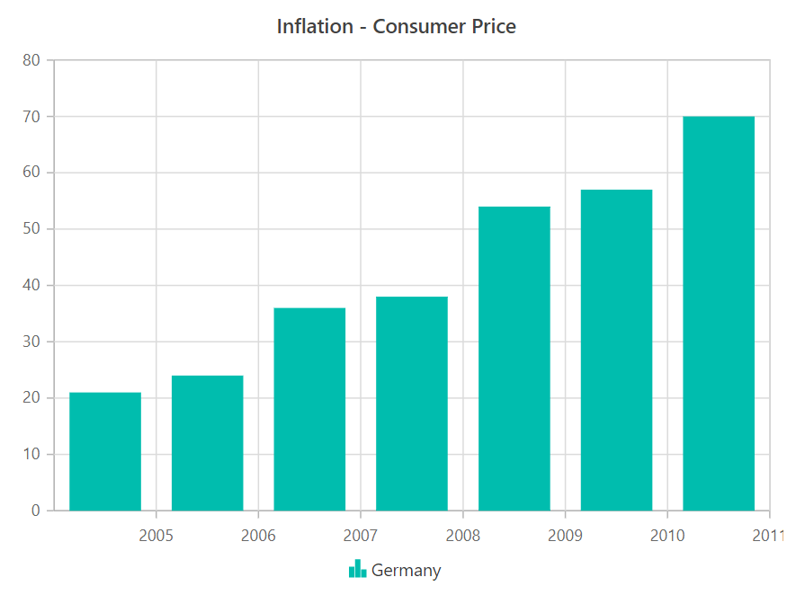
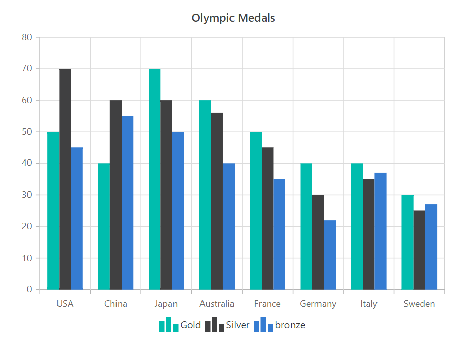
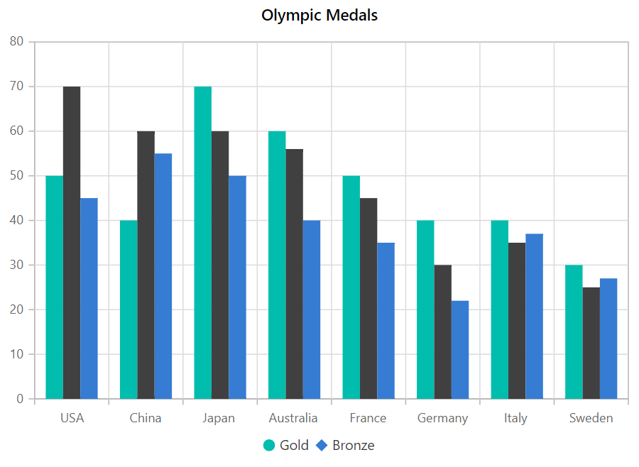

# Legend

Legend provides information about the series rendered in the chart.

## Enable Legend

You can use legend for the chart by setting the [`Visible`](https://help.syncfusion.com/cr/blazor/Syncfusion.Blazor.Charts.ChartLegendSettings.html#Syncfusion_Blazor_Charts_ChartLegendSettings_Visible)
property to **true** in [`ChartLegendSettings`](https://help.syncfusion.com/cr/blazor/Syncfusion.Blazor.Charts.ChartLegendSettings.html).





## Position and Alignment

By using the [`Position`](https://help.syncfusion.com/cr/blazor/Syncfusion.Blazor.Charts.ChartLegendSettings.html#Syncfusion_Blazor_Charts_ChartLegendSettings_Position) property, you can position the legend
at left, right, top or bottom of the chart. The legend is positioned at the bottom of the chart, by default.





Custom position helps you to position the legend anywhere in the chart using x, y coordinates.





<!-- markdownlint-disable MD036 -->

**Legend Alignment**

<!-- markdownlint-disable MD036 -->

You can align the legend at `Center`, `Far` or `Near` to the chart using
[`Alignment`](https://help.syncfusion.com/cr/blazor/Syncfusion.Blazor.Charts.ChartLegendSettings.html#Syncfusion_Blazor_Charts_ChartLegendSettings_Alignment) property.





## Customization

To change the legend icon shape, you can use [`LegendShape`](https://help.syncfusion.com/cr/blazor/Syncfusion.Blazor.Charts.ChartSeries.html#Syncfusion_Blazor_Charts_ChartSeries_LegendShape) property in the Series. By default legend icon shape is **SeriesType**.





**Legend Size**

By default, legend takes 20% - 25% of the chart's height, when it is placed on top or bottom position and 20% - 25% of the
chart's width, when placed on left or right position of the chart. You can change this default legend size by using the
[`Width`](https://help.syncfusion.com/cr/blazor/Syncfusion.Blazor.Charts.ChartLegendSettings.html#Syncfusion_Blazor_Charts_ChartLegendSettings_Width) and [`Height`](https://help.syncfusion.com/cr/blazor/Syncfusion.Blazor.Charts.ChartLegendSettings.html#Syncfusion_Blazor_Charts_ChartLegendSettings_Height) property.





**Legend Item Size**

You can customize the size of the legend items by using the [`ShapeHeight`](https://help.syncfusion.com/cr/blazor/Syncfusion.Blazor.Charts.ChartLegendSettings.html#Syncfusion_Blazor_Charts_ChartLegendSettings_ShapeHeight)
and [`ShapeWidth`](https://help.syncfusion.com/cr/blazor/Syncfusion.Blazor.Charts.ChartLegendSettings.html#Syncfusion_Blazor_Charts_ChartLegendSettings_ShapeWidth) property.





**Paging for Legend**

Paging will be enabled by default, when the legend items exceeds the legend bounds. You can view each legend items by navigating between the pages using navigation buttons.





## Series Selection on Legend

By default, legend click enables you to collapse the series visibility. On other hand, if you need to select a series through legend click, disable the
[`ToggleVisibility`](https://help.syncfusion.com/cr/blazor/Syncfusion.Blazor.Charts.ChartLegendSettings.html#Syncfusion_Blazor_Charts_ChartLegendSettings_ToggleVisibility).





## Collapsing Legend Item

By default, series name will be displayed as legend. To skip the legend for a particular series, you can give empty string to the series name.





> Note: You can refer to our [`Blazor Charts`](https://www.syncfusion.com/blazor-components/blazor-charts) feature tour page for its groundbreaking feature representations. You can also explore our [`Blazor Chart example`](https://blazor.syncfusion.com/demos/chart/line?theme=bootstrap4) to knows various chart types and how to represent time-dependent data, showing trends in data at equal intervals.

## See Also

* [Data label](./data-labels)
* [Marker](./data-markers)