---
layout: post
title: Blazor Charts Legend Configuration Examples | Syncfusion®
description: Learn how to display and customize legends in Syncfusion Blazor Charts. Enable ChartLegendSettings Visible and configure position and alignment.
platform: Blazor
control: Charts
documentation: ug
---

# Blazor Charts Legend

The [legend](https://help.syncfusion.com/cr/blazor/Syncfusion.Blazor.Charts.ChartLegendSettings.html) provides information on the series shown in the chart.

Watch the video below for a walkthrough on adding and customizing the legend.



## Enable legend

To display the legend for the chart, set the [Visible](https://help.syncfusion.com/cr/blazor/Syncfusion.Blazor.Charts.ChartLegendSettings.html#Syncfusion_Blazor_Charts_ChartLegendSettings_Visible) property in [ChartLegendSettings](https://help.syncfusion.com/cr/blazor/Syncfusion.Blazor.Charts.ChartLegendSettings.html) to **true**.

```cshtml

@using Syncfusion.Blazor.Charts

<SfChart Title="Olympic Medals">
    <ChartPrimaryXAxis ValueType="Syncfusion.Blazor.Charts.ValueType.Category"/>    

    <ChartSeriesCollection>
        <ChartSeries DataSource="@MedalDetails" Name="Gold" XName="Country" Width="2" Opacity="1" YName="Gold" Type="ChartSeriesType.Column"/>      
        <ChartSeries DataSource="@MedalDetails" Name="Silver" XName="Country" Width="2" Opacity="1" YName="Silver" Type="ChartSeriesType.Column"/>     
        <ChartSeries DataSource="@MedalDetails" Name="Bronze" XName="Country" Width="2" Opacity="1" YName="Bronze" Type="ChartSeriesType.Column"/>      
    </ChartSeriesCollection>

    <ChartLegendSettings Visible="true"/>
</SfChart>

@code{

    public class ChartData
    {
        public string Country { get; set; }
        public double Gold { get; set; }
        public double Silver { get; set; }
        public double Bronze { get; set; }
    }

    public List<ChartData> MedalDetails = new List<ChartData>
	{
		new ChartData{ Country= "USA", Gold=50, Silver=70, Bronze=45 },
		new ChartData{ Country="China", Gold=40, Silver= 60, Bronze=55 },
		new ChartData{ Country= "Japan", Gold=70, Silver= 60, Bronze=50 },
		new ChartData{ Country= "Australia", Gold=60, Silver= 56, Bronze=40 },
		new ChartData{ Country= "France", Gold=50, Silver= 45, Bronze=35 },
		new ChartData{ Country= "Germany", Gold=40, Silver=30, Bronze=22 },
		new ChartData{ Country= "Italy", Gold=40, Silver=35, Bronze=37 },
		new ChartData{ Country= "Sweden", Gold=30, Silver=25, Bronze=27 }
	};
}

```

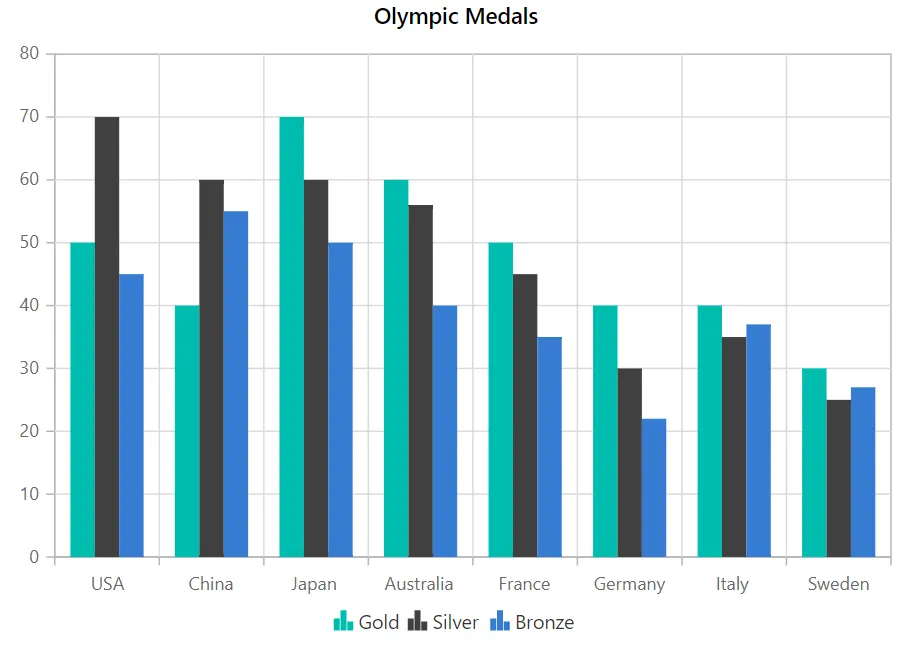

## Position and alignment

<!-- markdownlint-disable MD036 -->

**Legend Position**

<!-- markdownlint-disable MD036 -->

The legend can be placed at [Left](https://help.syncfusion.com/cr/blazor/Syncfusion.Blazor.Charts.LegendPosition.html#Syncfusion_Blazor_Charts_LegendPosition_Left), [Right](https://help.syncfusion.com/cr/blazor/Syncfusion.Blazor.Charts.LegendPosition.html#Syncfusion_Blazor_Charts_LegendPosition_Right), [Top](https://help.syncfusion.com/cr/blazor/Syncfusion.Blazor.Charts.LegendPosition.html#Syncfusion_Blazor_Charts_LegendPosition_Top), [Bottom](https://help.syncfusion.com/cr/blazor/Syncfusion.Blazor.Charts.LegendPosition.html#Syncfusion_Blazor_Charts_LegendPosition_Bottom) or [Custom](https://help.syncfusion.com/cr/blazor/Syncfusion.Blazor.Charts.LegendPosition.html#Syncfusion_Blazor_Charts_LegendPosition_Custom) position of the chart using the [Position](https://help.syncfusion.com/cr/blazor/Syncfusion.Blazor.Charts.ChartLegendSettings.html#Syncfusion_Blazor_Charts_ChartLegendSettings_Position) property. By default, the legend appears at the **bottom** of the chart.

```cshtml

@using Syncfusion.Blazor.Charts

<SfChart Title="Olympic Medals">
    <ChartPrimaryXAxis ValueType="Syncfusion.Blazor.Charts.ValueType.Category"/>    

    <ChartSeriesCollection>
        <ChartSeries DataSource="@MedalDetails" Name="Gold" XName="Country" Width="2" Opacity="1" YName="Gold" Type="ChartSeriesType.Column"/>      
        <ChartSeries DataSource="@MedalDetails" Name="Silver" XName="Country" Width="2" Opacity="1" YName="Silver" Type="ChartSeriesType.Column"/>     
        <ChartSeries DataSource="@MedalDetails" Name="Bronze" XName="Country" Width="2" Opacity="1" YName="Bronze" Type="ChartSeriesType.Column"/>      
    </ChartSeriesCollection>

    <ChartLegendSettings Visible="true" Position="LegendPosition.Top"/>
</SfChart>

@code{

    public class ChartData
    {
        public string Country { get; set; }
        public double Gold { get; set; }
        public double Silver { get; set; }
        public double Bronze { get; set; }
    }

    public List<ChartData> MedalDetails = new List<ChartData>
	{
		new ChartData{ Country= "USA", Gold=50, Silver=70, Bronze=45 },
		new ChartData{ Country="China", Gold=40, Silver= 60, Bronze=55 },
		new ChartData{ Country= "Japan", Gold=70, Silver= 60, Bronze=50 },
		new ChartData{ Country= "Australia", Gold=60, Silver= 56, Bronze=40 },
		new ChartData{ Country= "France", Gold=50, Silver= 45, Bronze=35 },
		new ChartData{ Country= "Germany", Gold=40, Silver=30, Bronze=22 },
		new ChartData{ Country= "Italy", Gold=40, Silver=35, Bronze=37 },
		new ChartData{ Country= "Sweden", Gold=30, Silver=25, Bronze=27 }
	};
}

```

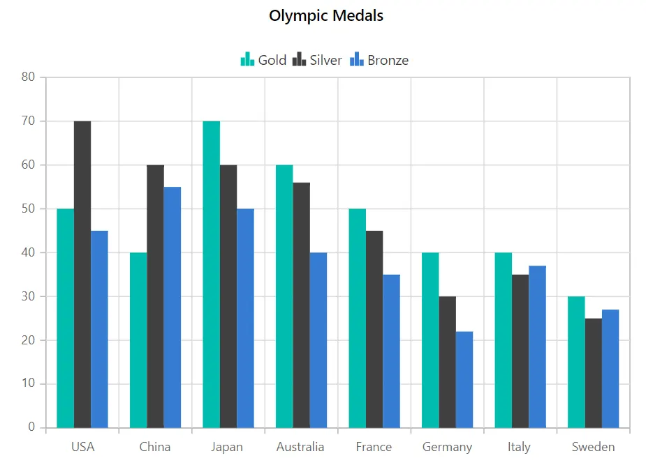

The [Custom](https://help.syncfusion.com/cr/blazor/Syncfusion.Blazor.Charts.LegendPosition.html#Syncfusion_Blazor_Charts_LegendPosition_Custom) position helps to position the legend anywhere in the chart using x and y coordinates (in pixels, relative to the chart's top-left corner).

```cshtml

@using Syncfusion.Blazor.Charts

<SfChart Title="Olympic Medals">
    <ChartPrimaryXAxis ValueType="Syncfusion.Blazor.Charts.ValueType.Category"/>    

    <ChartSeriesCollection>
        <ChartSeries DataSource="@MedalDetails" Name="Gold" XName="Country" Width="2" Opacity="1" YName="Gold" Type="ChartSeriesType.Column">
        </ChartSeries>
        <ChartSeries DataSource="@MedalDetails" Name="Silver" XName="Country" Width="2" Opacity="1" YName="Silver" Type="ChartSeriesType.Column">
        </ChartSeries>
        <ChartSeries DataSource="@MedalDetails" Name="Bronze" XName="Country" Width="2" Opacity="1" YName="Bronze" Type="ChartSeriesType.Column">
        </ChartSeries>
    </ChartSeriesCollection>

    <ChartLegendSettings Visible="true" Position="LegendPosition.Custom">
        <ChartLocation X="200" Y="100"/>
    </ChartLegendSettings>
</SfChart>

@code{

    public class ChartData
    {
        public string Country { get; set; }
        public double Gold { get; set; }
        public double Silver { get; set; }
        public double Bronze { get; set; }
    }

    public List<ChartData> MedalDetails = new List<ChartData>
    {
        new ChartData{ Country= "USA", Gold=50, Silver=70, Bronze=45 },
        new ChartData{ Country="China", Gold=40, Silver= 60, Bronze=55 },
        new ChartData{ Country= "Japan", Gold=70, Silver= 60, Bronze=50 },
        new ChartData{ Country= "Australia", Gold=60, Silver= 56, Bronze=40 },
        new ChartData{ Country= "France", Gold=50, Silver= 45, Bronze=35 },
        new ChartData{ Country= "Germany", Gold=40, Silver=30, Bronze=22 },
        new ChartData{ Country= "Italy", Gold=40, Silver=35, Bronze=37 },
        new ChartData{ Country= "Sweden", Gold=30, Silver=25, Bronze=27 }
    };
}

```

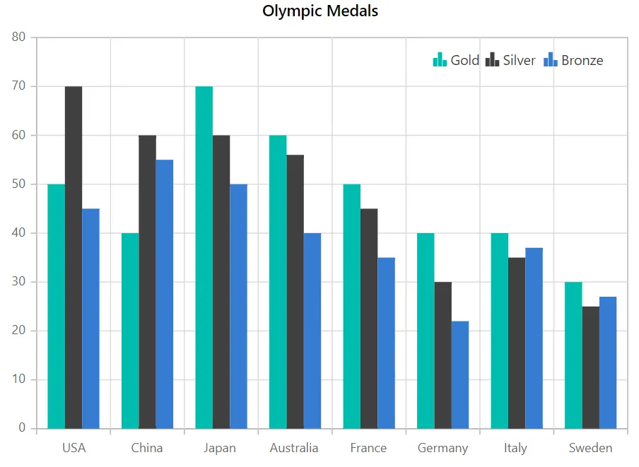

<!-- markdownlint-disable MD036 -->

## Reversing Legend Order

The order of the legend items can be reversed by using the [Reverse](https://help.syncfusion.com/cr/blazor/Syncfusion.Blazor.Charts.ChartLegendSettings.html#Syncfusion_Blazor_Charts_ChartLegendSettings_Reverse) property. By default, the first series in the collection is shown first.

```cshtml

@using Syncfusion.Blazor.Charts

<SfChart Title="Olympic Medals">
    <ChartPrimaryXAxis ValueType="Syncfusion.Blazor.Charts.ValueType.Category">
    </ChartPrimaryXAxis>

    <ChartSeriesCollection>
        <ChartSeries DataSource="@MedalDetails" Name="Gold" XName="Country" Width="2" Opacity="1" YName="Gold" Type="ChartSeriesType.Column">
        </ChartSeries>
        <ChartSeries DataSource="@MedalDetails" Name="Silver" XName="Country" Width="2" Opacity="1" YName="Silver" Type="ChartSeriesType.Column">
        </ChartSeries>
        <ChartSeries DataSource="@MedalDetails" Name="Bronze" XName="Country" Width="2" Opacity="1" YName="Bronze" Type="ChartSeriesType.Column">
        </ChartSeries>
    </ChartSeriesCollection>

    <ChartLegendSettings Visible="true" Reverse="true"></ChartLegendSettings>
</SfChart>

@code{

    public class ChartData
    {
        public string Country { get; set; }
        public double Gold { get; set; }
        public double Silver { get; set; }
        public double Bronze { get; set; }
    }

    public List<ChartData> MedalDetails = new List<ChartData>
	{
		new ChartData{ Country= "USA", Gold=50, Silver=70, Bronze=45 },
		new ChartData{ Country="China", Gold=40, Silver= 60, Bronze=55 },
		new ChartData{ Country= "Japan", Gold=70, Silver= 60, Bronze=50 },
		new ChartData{ Country= "Australia", Gold=60, Silver= 56, Bronze=40 },
		new ChartData{ Country= "France", Gold=50, Silver= 45, Bronze=35 },
		new ChartData{ Country= "Germany", Gold=40, Silver=30, Bronze=22 },
		new ChartData{ Country= "Italy", Gold=40, Silver=35, Bronze=37 },
		new ChartData{ Country= "Sweden", Gold=30, Silver=25, Bronze=27 }
	};
}


```

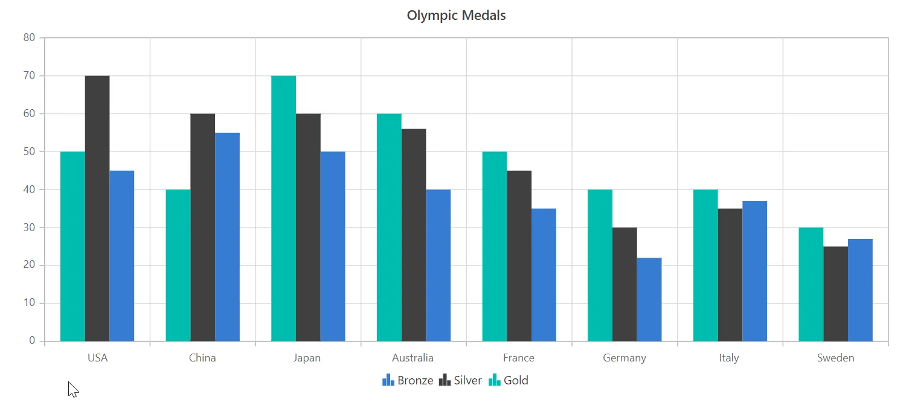

### Legend Alignment

Using the [Alignment](https://help.syncfusion.com/cr/blazor/Syncfusion.Blazor.Charts.ChartLegendSettings.html#Syncfusion_Blazor_Charts_ChartLegendSettings_Alignment) property, place the legend in [Center](https://help.syncfusion.com/cr/blazor/Syncfusion.Blazor.Charts.Alignment.html#Syncfusion_Blazor_Charts_Alignment_Center), [Far](https://help.syncfusion.com/cr/blazor/Syncfusion.Blazor.Charts.Alignment.html#Syncfusion_Blazor_Charts_Alignment_Far), or [Near](https://help.syncfusion.com/cr/blazor/Syncfusion.Blazor.Charts.Alignment.html#Syncfusion_Blazor_Charts_Alignment_Near) alignment.

```cshtml

@using Syncfusion.Blazor.Charts

<SfChart Title="Olympic Medals">
    <ChartPrimaryXAxis ValueType="Syncfusion.Blazor.Charts.ValueType.Category">
    </ChartPrimaryXAxis>

    <ChartSeriesCollection>
        <ChartSeries DataSource="@MedalDetails" Name="Gold" XName="Country" Width="2" Opacity="1" YName="Gold" Type="ChartSeriesType.Column">
        </ChartSeries>
        <ChartSeries DataSource="@MedalDetails" Name="Silver" XName="Country" Width="2" Opacity="1" YName="Silver" Type="ChartSeriesType.Column">
        </ChartSeries>
        <ChartSeries DataSource="@MedalDetails" Name="Bronze" XName="Country" Width="2" Opacity="1" YName="Bronze" Type="ChartSeriesType.Column">
        </ChartSeries>
    </ChartSeriesCollection>

    <ChartLegendSettings Visible="true" Alignment="Alignment.Far"></ChartLegendSettings>
</SfChart>

@code{

    public class ChartData
    {
        public string Country { get; set; }
        public double Gold { get; set; }
        public double Silver { get; set; }
        public double Bronze { get; set; }
    }

    public List<ChartData> MedalDetails = new List<ChartData>
	{
		new ChartData{ Country= "USA", Gold=50, Silver=70, Bronze=45 },
		new ChartData{ Country="China", Gold=40, Silver= 60, Bronze=55 },
		new ChartData{ Country= "Japan", Gold=70, Silver= 60, Bronze=50 },
		new ChartData{ Country= "Australia", Gold=60, Silver= 56, Bronze=40 },
		new ChartData{ Country= "France", Gold=50, Silver= 45, Bronze=35 },
		new ChartData{ Country= "Germany", Gold=40, Silver=30, Bronze=22 },
		new ChartData{ Country= "Italy", Gold=40, Silver=35, Bronze=37 },
		new ChartData{ Country= "Sweden", Gold=30, Silver=25, Bronze=27 }
	};
}


```

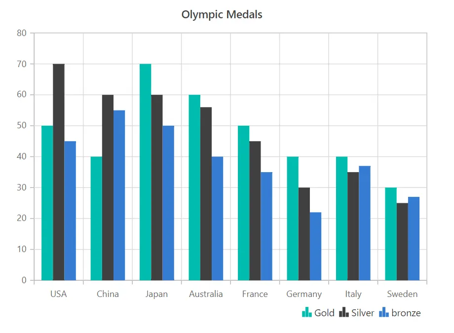

## Legend customization

### Legend Shape

The [LegendShape](https://help.syncfusion.com/cr/blazor/Syncfusion.Blazor.Charts.ChartSeries.html#Syncfusion_Blazor_Charts_ChartSeries_LegendShape) property in the [Series](https://help.syncfusion.com/cr/blazor/Syncfusion.Blazor.Charts.ChartSeries.html) can be used to change the shape of the legend icon. The default icon shape for legends is [SeriesType](https://help.syncfusion.com/cr/blazor/Syncfusion.Blazor.Charts.LegendShape.html#Syncfusion_Blazor_Charts_LegendShape_SeriesType). Other available values include `Circle`, `Diamond`, `Rectangle`, `Pentagon`, `Triangle`, `InvertedTriangle`, `Cross`, `HorizontalLine`, `VerticalLine`, and `Image`.

```cshtml

@using Syncfusion.Blazor.Charts

<SfChart Title="Olympic Medals">
    <ChartPrimaryXAxis ValueType="Syncfusion.Blazor.Charts.ValueType.Category" />

    <ChartSeriesCollection>
        <ChartSeries DataSource="@MedalDetails" Name="Gold" XName="Country" Width="2" Opacity="1" YName="Gold" Type="ChartSeriesType.Column" LegendShape="LegendShape.Circle"/>
        <ChartSeries DataSource="@MedalDetails" Name="Silver" XName="Country" Width="2" Opacity="1" YName="Silver" Type="ChartSeriesType.Column" LegendShape="LegendShape.SeriesType"/>
        <ChartSeries DataSource="@MedalDetails" Name="Bronze" XName="Country" Width="2" Opacity="1" YName="Bronze" Type="ChartSeriesType.Column" LegendShape="LegendShape.Diamond"/>
    </ChartSeriesCollection>

    <ChartLegendSettings Visible="true" />
</SfChart>

@code{

    public class ChartData
    {
        public string Country { get; set; }
        public double Gold { get; set; }
        public double Silver { get; set; }
        public double Bronze { get; set; }
    }

    public List<ChartData> MedalDetails = new List<ChartData>
	{
        new ChartData{ Country= "USA", Gold=50, Silver=70, Bronze=45 },
        new ChartData{ Country="China", Gold=40, Silver= 60, Bronze=55 },
        new ChartData{ Country= "Japan", Gold=70, Silver= 60, Bronze=50 },
        new ChartData{ Country= "Australia", Gold=60, Silver= 56, Bronze=40 },
        new ChartData{ Country= "France", Gold=50, Silver= 45, Bronze=35 },
        new ChartData{ Country= "Germany", Gold=40, Silver=30, Bronze=22 },
        new ChartData{ Country= "Italy", Gold=40, Silver=35, Bronze=37 },
        new ChartData{ Country= "Sweden", Gold=30, Silver=25, Bronze=27 }
    };
}

```


### Legend Size

When the legend is placed on the top or bottom of the chart, it takes up 20% - 25% of the chart's height, and 20% - 25% of the chart's width when it is positioned on the left or right side of the chart. So, the [Width](https://help.syncfusion.com/cr/blazor/Syncfusion.Blazor.Charts.ChartLegendSettings.html#Syncfusion_Blazor_Charts_ChartLegendSettings_Width) and [Height](https://help.syncfusion.com/cr/blazor/Syncfusion.Blazor.Charts.ChartLegendSettings.html#Syncfusion_Blazor_Charts_ChartLegendSettings_Height) properties can be used to adjust the legend size.

```cshtml

@using Syncfusion.Blazor.Charts

<SfChart Title="Olympic Medals">
    <ChartPrimaryXAxis ValueType="Syncfusion.Blazor.Charts.ValueType.Category"/>    

    <ChartSeriesCollection>
        <ChartSeries DataSource="@MedalDetails" Name="Gold" XName="Country" Width="2" LegendShape="LegendShape.Circle" Opacity="1" YName="Gold" Type="ChartSeriesType.Column">
        </ChartSeries>
        <ChartSeries DataSource="@MedalDetails" Name="Silver" XName="Country" Width="2" LegendShape="LegendShape.SeriesType" Opacity="1" YName="Silver" Type="ChartSeriesType.Column">
        </ChartSeries>
        <ChartSeries DataSource="@MedalDetails" Name="Bronze" XName="Country" Width="2" LegendShape="LegendShape.Diamond" Opacity="1" YName="Bronze" Type="ChartSeriesType.Column">
        </ChartSeries>
    </ChartSeriesCollection>

    <ChartLegendSettings Visible="true" Height="50" Width="300" >
        <ChartLegendBorder Color="red" Width="1"/>
    </ChartLegendSettings>
</SfChart>

@code{

    public class ChartData
    {
        public string Country { get; set; }
        public double Gold { get; set; }
        public double Silver { get; set; }
        public double Bronze { get; set; }
    }

    public List<ChartData> MedalDetails = new List<ChartData>
	{
        new ChartData{ Country= "USA", Gold=50, Silver=70, Bronze=45 },
        new ChartData{ Country="China", Gold=40, Silver= 60, Bronze=55 },
        new ChartData{ Country= "Japan", Gold=70, Silver= 60, Bronze=50 },
        new ChartData{ Country= "Australia", Gold=60, Silver= 56, Bronze=40 },
        new ChartData{ Country= "France", Gold=50, Silver= 45, Bronze=35 },
        new ChartData{ Country= "Germany", Gold=40, Silver=30, Bronze=22 },
        new ChartData{ Country= "Italy", Gold=40, Silver=35, Bronze=37 },
        new ChartData{ Country= "Sweden", Gold=30, Silver=25, Bronze=27 }
    };
}

```

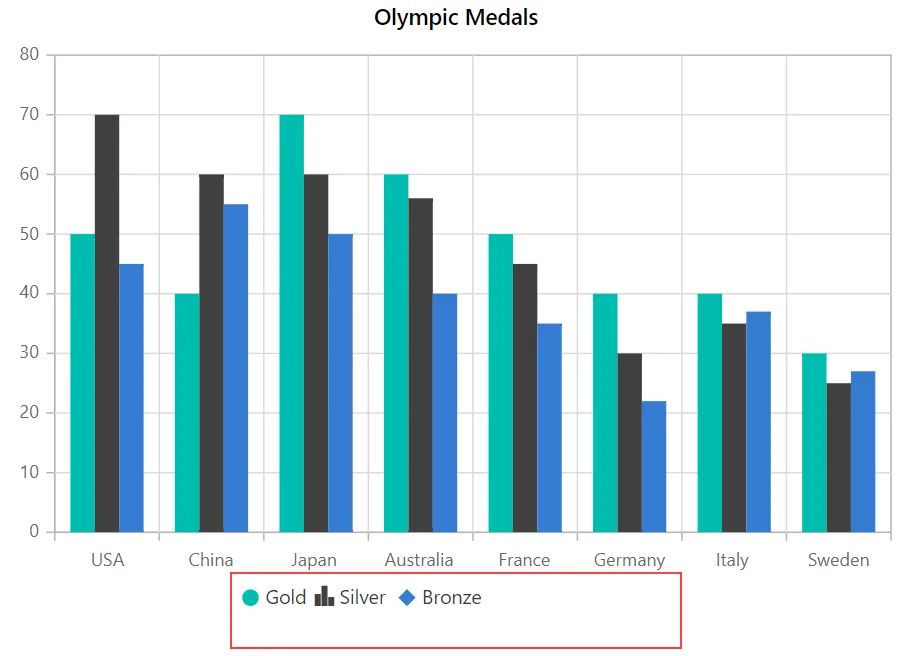

### Legend Shape Dimensions

The [ShapeHeight](https://help.syncfusion.com/cr/blazor/Syncfusion.Blazor.Charts.ChartLegendSettings.html#Syncfusion_Blazor_Charts_ChartLegendSettings_ShapeHeight) and [ShapeWidth](https://help.syncfusion.com/cr/blazor/Syncfusion.Blazor.Charts.ChartLegendSettings.html#Syncfusion_Blazor_Charts_ChartLegendSettings_ShapeWidth) properties can be used to adjust the dimensions of the legend shape.

```cshtml

@using Syncfusion.Blazor.Charts

<SfChart Title="Olympic Medals">
    <ChartPrimaryXAxis ValueType="Syncfusion.Blazor.Charts.ValueType.Category"/>    

    <ChartSeriesCollection>
        <ChartSeries DataSource="@MedalDetails" Name="Gold" XName="Country" Width="2" LegendShape="LegendShape.Circle" Opacity="1" YName="Gold" Type="ChartSeriesType.Column">
        </ChartSeries>
        <ChartSeries DataSource="@MedalDetails" Name="Silver" XName="Country" Width="2" LegendShape="LegendShape.SeriesType" Opacity="1" YName="Silver" Type="ChartSeriesType.Column">
        </ChartSeries>
        <ChartSeries DataSource="@MedalDetails" Name="Bronze" XName="Country" Width="2" LegendShape="LegendShape.Diamond" Opacity="1" YName="Bronze" Type="ChartSeriesType.Column">
        </ChartSeries>
    </ChartSeriesCollection>

    <ChartLegendSettings Visible="true" Height="50" Width="300" ShapeHeight="20" ShapeWidth="20">
    </ChartLegendSettings>
</SfChart>

@code{

    public class ChartData
    {
        public string Country { get; set; }
        public double Gold { get; set; }
        public double Silver { get; set; }
        public double Bronze { get; set; }
    }

    public List<ChartData> MedalDetails = new List<ChartData>
	{
		new ChartData{ Country= "USA", Gold=50, Silver=70, Bronze=45 },
		new ChartData{ Country="China", Gold=40, Silver= 60, Bronze=55 },
		new ChartData{ Country= "Japan", Gold=70, Silver= 60, Bronze=50 },
		new ChartData{ Country= "Australia", Gold=60, Silver= 56, Bronze=40 },
		new ChartData{ Country= "France", Gold=50, Silver= 45, Bronze=35 },
		new ChartData{ Country= "Germany", Gold=40, Silver=30, Bronze=22 },
		new ChartData{ Country= "Italy", Gold=40, Silver=35, Bronze=37 },
		new ChartData{ Country= "Sweden", Gold=30, Silver=25, Bronze=27 }
    };
}

```

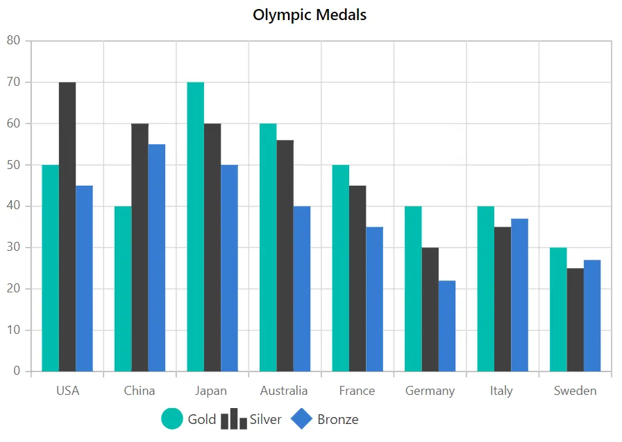

### Legend Item Padding

The [ItemPadding](https://help.syncfusion.com/cr/blazor/Syncfusion.Blazor.Charts.ChartLegendSettings.html#Syncfusion_Blazor_Charts_ChartLegendSettings_ItemPadding) property can be used to adjust the space between the legend items.

```cshtml

@using Syncfusion.Blazor.Charts

<SfChart Title="Olympic Medals">
    <ChartPrimaryXAxis ValueType="Syncfusion.Blazor.Charts.ValueType.Category"/>
    <ChartSeriesCollection>
        <ChartSeries DataSource="@MedalDetails" Name="Gold" XName="Country" Width="2" LegendShape="LegendShape.Circle" Opacity="1" YName="Gold" Type="ChartSeriesType.Column">
        </ChartSeries>
        <ChartSeries DataSource="@MedalDetails" Name="Silver" XName="Country" Width="2" LegendShape="LegendShape.SeriesType" Opacity="1" YName="Silver" Type="ChartSeriesType.Column">
        </ChartSeries>
        <ChartSeries DataSource="@MedalDetails" Name="Bronze" XName="Country" Width="2" LegendShape="LegendShape.Diamond" Opacity="1" YName="Bronze" Type="ChartSeriesType.Column">
        </ChartSeries>
    </ChartSeriesCollection>
    <ChartLegendSettings Visible="true" ItemPadding="30" >
    </ChartLegendSettings>
</SfChart>

@code{

    public class ChartData
    {
        public string Country { get; set; }
        public double Gold { get; set; }
        public double Silver { get; set; }
        public double Bronze { get; set; }
    }

    public List<ChartData> MedalDetails = new List<ChartData>
	{
        new ChartData{ Country= "USA", Gold=50, Silver=70, Bronze=45 },
        new ChartData{ Country="China", Gold=40, Silver= 60, Bronze=55 },
        new ChartData{ Country= "Japan", Gold=70, Silver= 60, Bronze=50 },
        new ChartData{ Country= "Australia", Gold=60, Silver= 56, Bronze=40 },
        new ChartData{ Country= "France", Gold=50, Silver= 45, Bronze=35 },
        new ChartData{ Country= "Germany", Gold=40, Silver=30, Bronze=22 },
        new ChartData{ Country= "Italy", Gold=40, Silver=35, Bronze=37 },
        new ChartData{ Country= "Sweden", Gold=30, Silver=25, Bronze=27 }
    };
}

```

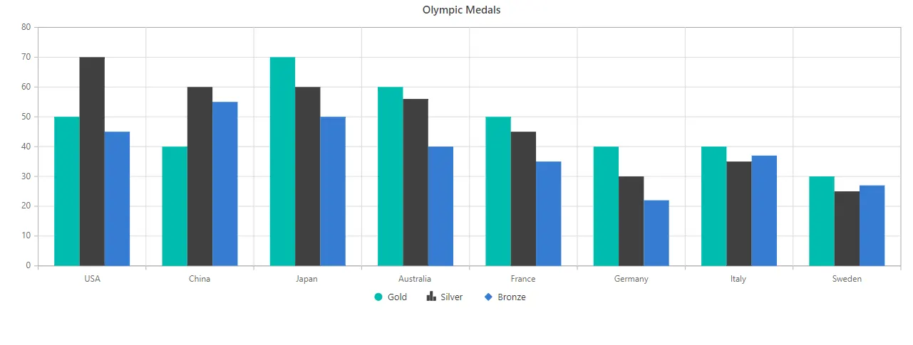

### Legend Paging

When the legend items exceed the available legend bounds, paging is enabled automatically. Navigation buttons allow the legend items to be viewed across multiple pages. The [Padding](https://help.syncfusion.com/cr/blazor/Syncfusion.Blazor.Charts.ChartLegendSettings.html#Syncfusion_Blazor_Charts_ChartLegendSettings_Padding) property controls the space between the legend bounds and the items, while [ShapePadding](https://help.syncfusion.com/cr/blazor/Syncfusion.Blazor.Charts.ChartLegendSettings.html#Syncfusion_Blazor_Charts_ChartLegendSettings_ShapePadding) controls the space between each shape and its label.

```cshtml

@using Syncfusion.Blazor.Charts

<SfChart Title="Olympic Medals">
    <ChartPrimaryXAxis ValueType="Syncfusion.Blazor.Charts.ValueType.Category">
    </ChartPrimaryXAxis>

    <ChartSeriesCollection>
        <ChartSeries DataSource="@MedalDetails" Name="Gold" XName="Country" Width="2" LegendShape="LegendShape.Circle" Opacity="1" YName="Gold" Type="ChartSeriesType.Column">
        </ChartSeries>
        <ChartSeries DataSource="@MedalDetails" Name="Silver" XName="Country" Width="2" LegendShape="LegendShape.SeriesType" Opacity="1" YName="Silver" Type="ChartSeriesType.Column">
        </ChartSeries>
        <ChartSeries DataSource="@MedalDetails" Name="Bronze" XName="Country" Width="2" LegendShape="LegendShape.Diamond" Opacity="1" YName="Bronze" Type="ChartSeriesType.Column">
        </ChartSeries>
    </ChartSeriesCollection>

    <ChartLegendSettings Visible="true" Width="100" Height="70" Padding="10" ShapePadding="10" >
        <ChartLegendBorder Color="red" Width="1"/>
    </ChartLegendSettings>
</SfChart>

@code{

    public class ChartData
    {
        public string Country { get; set; }
        public double Gold { get; set; }
        public double Silver { get; set; }
        public double Bronze { get; set; }
    }

    public List<ChartData> MedalDetails = new List<ChartData>
	{
		new ChartData{ Country= "USA", Gold=50, Silver=70, Bronze=45 },
		new ChartData{ Country="China", Gold=40, Silver= 60, Bronze=55 },
		new ChartData{ Country= "Japan", Gold=70, Silver= 60, Bronze=50 },
		new ChartData{ Country= "Australia", Gold=60, Silver= 56, Bronze=40 },
		new ChartData{ Country= "France", Gold=50, Silver= 45, Bronze=35 },
		new ChartData{ Country= "Germany", Gold=40, Silver=30, Bronze=22 },
		new ChartData{ Country= "Italy", Gold=40, Silver=35, Bronze=37 },
		new ChartData{ Country= "Sweden", Gold=30, Silver=25, Bronze=27 }
   };
}

```

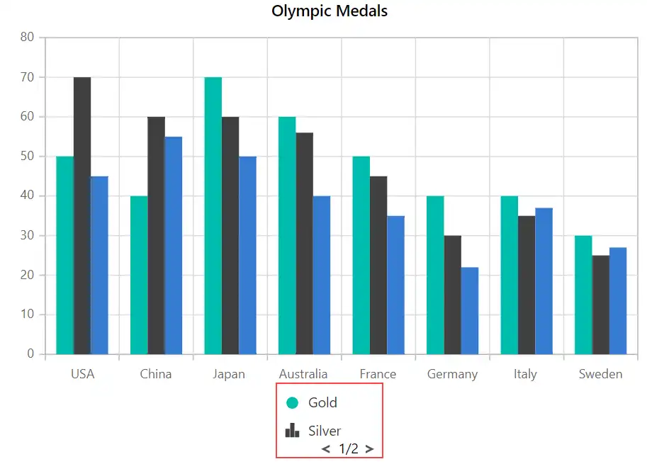

### Legend Text Wrap

When the legend text exceeds the container, the text can be wrapped by using the [TextWrap](https://help.syncfusion.com/cr/blazor/Syncfusion.Blazor.Charts.ChartLegendSettings.html#Syncfusion_Blazor_Charts_ChartLegendSettings_TextWrap) property. Other available values are `Normal`, `AnyWhere`, and `WrapWithOverflow`. You can also wrap the legend text based on the [MaximumLabelWidth](https://help.syncfusion.com/cr/blazor/Syncfusion.Blazor.Charts.ChartLegendSettings.html#Syncfusion_Blazor_Charts_ChartLegendSettings_MaximumLabelWidth) property.

```cshtml

@using Syncfusion.Blazor.Charts

<SfChart Title="Olympic Medals">
    <ChartPrimaryXAxis ValueType="Syncfusion.Blazor.Charts.ValueType.Category">
    </ChartPrimaryXAxis>
    <ChartSeriesCollection>
        <ChartSeries DataSource="@MedalDetails" Name="Gold Medals" XName="Country" Width="2" LegendShape="LegendShape.Circle" Opacity="1" YName="Gold" Type="ChartSeriesType.Column">
        </ChartSeries>
        <ChartSeries DataSource="@MedalDetails" Name="Silver Medals" XName="Country" Width="2" LegendShape="LegendShape.SeriesType" Opacity="1" YName="Silver" Type="ChartSeriesType.Column">
        </ChartSeries>
        <ChartSeries DataSource="@MedalDetails" Name="Bronze Medals" XName="Country" Width="2" LegendShape="LegendShape.Diamond" Opacity="1" YName="Bronze" Type="ChartSeriesType.Column">
        </ChartSeries>
    </ChartSeriesCollection>
    <ChartLegendSettings Visible="true" Position="LegendPosition.Right" MaximumLabelWidth="50">
        <ChartLegendBorder Color="red" Width="1"/>
    </ChartLegendSettings>
</SfChart>

@code{

    public class ChartData
    {
        public string Country { get; set; }
        public double Gold { get; set; }
        public double Silver { get; set; }
        public double Bronze { get; set; }
    }

    public List<ChartData> MedalDetails = new List<ChartData>
	{
		new ChartData{ Country= "USA", Gold=50, Silver=70, Bronze=45 },
		new ChartData{ Country="China", Gold=40, Silver= 60, Bronze=55 },
		new ChartData{ Country= "Japan", Gold=70, Silver= 60, Bronze=50 },
		new ChartData{ Country= "Australia", Gold=60, Silver= 56, Bronze=40 },
		new ChartData{ Country= "France", Gold=50, Silver= 45, Bronze=35 },
		new ChartData{ Country= "Germany", Gold=40, Silver=30, Bronze=22 },
		new ChartData{ Country= "Italy", Gold=40, Silver=35, Bronze=37 },
		new ChartData{ Country= "Sweden", Gold=30, Silver=25, Bronze=27 }
   };
}

```

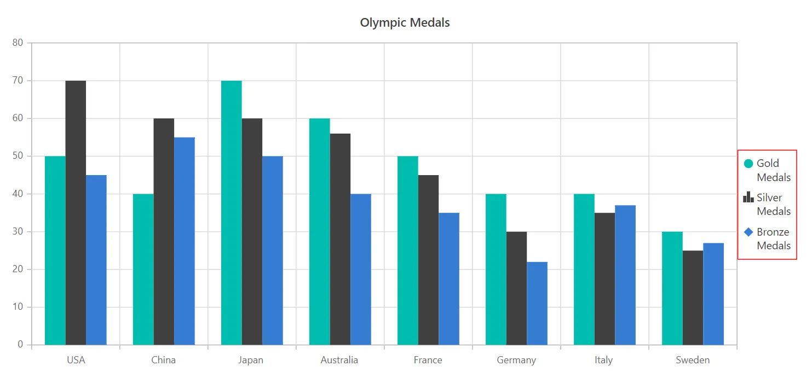

## Disabling Series Toggle on Legend Click

By default, when you click a legend item, the corresponding series is hidden. To disable this behavior, set the [ToggleVisibility](https://help.syncfusion.com/cr/blazor/Syncfusion.Blazor.Charts.ChartLegendSettings.html#Syncfusion_Blazor_Charts_ChartLegendSettings_ToggleVisibility) property on `ChartLegendSettings` to **false**.

```cshtml

@using Syncfusion.Blazor.Charts

<SfChart Title="Olympic Medals" SelectionMode="SelectionMode.Series">
    <ChartPrimaryXAxis ValueType="Syncfusion.Blazor.Charts.ValueType.Category"/>

    <ChartSeriesCollection>
        <ChartSeries DataSource="@MedalDetails" Name="Gold" XName="Country" Width="2" LegendShape="LegendShape.Circle" Opacity="1" YName="Gold" Type="ChartSeriesType.Column">
        </ChartSeries>
        <ChartSeries DataSource="@MedalDetails" Name="Silver" XName="Country" Width="2" LegendShape="LegendShape.SeriesType" Opacity="1" YName="Silver" Type="ChartSeriesType.Column">
        </ChartSeries>
        <ChartSeries DataSource="@MedalDetails" Name="Bronze" XName="Country" Width="2" LegendShape="LegendShape.Diamond" Opacity="1" YName="Bronze" Type="ChartSeriesType.Column">
        </ChartSeries>
    </ChartSeriesCollection>

    <ChartLegendSettings Visible="true" ToggleVisibility="false"/>
</SfChart>

@code{

    public class ChartData
    {
        public string Country { get; set; }
        public double Gold { get; set; }
        public double Silver { get; set; }
        public double Bronze { get; set; }
    }

    public List<ChartData> MedalDetails = new List<ChartData>
	{
		new ChartData{ Country= "USA", Gold=50, Silver=70, Bronze=45 },
		new ChartData{ Country="China", Gold=40, Silver= 60, Bronze=55 },
		new ChartData{ Country= "Japan", Gold=70, Silver= 60, Bronze=50 },
		new ChartData{ Country= "Australia", Gold=60, Silver= 56, Bronze=40 },
		new ChartData{ Country= "France", Gold=50, Silver= 45, Bronze=35 },
		new ChartData{ Country= "Germany", Gold=40, Silver=30, Bronze=22 },
		new ChartData{ Country= "Italy", Gold=40, Silver=35, Bronze=37 },
		new ChartData{ Country= "Sweden", Gold=30, Silver=25, Bronze=27 }
	};
}

```

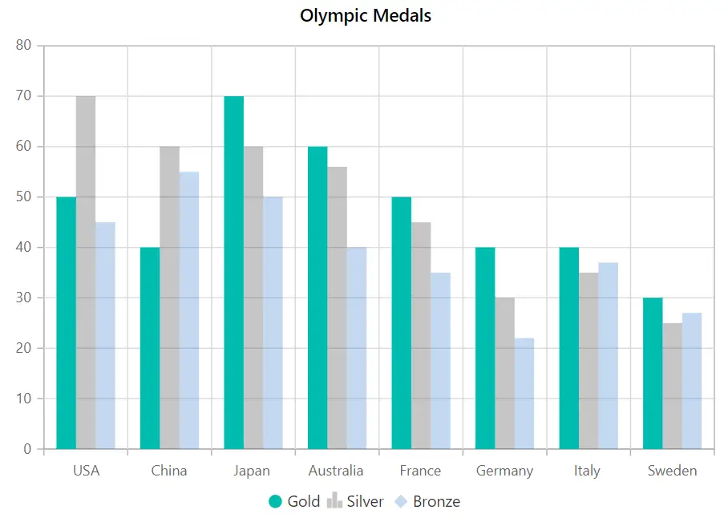

## Hiding a Legend Item

The series [Name](https://help.syncfusion.com/cr/blazor/Syncfusion.Blazor.Charts.ChartSeries.html#Syncfusion_Blazor_Charts_ChartSeries_Name) is displayed as the legend text by default. To skip the legend for a particular series, set its `Name` to an empty string. To hide the legend for the whole chart, set `ChartLegendSettings.Visible` to **false**.

```cshtml

@using Syncfusion.Blazor.Charts

<SfChart Title="Olympic Medals">
    <ChartPrimaryXAxis ValueType="Syncfusion.Blazor.Charts.ValueType.Category">
    </ChartPrimaryXAxis>

    <ChartSeriesCollection>
        <ChartSeries DataSource="@MedalDetails" Name="Gold" XName="Country" Width="2" LegendShape="LegendShape.Circle" Opacity="1" YName="Gold" Type="ChartSeriesType.Column">
        </ChartSeries>
        <ChartSeries DataSource="@MedalDetails" Name="" XName="Country" Width="2" LegendShape="LegendShape.SeriesType" Opacity="1" YName="Silver" Type="ChartSeriesType.Column">
        </ChartSeries>
        <ChartSeries DataSource="@MedalDetails" Name="Bronze" XName="Country" Width="2" LegendShape="LegendShape.Diamond" Opacity="1" YName="Bronze" Type="ChartSeriesType.Column">
        </ChartSeries>
    </ChartSeriesCollection>

    <ChartLegendSettings Visible="true" />
</SfChart>

@code{
    
    public class ChartData
    {
        public string Country { get; set; }
        public double Gold { get; set; }
        public double Silver { get; set; }
        public double Bronze { get; set; }
    }

    public List<ChartData> MedalDetails = new List<ChartData>
	{
		new ChartData{ Country= "USA", Gold=50, Silver=70, Bronze=45 },
		new ChartData{ Country="China", Gold=40, Silver= 60, Bronze=55 },
		new ChartData{ Country= "Japan", Gold=70, Silver= 60, Bronze=50 },
		new ChartData{ Country= "Australia", Gold=60, Silver= 56, Bronze=40 },
		new ChartData{ Country= "France", Gold=50, Silver= 45, Bronze=35 },
		new ChartData{ Country= "Germany", Gold=40, Silver=30, Bronze=22 },
		new ChartData{ Country= "Italy", Gold=40, Silver=35, Bronze=37 },
		new ChartData{ Country= "Sweden", Gold=30, Silver=25, Bronze=27 }
	};
}

```

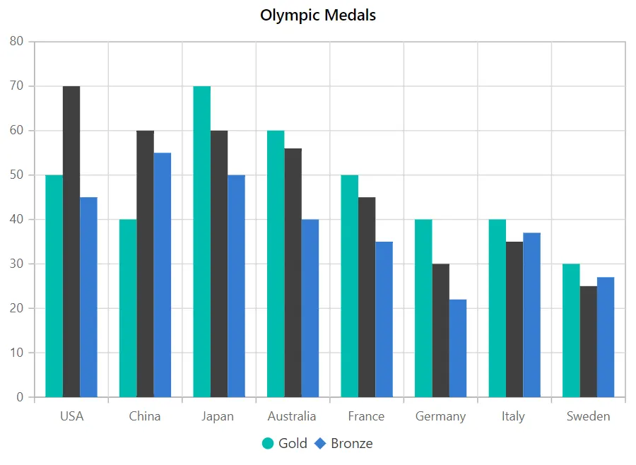

## Legend Item Template

Legend item templates allow you to replace default legend icons and text with custom HTML or Blazor markup for each series. This enables branded styles, richer content (icons, multi-line text, badges), improved readability, and localization.

To use, add a [LegendItemTemplate](https://help.syncfusion.com/cr/blazor/Syncfusion.Blazor.Charts.ChartSeries.html#Syncfusion_Blazor_Charts_ChartSeries_LegendItemTemplate) inside any [ChartSeries](https://help.syncfusion.com/cr/blazor/Syncfusion.Blazor.Charts.ChartSeries.html) you want to customize. The rendered content becomes the legend item and can be styled with CSS. Legend interactions (click to toggle series) remain unless [ToggleVisibility](https://help.syncfusion.com/cr/blazor/Syncfusion.Blazor.Charts.ChartLegendSettings.html#Syncfusion_Blazor_Charts_ChartLegendSettings_ToggleVisibility) is set to **false**. Templates work with all legend positions, alignments, and paging.

```cshtml
@using Syncfusion.Blazor.Charts
@using System.Linq

@* Initialize the chart and configure essential features *@
<SfChart Title="Olympic Medals">
    @* Set category axis for country names *@
    <ChartPrimaryXAxis ValueType="Syncfusion.Blazor.Charts.ValueType.Category" />

    @* Show the legend and enable series toggle *@
    <ChartLegendSettings Visible="true" />

    <ChartSeriesCollection>
        @* Gold column series *@
        <ChartSeries DataSource="@MedalDetails" Name="Gold" XName="Country" Width="2" Opacity="1" YName="Gold" Fill="#FFD700" Type="ChartSeriesType.Column">
            @* Custom legend with icon, label, and total count *@
            <LegendItemTemplate>
                <div style="display:flex; align-items:center; gap:10px; padding:4px 0;">
                    <span style="font-size:18px;">🥇</span>
                    <div style="display:flex; flex-direction:column; line-height:1.15;">
                        <span style="font-family:'Segoe UI'; font-size:14px; font-weight:700; color:#FFD700;">Gold</span>
                        <span style="font-size:12px; opacity:0.85;">Awarded for first place finishes</span>
                        <span style="font-size:12px; opacity:0.75;">Total: @GoldTotal</span>
                    </div>
                </div>
            </LegendItemTemplate>
        </ChartSeries>

        @* Silver column series *@
        <ChartSeries DataSource="@MedalDetails" Name="Silver" XName="Country" Width="2" Opacity="1" YName="Silver" Fill="#898989" Type="ChartSeriesType.Column">
            @* Custom legend with icon, label, and total count *@
            <LegendItemTemplate>
                <div style="display:flex; align-items:center; gap:10px; padding:4px 0;">
                    <span style="font-size:18px;">🥈</span>
                    <div style="display:flex; flex-direction:column; line-height:1.15;">
                        <span style="font-family:'Segoe UI'; font-size:14px; font-weight:700; color:#898989;">Silver</span>
                        <span style="font-size:12px; opacity:0.85;">Awarded for second place finishes</span>
                        <span style="font-size:12px; opacity:0.75;">Total: @SilverTotal</span>
                    </div>
                </div>
            </LegendItemTemplate>
        </ChartSeries>

        @* Bronze column series *@
        <ChartSeries DataSource="@MedalDetails" Name="Bronze" XName="Country" Width="2" Opacity="1" YName="Bronze" Fill="#CD7F32" Type="ChartSeriesType.Column">
            @* Custom legend with icon, label, and total count *@
            <LegendItemTemplate>
                <div style="display:flex; align-items:center; gap:10px; padding:4px 0;">
                    <span style="font-size:18px;">🥉</span>
                    <div style="display:flex; flex-direction:column; line-height:1.15;">
                        <span style="font-family:'Segoe UI'; font-size:14px; font-weight:700; color:#CD7F32;">Bronze</span>
                        <span style="font-size:12px; opacity:0.85;">Awarded for third place finishes</span>
                        <span style="font-size:12px; opacity:0.75;">Total: @BronzeTotal</span>
                    </div>
                </div>
            </LegendItemTemplate>
        </ChartSeries>
    </ChartSeriesCollection>

</SfChart>

@code{

    public class ChartData
    {
        public string Country { get; set; }
        public double Gold { get; set; }
        public double Silver { get; set; }
        public double Bronze { get; set; }
    }

    public List<ChartData> MedalDetails = new()
    {
        new ChartData{ Country= "USA",      Gold=50, Silver=70, Bronze=45 },
        new ChartData{ Country= "China",    Gold=40, Silver=60, Bronze=55 },
        new ChartData{ Country= "Japan",    Gold=70, Silver=60, Bronze=50 },
        new ChartData{ Country= "Australia",Gold=60, Silver=56, Bronze=40 },
        new ChartData{ Country= "France",   Gold=50, Silver=45, Bronze=35 },
        new ChartData{ Country= "Germany",  Gold=40, Silver=30, Bronze=22 },
        new ChartData{ Country= "Italy",    Gold=40, Silver=35, Bronze=37 },
        new ChartData{ Country= "Sweden",   Gold=30, Silver=25, Bronze=27 }
    };

    public int GoldTotal => (int)MedalDetails.Sum(m => m.Gold);
    public int SilverTotal => (int)MedalDetails.Sum(m => m.Silver);
    public int BronzeTotal => (int)MedalDetails.Sum(m => m.Bronze);
}
```
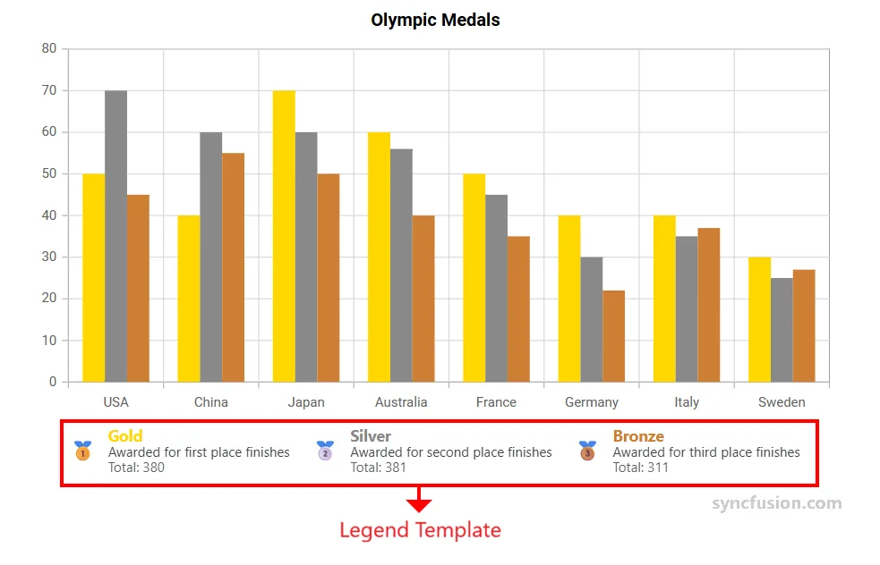

N> For a runnable sample that includes legends, see the [Blazor Charts demo](https://blazor.syncfusion.com/demos/chart/line?theme=fluent2).

## See also

* [Data label](./data-labels)
* [Marker](./data-markers)
* [Chart Appearance](./chart-appearance)
* [Events](./events)