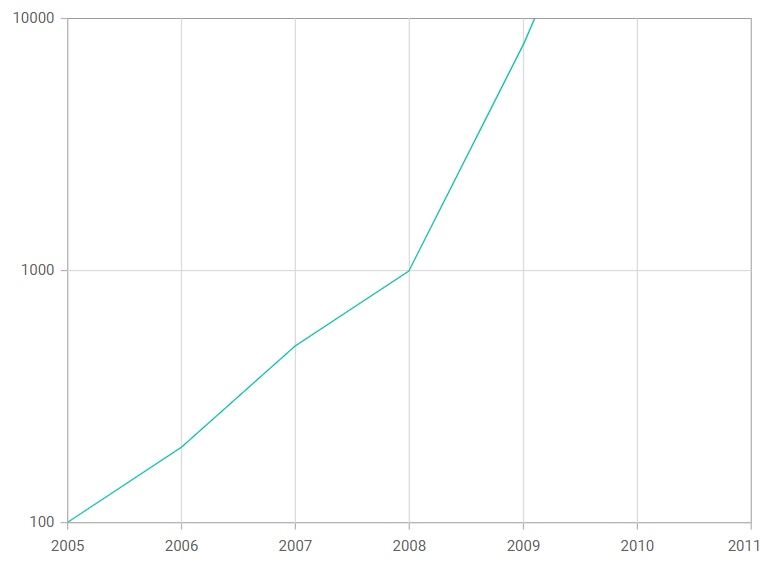
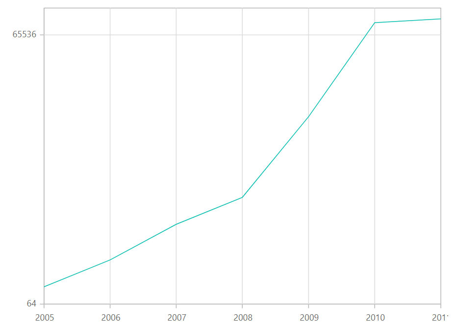
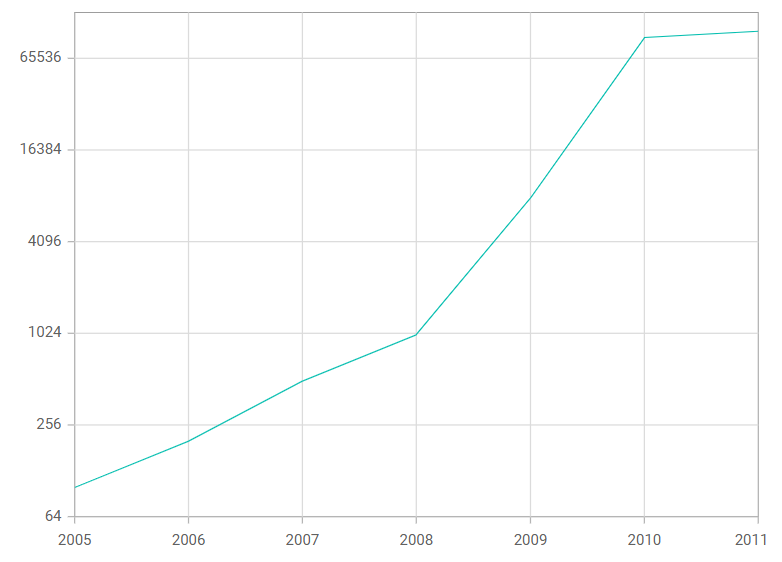
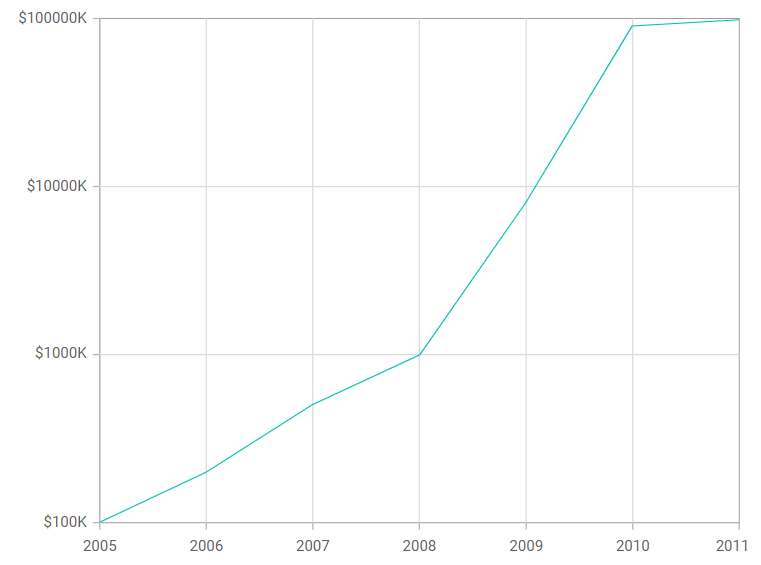

# Logarithmic Axis in Blazor Charts Component

<!-- markdownlint-disable MD033 -->

Use a logarithmic axis when data spans several orders of magnitude (for example, 10<sup>-6</sup> to 10<sup>6</sup>). This scale helps visualize both small and large values on the same chart.

Logarithmic axis customization in the Syncfusion Blazor Charts component can also be explored through the video linked below.



```cshtml

@using Syncfusion.Blazor.Charts

<SfChart>
    <ChartPrimaryXAxis ValueType="Syncfusion.Blazor.Charts.ValueType.DateTime" />

    <ChartPrimaryYAxis ValueType="Syncfusion.Blazor.Charts.ValueType.Logarithmic" />

    <ChartSeriesCollection>
        <ChartSeries DataSource="@Data" XName="XValue" YName="YValue" />
    </ChartSeriesCollection>
</SfChart>

@code{
    public class ChartData
    {
        public DateTime XValue { get; set; }
        public double YValue { get; set; }
    }

    public List<ChartData> Data = new List<ChartData>
	{
		new ChartData { XValue = new DateTime(2005, 01, 01), YValue = 100   },
		new ChartData { XValue = new DateTime(2006, 01, 01), YValue = 200   },
		new ChartData { XValue = new DateTime(2007, 01, 01), YValue = 500   },
		new ChartData { XValue = new DateTime(2008, 01, 01), YValue = 1000  },
		new ChartData { XValue = new DateTime(2009, 01, 01), YValue = 8000  },
		new ChartData { XValue = new DateTime(2010, 01, 01), YValue = 90000 },
		new ChartData { XValue = new DateTime(2011, 01, 01), YValue = 99000 }
	};
}

```



## Range

The axis range is calculated automatically based on the data. You can also customize it using the [Minimum](https://help.syncfusion.com/cr/blazor/Syncfusion.Blazor.Charts.ChartCommonAxis.html#Syncfusion_Blazor_Charts_ChartCommonAxis_Minimum), [Maximum](https://help.syncfusion.com/cr/blazor/Syncfusion.Blazor.Charts.ChartCommonAxis.html#Syncfusion_Blazor_Charts_ChartCommonAxis_Maximum), and [Interval](https://help.syncfusion.com/cr/blazor/Syncfusion.Blazor.Charts.ChartCommonAxis.html#Syncfusion_Blazor_Charts_ChartCommonAxis_Interval) properties.

```cshtml

@using Syncfusion.Blazor.Charts

<SfChart>
    <ChartPrimaryXAxis ValueType="Syncfusion.Blazor.Charts.ValueType.DateTime" />
    
    <ChartPrimaryYAxis Minimum="100" Maximum="10000" ValueType="Syncfusion.Blazor.Charts.ValueType.Logarithmic" />

    <ChartSeriesCollection>
        <ChartSeries DataSource="@Data" XName="XValue" YName="YValue" />
    </ChartSeriesCollection>
</SfChart>

@code{
    public class ChartData
    {
        public DateTime XValue { get; set; }
        public double YValue { get; set; }
    }

    public List<ChartData> Data = new List<ChartData>
	{
		new ChartData { XValue = new DateTime(2005, 01, 01), YValue = 100   },
		new ChartData { XValue = new DateTime(2006, 01, 01), YValue = 200   },
		new ChartData { XValue = new DateTime(2007, 01, 01), YValue = 500   },
		new ChartData { XValue = new DateTime(2008, 01, 01), YValue = 1000  },
		new ChartData { XValue = new DateTime(2009, 01, 01), YValue = 8000  },
		new ChartData { XValue = new DateTime(2010, 01, 01), YValue = 90000 },
		new ChartData { XValue = new DateTime(2011, 01, 01), YValue = 99000 }
	};
}

```




## Logarithmic base

Customize the logarithmic base using the [LogBase](https://help.syncfusion.com/cr/blazor/Syncfusion.Blazor.Charts.ChartCommonAxis.html#Syncfusion_Blazor_Charts_ChartCommonAxis_LogBase) property of the axis. For example, when the base is b, labels appear at b<sup>-2</sup>, b<sup>-1</sup>, b<sup>0</sup>, b<sup>1</sup>, b<sup>2</sup>, and so on.

```cshtml

@using Syncfusion.Blazor.Charts

<SfChart>
    <ChartPrimaryXAxis ValueType="Syncfusion.Blazor.Charts.ValueType.DateTime" />

    <ChartPrimaryYAxis LogBase="2" ValueType="Syncfusion.Blazor.Charts.ValueType.Logarithmic" />

    <ChartSeriesCollection>
        <ChartSeries DataSource="@Data" XName="XValue" YName="YValue" />
    </ChartSeriesCollection>
</SfChart>

@code{
    public class ChartData
    {
        public DateTime XValue { get; set; }
        public double YValue { get; set; }
    }

    public List<ChartData> Data = new List<ChartData>
	{
		new ChartData { XValue = new DateTime(2005, 01, 01), YValue = 100   },
		new ChartData { XValue = new DateTime(2006, 01, 01), YValue = 200   },
		new ChartData { XValue = new DateTime(2007, 01, 01), YValue = 500   },
		new ChartData { XValue = new DateTime(2008, 01, 01), YValue = 1000  },
		new ChartData { XValue = new DateTime(2009, 01, 01), YValue = 8000  },
		new ChartData { XValue = new DateTime(2010, 01, 01), YValue = 90000 },
		new ChartData { XValue = new DateTime(2011, 01, 01), YValue = 99000 }
	};
}

```




## Logarithmic interval

Customize the interval using the [Interval](https://help.syncfusion.com/cr/blazor/Syncfusion.Blazor.Charts.ChartCommonAxis.html#Syncfusion_Blazor_Charts_ChartCommonAxis_Interval) property. For example, when the logarithmic base is **10** and the interval is **2**, labels are placed at powers of 10<sup>2</sup>. The default interval value is **1**.

```cshtml

@using Syncfusion.Blazor.Charts

<SfChart>
    <ChartPrimaryXAxis ValueType="Syncfusion.Blazor.Charts.ValueType.DateTime" />

    <ChartPrimaryYAxis Interval="2" LogBase="2" ValueType="Syncfusion.Blazor.Charts.ValueType.Logarithmic" />

    <ChartSeriesCollection>
        <ChartSeries DataSource="@Data" XName="XValue" YName="YValue" />
    </ChartSeriesCollection>
</SfChart>

@code{
    public class ChartData
    {
        public DateTime XValue { get; set; }
        public double YValue { get; set; }
    }

    public List<ChartData> Data = new List<ChartData>
	{
		new ChartData { XValue = new DateTime(2005, 01, 01), YValue = 100   },
		new ChartData { XValue = new DateTime(2006, 01, 01), YValue = 200   },
		new ChartData { XValue = new DateTime(2007, 01, 01), YValue = 500   },
		new ChartData { XValue = new DateTime(2008, 01, 01), YValue = 1000  },
		new ChartData { XValue = new DateTime(2009, 01, 01), YValue = 8000  },
		new ChartData { XValue = new DateTime(2010, 01, 01), YValue = 90000 },
		new ChartData { XValue = new DateTime(2011, 01, 01), YValue = 99000 }
	};
}

```




## Label format

Use the [LabelFormat](https://help.syncfusion.com/cr/blazor/Syncfusion.Blazor.Charts.ChartCommonAxis.html#Syncfusion_Blazor_Charts_ChartCommonAxis_LabelFormat) property to format logarithmic labels using standard .NET globalization formats.

```cshtml

@using Syncfusion.Blazor.Charts

<SfChart>
    <ChartPrimaryXAxis ValueType="Syncfusion.Blazor.Charts.ValueType.DateTime" />

    <ChartPrimaryYAxis LabelFormat="P1" ValueType="Syncfusion.Blazor.Charts.ValueType.Logarithmic" />

    <ChartSeriesCollection>
        <ChartSeries DataSource="@Data" XName="XValue" YName="YValue" />
    </ChartSeriesCollection>
</SfChart>

@code{
    public class ChartData
    {
        public DateTime XValue { get; set; }
        public double YValue { get; set; }
    }

    public List<ChartData> Data = new List<ChartData>
	{
		new ChartData { XValue = new DateTime(2005, 01, 01), YValue = 100   },
		new ChartData { XValue = new DateTime(2006, 01, 01), YValue = 200   },
		new ChartData { XValue = new DateTime(2007, 01, 01), YValue = 500   },
		new ChartData { XValue = new DateTime(2008, 01, 01), YValue = 1000  },
		new ChartData { XValue = new DateTime(2009, 01, 01), YValue = 8000  },
		new ChartData { XValue = new DateTime(2010, 01, 01), YValue = 90000 },
		new ChartData { XValue = new DateTime(2011, 01, 01), YValue = 99000 }
	};
}

```




The table below shows the results of applying some commonly used label formats to logarithmic values.

<!-- markdownlint-disable MD033 -->

<table>
<tr>
<td><b>Label Value</b></td>
<td><b>Label Format property value</b></td>
<td><b>Result </b></td>
<td><b>Description </b></td>
</tr>
<tr>
<td>1000</td>
<td>n1</td>
<td>1000.0</td>
<td>The value is rounded to 1 decimal place.</td>
</tr>
<tr>
<td>1000</td>
<td>n2</td>
<td>1000.00</td>
<td>The value is rounded to 2 decimal places.</td>
</tr>
<tr>
<td>1000</td>
<td>n3</td>
<td>1000.000</td>
<td>The value is rounded to 3 decimal places.</td>
</tr>
<tr>
<td>0.01</td>
<td>p1</td>
<td>1.0%</td>
<td>The value is converted to a percentage with 1 decimal place.</td>
</tr>
<tr>
<td>0.01</td>
<td>p2</td>
<td>1.00%</td>
<td>The value is converted to a percentage with 2 decimal places.</td>
</tr>
<tr>
<td>0.01</td>
<td>p3</td>
<td>1.000%</td>
<td>The value is converted to a percentage with 3 decimal places.</td>
</tr>
<tr>
<td>1000</td>
<td>c1</td>
<td>$1000.0</td>
<td>The currency symbol is appended and the number is rounded to 1 decimal place.</td>
</tr>
<tr>
<td>1000</td>
<td>c2</td>
<td>$1000.00</td>
<td>The currency symbol is appended and the number is rounded to 2 decimal places.</td>
</tr>
</table>

## Custom label format

The axis also supports custom label formats using placeholders such as {value}K, where value represents the axis label (for example, 200K).

```cshtml

@using Syncfusion.Blazor.Charts

<SfChart>
    <ChartPrimaryXAxis ValueType="Syncfusion.Blazor.Charts.ValueType.DateTime" />

    <ChartPrimaryYAxis ValueType="Syncfusion.Blazor.Charts.ValueType.Logarithmic" LabelFormat="${value}K" RangePadding="ChartRangePadding.Auto" />

    <ChartSeriesCollection>
        <ChartSeries DataSource="@Data" XName="XValue" YName="YValue" />
    </ChartSeriesCollection>
</SfChart>

@code{
    public class ChartData
    {
        public DateTime XValue { get; set; }
        public double YValue { get; set; }
    }

    public List<ChartData> Data = new List<ChartData>
	{
		new ChartData { XValue = new DateTime(2005, 01, 01), YValue = 100   },
		new ChartData { XValue = new DateTime(2006, 01, 01), YValue = 200   },
		new ChartData { XValue = new DateTime(2007, 01, 01), YValue = 500   },
		new ChartData { XValue = new DateTime(2008, 01, 01), YValue = 1000  },
		new ChartData { XValue = new DateTime(2009, 01, 01), YValue = 8000  },
		new ChartData { XValue = new DateTime(2010, 01, 01), YValue = 90000 },
		new ChartData { XValue = new DateTime(2011, 01, 01), YValue = 99000 }
	};
}

```




N> Refer to our [Blazor Charts](https://www.syncfusion.com/blazor-components/blazor-charts) feature tour page for its groundbreaking feature representations and also explore our [Blazor Chart Example](https://blazor.syncfusion.com/demos/chart/line?theme=bootstrap5) to know various chart types and how to represent time-dependent data, showing trends at equal intervals.

## See also

* [Data label](./data-labels)
* [Tooltip](./tool-tip)
* [Marker](./data-markers)
