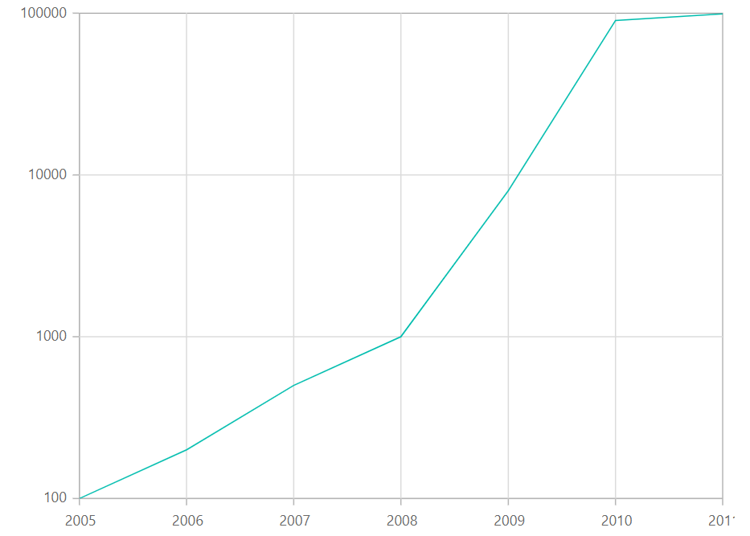
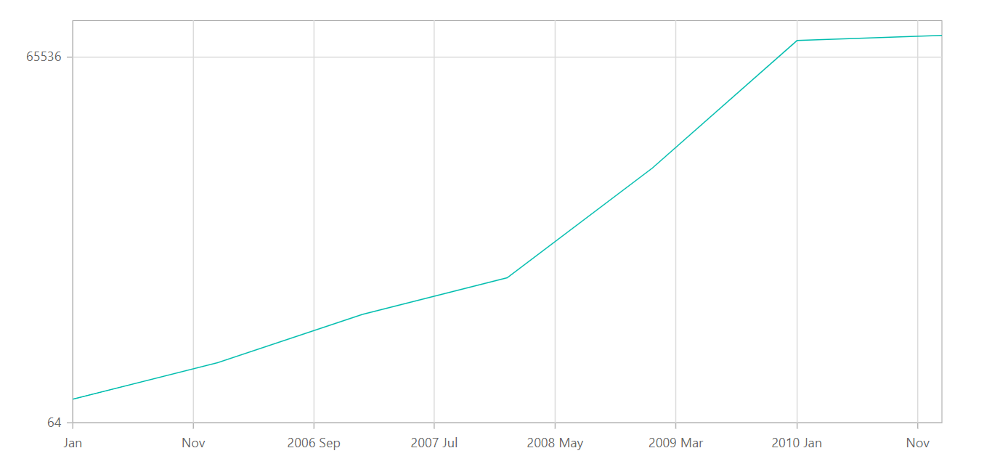

# Logarithmic Axis

<!-- markdownlint-disable MD033 -->

Logarithmic axis uses logarithmic scale and it is very useful in visualizing data, when it has numeric values in
both lower order of magnitude (eg: 10<sup>-6</sup>) and higher order of magnitude (eg: 10<sup>6</sup>).

```csharp

@using Syncfusion.Blazor.Charts

<SfChart Width="60%">

    <ChartPrimaryXAxis ValueType="Syncfusion.Blazor.Charts.ValueType.DateTime"/>    

    <ChartPrimaryYAxis ValueType="Syncfusion.Blazor.Charts.ValueType.Logarithmic"/>    

    <ChartSeriesCollection>
        <ChartSeries DataSource="@Data" XName="XValue" YName="YValue" />        
    </ChartSeriesCollection>
</SfChart>

@code{
    public class ChartData
    {
        public DateTime XValue { get; set; }
        public double YValue { get; set; }
    }

    public List<ChartData> Data = new List<ChartData> {
            new ChartData { XValue = new DateTime(2005, 01, 01), YValue = 100   },
            new ChartData { XValue = new DateTime(2006, 01, 01), YValue = 200   },
            new ChartData { XValue = new DateTime(2007, 01, 01), YValue = 500   },
            new ChartData { XValue = new DateTime(2008, 01, 01), YValue = 1000  },
            new ChartData { XValue = new DateTime(2009, 01, 01), YValue = 8000  },
            new ChartData { XValue = new DateTime(2010, 01, 01), YValue = 90000 },
            new ChartData { XValue = new DateTime(2011, 01, 01), YValue = 99000 },
        };
}


```



## Range

Range of the axis, will be calculated automatically based on the provided data, you can also customize the range
of the axis using [`Minimum`](https://help.syncfusion.com/cr/blazor/Syncfusion.Blazor.Charts.AxisModel.html#Syncfusion_Blazor_Charts_AxisModel_Minimum),
[`Maximum`](https://help.syncfusion.com/cr/blazor/Syncfusion.Blazor.Charts.AxisModel.html#Syncfusion_Blazor_Charts_AxisModel_Maximum) and [`Interval`](https://help.syncfusion.com/cr/blazor/Syncfusion.Blazor.Charts.AxisModel.html#Syncfusion_Blazor_Charts_AxisModel_Interval) property of the axis.

```csharp

@using Syncfusion.Blazor.Charts

<SfChart Width="60%">
    <ChartPrimaryXAxis ValueType="Syncfusion.Blazor.Charts.ValueType.DateTime"/>
    
    <ChartPrimaryYAxis Minimum="100" Maximum="10000" ValueType="Syncfusion.Blazor.Charts.ValueType.Logarithmic"/>

    <ChartSeriesCollection>
        <ChartSeries DataSource="@Data" XName="XValue" YName="YValue"/>
    </ChartSeriesCollection>
</SfChart>

@code{
    public class ChartData
    {
        public DateTime XValue { get; set; }
        public double YValue { get; set; }
    }

    public List<ChartData> Data = new List<ChartData> {
            new ChartData { XValue = new DateTime(2005, 01, 01), YValue = 100   },
            new ChartData { XValue = new DateTime(2006, 01, 01), YValue = 200   },
            new ChartData { XValue = new DateTime(2007, 01, 01), YValue = 500   },
            new ChartData { XValue = new DateTime(2008, 01, 01), YValue = 1000  },
            new ChartData { XValue = new DateTime(2009, 01, 01), YValue = 8000  },
            new ChartData { XValue = new DateTime(2010, 01, 01), YValue = 90000 },
            new ChartData { XValue = new DateTime(2011, 01, 01), YValue = 99000 },
        };
}

```

## Logarithmic Base

Logarithmic base can be customized by using the [`LogBase`](https://help.syncfusion.com/cr/blazor/Syncfusion.Blazor.Charts.AxisModel.html#Syncfusion_Blazor_Charts_AxisModel_LogBase) property of the axis.
For example when the LogBase is 5, the axis values follows 5<sup>-2</sup>, 5<sup>-1</sup>, 5<sup>0</sup>,
5<sup>1</sup>, 5<sup>2</sup> etc.

```csharp

@using Syncfusion.Blazor.Charts

<SfChart Width="60%">
    <ChartPrimaryXAxis ValueType="Syncfusion.Blazor.Charts.ValueType.DateTime"/>    

    <ChartPrimaryYAxis LogBase="2" ValueType="Syncfusion.Blazor.Charts.ValueType.Logarithmic"/>    

    <ChartSeriesCollection>
        <ChartSeries DataSource="@Data" XName="XValue" YName="YValue" />        
    </ChartSeriesCollection>
</SfChart>

@code{
    public class ChartData
    {
        public DateTime XValue { get; set; }
        public double YValue { get; set; }
    }

    public List<ChartData> Data = new List<ChartData> {
            new ChartData { XValue = new DateTime(2005, 01, 01), YValue = 100   },
            new ChartData { XValue = new DateTime(2006, 01, 01), YValue = 200   },
            new ChartData { XValue = new DateTime(2007, 01, 01), YValue = 500   },
            new ChartData { XValue = new DateTime(2008, 01, 01), YValue = 1000  },
            new ChartData { XValue = new DateTime(2009, 01, 01), YValue = 8000  },
            new ChartData { XValue = new DateTime(2010, 01, 01), YValue = 90000 },
            new ChartData { XValue = new DateTime(2011, 01, 01), YValue = 99000 },
        };
}

```



## Logarithmic Interval

Logarithmic axis Interval can be customized by using the [`Interval`](https://help.syncfusion.com/cr/blazor/Syncfusion.Blazor.Charts.AxisModel.html#Syncfusion_Blazor_Charts_AxisModel_Interval)
property of the axis. When the logarithmic base is 10 and logarithmic Interval is 2, then the axis labels are
placed at an Interval of 10<sup>2</sup>. The default value of the Interval is 1.

```csharp

@using Syncfusion.Blazor.Charts

<SfChart Width="60%">
    <ChartPrimaryXAxis ValueType="Syncfusion.Blazor.Charts.ValueType.DateTime"/>    

    <ChartPrimaryYAxis Interval="2" LogBase="2" ValueType="Syncfusion.Blazor.Charts.ValueType.Logarithmic"/>    

    <ChartSeriesCollection>
        <ChartSeries DataSource="@Data" XName="XValue" YName="YValue" />        
    </ChartSeriesCollection>
</SfChart>

@code{
    public class ChartData
    {
        public DateTime XValue { get; set; }
        public double YValue { get; set; }
    }

    public List<ChartData> Data = new List<ChartData> {
            new ChartData { XValue = new DateTime(2005, 01, 01), YValue = 100   },
            new ChartData { XValue = new DateTime(2006, 01, 01), YValue = 200   },
            new ChartData { XValue = new DateTime(2007, 01, 01), YValue = 500   },
            new ChartData { XValue = new DateTime(2008, 01, 01), YValue = 1000  },
            new ChartData { XValue = new DateTime(2009, 01, 01), YValue = 8000  },
            new ChartData { XValue = new DateTime(2010, 01, 01), YValue = 90000 },
            new ChartData { XValue = new DateTime(2011, 01, 01), YValue = 99000 },
        };
}

```

## Label Format

### Logarithmic Label Format

Logarithmic labels can be formatted by using the [`LabelFormat`](https://help.syncfusion.com/cr/blazor/Syncfusion.Blazor.Charts.AxisModel.html#Syncfusion_Blazor_Charts_AxisModel_LabelFormat) property.
Logarithmic labels supports all globalize format.

```csharp

@using Syncfusion.Blazor.Charts

<SfChart Width="60%">
    <ChartPrimaryXAxis ValueType="Syncfusion.Blazor.Charts.ValueType.DateTime"/>    

    <ChartPrimaryYAxis LabelFormat="P" Interval="2" LogBase="2" ValueType="Syncfusion.Blazor.Charts.ValueType.Logarithmic"/>    

    <ChartSeriesCollection>
        <ChartSeries DataSource="@Data" XName="XValue" YName="YValue" />        
    </ChartSeriesCollection>
</SfChart>

@code{
    public class ChartData
    {
        public DateTime XValue { get; set; }
        public double YValue { get; set; }
    }

    public List<ChartData> Data = new List<ChartData> {
            new ChartData { XValue = new DateTime(2005, 01, 01), YValue = 100   },
            new ChartData { XValue = new DateTime(2006, 01, 01), YValue = 200   },
            new ChartData { XValue = new DateTime(2007, 01, 01), YValue = 500   },
            new ChartData { XValue = new DateTime(2008, 01, 01), YValue = 1000  },
            new ChartData { XValue = new DateTime(2009, 01, 01), YValue = 8000  },
            new ChartData { XValue = new DateTime(2010, 01, 01), YValue = 90000 },
            new ChartData { XValue = new DateTime(2011, 01, 01), YValue = 99000 },
        };
}

```

The following table describes the result of applying some commonly used label formats on logarithmic values.

<!-- markdownlint-disable MD033 -->

<table>
<tr>
<td><b>Label Value</b></td>
<td><b>Label Format property value</b></td>
<td><b>Result </b></td>
<td><b>Description </b></td>
</tr>
<tr>
<td>1000</td>
<td>n1</td>
<td>1000.0</td>
<td>The Value is rounded to 1 decimal place</td>
</tr>
<tr>
<td>1000</td>
<td>n2</td>
<td>1000.00</td>
<td>The Value is rounded to 2 decimal place</td>
</tr>
<tr>
<td>1000</td>
<td>n3</td>
<td>1000.000</td>
<td>The Value is rounded to 3 decimal place</td>
</tr>
<tr>
<td>0.01</td>
<td>p1</td>
<td>1.0%</td>
<td>The Value is converted to percentage with 1 decimal place</td>
</tr>
<tr>
<td>0.01</td>
<td>p2</td>
<td>1.00%</td>
<td>The Value is converted to percentage with 2 decimal place</td>
</tr>
<tr>
<td>0.01</td>
<td>p3</td>
<td>1.000%</td>
<td>The Value is converted to percentage with 3 decimal place</td>
</tr>
<tr>
<td>1000</td>
<td>c1</td>
<td>$1000.0</td>
<td>The Currency symbol is appended to number and number is rounded to 1 decimal place</td>
</tr>
<tr>
<td>1000</td>
<td>c2</td>
<td>$1000.00</td>
<td>The Currency symbol is appended to number and number is rounded to 2 decimal place</td>
</tr>
</table>

## Custom Label Format

Axis also supports custom label format using placeholder like {value}°C, in which the value represent the axis
label e.g 20°C.

```csharp

@using Syncfusion.Blazor.Charts

<SfChart>

    <ChartPrimaryYAxis LabelFormat="${value}K" />

    <ChartSeriesCollection>
        <ChartSeries DataSource="@Data" XName="XValue" YName="YValue" />
    </ChartSeriesCollection>
</SfChart>

@code{
    public class ChartData
    {
        public double XValue { get; set; }
        public double YValue { get; set; }
    }
    public List<ChartData> Data = new List<ChartData>
    {
    new ChartData { XValue = 10, YValue = 21 },
    new ChartData { XValue = 20, YValue = 24 },
    new ChartData { XValue = 30, YValue = 36 },
    new ChartData { XValue = 40, YValue = 38 },
    new ChartData { XValue = 50, YValue = 54 },
    new ChartData { XValue = 60, YValue = 57 },
    new ChartData { XValue = 70, YValue = 70 },
    };
}

```

> Note: You can refer to our [`Blazor Charts`](https://www.syncfusion.com/blazor-components/blazor-charts) feature tour page for its groundbreaking feature representations. You can also explore our [`Blazor Chart example`](https://blazor.syncfusion.com/demos/chart/line?theme=bootstrap4) to knows various chart types and how to represent time-dependent data, showing trends in data at equal intervals.

## See Also

* [Data label](./data-labels)
* [Tooltip](./tool-tip)
* [Marker](./data-markers)